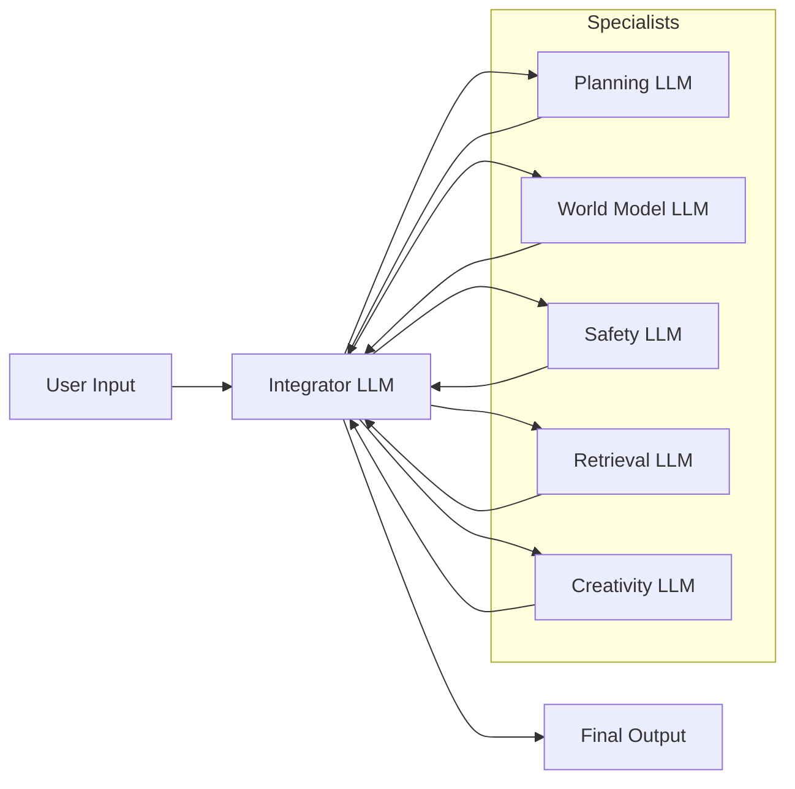
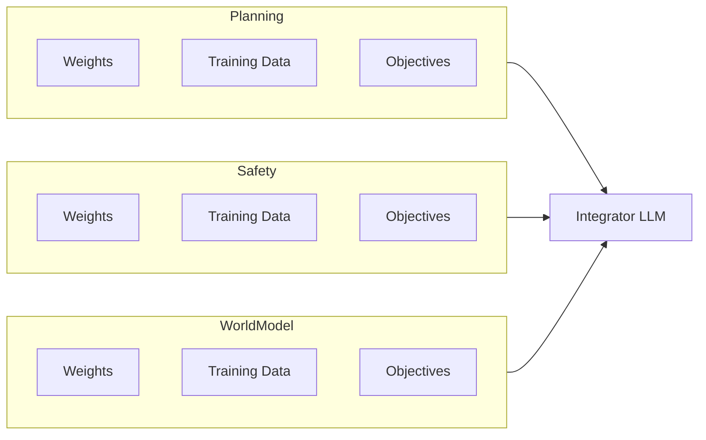
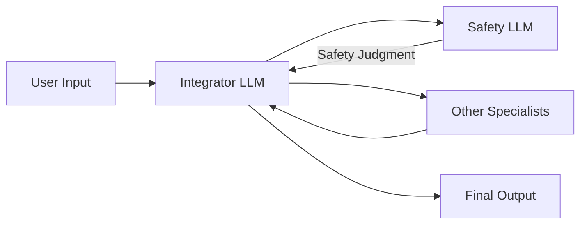
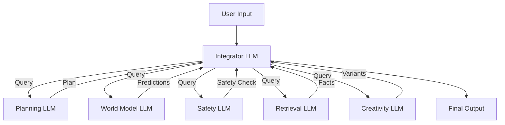
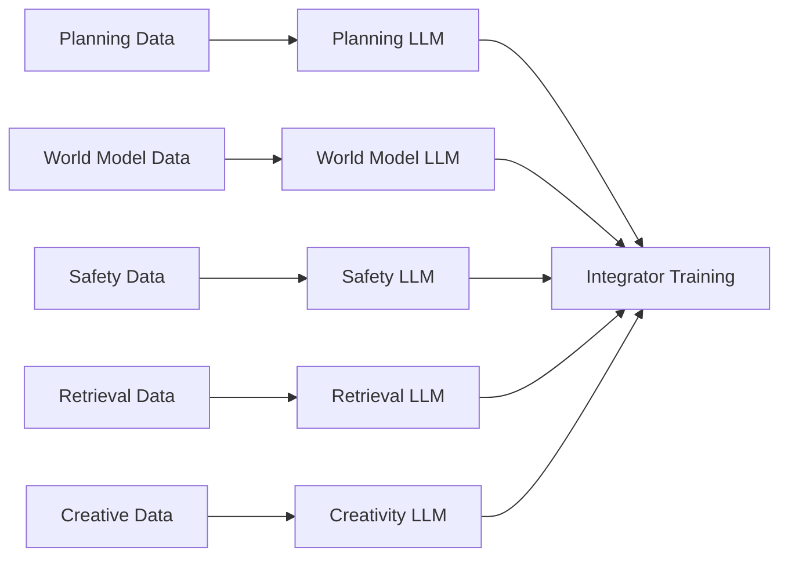

```mermaid
flowchart LR
    U[User Input] --> I[Integrator LLM]

    subgraph Specialists
        P[Planning LLM]
        W[World Model LLM]
        S[Safety LLM]
        R[Retrieval LLM]
        C[Creativity LLM]
    end

    I --> P
    I --> W
    I --> S
    I --> R
    I --> C

    P --> I
    W --> I
    S --> I
    R --> I
    C --> I

    I --> O[Final Output]

```

```mermaid
flowchart LR
    subgraph Planning
        P1[Weights]
        P2[Training Data]
        P3[Objectives]
    end

    subgraph Safety
        S1[Weights]
        S2[Training Data]
        S3[Objectives]
    end

    subgraph WorldModel
        W1[Weights]
        W2[Training Data]
        W3[Objectives]
    end

    I[Integrator LLM]

    Planning --> I
    Safety --> I
    WorldModel --> I
```

```mermaid
flowchart LR
    U[User Input] --> I[Integrator LLM]

    I --> S[Safety LLM]
    I --> X[Other Specialists]

    S -->|Safety Judgment| I
    X --> I

    I --> O[Final Output]
```

```mermaid
flowchart TD
    U[User Input] --> I[Integrator LLM]

    I -->|Query| P[Planning LLM]
    I -->|Query| W[World Model LLM]
    I -->|Query| S[Safety LLM]
    I -->|Query| R[Retrieval LLM]
    I -->|Query| C[Creativity LLM]

    P -->|Plan| I
    W -->|Predictions| I
    S -->|Safety Check| I
    R -->|Facts| I
    C -->|Variants| I

    I --> O[Final Output]
```

```mermaid
flowchart LR
    D1[Planning Data] --> P[Planning LLM]
    D2[World Model Data] --> W[World Model LLM]
    D3[Safety Data] --> S[Safety LLM]
    D4[Retrieval Data] --> R[Retrieval LLM]
    D5[Creative Data] --> C[Creativity LLM]

    P --> I[Integrator Training]
    W --> I
    S --> I
    R --> I
    C --> I
```
