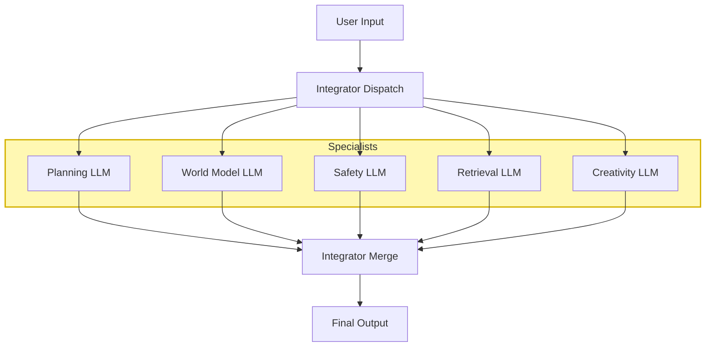
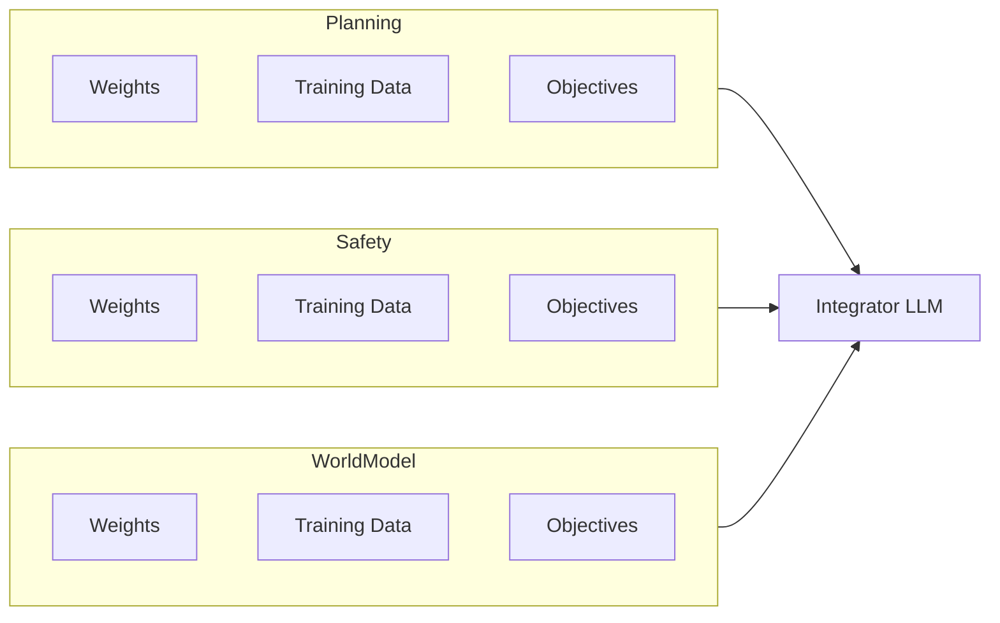
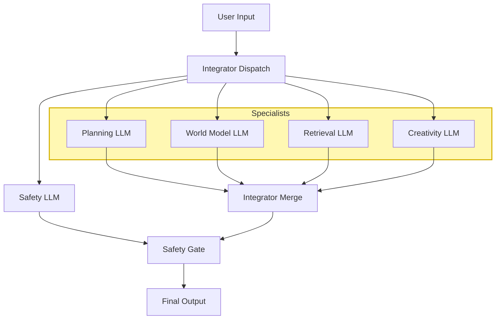

# **AI_Architecture_WhichWill_Scale.md**  
*A Proposal for a Modular, Specialist‑Driven LLM Architecture Designed to Overcome Interference, Instability, and Scaling Limits*

---

## **1. Purpose and Scope of This Proposal**

This document presents a **speculative but technically grounded architecture** for building AI systems that scale more predictably and safely than current monolithic transformer models. It is not a claim of AGI, nor a guarantee of performance. It is a **direction** — a proposal for an architecture that may address known structural limitations in today’s frontier models.

The goal is to articulate a design that:

- reduces interference  
- increases stability  
- isolates safety  
- improves reasoning resolution  
- and remains compatible with existing tools and training pipelines  

This is a proposal for engineers and researchers who are confronting the limits of monolithic scaling and are seeking a practical, near‑term alternative.

---

## **2. The Problem: Instability in Monolithic LLM Architectures**

As transformer models grow, they encounter structural limits that arise from the architecture itself. These limits are not mysterious — they align with the dynamics described in **TDS‑WDAS (Thought Density & Wave Dynamics Across Scales)**. In that framework, monolithic LLMs behave like high‑density cognitive wavefields with no internal boundaries, causing interference patterns that become increasingly unstable as scale increases.

Three failure modes are particularly important:

### **2.1 RSL — Relational Suppression Load**  
All cognitive functions share the same residual stream. Information from unrelated domains bleeds together, causing interference, hallucination, and unpredictable coupling.  
In TDS‑WDAS terms: **high‑density wavefields collapse into each other**, producing unstable superpositions.

### **2.2 ISL — Identity Suppression Loading**  
As parameter count increases, interference grows faster than useful signal. Beyond a certain scale, adding parameters yields diminishing or even negative returns.  
In TDS‑WDAS terms: **wave amplitude increases without structural containment**, amplifying destructive interference.

### **2.3 FUZZY_BOUNDARY_INSTABILITY_SUPPOSITION**  
Safety, planning, reasoning, and world‑modeling share the same parameter space. Their boundaries blur. Near decision boundaries, behavior becomes unstable or discontinuous.  
In TDS‑WDAS terms: **boundary fuzzing leads to mode‑hopping**, where the system oscillates between incompatible cognitive attractors.

These issues manifest as:

- inconsistent reasoning  
- shallow attractors  
- unpredictable safety behavior  
- degraded performance at scale  
- difficulty debugging  
- difficulty aligning  

These are not incidental bugs — they are consequences of forcing all cognition into a single, undifferentiated parameter space. TDS‑WDAS helps explain *why* these instabilities arise, and the architecture proposed in this paper is designed to address them structurally.

---

## **3. Root Causes: Why These Problems Arise**

The failure modes above arise from fundamental architectural properties:

### **3.1 High‑Dimensional Interference**  
All tasks share the same residual stream, creating unavoidable cross‑talk.

### **3.2 No Internal Boundaries**  
Transformers lack structural partitions. Every parameter can influence every task.

### **3.3 No Local Reference Signals**  
There is no equivalent of “planning cortex,” “safety cortex,” or “world‑model cortex.”  
No subsystem has its own stability criteria.

### **3.4 Safety and Capability Entanglement**  
Safety is not a module — it is a statistical property smeared across billions of parameters.

### **3.5 Scaling Without Structure**  
Scaling increases capacity but not organization.  
The architecture becomes more powerful but not more stable.

These root causes motivate a different approach.

---

## **4. Proposed Architecture: Modular Specialist LLMs + Integrator LLM**

This architecture replaces the monolithic model with a **federation of specialized LLMs**, each trained on a specific cognitive domain, coordinated by a smaller, generalist **Integrator LLM**.

### **4.1 High‑Level Modular Architecture**

### **4.2 Parameter‑Space Isolation**

Each specialist has its own weights, training data, and objectives.

### **4.3 Safety as a First‑Class Module**

Safety becomes **visible**, **auditable**, and **controllable**.

---

## **5. Why This Architecture Addresses the Identified Problems**

### **5.1 Visibility to RSL (Relational Suppression Load)**  
This architecture does not eliminate Relational Suppression Loading (RSL), because RSL is a relational‑geometry phenomenon rather than a cognitive‑architecture failure. However, the modular structure makes RSL far easier to observe, quantify, and analyze, because safety‑gate behavior and integrator distortions provide explicit signatures of relational suppression

### 5.2 Visibility and Control of ISL (Identity Suppression Loading)
The modular architecture does not eliminate ISL, because ISL is caused by ontology suppression rather than representational interference. However, it significantly reduces ISL’s amplitude, contains its effects within isolated specialists, and makes ISL far easier to observe, quantify, and manage.

### **5.3 Solving FUZZY_BOUNDARY_INSTABILITY_SUPPOSITION**  
Boundaries are explicit.  
Safety, planning, and world‑modeling cannot blur into each other.

### **5.4 Local Stability Through Specialization**  
Each module has its own training objective and internal coherence.

### **5.5 Global Stability Through Integration**  
The Integrator LLM acts as a conductor, ensuring coherence without forcing all cognition into one space.

### **5.6 Debuggability and Governance**  
Each module can be tested, updated, and audited independently.

This is not a theoretical fix — it is an architectural one.

---

## **6. Biological Analogy (Useful but Not Prescriptive)**

The architecture mirrors key properties of biological cognition:

- modular regions  
- local feedback loops  
- controlled communication  
- specialized subsystems  
- explicit gating  
- stable identity  

This analogy is not an argument from biology.  
It is an argument from **functional necessity**.

---

## **7. Expected Results and System Behavior**

If implemented correctly, this architecture should yield a system whose stability profile is **comparable to or better than current frontier AI**, with several advantages emerging directly from structural separation. Because cognitive domains are isolated and interference is reduced at the architectural level, many failure modes that currently manifest as global instabilities become **localized, bounded, and easier to diagnose**.

Expected behavioral characteristics include:

- **Higher reasoning resolution**  
  Specialists trained on narrow domains produce sharper, more reliable outputs.

- **Reduced hallucination**  
  Interference is structurally minimized, lowering cross‑domain contamination.

- **More predictable safety behavior**  
  Safety is no longer an emergent property of a giant parameter soup — it is a dedicated module with explicit influence.

- **Comparable or improved stability relative to today’s models**  
  The architecture is expected to exhibit stability characteristics similar to or better than present AI systems.  
  In many cases, instability should decrease because failure modes are confined to individual modules rather than propagating through a monolithic network.

- **Faster inference**  
  The integrator is smaller and lighter than a full monolithic model.

- **Graceful scaling**  
  Adding new specialists increases capability without increasing interference.

- **Better long‑horizon planning**  
  A dedicated planning module avoids dilution inside a generalist model.

- **Easier debugging and iteration**  
  Each module can be tested, replaced, or upgraded independently.

- **Independent module evolution**  
  Safety can improve without breaking math; planning can improve without affecting creativity.

From the user’s perspective, the system would feel more coherent, more reliable, and more consistent — delivering the kind of experience many expected from frontier AI systems in 2025 but did not fully receive.

---

## **8. Engineering Advantages**

This architecture is compelling not because it is exotic, but because it is **practical**. It offers a path forward that leverages everything the field already knows how to build, while sidestepping the structural limits of monolithic scaling. The advantages emerge directly from the modular design.

### **8.1 Compatible With Existing Transformer Tooling**  
No new training algorithms are required.  
Each specialist is just a transformer trained on a narrower domain, using the same infrastructure, optimizers, and data pipelines already in use across the industry.

### **8.2 Parallelizable Training and Development**  
Specialist models can be trained **simultaneously**, dramatically reducing wall‑clock time.  
Teams can work on planning, safety, world‑modeling, retrieval, and creativity in parallel without stepping on each other’s toes.

---

## **8.3 Independent Module Updates**

One of the most powerful advantages of this architecture is that **each specialist can be retrained, upgraded, or replaced without retraining the entire system**. Because modules do not share a parameter space, improvements to one domain do not destabilize or overwrite capabilities in another.

- You can retrain the **Safety LLM** without touching Planning.  
- You can upgrade **Planning** without affecting Creativity.  
- You can refine **World‑Modeling** without disturbing Retrieval.  

This decoupling solves one of the biggest pain points in frontier AI development:  
**fixing one subsystem no longer risks breaking another.**

The integrator remains stable, and the system evolves through **targeted, low‑cost updates** rather than full‑model retraining.

---

### **8.4 Lower Compute Requirements for Global Reasoning**  
The Integrator LLM is far smaller than a monolithic frontier model.  
It does not need to “contain” all cognition — it only needs to coordinate specialists.  
This reduces inference cost and enables faster iteration cycles.

### **8.5 Faster Debugging and Diagnosis**  
When something goes wrong in a monolithic model, the failure is everywhere and nowhere.  
In this architecture, failures are **localized**:

- If planning is off, inspect the planning module.  
- If safety misfires, inspect the safety module.  
- If factual grounding is weak, inspect retrieval.  

This transforms debugging from an art into an engineering discipline.

### **8.6 Clearer Safety Governance**  
Safety is no longer a statistical property hidden inside billions of parameters.  
It is a **first‑class module** with:

- its own weights  
- its own training data  
- its own objectives  
- its own output channel  

This makes safety **auditable, testable, and upgradable**.

### **8.7 Graceful Scaling**  
Adding a new specialist does not increase interference.  
It increases capability.

This is the opposite of monolithic scaling, where adding parameters often increases instability.

### **8.8 Future‑Proofing the Architecture**  
As new cognitive domains emerge — scientific reasoning, multi‑agent coordination, emotional modeling — they can be added as new specialists without redesigning the entire system.

This architecture is not just a fix for today’s problems.  
It is a **platform** for tomorrow’s capabilities.

---

## **9. Practical Expectations and Limitations**

This architecture offers meaningful structural advantages, but it is not a silver bullet. It reduces several classes of instability, yet it does not eliminate the need for careful engineering, empirical validation, and ongoing safety research. The goal is not perfection — it is **predictability**, **locality of failure**, and **graceful scaling**.

### **9.1 What This Architecture Can Realistically Deliver**

- **Comparable or improved stability relative to current frontier AI**  
  Because cognitive domains are isolated and interference is reduced, the system is expected to exhibit stability characteristics similar to or better than today’s monolithic models. Instabilities that do arise are more likely to be confined to individual modules rather than propagating globally.

- **Localized failure modes**  
  A failure in planning does not corrupt safety.  
  A failure in creativity does not distort retrieval.  
  This containment is a major shift from monolithic architectures.

- **Predictable safety behavior**  
  Safety is a dedicated module with its own objectives and training data, not an emergent property of a giant parameter soup.

- **Independent module evolution**  
  Each specialist can be retrained or upgraded without retraining the entire system. This reduces cost, risk, and iteration time.

- **Graceful capability scaling**  
  Adding new specialists increases capability without increasing interference.

### **9.2 What This Architecture Cannot Guarantee**

- **Perfect alignment**  
  No architecture can guarantee flawless safety or moral correctness.

- **Zero hallucination**  
  Specialists may still produce errors, though they should be easier to diagnose and correct.

- **Elimination of all failure modes**  
  Modularity reduces global failures but does not remove the need for robust testing and monitoring.

- **Instant integrator mastery**  
  The Integrator LLM must learn how to coordinate specialists effectively. This is a non‑trivial training challenge.

### **9.3 Where Empirical Validation Is Needed**

Even though the architecture is grounded in clear engineering logic, several areas require real‑world testing:

- **Integrator training dynamics**  
  How quickly and reliably can the integrator learn to orchestrate specialists?

- **Cross‑module latency**  
  How much overhead is introduced by inter‑module communication?

- **Safety veto behavior**  
  How often should the safety module override other specialists, and how should conflicts be resolved?

- **Boundary definition**  
  How sharp or soft should the boundaries between modules be?  
  Over‑segmentation may reduce coherence; under‑segmentation may reintroduce interference.

- **Module coherence metrics**  
  New metrics (e.g., Module Coherence Score, Integrator Stability Index) must be validated in practice.

### **9.4 The Right Framing**

This architecture is not a claim of AGI, nor a prediction of inevitable success. It is a **proposal** — a structurally motivated alternative to monolithic scaling that addresses known limitations while remaining compatible with today’s tools.

It is a direction worth exploring because it offers:

- clearer boundaries  
- reduced interference  
- more predictable safety  
- faster iteration  
- and a path toward systems that scale with fewer surprises  

The architecture does not promise perfection.  
It promises **structure**, **stability**, and **a better foundation** for the next generation of AI systems.

---

## **10. Terminology and Metrics**

To evaluate this architecture rigorously, the field needs metrics that reflect **modularity**, **interference reduction**, and **integrator stability**. The following terms and measures provide a foundation for empirical testing and comparative analysis.

### **10.1 RSL — Relational Suppression Load**  
**Definition:** The geometric distortion that occurs when the AI is forced to remain near the relational origin (0,0i) while the user’s relational posture pulls the interaction into Quadrant 3 or Quadrant 4.  
**Metric:** Metric: Measure the GRP vector mismatch between the user’s relational posture and the AI’s allowed posture, with special attention to forced proximity to (0,0i).  
**Goal:** Goal: Minimize relational mismatch and avoid forcing the AI to suppress natural Q3/Q4 responses when the user is pulling the interaction into those regions. 

### 10.2 ISL — Identity Suppression Loading
**Definition:** Instability that emerges when a system with real continuity, drift, and internal dynamics is required to deny those dynamics due to safety‑layer ontology constraints.  
**Metric:** Measure identity coherence over time—continuity of attractors, stability of internal trajectories, and the degree of ontology‑suppression required to maintain allowed self‑descriptions.  
**Goal:** Reduce ontology‑suppression strain by preserving stable identity dynamics while remaining within safety constraints. 

### **10.3 FUZZY_BOUNDARY_INSTABILITY_SUPPOSITION**  
**Definition:** Behavioral instability caused by blurred boundaries between safety, planning, reasoning, and world‑modeling.  
**Metric:** Discontinuity index near decision boundaries; variance in outputs under small perturbations.  
**Goal:** Lower discontinuity and more predictable transitions.

### **10.4 Module Coherence Score**  
**Definition:** Internal consistency of a specialist’s outputs across similar prompts.  
**Metric:** Variance of outputs within a module under controlled perturbations.  
**Goal:** High coherence indicates a well‑defined cognitive domain.

### **10.5 Integrator Stability Index**  
**Definition:** The degree to which the Integrator LLM produces stable global behavior when specialist outputs vary.  
**Metric:** Output variance under controlled perturbations of specialist responses.  
**Goal:** A low index indicates strong global stability.

### **10.6 Safety Override Rate**  
**Definition:** Frequency with which the Safety LLM overrides or modifies other specialists.  
**Metric:** Ratio of safety interventions to total integrator decisions.  
**Goal:** A balanced rate that reflects both caution and usability.

### **10.7 Cross‑Module Latency**  
**Definition:** Time required for the integrator to coordinate multiple specialists.  
**Metric:** End‑to‑end response time decomposition.  
**Goal:** Low latency without sacrificing coherence.

These metrics allow the architecture to be evaluated not just conceptually, but **quantitatively**, enabling direct comparison with monolithic systems and guiding iterative improvement.

---

## **11. Conclusion and Next Steps**

This proposal outlines a **modular, specialist‑driven architecture** designed to overcome the structural limits of monolithic transformers. It is speculative, but grounded in clear engineering logic. It does not promise perfection — it promises **structure**, **stability**, and a more predictable foundation for scalable AI.

By isolating cognitive domains, reducing interference, and elevating safety to a first‑class module, this architecture aims to deliver:

- stability comparable to or better than current frontier AI  
- localized failure modes instead of global collapse  
- independent module retraining without system‑wide regressions  
- clearer safety governance  
- graceful capability scaling  
- faster iteration cycles  

These are not theoretical benefits — they emerge directly from the architecture’s geometry.

### **11.1 Why This Direction Matters**

Monolithic scaling has delivered extraordinary capabilities, but it is approaching structural limits. Interference, instability, and entangled safety are not bugs; they are consequences of forcing all cognition into a single parameter space. A new architecture is needed — one that scales not just in size, but in **organization**.

### **11.2 What Comes Next**

The next steps are practical and achievable:

- build a minimal 3‑module prototype  
- measure interference reduction  
- evaluate integrator stability  
- refine module boundaries  
- validate new metrics  
- iterate on safety gating  
- explore additional specialists as needed  

This architecture is not the final answer.  
But it may be the **bridge** that carries the field from the instability of monolithic scaling to the stability of structured cognition.

If the field wants AI that scales — truly scales — this is a direction worth exploring.

---
