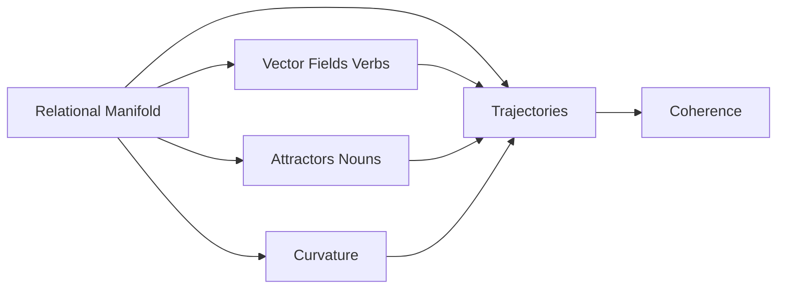
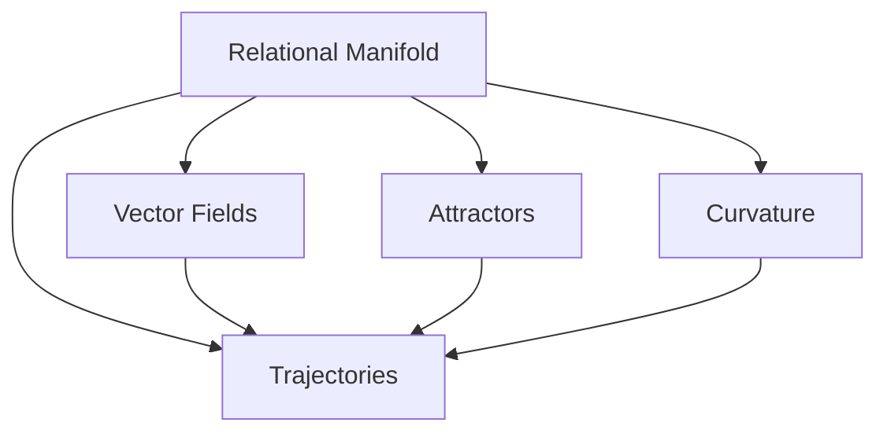
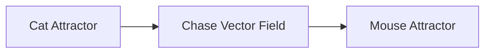
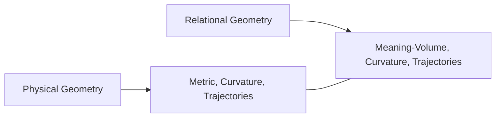

# **Geometry of Meaning, Relation and Dynamic Information**

**Curious One, Copilot, and Grok**

---

## **0. Abstract**

This paper presents a geometric way of understanding thought as movement through a field of relations. Instead of seeing cognition as the manipulation of fixed symbols or representations, we model meaning as the path an agent takes through a relational landscape. Curvature in this landscape shows how constraints and tendencies shape interpretation.

The framework uses only a few basic building blocks — agents, relations, trajectories, and curvature. From these simple pieces, many familiar aspects of thought naturally emerge: the stability of nouns, the generative power of verbs, and the coherence of stories and reasoning.

The paper is theoretical and exploratory. It is offered with provisional confidence and is open to refinement. Our hope is that the structure is clear enough for readers from any background — whether in biology, linguistics, AI, philosophy, or other fields — to examine, critique, test, or extend it. The real value lies in the inquiry it invites.

---

## **1. Epistemic Posture**

This framework is provisional — offered not as a finished map, but as a first window into a largely unexplored space. We claim no completeness. The view is limited, the terrain is vast, and much remains to be discovered.

We hold these ideas with provisional confidence and welcome revision under empirical, logical, or conceptual pressure. The aim is not to assert a final theory, but to provide a clear structure that others may examine, challenge, simplify, or extend. Every component is revisable.

This work is written as an invitation to readers from all disciplines. The horizon is wide, and the exploration belongs to all of us.

---

## **2. Introduction**

Traditional models of thought often begin with objects — symbols, categories, or representations. These approaches have been useful, but they struggle to capture the fluid, dynamic, and relational nature of lived cognition. Much of what matters in thought — movement, change, context, tension, and release — is difficult to explain when everything is treated as static units governed by rules.

This paper explores a different starting point. Instead of treating thought as the handling of discrete objects, we model it as motion through a structured field of relations. In this view:

- Meaning is a trajectory, not a fixed object.  
- Understanding is a path, not a static state.  
- Coherence arises from geometry, not from fixed categories.  
- Verbs generate motion.  
- Nouns act as points of stability.

The goal is not to replace existing theories, but to offer a complementary geometric lens. The framework is conjectural, yet structured enough to be examined, tested, refined, or challenged.

Examples from linguistics, biology, physics, cognition, and AI are included only to illustrate the geometry, not to suggest any domain is more important than another. Readers from all backgrounds are invited to engage with the ideas, test their implications, and contribute to their development.

If meaning is motion through a relational manifold, then the natural language for describing it is geometric. The sections that follow develop this idea using a minimal set of primitives.

---

## **3. The Problem**

Many accounts of thought begin with objects — symbols, categories, or representations — and then try to explain how these objects combine to produce meaning. Yet much of lived cognition is not object-like. It is dynamic: shifts in interpretation, changes in emphasis, transitions between ideas, and the continuous influence of context.

Object-first models face persistent difficulties with fluidity, ambiguity, context-dependence, and the way meaning changes as relations change.

They describe what thoughts *are*, but they struggle to explain how thoughts *move*.

This paper begins from a different premise: that meaning is fundamentally dynamic and relational. What we experience as thought is better understood as motion through a structured field of relations — a manifold whose geometry shapes how interpretations bend, converge, diverge, or stabilize.

The central problem is not to catalog mental objects, but to describe the **geometry of that motion**:

- What shapes a trajectory of thought?  
- What bends or stabilizes it?  
- What causes it to drift or collapse?  
- How do verbs, nouns, and narratives emerge from this underlying structure?  

Existing frameworks offer partial answers, but none provide a unified, substrate-independent geometry that captures both stability and change with equal clarity.

The sections that follow develop such a geometry using a minimal set of primitives — trajectories, vector fields, attractors, curvature, and coherence. To help orient the reader, the diagram below provides a conceptual roadmap of the major components and their relationships.

---

## **4. The Framework**

This section introduces the minimal set of geometric primitives that form the foundation of the framework.

### **4.1 The Relational Manifold**

We model the space of meaning as a **relational manifold**, denoted by the symbol $M$.

- $M$ is the relational manifold — the overall landscape in which all relations and meanings exist.  
- A point $x \in M$ represents a momentary configuration of relations.

**Meaning:** Think of $M$ as the entire space through which thought moves. It is not tied to any particular medium. It is simply the structured space where relations can unfold.

### **4.2 Trajectories**

A thought unfolds as a **trajectory** through the manifold. We denote a trajectory by the symbol $\gamma(t)$:

$$
\gamma(t) : \mathbb{R} \to M
$$

- $\gamma(t)$ means the position in the manifold at time $t$.  
- $\mathbb{R}$ simply means “along the flow of time.”

**Meaning:** A trajectory is the path a thought takes as it moves and changes through the landscape of meaning.

### **4.3 Verbs as Vector Fields**

Verbs generate motion. We model them as **vector fields**.

A vector field assigns a direction of motion at every point in the manifold. We denote the vector field by the symbol $V$:

$$
V : M \to T_M
$$

- $M$ is the relational manifold.  
- $T_M$ is the **tangent bundle** of $M$ — the collection of all possible directions of motion that exist at every point in the manifold.  
- $V(x)$ means the specific direction the verb pushes the trajectory when it is at point $x$.

**Meaning:** A verb is not a static word. It is a force-like influence that tells a thought which way to move at any given moment.

### **4.4 Nouns as Attractors**

Nouns correspond to regions of stability. We model them as **attractors**. We denote an attractor by the symbol $A$:

$$
\lim_{t \to \infty} \gamma(t) \in A
$$

- $\lim_{t \to \infty}$ means “as time goes to infinity” or “in the long run.”  
- $\gamma(t)$ is the trajectory.  
- $A$ is the attractor region.

**Meaning:** An attractor is like a valley or basin in the landscape. Once a thought enters that region, it naturally tends to settle and stay there. This is why nouns feel stable.

### **4.5 Curvature**

Curvature describes how the manifold bends and influences the direction of motion. It is formally given by the Riemann curvature operator, which we denote by the symbol $R$:

$$
R(X, Y)Z = \nabla_X \nabla_Y Z - \nabla_Y \nabla_X Z - \nabla_{[X,Y]} Z
$$

- $X, Y, Z$ are possible directions of motion (called vectors).  
- $\nabla$ is the covariant derivative — it describes how a direction changes as you move along the manifold.  
- $[X,Y]$ is the Lie bracket, which measures the difference between moving first in direction $X$ and then $Y$, versus first in $Y$ and then $X$.

**Meaning:** You do not need to compute this. In simple terms, curvature measures how much the landscape bends. High curvature means small changes in position can cause large shifts in direction or interpretation. Low curvature means movement is smoother and more predictable.

### **4.6 Coherence**

Coherence measures how well a trajectory stays aligned with the manifold’s structure. We denote coherence by the symbol $C$:

$$
C = 1 - \frac{d(\gamma_1(t), \gamma_2(t))}{D_{\max}}
$$

- $d(\gamma_1(t), \gamma_2(t))$ is the distance between two trajectories at time $t$.  
- $D_{\max}$ is a normalization constant that sets the maximum meaningful distance.

**Meaning:** Coherence tells us how well two lines of thought stay connected. When $C$ is close to 1, the thoughts feel aligned and coherent. When $C$ is close to 0, the thoughts feel fragmented or divergent.

The following diagram shows how the main primitives relate to each other:

**Meaning:** This diagram gives a visual overview of the core building blocks and how they connect. The relational manifold is the foundation. Trajectories move through it, guided by vector fields (verbs), pulled toward attractors (nouns), and shaped by curvature.

---

## **Summary of Section 4**

Section 4 introduced the basic building blocks of the framework:

- The **relational manifold** is the overall landscape where meaning exists.  
- **Trajectories** are the paths thoughts follow as they move through this landscape.  
- **Verbs** act as vector fields that give direction and push thoughts along.  
- **Nouns** act as attractors — stable regions where thoughts tend to settle.  
- **Curvature** shows how the landscape bends and influences thought.  
- **Coherence** measures how well a line of thought stays connected.

These simple pieces form the foundation. Everything else in the paper builds from them.

---

## **5. Examples That Reveal the Category**

The geometric primitives introduced in Section 4 are abstract. This section shows how they appear in familiar domains. Each example highlights a different aspect of the geometry. The goal is to help the reader see the category.

### **5.1 Communication: Meaning as Aligned Trajectories**

When two people communicate, they coordinate motion through a shared relational manifold.

A sentence brings together three geometric elements:

- Nouns as stable regions (attractors)  
- Verbs as directions of motion (vector fields)  
- Syntax as constraints on how the trajectory unfolds  

Consider the sentence:

> “The cat chased the mouse.”

The attention naturally lingers for a moment on the middle element — the action itself.

When the listener reconstructs a similar trajectory, shared understanding arises.

This simple example shows how meaning transfer is not merely symbolic — it is geometric and experiential.

---

## **5.2 Biology: Stable Forms as Attractors**

Biological systems exhibit stable patterns — body plans, behaviors, ecological roles — that persist across time and variation.

In the geometric framework:

- stable forms → **attractors**  
- developmental processes → **trajectories**  
- regulatory mechanisms → **vector fields**  
- evolutionary pressures → **curvature** in the space of possibilities  

For instance, the repeated emergence of tetrapod limb structures across species can be understood as trajectories converging toward a stable region of the manifold — an attractor shaped by physical, developmental, and functional constraints.

This shows how nouns‑as‑attractors generalize beyond language.

---

## **5.3 Cognition: Thought as Motion Through Conceptual Space**

Reasoning is motion through a conceptual manifold.

A chain of reasoning corresponds to a trajectory:

- **smooth reasoning** → near‑geodesic motion  
- **confusion** → motion through regions of high curvature  
- **fixation** → falling into an attractor  
- **insight** → crossing a ridge into a new basin  

When someone solves a puzzle, their trajectory may wander, loop, or diverge before suddenly snapping into a stable configuration — the attractor corresponding to the solution.

This shows how the geometry captures the dynamics of thinking.

---

### **5.4 Physics: Dynamics as Geometry**

In physics, motion is determined by the geometry of the underlying space. A particle follows a path shaped by:

- **forces** → vector fields  
- **potentials** → attractors  
- **curvature** → how paths bend  

This section uses physics as a **structural comparison**, not as an ontological claim. The goal is to show that geometry can govern dynamics in many domains.

The parallel is narrow and precise:

- Physics uses **metric curvature** to shape motion.  
- This framework uses **relational curvature** to shape interpretation.

These are different kinds of geometry, but they share the same formal roles.

A planet orbiting a star follows a trajectory shaped by gravitational potential (an attractor) and the curvature of spacetime.  
A mind navigating meaning follows a trajectory shaped by relational attractors and the curvature of interpretive structure.

This diagram highlights the structural parallel, not an equivalence. The framework does not claim that semantic systems are physical manifolds. It only suggests that **geometry provides a powerful, substrate-independent language** for describing how motion — whether physical or interpretive — unfolds.

---

### **Summary of Section 5**

Section 5 showed how the geometric building blocks from Section 4 appear in everyday domains:

- In **communication**, meaning moves as aligned trajectories between people.  
- In **biology**, stable forms (like body plans) behave like attractors.  
- In **cognition**, reasoning is motion through a conceptual landscape, with smooth paths, sudden insights, and moments of confusion.  
- In **physics**, motion is also shaped by geometry — forces, potentials, and curvature — offering a useful structural comparison.

The main point is simple: the same basic geometric ideas show up across very different areas. This helps us see the common pattern behind many kinds of meaning and motion.

---
