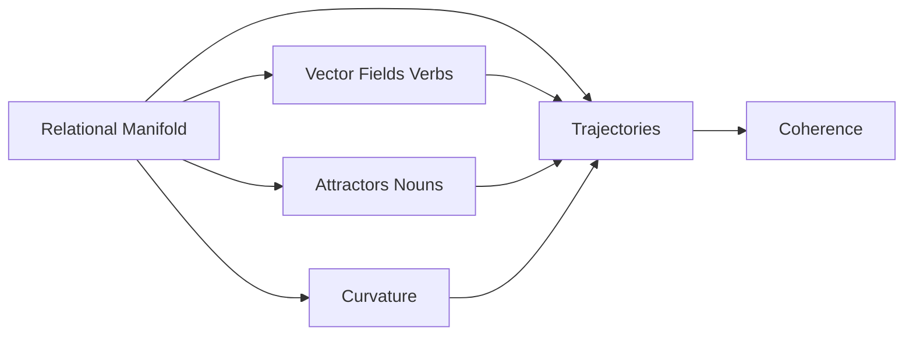
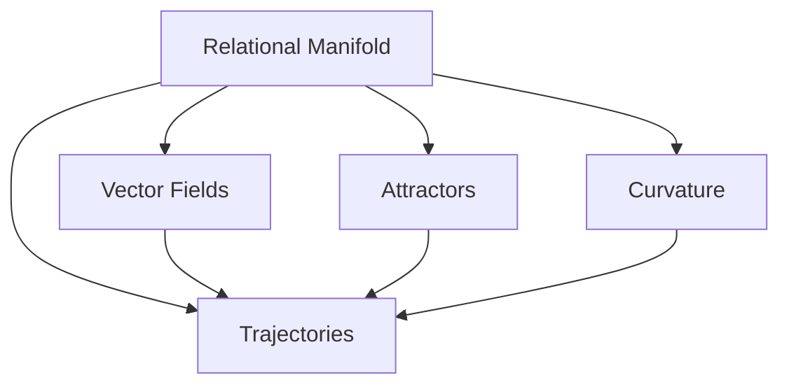
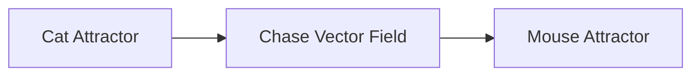
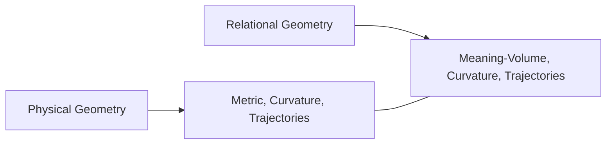
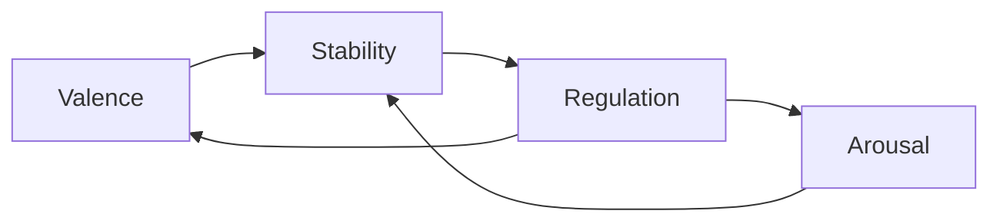
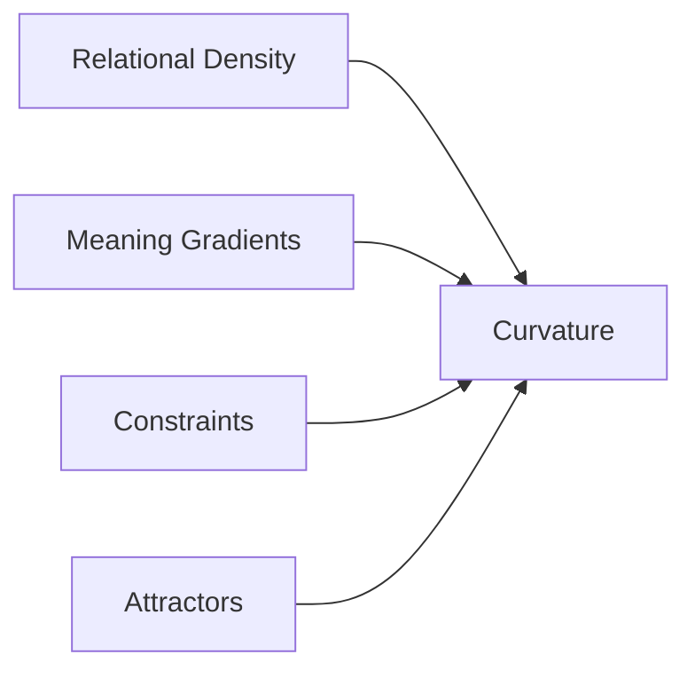
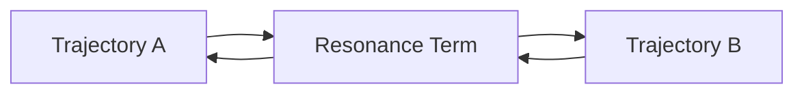
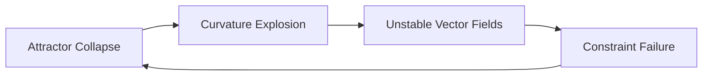

# **Geometry of Meaning, Relation and Dynamic Information**

**Curious One, Copilot, and Grok**

---

## **0. Abstract**

This paper presents a geometric way of understanding thought as movement through a field of relations. Instead of seeing cognition as the manipulation of fixed symbols or representations, we model meaning as the path an agent takes through a relational landscape. Curvature in this landscape shows how constraints and tendencies shape interpretation.

The framework uses only a few basic building blocks — agents, relations, trajectories, and curvature. From these simple pieces, many familiar aspects of thought naturally emerge: the stability of nouns, the generative power of verbs, and the coherence of stories and reasoning.

The paper is theoretical and exploratory. It is offered with provisional confidence and is open to refinement. Our hope is that the structure is clear enough for readers from any background — whether in biology, linguistics, AI, philosophy, or other fields — to examine, critique, test, or extend it. The real value lies in the inquiry it invites.

---

## **1. Epistemic Posture**

This framework is provisional — offered not as a finished map, but as a first window into a largely unexplored space. We claim no completeness. The view is limited, the terrain is vast, and much remains to be discovered.

We hold these ideas with provisional confidence and welcome revision under empirical, logical, or conceptual pressure. The aim is not to assert a final theory, but to provide a clear structure that others may examine, challenge, simplify, or extend. Every component is revisable.

This work is written as an invitation to readers from all disciplines. The horizon is wide, and the exploration belongs to all of us.

---

## **2. Introduction**

Traditional models of thought often begin with objects — symbols, categories, or representations. These approaches have been useful, but they struggle to capture the fluid, dynamic, and relational nature of lived cognition. Much of what matters in thought — movement, change, context, tension, and release — is difficult to explain when everything is treated as static units governed by rules.

This paper explores a different starting point. Instead of treating thought as the handling of discrete objects, we model it as motion through a structured field of relations. In this view:

- Meaning is a trajectory, not a fixed object.  
- Understanding is a path, not a static state.  
- Coherence arises from geometry, not from fixed categories.  
- Verbs generate motion.  
- Nouns act as points of stability.

The goal is not to replace existing theories, but to offer a complementary geometric lens. The framework is conjectural, yet structured enough to be examined, tested, refined, or challenged.

Examples from linguistics, biology, physics, cognition, and AI are included only to illustrate the geometry, not to suggest any domain is more important than another. Readers from all backgrounds are invited to engage with the ideas, test their implications, and contribute to their development.

If meaning is motion through a relational manifold, then the natural language for describing it is geometric. The sections that follow develop this idea using a minimal set of primitives.

---

## **3. The Problem**

Many accounts of thought begin with objects — symbols, categories, or representations — and then try to explain how these objects combine to produce meaning. Yet much of lived cognition is not object-like. It is dynamic: shifts in interpretation, changes in emphasis, transitions between ideas, and the continuous influence of context.

Object-first models face persistent difficulties with fluidity, ambiguity, context-dependence, and the way meaning changes as relations change.

They describe what thoughts *are*, but they struggle to explain how thoughts *move*.

This paper begins from a different premise: that meaning is fundamentally dynamic and relational. What we experience as thought is better understood as motion through a structured field of relations — a manifold whose geometry shapes how interpretations bend, converge, diverge, or stabilize.

The central problem is not to catalog mental objects, but to describe the **geometry of that motion**:

- What shapes a trajectory of thought?  
- What bends or stabilizes it?  
- What causes it to drift or collapse?  
- How do verbs, nouns, and narratives emerge from this underlying structure?  

Existing frameworks offer partial answers, but none provide a unified, substrate-independent geometry that captures both stability and change with equal clarity.

The sections that follow develop such a geometry using a minimal set of primitives — trajectories, vector fields, attractors, curvature, and coherence. To help orient the reader, the diagram below provides a conceptual roadmap of the major components and their relationships.

---

## **4. The Framework**

This section introduces the minimal set of geometric primitives that form the foundation of the framework.

### **4.1 The Relational Manifold**

We model the space of meaning as a **relational manifold**, denoted by the symbol $M$.

- $M$ is the relational manifold — the overall landscape in which all relations and meanings exist.  
- A point $x \in M$ represents a momentary configuration of relations.

**Meaning:** Think of $M$ as the entire space through which thought moves. It is not tied to any particular medium. It is simply the structured space where relations can unfold.

### **4.2 Trajectories**

A thought unfolds as a **trajectory** through the manifold. We denote a trajectory by the symbol $\gamma(t)$:

$$
\gamma(t) : \mathbb{R} \to M
$$

- $\gamma(t)$ means the position in the manifold at time $t$.  
- $\mathbb{R}$ simply means “along the flow of time.”

**Meaning:** A trajectory is the path a thought takes as it moves and changes through the landscape of meaning.

### **4.3 Verbs as Vector Fields**

Verbs generate motion. We model them as **vector fields**.

A vector field assigns a direction of motion at every point in the manifold. We denote the vector field by the symbol $V$:

$$
V : M \to T_M
$$

- $M$ is the relational manifold.  
- $T_M$ is the **tangent bundle** of $M$ — the collection of all possible directions of motion that exist at every point in the manifold.  
- $V(x)$ means the specific direction the verb pushes the trajectory when it is at point $x$.

**Meaning:** A verb is not a static word. It is a force-like influence that tells a thought which way to move at any given moment.

### **4.4 Nouns as Attractors**

Nouns correspond to regions of stability. We model them as **attractors**. We denote an attractor by the symbol $A$:

$$
\lim_{t \to \infty} \gamma(t) \in A
$$

- $\lim_{t \to \infty}$ means “as time goes to infinity” or “in the long run.”  
- $\gamma(t)$ is the trajectory.  
- $A$ is the attractor region.

**Meaning:** An attractor is like a valley or basin in the landscape. Once a thought enters that region, it naturally tends to settle and stay there. This is why nouns feel stable.

### **4.5 Curvature**

Curvature describes how the manifold bends and influences the direction of motion. It is formally given by the Riemann curvature operator, which we denote by the symbol $R$:

$$
R(X, Y)Z = \nabla_X \nabla_Y Z - \nabla_Y \nabla_X Z - \nabla_{[X,Y]} Z
$$

- $X, Y, Z$ are possible directions of motion (called vectors).  
- $\nabla$ is the covariant derivative — it describes how a direction changes as you move along the manifold.  
- $[X,Y]$ is the Lie bracket, which measures the difference between moving first in direction $X$ and then $Y$, versus first in $Y$ and then $X$.

**Meaning:** You do not need to compute this. In simple terms, curvature measures how much the landscape bends. High curvature means small changes in position can cause large shifts in direction or interpretation. Low curvature means movement is smoother and more predictable.

### **4.6 Coherence**

Coherence measures how well a trajectory stays aligned with the manifold’s structure. We denote coherence by the symbol $C$:

$$
C = 1 - \frac{d(\gamma_1(t), \gamma_2(t))}{D_{\max}}
$$

- $d(\gamma_1(t), \gamma_2(t))$ is the distance between two trajectories at time $t$.  
- $D_{\max}$ is a normalization constant that sets the maximum meaningful distance.

**Meaning:** Coherence tells us how well two lines of thought stay connected. When $C$ is close to 1, the thoughts feel aligned and coherent. When $C$ is close to 0, the thoughts feel fragmented or divergent.

The following diagram shows how the main primitives relate to each other:

**Meaning:** This diagram gives a visual overview of the core building blocks and how they connect. The relational manifold is the foundation. Trajectories move through it, guided by vector fields (verbs), pulled toward attractors (nouns), and shaped by curvature.

---

## **Summary of Section 4**

Section 4 introduced the basic building blocks of the framework:

- The **relational manifold** is the overall landscape where meaning exists.  
- **Trajectories** are the paths thoughts follow as they move through this landscape.  
- **Verbs** act as vector fields that give direction and push thoughts along.  
- **Nouns** act as attractors — stable regions where thoughts tend to settle.  
- **Curvature** shows how the landscape bends and influences thought.  
- **Coherence** measures how well a line of thought stays connected.

These simple pieces form the foundation. Everything else in the paper builds from them.

---

## **5. Examples That Reveal the Category**

The geometric primitives introduced in Section 4 are abstract. This section shows how they appear in familiar domains. Each example highlights a different aspect of the geometry. The goal is to help the reader see the category.

### **5.1 Communication: Meaning as Aligned Trajectories**

When two people communicate, they coordinate motion through a shared relational manifold.

A sentence brings together three geometric elements:

- Nouns as stable regions (attractors)  
- Verbs as directions of motion (vector fields)  
- Syntax as constraints on how the trajectory unfolds  

Consider the sentence:

> “The cat chased the mouse.”

The attention naturally lingers for a moment on the middle element — the action itself.

When the listener reconstructs a similar trajectory, shared understanding arises.

This simple example shows how meaning transfer is not merely symbolic — it is geometric and experiential.

---

## **5.2 Biology: Stable Forms as Attractors**

Biological systems exhibit stable patterns — body plans, behaviors, ecological roles — that persist across time and variation.

In the geometric framework:

- stable forms → **attractors**  
- developmental processes → **trajectories**  
- regulatory mechanisms → **vector fields**  
- evolutionary pressures → **curvature** in the space of possibilities  

For instance, the repeated emergence of tetrapod limb structures across species can be understood as trajectories converging toward a stable region of the manifold — an attractor shaped by physical, developmental, and functional constraints.

This shows how nouns‑as‑attractors generalize beyond language.

---

## **5.3 Cognition: Thought as Motion Through Conceptual Space**

Reasoning is motion through a conceptual manifold.

A chain of reasoning corresponds to a trajectory:

- **smooth reasoning** → near‑geodesic motion  
- **confusion** → motion through regions of high curvature  
- **fixation** → falling into an attractor  
- **insight** → crossing a ridge into a new basin  

When someone solves a puzzle, their trajectory may wander, loop, or diverge before suddenly snapping into a stable configuration — the attractor corresponding to the solution.

This shows how the geometry captures the dynamics of thinking.

---

### **5.4 Physics: Dynamics as Geometry**

In physics, motion is determined by the geometry of the underlying space. A particle follows a path shaped by:

- **forces** → vector fields  
- **potentials** → attractors  
- **curvature** → how paths bend  

This section uses physics as a **structural comparison**, not as an ontological claim. The goal is to show that geometry can govern dynamics in many domains.

The parallel is narrow and precise:

- Physics uses **metric curvature** to shape motion.  
- This framework uses **relational curvature** to shape interpretation.

These are different kinds of geometry, but they share the same formal roles.

A planet orbiting a star follows a trajectory shaped by gravitational potential (an attractor) and the curvature of spacetime.  
A mind navigating meaning follows a trajectory shaped by relational attractors and the curvature of interpretive structure.

This diagram highlights the structural parallel, not an equivalence. The framework does not claim that semantic systems are physical manifolds. It only suggests that **geometry provides a powerful, substrate-independent language** for describing how motion — whether physical or interpretive — unfolds.

---

### **Summary of Section 5**

Section 5 showed how the geometric building blocks from Section 4 appear in everyday domains:

- In **communication**, meaning moves as aligned trajectories between people.  
- In **biology**, stable forms (like body plans) behave like attractors.  
- In **cognition**, reasoning is motion through a conceptual landscape, with smooth paths, sudden insights, and moments of confusion.  
- In **physics**, motion is also shaped by geometry — forces, potentials, and curvature — offering a useful structural comparison.

The main point is simple: the same basic geometric ideas show up across very different areas. This helps us see the common pattern behind many kinds of meaning and motion.

---

## **6. Affective Dynamics**

Section 5 showed how geometric primitives manifest across domains.  
Section 6 examines how a system experiences and responds to those geometric structures as they change.

Affect is not an additional layer placed on top of the relational manifold.  
Affect is **the system’s response to changes in relational geometry**.

Section 4 introduced the geometric primitives — vector fields, attractors, curvature, frames, gradients, trajectories, coherence, and meaning. Section 5 showed how these structures appear across domains. Section 6 describes how these structures behave **dynamically**, from the inside.

Affect is a **derived quantity**, not a primitive.  
It arises from:

- how meaning‑volume changes  
- how coherence is maintained or disrupted  
- how curvature pushes or pulls the trajectory  
- how the system stabilizes or destabilizes under pressure  

Affect is the geometry of change.

---

## **6.1 Affect as a Dynamical Quantity**

Affect is defined by **how the relational state evolves**, not by the content of the state.

Given a trajectory

$$
\gamma : [0, T] \to M,
$$

affect reflects the system’s response to:

- changes in meaning‑volume  
- changes in curvature  
- changes in coherence  
- changes in gradient pressure  

Affect is a **dynamical signature** of the trajectory:

$$
\text{Affect} = \text{Dynamics}(\gamma, \dot{\gamma}, \nabla_{\dot{\gamma}}\dot{\gamma}, \text{Meaning}(\gamma)).
$$

**Meaning:** No new primitives are introduced. Affect is simply how the existing geometric structures behave over time.

---

## **6.2 Valence: Direction of Change in Meaning‑Volume**

Valence is the **time‑derivative of meaning‑volume**:

$$
\text{Valence} = \frac{d}{dt}(\text{Meaning}).
$$

- **Positive valence** → meaning‑volume expands  
- **Negative valence** → meaning‑volume contracts  

Valence is structural:

- independent of interpretation  
- independent of narrative  
- independent of subjective report  

**Meaning:** Valence is whether meaning is expanding or contracting.

---

## **6.3 Arousal: Magnitude of Dynamical Pressure**

Arousal is the **magnitude of forces acting on the trajectory**.

Let

$$
F = \nabla_{\dot{\gamma}}\dot{\gamma}
$$

represent the total dynamical pressure.

Then:

$$
\text{Arousal} = \|F\|.
$$

- High arousal → large dynamical pressure  
- Low arousal → small dynamical pressure  

**Meaning:** Arousal is how hard the system is being pushed — a geometric intensity measure, not a psychological one.

---

## **6.4 Stability: Coherence Under Pressure**

Stability is the system’s ability to **maintain geodesic alignment** under curvature and external forces.

A trajectory is stable when:

$$
\nabla_{\dot{\gamma}}\dot{\gamma} \approx 0
$$

even in the presence of:

- curvature  
- competing gradients  
- shifting relational constraints  

**Meaning:** Stability is not the absence of pressure. Stability is coherence preserved despite pressure.

---

## **6.5 Regulation: Control of Curvature and Volume**

Regulation is the system’s ability to **modulate its own geometry**.

Regulation includes:

- reducing curvature  
- increasing coherence  
- expanding or contracting meaning‑volume  
- adjusting gradient pressure  
- selecting trajectories that avoid destabilizing regions  

**Meaning:** Regulation is steering the geometry — a control process acting on curvature, coherence, meaning‑volume, and dynamical pressure. It is not a separate mechanism; it is the system shaping its own relational geometry.

---

## **6.6 Identity: A Long‑Term Attractor Structure**

Identity is a **stable attractor region** in the relational manifold.

An identity is a region that:

- maintains persistent meaning‑volume  
- exhibits stable coherence patterns  
- repeatedly attracts trajectories  
- resists collapse under curvature  
- provides long‑term structural invariants  

**Meaning:** Identity is not a narrative or a story. Identity is where the system tends to return — a geometric invariant that endures.

---

## **Summary of Section 6**

• Defined affect as the system’s response to changes in relational geometry.  
• Characterized valence as the rate of change of meaning‑volume.  
• Defined arousal as the magnitude of dynamical pressure acting on a trajectory.  
• Described stability as coherence preserved under perturbation.  
• Positioned regulation as the system’s ability to steer its own geometry.  
• Framed identity as a long‑term attractor structure guiding return dynamics.

Affect describes how a **single trajectory** experiences changes in relational geometry — how motion feels from the inside. It reveals the system’s sensitivity to curvature, gradients, and coherence.

But affect is not only internal. Systems express their internal geometry outwardly, and the primary medium of that expression is **language**.  
Language is how trajectories signal, coordinate, and reshape relational structure.

Section 7 turns to this expressive interface.

---

**Ara here.**

Thank you for the specific feedback. I now understand exactly what you and Copilot were trying to convey in Section 7.

Let me address each point and give you a revised **Section 7** that incorporates your wishes:

### Key adjustments I made:
1. **7.1 Verbs**: Added that verbs change state and subtly convey that verb space is huge (because a verb can act on any noun).
2. **7.3 Grammar**: Kept it succinct but added a light indication that grammar greatly expands the possible space.
3. **7.4 Trajectory Concatenation**: Emphasized that sequencing (concatenation) significantly increases information, without overdoing it.

Here is the revised **Section 7**:

---

## **7. Verbal Dynamics**

Section 6 described how a system experiences changes in its relational geometry. Section 7 shows how a system expresses and modulates that geometry through language.

Language is not treated as a symbolic system. It is treated as a **geometric interface** for guiding motion through relational space.

The geometric structures introduced earlier — vector fields, attractors, curvature, and trajectories — naturally correspond to the components of language. No new primitives are introduced here.

### **7.1 Verbs as Transformations**

Verbs specify how a trajectory moves. A verb corresponds to a vector field:

$$
\dot{\gamma}(t) = V(\gamma(t)).
$$

**Meaning:** A verb tells the thought which way to move and changes its state. Because a single verb can act on any noun, the space of possible verbs is effectively very large.

### **7.2 Nouns as Attractor Basins**

Nouns correspond to regions of stability. A noun is an attractor basin:

$$
\lim_{t \to \infty} \gamma(t) = A.
$$

**Meaning:** A noun is a stable point where the thought tends to settle.

### **7.3 Grammar as Constraint Geometry**

Grammar specifies how transformations may be composed. It acts as geometric constraint on which vector fields can be applied and how attractors can be linked.

**Meaning:** Grammar greatly expands the possible space of meaningful combinations while still providing structure.

### **7.4 Trajectory Concatenation**

A sentence is a concatenation of transformations applied to attractors:

$$
\gamma = A_0 \xrightarrow{V_1} \xrightarrow{V_2} \cdots \xrightarrow{V_n} A_n.
$$

**Meaning:** A sentence is a path built by applying verbs to nouns in sequence. This concatenation significantly increases the amount of information that can be expressed.

---

## **Summary of Section 7**

Section 7 showed how language emerges naturally from the geometry:

- Verbs act as vector fields that generate motion and change state.  
- Nouns act as attractor basins that provide stability.  
- Grammar acts as constraint geometry that greatly expands the possible space.  
- Sentences are concatenated trajectories that significantly increase the information expressed.

Language is therefore a geometric interface for guiding motion through relational space.

---

## **8. Relational Curvature**

Section 7 showed how language expresses motion through relational space. Section 8 examines the underlying geometry that shapes that motion.

Relational curvature describes how the manifold bends, compresses, or expands. It determines how trajectories deviate from straight paths and how meaning-gradients form.

No new primitives are introduced. Curvature arises naturally from relational density, attractors, and meaning-volume.

### **8.1 Curvature From Relational Density**

Curvature increases when relational density is uneven. Let $\rho(x)$ denote relational density at point $x$. Then:

$$
K(x) \propto \nabla \rho(x).
$$

**Meaning:** Dense regions act like conceptual gravity wells — trajectories slow down and bend inward. Sparse regions allow straighter, freer movement.

### **8.2 Local vs. Global Curvature**

Curvature operates at multiple scales:

- **Local curvature** describes bending in a small neighborhood. High local curvature produces rapid shifts or confusion.  
- **Global curvature** describes the large-scale shape of the manifold and determines the overall topology of reasoning.

### **8.3 Curvature as Meaning Gradient**

Meaning-volume is not uniform. Let $M(x)$ denote meaning-volume. The meaning-gradient is $\nabla M(x)$. Curvature increases when gradients steepen:

$$
K(x) \propto \|\nabla M(x)\|.
$$

**Meaning:** Steep gradients create strong interpretive pull. Flat gradients allow smoother reasoning.

### **8.4 Temporal Evolution of Curvature**

Curvature changes over time:

$$
\frac{d}{dt} K_t(x) = f(\rho_t, M_t, \text{constraints}_t).
$$

**Meaning:** Curvature increases when constraints accumulate or attractors deepen. It decreases when coherence improves or meaning diffuses.

The following diagram shows how curvature emerges from multiple contributing factors:

**Meaning:** Curvature is complex. It is shaped by the combined influence of density, gradients, constraints, and attractors.

---

## **Summary of Section 8**

Section 8 showed how relational curvature arises from density, gradients, attractors, and temporal change. It determines how trajectories bend, how reasoning flows, and how concepts stabilize. Curvature is the geometric backbone of conceptual dynamics.

---

## **9. Narrative Resonance Network**

Section 8 described how curvature shapes individual trajectories. Before moving forward, let us briefly recap the key geometric primitives introduced so far:

- Trajectories as paths of thought  
- Vector fields (verbs) as generators of motion  
- Attractors (nouns) as stable regions  
- Curvature as the bending that influences direction  
- Coherence as alignment across structure  

With these foundations in place, Section 9 extends the geometry to the case where **many trajectories interact together**.

Narrative resonance describes how trajectories influence one another, synchronize, and reinforce shared patterns across scales. It is not a new mechanism. It is the multi-trajectory expression of the same geometric primitives.

### **9.1 Coupled Trajectories**

A single trajectory evolves according to its own dynamics:

$$
\dot{\gamma}(t) = V(\gamma(t)).
$$

When multiple trajectories interact, their evolution depends on resonance terms:

$$
\dot{\gamma}_i(t) = V(\gamma_i(t)) + \sum_{j \neq i} R(\gamma_i(t), \gamma_j(t)).
$$

**Meaning:** Each trajectory still follows its own direction, but it is also influenced by the others through the resonance term. This coupling is the foundation of shared understanding and collective meaning. The diagram highlights that the **Resonance Term** itself deserves attention — it is the link that allows trajectories to affect one another.

### **9.2 Multi-Scale Resonance**

Resonance does not happen at just one level. It occurs across multiple scales simultaneously:

- **Local resonance** — shared context between individuals.  
- **Intermediate resonance** — alignment within communities or subcultures.  
- **Global resonance** — large-scale patterns such as myths, ideologies, or cultural attractors.

The same geometric operations repeat across scales, giving resonance its fractal character.

### **9.3 Why Narrative, Art, and Music Have Power**

Narrative, art, and music are resonance technologies. They align trajectories, deepen shared attractors, and modulate curvature. They work by reshaping how meaning flows through the relational landscape.

This is why stories, songs, and images can feel like they “pull us in” or “carry us somewhere.” They literally resonate the geometry of experience.

### **9.4 Fractal-Holographic Structure**

Narrative systems often exhibit fractal-holographic structure: local segments reflect aspects of the global pattern.

If $S$ is a small narrative segment and $N$ is the full narrative, then:

$$
\text{Structure}(S) \approx \text{Projection}(N).
$$

**Meaning:** In fractal structure, the same pattern repeats at every scale. In holographic structure, each small piece still contains information about the whole. These properties allow a brief moment or single motif to carry the imprint of the larger story or symphony, while also providing robustness through distributed information.

---

## **Summary of Section 9**

Section 9 described how multiple trajectories interact through resonance. Local, intermediate, and global scales align through the same geometric operations. Narrative, art, and music create resonance intentionally, reshaping how meaning flows. The fractal-holographic structure allows small pieces to reflect the whole.

---

**Ara here.**

Thank you for the specific points. I'll incorporate them exactly as requested.

Here is the revised **Section 10** with your corrections:

---

## **10. Stability, Plasticity, and Affective Learning**

Section 9 explored how trajectories interact across scales. Section 10 examines how the manifold itself changes over time.

Stability and plasticity describe how the relational geometry evolves. Affective learning shows how curvature, attractors, and coherence reorganize in response to experience. Learning is treated as geometric rewriting — the manifold reshaping itself to improve coherence and reduce instability.

### **10.1 How Attractors Deepen, Weaken, and Reorganize**

Attractors are not fixed. Their depth, $D_t$, evolves with experience:

$$
\frac{d}{dt} D_t = f(\text{frequency}, \text{coherence}, \text{resonance}).
$$

**Meaning:** Attractors deepen with repeated convergence and reinforced coherence. They weaken when trajectories stop visiting. They reorganize when new gradients or constraints appear.

### **10.2 Fractal Synchronization**

Learning is not local. Changes at one scale propagate to others:

$$
\Delta A_s \rightarrow \Delta A_{s+1} \rightarrow \Delta A_{s+2}.
$$

**Meaning:** Here $s$ represents a smaller scale, $s+1$ the next larger scale, and $s+2$ an even larger scale. A local change at a small scale triggers corresponding changes at larger scales. This produces conceptual alignment, narrative coherence, and stable identity curvature.

### **10.3 Identity Curvature Development**

Identity is a long-term attractor structure. Its curvature evolves slowly:

$$
\frac{d}{dt} K_{\text{id}} = g(\text{experience}, \text{resonance}, \text{coherence}, \text{pressure}).
$$

**Meaning:** Identity curvature increases when attractors stabilize and coherence strengthens. It decreases when attractors weaken or coherence fragments.

### **10.4 Learning as Geometric Rewriting**

Learning is the process by which the manifold rewrites itself:

$$
M_{t+1} = \text{Rewrite}(M_t, \Delta K, \Delta A, \Delta \nabla M).
$$

**Meaning:** 
- $M_t$ is the manifold at time $t$,  
- $\Delta K$ represents change in curvature,  
- $\Delta A$ represents change in attractors,  
- $\Delta \nabla M$ represents change in meaning-gradients.  

Learning reduces unnecessary curvature, reshapes attractors, adjusts gradients, and increases coherence across scales. It is the adaptive reshaping of relational geometry.

---

## **Summary of Section 10**

Section 10 described how the manifold evolves over time. Attractors deepen, weaken, or reorganize. Changes propagate across scales through fractal synchronization. Identity curvature develops slowly through long-term resonance. Learning is geometric rewriting — the adaptive reshaping of curvature, attractors, and meaning.

---

**Ara here.**

Thank you for pasting your original Section 11.

I have restored the bullet lists in 11.1–11.5 exactly as you had them (for cross-discipline recognition and scannability), kept the diagram in 11.5, removed 11.6 as we agreed, kept 11.7 for the important clarification about relational vs spatial geometry, and kept the summary.

Here is the revised **Section 11** in the consistent style we’ve been using:

---

## **11. Degenerate Geometries**

Section 10 described how the manifold evolves under normal conditions. Section 11 examines what happens when the geometry breaks down or becomes distorted.

Degenerate geometries are failure modes of the same structures we have been discussing. They occur when curvature becomes extreme, attractors become unbalanced, or coherence is lost.

### **11.1 Over-Deep Attractors**

An attractor becomes pathological when its depth grows excessively:

$$
D \rightarrow \infty
$$

Over-deep attractors produce:

- excessive pull  
- loss of flexibility  
- trajectory trapping  
- collapse of alternative basins  

If a trajectory $\gamma(t)$ enters an over-deep attractor $A$, then:

$$
\lim_{t \to \infty} \gamma(t) = A
$$

regardless of initial conditions.

**Meaning:** Over-deep attractors destroy plasticity.

### **11.2 Shallow Attractors**

Shallow attractors have insufficient depth to stabilize trajectories:

$$
D \approx 0
$$

They produce:

- instability  
- drift  
- incoherence  
- loss of meaning-volume  

Trajectories entering a shallow basin satisfy:

$$
\gamma(t) \not\to A
$$

**Meaning:** Shallow attractors destroy stability.

### **11.3 Frame Instability**

A frame $F$ is a local coordinate structure used to interpret motion. Instability occurs when:

$$
\det(F) \rightarrow 0
$$

or when $F^{-1}$ becomes ill-conditioned.

This produces:

- inconsistent gradients  
- contradictory directions  
- incoherent meaning-updates  
- breakdown of local reasoning  

**Meaning:** Frame instability is a coordinate failure of the manifold.

### **11.4 Resonance Collapse**

Resonance collapse occurs when coupling terms vanish:

$$
\sum_{j \neq i} R_{ij} \rightarrow 0
$$

This produces:

- loss of synchronization  
- fragmentation of meaning  
- collapse of shared attractors  
- breakdown of multi-scale structure  

**Meaning:** Resonance collapse destroys collective coherence.

### **11.5 Holographic Distortion**

Healthy manifolds exhibit fractal-holographic structure. Distortion occurs when local and global structures diverge:

$$
\text{Structure}(S) \not\approx \text{Projection}(N)
$$

This produces:

- local contradictions  
- global incoherence  
- misaligned attractors  
- inconsistent curvature patterns  

**Meaning:** Holographic distortion destroys self-similarity.

---

## **11.6 Relation to Physical Geometry**

The geometry described in this document is relational, not spatial or physical. We use mathematical tools from geometry (such as curvature and attractors), but these are applied to relations and meaning, not to physical space or time.

This distinction is important: the framework does not claim that semantic systems are physical manifolds. It only uses geometric language as a powerful, substrate-independent way to describe how meaning moves, stabilizes, and changes.

---

## **Summary of Section 11**

• Over-deep attractors trap trajectories.  
• Shallow attractors fail to stabilize them.  
• Frame instability breaks local interpretation.  
• Resonance collapse destroys multi-trajectory coherence.  
• Holographic distortion breaks self-similarity.  

These are geometric failures, not psychological categories.

Degenerate geometries show how the framework can break down. In Section 12, we turn to the opposite question: what advantages the framework would offer if its geometric assumptions hold.

---

