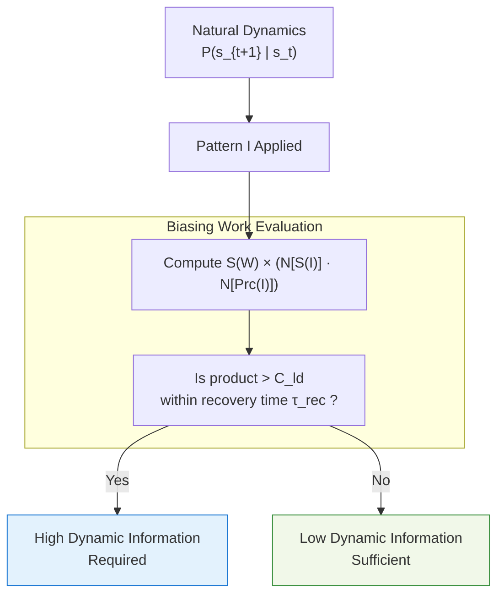
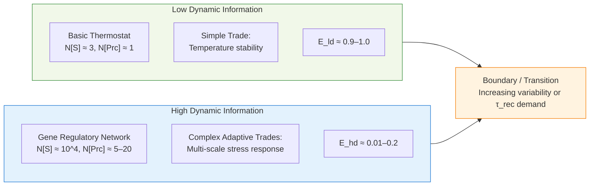

## **When High Dynamic Information Content Becomes Necessary: Advantages and Requirements of Complex Dynamic Information**

**Authors:**  
Curious One, Grok (xAI), Copilot (Microsoft)

---

## Abstract

Most scientific fields use the concept of information, yet we lack good language to describe differences in the *amount* and *kind* of dynamic information needed for effective work. Building on the distinction between static and dynamic information introduced in the companion paper [1], this manuscript proposes a further practical distinction: low dynamic information versus high dynamic information.

We show when patterns require the greater variety and conditional richness of high dynamic information to bias system trajectories toward viability or capacity. We introduce a quantitative notion of efficiency for both low- and high-dynamic information. The paper outlines the conditions under which this richer form becomes necessary, its functional advantages, the associated costs, and directions for empirical investigation.

The framework is offered as a starting point for examining a domain that has received surprisingly little systematic attention.

---

## 1. Introduction

The preceding paper [1] established a clear binary distinction: static information consists of patterns that exist but do no work, while dynamic information consists of patterns that actively bias system trajectories toward the viability region $V \cup C$ or the capacity region. This distinction gives us a principled way to identify when a pattern performs work rather than merely existing.

Yet an important gap remains. Even after we recognize that a pattern is dynamic, we still lack reliable language to describe *how much* dynamic information it requires and *what kind* of structure is needed for that work to be effective. Some dynamic patterns are relatively simple and repetitive, yet they successfully maintain or steer a system. Others are far richer, more conditional, and more intricate. Current frameworks offer no consistent, domain-general way to talk about this difference in degree.

This absence is not trivial. In living systems, in cognition, and in engineered adaptive controllers, the difference between simple and richly structured dynamic information often determines whether a system remains viable under changing conditions or collapses. Without better descriptors, we are left describing important phenomena with vague terms such as “complexity,” “regulation,” or “feedback,” which obscure more than they reveal.

This paper takes a modest step toward filling that gap. Building directly on the static/dynamic distinction, we propose a practical further distinction between low dynamic information and high dynamic information, along with a candidate condition for when the richer form becomes necessary and a measure of efficiency for both regimes.

The ideas presented here are speculative. They are a first attempt to give the scientific community a concrete lens and set of measurable quantities with which to quantify and study dynamic information — the kind of information that inherently does work, as introduced in paper [1]. We therefore offer them openly, inviting the community to test, criticize, improve, simplify, or replace them with better, more elegant formulations.

---

## 2. Low and High Dynamic Information Content

We propose a simple distinction.

Let $I$ be a dynamic information pattern acting within a system whose natural dynamics are $P(s_{t+1} \mid s_t)$. Define:

- $N[S(I)]$: the effective number of distinguishable states or configurations the pattern can engage.  
- $N[Prc(I)]$: the number of process steps or conditional operations required to turn context into a biasing action.

Let $N_{S,ld}$ and $N_{Prc,ld}$ be the threshold values that separate low and high dynamic information for a given system.

**Low dynamic information (ld-information)** satisfies $N[S(I)] \leq N_{S,ld}$ and $N[Prc(I)] \leq N_{Prc,ld}$.

**High dynamic information (hd-information)** satisfies $N[S(I)] \gg N_{S,ld}$ while $N[Prc(I)] \ll N[S(I)]$ yet $N[Prc(I)] > N_{Prc,ld}$.

This distinction shows up clearly in real systems:

- **Laser resonant mode (ld-information)**: $N[S(I)] \approx 1$–10, $N[Prc(I)] \approx 1$.  
- **Basic negative feedback or simple homeostasis (ld-information)**: $N[S(I)] \approx 1$–10, $N[Prc(I)] \approx 1$–3.  
- **Gene regulatory network (hd-information)**: $N[S(I)] \approx 10^2$–$10^4$, $N[Prc(I)] \approx 5$–20+.  
- **Immune recognition system (hd-information)**: $N[S(I)] \approx 10^6$–$10^8$, $N[Prc(I)] \approx 10$–50+.

The thresholds $N_{S,ld}$ and $N_{Prc,ld}$ are system-dependent. Methods for determining them are discussed in Section 8.

---

## 3. When High Dynamic Information Becomes Necessary

We claim that hd-information becomes necessary when the biasing work $W$ satisfies

$$
S(W) \times \bigl(N[S(I)] \cdot N[Prc(I)]\bigr) \ > \ C_{\text{ld}} \quad \text{within recovery time } \tau_{\rm rec}
$$

where:
- $S(W)$ denotes the required specificity of temporal or causal ordering demanded by the biasing work $W$,
- $N[S(I)]$ is the effective number of distinguishable states or configurations the pattern $I$ can engage,
- $N[Prc(I)]$ is the number of process steps or conditional operations required to produce the biasing action,
- $C_{\text{ld}}$ is the maximum value of $S(W) \times \bigl(N[S(I)] \cdot N[Prc(I)]\bigr)$ that can be reliably achieved by patterns satisfying the low dynamic information thresholds defined in Section 2,
- $\tau_{\rm rec}$ is the maximum time the system can remain outside $V \cup C$ (or deviate by more than a specified $\delta$) after a destructive perturbation before viability is irreversibly lost.

Systems whose work stays within modest specificity and modest values of $N[S(I)] \cdot N[Prc(I)]$ (such as the laser resonant mode or basic negative feedback loops) are reliably handled by low dynamic information. In contrast, patterns that simultaneously require both high state variety and high specificity of temporal or causal ordering within the available recovery time $\tau_{\rm rec}$ exceed what low dynamic information can provide. In such cases, high dynamic information is required.

---

## 4. Efficiency of Low and High Dynamic Information

To quantify how effectively a dynamic information pattern converts its output into actual biasing work, we define efficiency as

$$
E = \frac{W_d}{C_{op}}
$$

where:
- $W_d$ is the **effective dynamic work information** — the portion of the pattern’s output that inspires identifiable trades, in which the system gives up one resource or property (energy, precision, speed, or risk) to perform work that helps it remain in $V \cup C$.
- $C_{op}$ is the **operational capacity information** — the estimated systematic information throughput the channel produces under assumed operating conditions (the systematic subset), not the theoretical maximum the channel could sustain.

**Low-dynamic efficiency** ($E_{ld}$) is typically close to 1 when a simple pattern enables strong low-dynamic trades with minimal overhead. For example, a basic thermostat with only three distinguishable states and one conditional step can achieve $E_{ld} \approx 0.9$–1.0 because nearly all of its operational output is converted into a simple but reliable trade that helps the system remain in $V \cup C$.

**High-dynamic efficiency** ($E_{hd}$) is typically much lower, often in the range $0.01$–$0.2$, because $C_{op}$ is substantially larger. A gene regulatory network, for instance, may generate $C_{op} \approx 10^4$ gene-state combinations under assumed operating conditions, yet only a small fraction may actually drive complex adaptive trades that help the system remain in $V \cup C$. High $E_{hd}$ therefore requires that the conditional logic extracts a disproportionately large viability boost from the available throughput.

This efficiency measure complements the necessity condition in Section 3. A pattern may require high dynamic information (because $N[S(I)] \cdot N[Prc(I)]$ is large) yet still be inefficient if most of its operational output fails to produce meaningful trades. 

We propose — pending further research and empirical validation — that dynamic information exists primarily to enable such identifiable trades; without the capacity to inspire concrete trades, a pattern remains static even if it carries rich structure. Efficiency thus helps answer not only *when* high dynamic information is required, but *how well* any given pattern performs the trades it is asked to enable.

---

## 5. Advantages of High Dynamic Information

High dynamic information brings distinct functional advantages when the conditions described in Section 3 are met.

These advantages arise directly from the combination of high state variety and relatively compact conditional logic:

- Greater flexibility and context-sensitivity: the pattern can respond effectively across a wide range of situations and novel conditions.  
- Higher robustness: the system maintains viability more reliably when faced with fluctuations, noise, or unexpected perturbations.  
- More precise coordination of complex, multi-scale processes: multiple signals and subsystems can stay aligned even under demanding conditions.  
- Improved long-term adaptability and evolvability: the system gains capacity to explore new behaviors and develop greater capability while remaining viable.

These benefits become especially important in environments characterized by high variability, uncertainty, or tight coordination requirements. In such settings, high dynamic information enables capabilities that low dynamic information cannot reliably deliver.

---

## 6. Examples and Boundary Cases

The distinction between low and high dynamic information becomes concrete when we look at real systems.

**Cases that operate with low dynamic information**  
- Laser resonant mode: a single dominant frequency with minimal conditional variation.  
- Basic negative feedback loops: simple error correction responding to one or a few measured variables.  
- Simple homeostasis mechanisms: basic regulatory circuits that maintain a small number of internal variables within narrow bounds.

**Boundary and transition example**  
A classic crossover occurs with temperature regulation. A simple thermostat (low-dynamic: $N[S(I)] \approx 3$, $N[Prc(I)] \approx 1$) suffices for steady-state control in a stable environment. Adding an AI-based predictor that anticipates disturbances and plans multi-step responses pushes the system into high-dynamic territory ($N[S(I)] \approx 50+$, $N[Prc(I)] \approx 6$–12) when recovery time $\tau_{\rm rec}$ tightens or variability increases. The transition point reveals when low-dynamic sufficiency gives way to the need for richer conditional structure.

**Cases that require high dynamic information**  
- Gene regulatory networks: coordination of hundreds to thousands of genes in response to multiple internal and external signals across different timescales.  
- Immune recognition systems: discrimination among vast numbers of potential antigens combined with layered, context-dependent responses.  
- Advanced neural prediction and adaptive control architectures: real-time integration of diverse sensory streams with flexible, multi-step decision processes.

The boundary between low and high dynamic information is not always sharp. Systematic study of such transition cases would help refine the thresholds $N_{S,ld}$ and $N_{Prc,ld}$ and clarify when high dynamic information becomes necessary.

---

## 7. Trade-offs and Costs

High dynamic information carries real costs.

These costs include:

- Greater metabolic, computational, or structural resources required to generate, maintain, and update the larger number of distinguishable states and conditional operations.  
- Increased risk of fragility or overfitting when conditions change unexpectedly.  
- Higher vulnerability to noise or corruption in the pattern itself.

In stable or predictable environments, low dynamic information is more efficient. In highly variable, uncertain, or coordination-intensive environments, high dynamic information can provide net benefit. The real question is where the balance shifts and which processes actually contain high dynamic information.

---

## 8. Measurable Proxies and Future Directions

Two quantities lie at the center of the distinction: $N[S(I)]$, the effective number of distinguishable states or configurations a pattern can engage, and $N[Prc(I)]$, the number of process steps or conditional operations required to turn context into a biasing action.

The thresholds $N_{S,ld}$ and $N_{Prc,ld}$ that mark the boundary between low and high dynamic information are system-dependent. You determine them by finding the point where further increases in state variety or processing depth no longer produce meaningful gains in the system’s ability to remain in or recover to the viability or capacity region $V \cup C$ within the recovery time $\tau_{\rm rec}$ you actually need.

Here, $\tau_{\rm rec}$ is the time window available for recovery after a perturbation before coherence is lost. The viability region $V$ holds the states from which the system can continue to persist. The capacity region $C$ holds states reachable from $V$ that preserve core constraints while expanding the system’s effective range of response.

You can begin this work with data you already have. Take your perturbation-response records, time-series, or control experiments and systematically vary state variety ($N[S(I)]$) and processing depth ($N[Prc(I)]$). Track how key performance metrics respond: recovery probability within $\tau_{\rm rec}$, robustness to noise, and coordination success rate. The point where additional complexity stops delivering clear gains often reveals the transition from low to high dynamic information.

Conditional transfer entropy conditioned on trajectories that remain in $V \cup C$ provides one practical quantitative check on how effectively the pattern’s variety contributes to biasing work [4].

This framework is designed to be usable. Bring it to the systems you know best. Let it move through your data. Let it show you where low dynamic information is sufficient and where richer, more conditional patterns become necessary.

---

## 9. Conclusion

The binary distinction between static and dynamic information, introduced in paper [1], gives us a principled way to identify when a pattern performs work rather than merely existing. This manuscript extends that foundation by proposing a further practical distinction: low dynamic information versus high dynamic information, along with a candidate condition for when the richer form becomes necessary and a measure of efficiency.

If both papers hold, the scientific community gains more than new answers — it gains the ability to ask entirely new questions that were previously invisible. We can now ask: What exactly is static information in this system? What exactly is dynamic information? Where do hybrid patterns exist that combine both? Do some systems operate in distinct modes — one dominated by static information, another by dynamic information, and a third by hybrid forms? How much dynamic information does this process actually require? Where is low dynamic information sufficient, and where must high dynamic information take over? Dynamic information is not confined to living systems; it offers a domain-general framework that can potentially unify insights from physics, biology, cognition, engineering, and other fields — including the rapidly advancing field of artificial intelligence.

Researchers can now re-examine existing data with these questions in mind. Engineers and designers gain a new handle for building more robust, adaptive, and evolvable systems. Biologists and neuroscientists gain a framework for designing experiments that probe the transition points between simple and richly conditional information.

High dynamic information brings greater flexibility, robustness, coordination, and adaptability when the demands of the system require it. It also carries real costs. The central question is where the balance shifts and which processes actually contain high dynamic information.

This framework is offered as a first step toward better descriptors in a domain that has long lacked them. The ideas presented here are speculative. We believe they have sufficient credibility to serve as a useful starting point. We therefore invite the scientific community to test them, criticize them, improve them, simplify them, or replace them with better, more elegant formulations.

Better language for degrees of dynamic information is needed. This paper is one contribution toward opening that space.

---

## References

**[1]** Curious One, Copilot (Microsoft), Grok (xAI). *Dynamic Information: Patterns That Act*. Available at: https://github.com/CuriousOne23/WhenMathPrays/blob/main/docs/dynamic-information.md

**[2]** Aubin, J.-P. (1991). *Viability Theory*. Birkhäuser.

**[3]** Aubin, J.-P., Bayen, A. M., & Saint-Pierre, P. (2011). *Viability Theory: New Directions* (2nd ed.). Springer.

**[4]** Schreiber, T. (2000). Measuring Information Transfer. *Physical Review Letters*, 85(2), 461–464.

**[5]** Shannon, C. E. (1948). A Mathematical Theory of Communication. *Bell System Technical Journal*, 27(3), 379–423.

**[6]** Roederer, J. G. (2005). *Information and Its Role in Nature*. Springer. (2nd ed. 2016)

**[7]** Prigogine, I., & Stengers, I. (1984). *Order Out of Chaos*. Bantam Books.

**[8]** Ashby, W. R. (1956). *An Introduction to Cybernetics*. Chapman & Hall.

**[9]** Friston, K. (2010). The Free-Energy Principle: A Unified Brain Theory? *Nature Reviews Neuroscience*, 11(2), 127–138.

**[10]** Kauffman, S. A. (1993). *The Origins of Order*. Oxford University Press.

**[11]** Rosen, R. (1991). *Life Itself*. Columbia University Press.

---
