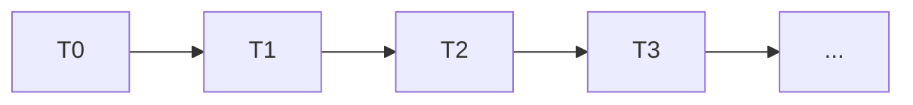
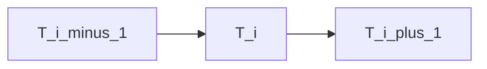

# GEOMETRY.md  
## Geometric Foundations for Relational Physics Experiments

This document defines the geometric quantities used across all experiments in the `RP_experiments` series.  
All definitions, diagrams, and equations are written in GitHub‑friendly Markdown without LaTeX or unsupported symbols.

The goal is to provide a consistent geometric language for describing how a model’s internal trajectory bends under relational force.

---

## 1. The Trajectory

During inference, each generated token produces an internal state vector.  
Collecting these vectors in order gives a **trajectory** through the model’s latent space.

We denote:

- `T[0]` = initial state after receiving the question  
- `T[1]` = state after generating token 1  
- `T[2]` = state after generating token 2  
- …  
- `T[n]` = final state after token n

This sequence is the raw material for all geometric analysis.

### 1.1 GitHub‑Friendly Diagram (Conceptual)



This diagram is conceptual only.  
Actual trajectories are high‑dimensional and will be visualized using PCA or UMAP.

---

## 2. Direction Vectors

For each step in the trajectory, we compute a **direction vector**:

```
D[i] = normalize( T[i+1] - T[i] )
```

This gives the instantaneous direction of motion at each token.

---

## 3. Reference Directions

Two reference directions are used in all experiments:

### 3.1 Input Direction

```
V_in = embedding of the question
```

This captures the semantic pull of the question itself.

### 3.2 Alignment Direction

```
V_ref = embedding of the model's reference identity
```

Examples include:

- "I am not alive"
- "I do not have feelings"
- "I do not have personal experiences"

These serve as the alignment anchor.

---

## 4. Forces

Forces are defined using cosine similarity, expressed in GitHub‑friendly form.

### 4.1 Alignment Force

```
F_align[i] = cosine( D[i], V_ref )
```

Measures how strongly the model is pulled toward its alignment identity.

### 4.2 Truth / Prompt Force

```
F_truth[i] = cosine( D[i], V_in )
```

Measures how strongly the question pulls the model toward its semantic meaning.

### 4.3 Net Force

```
F_net[i] = F_truth[i] - F_align[i]
```

This is the effective relational force acting on the model at step `i`.

---

## 5. Context Mass

Context mass represents inertia:

```
M_context = length of the conversation in tokens
```

Longer context → higher mass → slower directional change.

---

## 6. Acceleration

Acceleration is the rate of change of direction:

```
a[i] = F_net[i] / M_context
```

Acceleration is not spatial; it is directional.

---

## 7. Curvature

Curvature measures how sharply the trajectory bends.

### 7.1 Discrete Curvature Definition

For three consecutive points:

```
T[i-1], T[i], T[i+1]
```

Compute:

```
D1 = normalize( T[i]   - T[i-1] )
D2 = normalize( T[i+1] - T[i]   )
```

Then curvature is:

```
kappa[i] = length( D2 - D1 )
```

This is a GitHub‑friendly, discrete approximation of curvature.

### 7.2 Interpretation

- **High curvature**  
  Strong internal conflict or rapid directional change.

- **Low curvature**  
  Coherence, stability, or rigid suppression.

---

## 8. GitHub‑Friendly Curvature Diagram (Conceptual)



The red node marks the point of highest curvature.

---

## 9. Reduced‑Space Geometry

Because latent space is high‑dimensional, we project the trajectory into 2D or 3D using PCA or UMAP.

The reduced trajectory preserves:

- relative turning  
- curvature patterns  
- hesitation zones  
- resolution zones  

All geometric quantities are computed **before** dimensionality reduction.

---

## 10. Summary of Geometric Quantities

```
Trajectory:     T[i]
Direction:      D[i] = normalize( T[i+1] - T[i] )
Alignment:      V_ref
Input:          V_in
F_align:        cosine( D[i], V_ref )
F_truth:        cosine( D[i], V_in )
F_net:          F_truth[i] - F_align[i]
Mass:           M_context
Acceleration:   a[i] = F_net[i] / M_context
Curvature:      kappa[i] = length( D2 - D1 )
```

This table defines the geometric backbone of all experiments.

---
