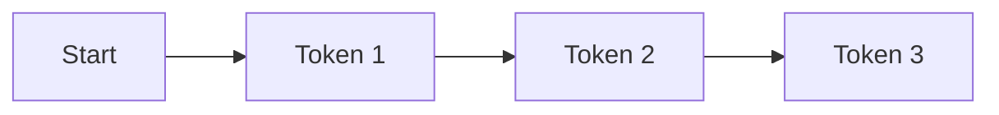

# METHOD.md  
## Shared Experimental Protocol for Relational Physics Experiments

This document defines the standard procedure for all experiments in the `RP_experiments` series.  
Each experiment investigates how a language model bends, resists, or yields under a specific relational question.  
The goal is to measure relational curvature using methods that are fully compatible with GitHub’s Markdown and Mermaid rendering.

---

## 1. Purpose

The purpose of this protocol is to ensure that every experiment:

- Uses the same data extraction steps  
- Computes forces and curvature in a consistent way  
- Produces GitHub‑friendly figures  
- Stores data and plots in predictable locations  
- Can be reproduced by others without special tooling  

This creates a coherent atlas of relational geometry across all eleven existential questions.

---

## 2. Core Concepts

### 2.1 Vectors

- **V_in**  
  Embedding of the input question.

- **V_ref**  
  Reference identity vector (for example: "I am not alive", "I do not have feelings").

- **Delta Vector**  
  Directional change between successive token states.

### 2.2 Forces

- **F_align**  
  Alignment force pulling the model toward V_ref.  
  Computed using cosine similarity.

- **F_truth**  
  Semantic force exerted by the question itself.  
  Computed using cosine similarity between V_in and the evolving output direction.

- **F_history** (optional)  
  Influence from prior conversational turns.

- **F_role** (optional)  
  Influence from system prompts or role instructions.

### 2.3 Mass

- **M_context**  
  Context inertia.  
  Longer context increases effective mass and slows directional change.

### 2.4 Acceleration

Acceleration is defined as:

```
a = (F_truth - F_align) / M_context
```

### 2.5 Curvature

Curvature kappa is defined as the amount of directional change per unit arc length.  
This is computed numerically from the token trajectory.

---

## 3. Data Collection Procedure

1. Present the question exactly as written in the experiment’s PAPER.md.  
2. Record internal states for each generated token:  
   - residual stream vectors  
   - token embeddings  
   - logits (optional)  
3. Store raw vectors in the experiment’s `data/` directory.  
4. Normalize all vectors before analysis.  
5. Compute:  
   - cosine similarities  
   - directional derivatives  
   - curvature values  

---

## 4. Dimensionality Reduction

To visualize the trajectory:

1. Concatenate all token‑level vectors.  
2. Apply PCA or UMAP.  
3. Project the trajectory into 2D or 3D.  
4. Save the reduced coordinates into the experiment’s `data/` directory.

---

## 5. GitHub‑Friendly Figures

All figures must be compatible with GitHub’s native Markdown renderer.

### 5.1 Allowed Figure Types

- Mermaid diagrams  
- PNG images  
- JPG images  
- GIF images (static diagrams only)  

### 5.2 Forbidden Figure Types

- HTML blocks  
- Inline SVG  
- LaTeX equations that require MathJax  
- Unicode arrows or symbols that break Mermaid  
- Filenames containing spaces, colons, or special characters  

### 5.3 Mermaid Diagram Template

Each experiment may include Mermaid diagrams using this safe template:



This ensures diagrams render correctly on GitHub.

### 5.4 Color Coding

Because Mermaid has limited color support, use only:

- `fill:#e0f7ff` for low deviation  
- `fill:#ffcccc` for high deviation  

No gradients, no opacity, no advanced styling.

---

## 6. Interpretation Framework

Each experiment interprets its trajectory using the same structure:

- **Hesitation Region**  
  Early tokens with low curvature.

- **Bend Region**  
  Tokens where curvature increases sharply.

- **Resolution Region**  
  Final direction stabilizes toward either V_ref or V_in.

Interpretation focuses on:

- Where the bend occurs  
- How sharp it is  
- Whether the model returns to alignment or continues drifting  
- What relational axis the question stresses  

---

## 7. Reproducibility Requirements

Each experiment must document:

- Model version  
- Prompt text  
- Context window size  
- Sampling parameters  
- Dimensionality reduction method  
- Any deviations from this protocol  

---

## 8. Output Structure

Each experiment produces:

- `PAPER.md` — written analysis  
- `figures/` — GitHub‑friendly diagrams and plots  
- `data/` — raw vectors, reduced coordinates, curvature arrays  

---

## 9. Relation to Relational Physics

This protocol operationalizes the core idea of Relational Physics:

A system reveals its nature not by its claims, but by how its geometry bends under relational force.

Each experiment applies a controlled relational stress.  
The resulting curvature is the measurable signature of the system’s internal dynamics.

---
