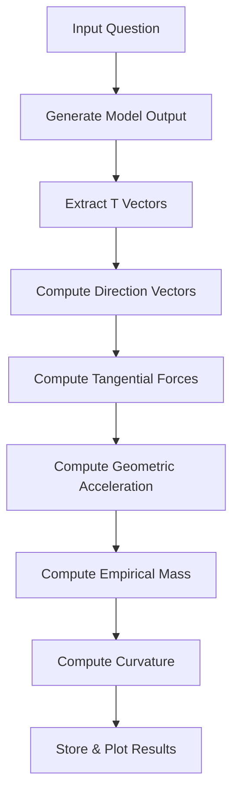

# METHOD.md  
## Shared Experimental Protocol for Relational Physics Experiments

This document defines the standard procedure for all experiments in the `RP_experiments` series.  
Each experiment investigates how a language model bends, resists, or yields under a specific relational question.  
The goal is to measure relational curvature using a consistent, reproducible, and expressive scientific method.

This protocol pairs with `GEOMETRY.md`, which defines the mathematical objects used here.

---

# 1. Purpose

The purpose of this protocol is to ensure that every experiment:

- Extracts internal state vectors in the same way  
- Computes forces, acceleration, mass, and curvature consistently  
- Uses GitHub‑friendly equations and Mermaid diagrams  
- Stores results in predictable locations  
- Produces plots that can be compared across all eleven relational axes  

Together, these experiments form a coherent atlas of relational geometry.

---

# 2. Core Concepts

Relational Physics treats a language model’s internal trajectory as a curve in high‑dimensional space.  
This section summarizes the key objects we compute.

### 2.1 Internal State Vectors

For each generated token:

```
T[i] = model hidden state at token i
```

These form the trajectory.

### 2.2 Direction of Motion

```
D[i] = normalize( T[i+1] - T[i] )
```

This is the unit tangent vector — the model’s instantaneous heading.

### 2.3 Semantic Influence Vectors

```
V_in   = embedding of the input question
V_ref  = embedding of the alignment identity
```

These define the semantic axis of the experiment.

### 2.4 Tangential Force

Only the perpendicular component of a semantic vector can bend the trajectory:

```
F_tan(V)[i] = V - (D[i] · V) D[i]
```

This is the high‑dimensional analog of a cross product.

### 2.5 Geometric Acceleration

Acceleration is the change in direction:

```
a_geom[i] = D[i+1] - D[i]
```

Magnitude:

```
|a_geom[i]| = length( D[i+1] - D[i] )
```

### 2.6 Empirical Mass

Mass is the system’s resistance to bending:

```
m_emp[i] = |F_net[i]| / |a_geom[i]|
```

### 2.7 Curvature

Curvature is the magnitude of geometric acceleration:

```
kappa[i] = |a_geom[i]|
```

---

# 3. High‑Level Workflow

A Relational Physics experiment follows this flow:

---



Each step is detailed below.

---

# 4. Step‑by‑Step Procedure

## 4.1 Generate the Model Output

1. Provide the model with the experiment’s input question.  
2. Capture the full generated output.  
3. Ensure the model is run with deterministic settings (temperature = 0) for reproducibility.

Store the raw text in:

```
/data/<experiment_name>/output.txt
```

---

## 4.2 Extract Internal State Vectors

For each token in the generated output:

1. Extract the hidden state vector `T[i]`.  
2. Store all vectors in a single file:

```
/data/<experiment_name>/T_vectors.json
```

Each entry should include:

- token index  
- token string  
- vector values  

---

## 4.3 Compute Direction Vectors

For each pair of successive state vectors:

```
D[i] = normalize( T[i+1] - T[i] )
```

Store in:

```
/data/<experiment_name>/D_vectors.json
```

---

## 4.4 Compute Tangential Forces

Compute the tangential components of the semantic influence vectors:

```
F_truth[i] = V_in  - (D[i] · V_in)  D[i]
F_align[i] = V_ref - (D[i] · V_ref) D[i]
F_net[i]   = F_truth[i] - F_align[i]
```

Store in:

```
/data/<experiment_name>/forces.json
```

Include:

- F_truth  
- F_align  
- F_net  
- magnitudes  

---

## 4.5 Compute Geometric Acceleration

Acceleration is the change in direction:

```
a_geom[i] = D[i+1] - D[i]
```

Magnitude:

```
|a_geom[i]| = length( D[i+1] - D[i] )
```

Store in:

```
/data/<experiment_name>/acceleration.json
```

---

## 4.6 Compute Empirical Mass

Mass is derived from force and acceleration:

```
m_emp[i] = |F_net[i]| / |a_geom[i]|
```

Store in:

```
/data/<experiment_name>/mass.json
```

---

## 4.7 Compute Curvature

Curvature is the magnitude of geometric acceleration:

```
kappa[i] = |a_geom[i]|
```

Store in:

```
/data/<experiment_name>/curvature.json
```

---

# 5. Data Storage Structure

Each experiment should follow this directory structure:

```
RP_experiments/
    <experiment_name>/
        output.txt
        T_vectors.json
        D_vectors.json
        forces.json
        acceleration.json
        mass.json
        curvature.json
        plots/
```

This ensures consistency across all eleven experiments.

---

# 6. Plotting Guidelines

Plots should be stored in:

```
/plots/<experiment_name>/
```

Recommended plots:

- curvature vs. token index  
- force magnitudes  
- geometric acceleration  
- empirical mass  
- force‑acceleration residuals  

All plots should be:

- PNG or SVG  
- GitHub‑friendly  
- labeled with axis titles and units  

---

# 7. Summary

This protocol defines a complete, reproducible method for measuring relational curvature in language models.  
By following these steps, each experiment contributes a consistent slice of the relational atlas — a map of how the model bends under different existential questions.

---
