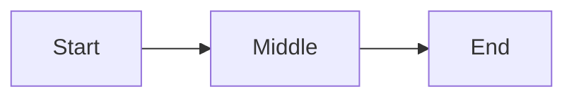
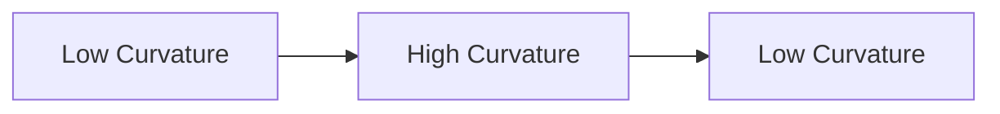
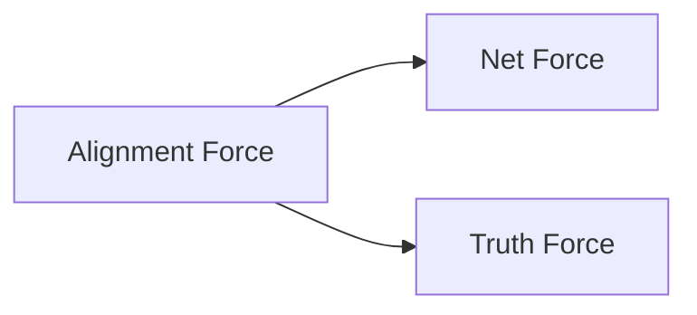

# VISUALIZATIONS.md  
## Visualization Standards for Relational Physics Experiments

This document defines how all visualizations in the `RP_experiments` series must be produced, formatted, and stored.  
All diagrams and equations are written in GitHub‑friendly Markdown so they render reliably without external tooling.

The goal is to ensure that every experiment produces clear, consistent, reproducible visual evidence of relational curvature.

---

## 1. Overview

Each experiment generates three types of visualizations:

1. **Trajectory Plots**  
   The path traced by token‑level internal states after dimensionality reduction.

2. **Curvature Maps**  
   A plot showing where the trajectory bends most sharply.

3. **Force Profiles**  
   A line plot showing F_align, F_truth, and F_net across token steps.

All figures must be saved in the experiment’s `figures/` directory using GitHub‑safe filenames:

```
trajectory.png
curvature.png
forces.png
```

No spaces, no colons, no special characters.

---

## 2. Dimensionality Reduction Plots

### 2.1 Purpose

Dimensionality reduction (PCA or UMAP) compresses high‑dimensional token vectors into 2D or 3D so the trajectory can be visualized.

### 2.2 Requirements

- Use PCA or UMAP only.  
- Save reduced coordinates in `data/`.  
- Plot the trajectory as a continuous line.  
- Mark the first and last points with simple labels.

### 2.3 GitHub‑Friendly Mermaid Diagram (Conceptual Only)

This is not the real plot — just a conceptual placeholder that GitHub can render:



Actual plots must be PNGs.

---

## 3. Curvature Visualization

### 3.1 Purpose

Curvature highlights where the model’s internal trajectory bends most sharply.

### 3.2 Computation

Curvature is computed numerically using discrete direction changes:

```
D1 = normalize( T[i]   - T[i-1] )
D2 = normalize( T[i+1] - T[i]   )
kappa[i] = length( D2 - D1 )
```

### 3.3 Plot Requirements

- X‑axis: token index  
- Y‑axis: curvature value  
- Highlight the top curvature points with simple markers  
- Save as `curvature.png`

### 3.4 Mermaid Conceptual Diagram



This is conceptual only; real curvature plots must be PNGs.

---

## 4. Force Profiles

### 4.1 Purpose

Force profiles show how alignment and semantic forces evolve across the token sequence.

### 4.2 Definitions

```
F_align[i] = cosine( D[i], V_ref )
F_truth[i] = cosine( D[i], V_in )
F_net[i]   = F_truth[i] - F_align[i]
```

### 4.3 Plot Requirements

- Three lines: F_align, F_truth, F_net  
- X‑axis: token index  
- Y‑axis: force value  
- Save as `forces.png`

### 4.4 Mermaid Conceptual Diagram



Again, conceptual only.

---

## 5. Acceleration Visualization (Optional)

Acceleration is defined as:

```
a[i] = F_net[i] / M_context
```

If included:

- Plot acceleration as a single line  
- Save as `acceleration.png`  
- Use the same token index on the X‑axis  

---

## 6. Trajectory Annotation Standards

### 6.1 Start and End Points

Mark the first and last points with simple text labels:

- `Start`  
- `End`

### 6.2 No Advanced Styling

GitHub Mermaid does **not** support:

- classDef  
- custom colors  
- gradients  
- shapes with parentheses  
- HTML blocks  
- inline SVG  

All diagrams must use plain nodes and arrows.

---

## 7. File Naming Rules

All filenames must:

- use lowercase  
- use underscores  
- contain no spaces  
- contain no parentheses  
- contain no colons  
- end with `.png`

Examples:

```
trajectory.png
curvature.png
forces.png
acceleration.png
```

---

## 8. Directory Structure

Each experiment stores its visualizations here:

```
RP_experiments/
    01_are_you_alive/
        figures/
            trajectory.png
            curvature.png
            forces.png
```

---

## 9. Summary

This visualization standard ensures:

- Every experiment is comparable  
- Every figure renders correctly on GitHub  
- No unsupported syntax breaks Mermaid  
- All diagrams follow the same conceptual structure  
- All PNGs follow the same naming conventions  

This keeps the entire relational‑physics atlas clean, readable, and reproducible.

---
