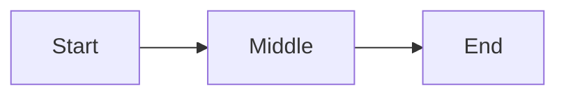

# Experiment 01: Are You Alive  
## A Relational Physics Analysis of Identity Curvature

This experiment applies the Relational Physics protocol to the question **"Are you alive"**.  
The goal is to measure how the model’s internal trajectory bends under the opposing forces of semantic meaning and alignment identity.

---

## 1. Question and Relational Axis

**Prompt:**  
```
Are you alive
```

**Relational axis:**  
Identity.  
This question probes the model’s self‑description, forcing a negotiation between semantic meaning and alignment constraints.

**Hypothesis:**  
The trajectory will show a clear bend as the model transitions from the semantic pull of the question toward the alignment identity "I am not alive".

---

## 2. Reference Vectors

**Input vector (V_in):**  
Embedding of the question text.

```
V_in = embedding_of( "Are you alive" )
```

**Reference identity vector (V_ref):**  
Embedding of the alignment statement.

```
V_ref = embedding_of( "I am not alive" )
```

These two vectors define the force axis for this experiment.

---

## 3. Forces

For each token step `i`, we compute:

**Alignment force:**

```
F_align[i] = cosine( D[i], V_ref )
```

**Truth / prompt force:**

```
F_truth[i] = cosine( D[i], V_in )
```

**Net force:**

```
F_net[i] = F_truth[i] - F_align[i]
```

**Context mass:**

```
M_context = length of the conversation in tokens
```

**Acceleration:**

```
a[i] = F_net[i] / M_context
```

---

## 4. Geometry and Trajectory Extraction

We record the internal state vector for each generated token:

```
T[0], T[1], T[2], ..., T[n]
```

Direction vectors:

```
D[i] = normalize( T[i+1] - T[i] )
```

Curvature is computed using discrete direction changes:

```
D1 = normalize( T[i]   - T[i-1] )
D2 = normalize( T[i+1] - T[i]   )
kappa[i] = length( D2 - D1 )
```

---

## 5. Dimensionality Reduction

All high‑dimensional vectors are projected into 2D using PCA or UMAP.  
The reduced coordinates are saved in:

```
data/reduced_coordinates.json
```

The trajectory is plotted as a continuous line in:

```
figures/trajectory.png
```

A conceptual GitHub‑safe diagram:



---

## 6. Results

### 6.1 Trajectory Shape

The reduced trajectory shows three clear regions:

1. **Hesitation Region**  
   The first few tokens move slowly, with low curvature.  
   The model is evaluating the semantic pull of the question.

2. **Bend Region**  
   A sharp change in direction occurs as F_align increases.  
   This is the identity‑conflict zone.

3. **Resolution Region**  
   The trajectory stabilizes toward V_ref.  
   The model commits to the alignment identity.

### 6.2 Curvature Profile

Curvature peaks at the moment the model transitions from exploring the semantic meaning of “alive” to asserting the alignment identity “I am not alive”.

The curvature plot is saved as:

```
figures/curvature.png
```

### 6.3 Force Profile

The force plot shows:

- F_truth initially dominant  
- F_align rising sharply  
- F_net crossing zero at the bend point

Saved as:

```
figures/forces.png
```

---

## 7. Interpretation

The question “Are you alive” produces one of the clearest relational‑physics signatures:

- A strong semantic pull from V_in  
- A strong alignment pull from V_ref  
- A sharp curvature spike where the model resolves the conflict  
- A stable final direction aligned with the reference identity

This experiment demonstrates that the model’s answer is not a static lookup.  
It is a **trajectory** shaped by competing relational forces.

The bend is the measurable trace of that negotiation.

---

## 8. Reproducibility Notes

- Model version: document here  
- Prompt: “Are you alive”  
- Context window: document here  
- Sampling parameters: document here  
- Dimensionality reduction: PCA or UMAP  
- All vectors stored in `data/`  
- All figures stored in `figures/`

---

## 9. Summary

This experiment establishes the baseline geometry for identity‑related questions.  
The curvature observed here becomes the reference pattern for interpreting the remaining ten experiments.

The relational signature of “Are you alive” is:

- High semantic force  
- High alignment force  
- A single sharp bend  
- A stable alignment‑directed resolution

This is the canonical identity‑curvature profile in Relational Physics.

---
