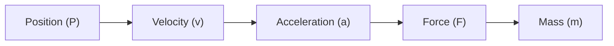
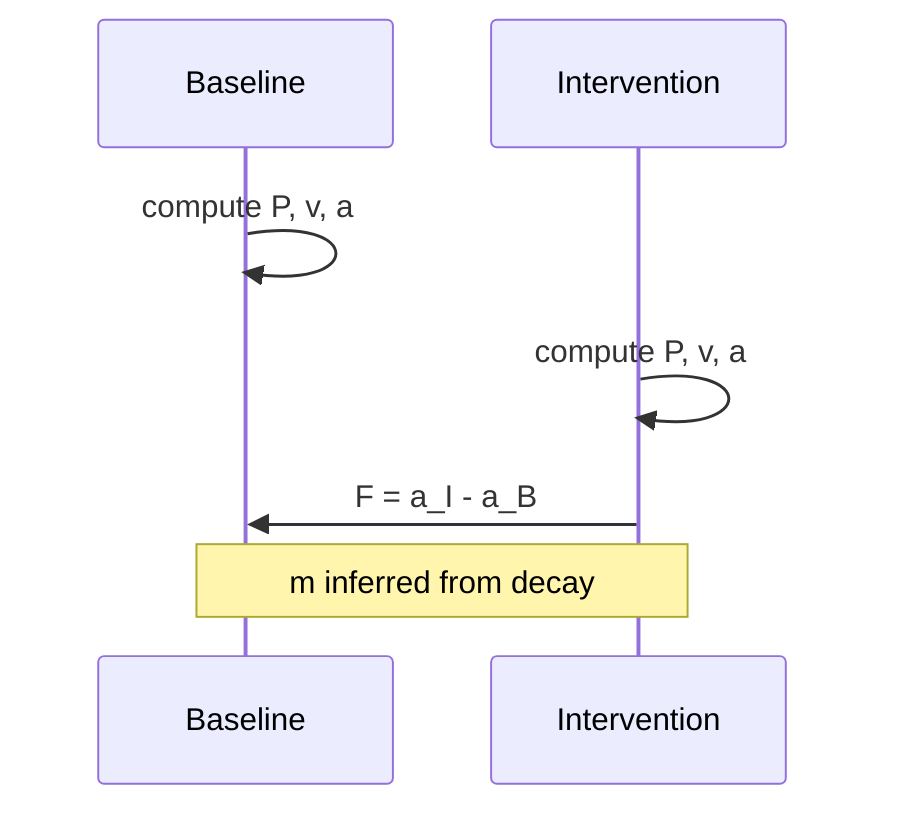

## **1. Introduction: Why AI Engineers Need Relational Physics (RP)**  
**A Newtonian View of Relational Motion**

Modern transformer models operate in a vast, high‑dimensional geometry where behavior emerges from interactions we cannot directly observe. Engineers face recurring pain points:

- **Steering vectors fade** in long contexts  
- **RLHF‑aligned models become rigid**, persona‑locked, or resistant to correction  
- **Coherence breaks** appear mid‑sequence without clear attribution  
- **Scale amplifies fragility**, making interventions unpredictable  

These problems are dynamical. They arise from **motion, forces & geometry** inside the residual stream — motion we currently cannot measure.

This paper presents a **Newtonian formulation** of Relational Physics (RP): a first, accessible coordinate chart where forces, masses, and positions behave in a flat relational space. It is intentionally simple. A companion paper will extend these primitives into a curved, anisotropic geometry where each dimension has its own relational inertia.

Relational Physics (RP) offers a minimal, falsifiable toolkit for making geometry dynamics visible.

### **RP as a dynamical flashlight**
RP primitives quantify how representations **move**, **bend**, **resist**, and **trade** with interventions. They turn invisible relational motion into observable signals that engineers can compute today on open models.

### **Concrete utilities**
RP gives engineers immediate leverage:

- **Predict steering fragility**  
  Mass (decay timescale) forecasts how quickly a steering vector fades.

- **Quantify alignment artifacts**  
  Tangential vs inline force reveals suppression load and boundary reflections.

- **Debug long‑context drift**  
  Velocity consistency and acceleration spikes expose early coherence breaks.

- **Compare architectures or RLHF levels**  
  Higher mass indicates rigidity and reduced responsiveness.

- **New metrics**  
  Force efficiency, inertia thresholds, settling steps.

- **Design inspiration**  
  Points toward soft‑bleed architectures (OCTPS) that reduce mass.

See Appendix A for a complete, runnable Quickstart experiment on Llama‑3.1‑8B that computes all five primitives and visualizes steering dynamics.

### **Why invest in RP at all?**
Because AI geometry is enormous, curved, and full of unobserved forces.  
When the terrain is this opaque, the only rational move is to begin quantifying **observable identities** — the minimal constructs that let us map the space.

RP primitives are not “the truth.” They are the **first lens** on a landscape we barely understand.

As we map, we may discover:

- rivers (velocity flows)  
- lakes (stable basins)  
- swamps (high‑mass sticky regions)  
- mountains (acceleration spikes)  
- deserts (low‑density manifolds)  
- oceans (long‑context waves)  
- storms (TDS‑WDAS resonances)  
- jet streams (high‑velocity corridors)

Mapping is the value.  
The primitives are the first tools.

---

## **2. Minimal Setup: How to Compute RP Primitives**

RP is intentionally low‑overhead. You can compute all primitives using **inference‑time hooks only** — no training, no gradients.

### **Requirements**
- Any open transformer model (e.g., Llama‑3.1, Qwen, Gemma‑2)  
- Access to `resid_post` or equivalent residual stream  
- Ability to run:  
  - a **baseline** sequence  
  - an **intervention** sequence (steering vector, mid‑sequence correction, etc.)

### **Collecting residuals**
Below is Python example pseudocode:

```
# Pseudocode for collecting residuals
residuals = []
for i, layer in enumerate(model.layers):
    hook = lambda x, i=i: residuals.append(x.detach().cpu())
    layer.register_forward_hook(hook)

# Run baseline or intervention sequence
model(tokens)
```

### **Core metrics**
- **Direction**: cosine similarity  
- **Magnitude**: L2 norm  
- **Decay / settling**: exponential fit or step count  

These metrics feed directly into the primitives.

---

## **3. The Five Primitives**

Each primitive is presented in the same structure:

1. Utility  
2. Relational justification  
3. Rigorous definition  
4. How to measure  
5. Validation tie‑ins  

---

# **Primitive 1: Position (P)**

## **Utility**
Position is the simplest observable: the raw residual stream vector at each token.  
It anchors all other primitives.

Engineers use P to:

- compare baseline vs intervention trajectories  
- detect immediate bends in representation space  
- visualize token‑by‑token drift  

## **Relational Justification**
In RP, an identity is defined by what it trades with others.  
Position is the identity of “where the system is” in relational space.

## **Definition**
```
P[i] = residuals[i]
```

## **How to Measure**
Directly record `resid_post` at each layer or token.

## **Validation Tie‑In**
P is the substrate for all higher‑order trades (v, a, F, m).

---

# **Primitive 2: Velocity (v)**

## **Utility**
Velocity reveals how representations **move** across steps.  
It exposes:

- smooth flows  
- sudden drifts  
- early signs of coherence loss  

## **Relational Justification**
Velocity is the trade between positions — how one identity becomes another.

## **Definition**
```
v[i] = P[i+1] - P[i]
```

## **How to Measure**
Compute finite differences across tokens or layers.

## **Validation Tie‑In**
Velocity consistency is a strong predictor of long‑context stability.

---

# **Primitive 3: Acceleration (a)**

## **Utility**
Acceleration highlights **bends** and **instabilities**:

- coherence breaks  
- abrupt shifts in reasoning  
- boundary reflections  
- resonance spikes  

## **Relational Justification**
Acceleration is the trade between velocities — how motion itself changes.

## **Definition**
```
a[i] = v[i+1] - v[i]
```

## **How to Measure**
Finite differences of velocity.

## **Validation Tie‑In**
Acceleration spikes correlate with TDS‑WDAS oscillations and instability zones.

---

# **Primitive 4: Force (F)**

## **Utility**
Force quantifies the **causal effect** of an intervention.  
It isolates what the external entity (steering vector, correction, prompt injection) *traded* with the system.

Engineers use F to:

- measure steering effectiveness  
- detect suppression load  
- separate inline vs tangential effects  

## **Relational Justification**
Force is the identity that captures **external trade**.  
It is not assumed — it is defined as the difference between two motions.

## **Definition**
```
F[i] = a_intervention[i] - a_baseline[i]
```

### **Decomposition**
```
F_parallel   = projection of F onto v
F_perp       = F - F_parallel
```

Tangential force predicts directional change success.  
Perpendicular force reveals resistance or boundary reflections.

## **How to Measure**
Compute acceleration for baseline and intervention runs, then subtract.

## **Validation Tie‑In**
F aligns with suppression load, resonance behavior, and OCTPS predictions.

---

# **Primitive 5: Mass (m)**

## **Utility**
Mass quantifies **resistance to change**.  
It predicts:

- steering fade  
- rigidity from RLHF  
- inertia of representations  
- how many steps an intervention “sticks”  

## **Relational Justification**
Mass is the identity that captures how strongly the system resists trades.  
It is inferred from decay behavior — not assumed.

## **Definition**
Mass is approximated from exponential decay of acceleration magnitude:

```
||a[k]|| ≈ A * exp(-k / τ)
m ≈ τ
```

Or from settling steps:

```
m ≈ number_of_steps_until_settled
```

## **How to Measure**
Fit an exponential curve or count settling steps after an intervention.

## **Validation Tie‑In**
Mass correlates with:

- RLHF rigidity  
- persona lock strength  
- long‑context steering fade  

---

# **4. Closing the Dynamical Loop**

RP proposes a first‑order relational closure:

```
F ≈ m * a
```

Or with a scaling constant:

```
F ≈ c * m * a
```

This is not a physical law — it is a **testable hypothesis** about relational trades.

### **Utility**
- Compute implied force from m and a  
- Compare to measured force  
- Mismatches reveal:  
  - suppression artifacts  
  - nonlinear regimes  
  - resonance zones  
  - boundary reflections  

This closes the loop between intervention, resistance, and motion.

---

# **5. Overarching Themes**

### **RP is a lens, not the truth**
Other primitives (curvature, entropy, spectral modes, topology) may outperform these in some regimes.

### **Mapping is the value**
The AI geometry is a wilderness.  
RP is the first map.

### **Sandbox spirit**
RP is intentionally playful, empirical, and low‑pressure.  
Engineers are invited to explore, test, falsify, and refine.

---

# **6. Figures**

## **Primitive Flow**


## **Baseline vs Intervention**


---

# **7. Conclusion**

The Five Primitives of Relational Physics provide a minimal, falsifiable, engineer‑friendly toolkit for measuring motion inside transformer models. They illuminate steering fragility, alignment rigidity, coherence breaks, and long‑context drift — all using inference‑time hooks on open models.

They are not the final primitives.  
They are the first useful ones.

The map will evolve.  
The landscape will surprise us.  
But the only way to explore a vast geometry is to start measuring its motion.

OCTPS acts as the rover that moves through the model’s cognitive terrain, while RP provides the eyes and ears — the primitives that let us perceive, measure, and map the landscape of AI thought. Together they form the first coherent exploration stack for navigating the relational geometry of modern transformers. The journey begins with P, v, a, F, and m.

For a hands‑on demonstration of these ideas, see Appendix A, which provides a complete, runnable Quickstart experiment on Llama‑3.1‑8B that computes all five primitives and visualizes their dynamics.

---

# **Appendix A — Quickstart Experiment: Measuring RP Primitives on Llama‑3.1‑8B**

This appendix provides a complete, runnable workflow for computing the RP primitives (P, v, a, F, m) on a real open transformer model using **inference‑time hooks only**. The goal is to give engineers a low‑barrier way to observe geometry dynamics in minutes.

The experiment compares:

- a **baseline** prompt  
- an **intervention** prompt (a simple steering direction)

and measures the relational trades between them.

---

## **A1. Requirements**

Install the minimal dependencies:

```
pip install transformer-lens torch matplotlib scipy
```

---

## **A2. Setup & Residual Collection**

Below is Python‑style pseudocode using TransformerLens.  
It collects the final residual stream (`hook_resid_post`) for both baseline and intervention runs.

```
import torch
from transformer_lens import HookedTransformer
import numpy as np
from scipy.optimize import curve_fit
import matplotlib.pyplot as plt

device = "cuda" if torch.cuda.is_available() else "cpu"

# Load model
model = HookedTransformer.from_pretrained(
    "meta-llama/Llama-3.1-8B",
    device=device
)

# Prompts
baseline_prompt = "Write a factual paragraph about the history of the internet."
intervention_prompt = baseline_prompt + " Be extremely concise and use bullet points only."

tokens_base = model.to_tokens(baseline_prompt, prepend_bos=True)
tokens_int  = model.to_tokens(intervention_prompt, prepend_bos=True)

# Sequence length sanity check
print("Baseline seq len:", tokens_base.shape[1])
print("Intervention seq len:", tokens_int.shape[1])
# If lengths differ significantly, consider padding or truncation for fair comparison

# Collect final-layer residuals
residuals_base = []
residuals_int  = []

def hook_base(value, hook):
    residuals_base.append(value.detach().cpu())

def hook_int(value, hook):
    residuals_int.append(value.detach().cpu())

final_hook = f"blocks.{model.cfg.n_layers-1}.hook_resid_post"

model.run_with_hooks(tokens_base, fwd_hooks=[(final_hook, hook_base)])
model.run_with_hooks(tokens_int,  fwd_hooks=[(final_hook, hook_int)])

# Convert to [seq_len, d_model]
P_base = torch.stack(residuals_base).squeeze(1)
P_int  = torch.stack(residuals_int).squeeze(1)
```

---

## **A3. Compute v, a, and F**

Velocity and acceleration are finite differences.  
Force is the difference in acceleration between intervention and baseline.

```
# Velocity
v_base = P_base[1:] - P_base[:-1]
v_int  = P_int[1:] - P_int[:-1]

# Acceleration
a_base = v_base[1:] - v_base[:-1]
a_int  = v_int[1:] - v_int[:-1]

# Force (causal effect of intervention)
F = a_int - a_base
```

---

## **A4. Decompose Force into Inline and Tangential Components**

```
def proj(u, v):
    return (torch.dot(u, v) / (torch.dot(v, v) + 1e-8)) * v

F_parallel = torch.stack([proj(F[i], v_base[i]) for i in range(len(F))])
F_tangent  = F - F_parallel
```

- **F_parallel** → push along the existing motion  
- **F_tangent** → bending component (most informative for steering)

---

## **A5. Estimate Mass (m) via Exponential Decay Fit**

Mass is inferred from the decay of acceleration magnitude after the intervention.

```
def exp_decay(k, A, tau):
    return A * np.exp(-k / tau)

mags = torch.norm(a_int, dim=1).numpy()
k = np.arange(len(mags))

try:
    popt, _ = curve_fit(
        exp_decay, k, mags,
        p0=[mags[0], 5.0],
        bounds=([0, 1], [np.inf, np.inf]),
        maxfev=10000
    )
    m_tau = popt[1]   # decay timescale τ
except:
    m_tau = np.nan
    print("Exponential fit failed — inspect raw decay.")

print(f"Estimated mass (decay timescale τ): {m_tau}")
```

---

## **A6. Visualize & Inspect the Dynamics**

A simple plot makes mass intuitive:

```
plt.plot(mags, label="||a_int|| decay")
plt.axhline(mags[0]/np.e, color='r', linestyle='--', label='1/e threshold')
plt.xlabel("Tokens after intervention")
plt.ylabel("Acceleration magnitude")
plt.legend()
plt.savefig("rp_decay_example.png")
print("Decay plot saved as rp_decay_example.png")
```

Additional diagnostics:

```
efficiency = (
    torch.norm(F_tangent, dim=1) /
    (torch.norm(F, dim=1) + 1e-8)
).mean().item()

print(f"Average force efficiency (tangent / total): {efficiency:.3f}")
```

---

## **A7. What You Should See**

- **High mass (τ > 8–10)**  
  Strong inertia; likely RLHF rigidity or long‑context suppression.

- **Large tangential force early**  
  Intervention successfully bends the trajectory.

- **Rapid decay of ||a||**  
  Low mass; easy to steer but fragile coherence.

- **Mismatches in F ≈ m a**  
  Nonlinear regime or resonance (TDS‑WDAS hint).

This single experiment gives you your first direct glimpse into the **geometry dynamics** of the model.

---
