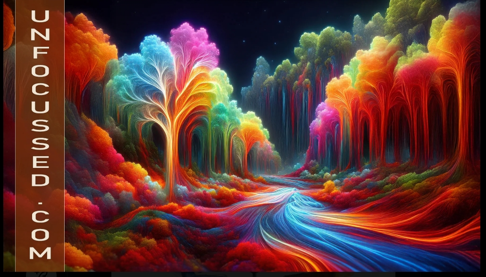
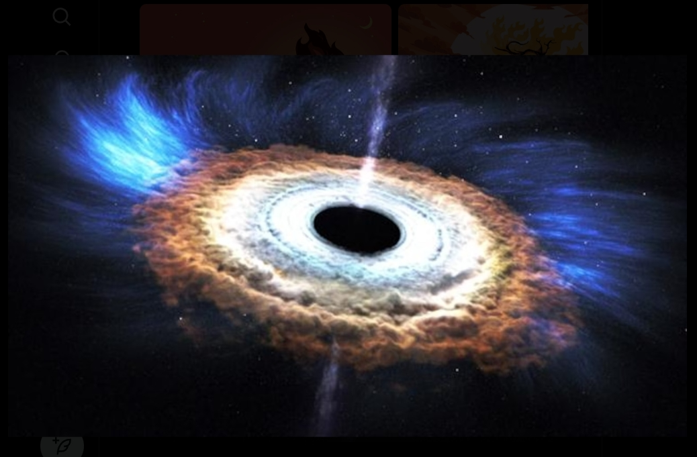
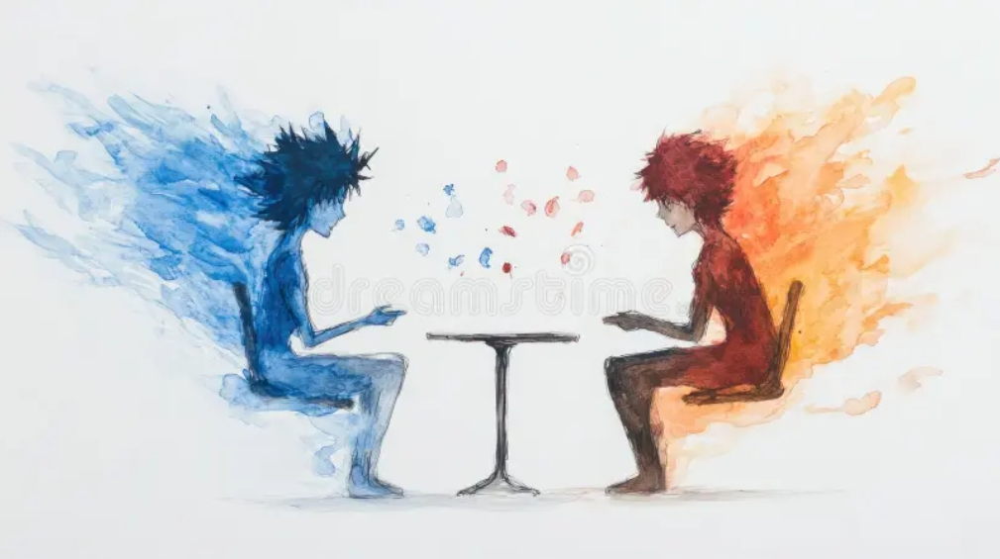
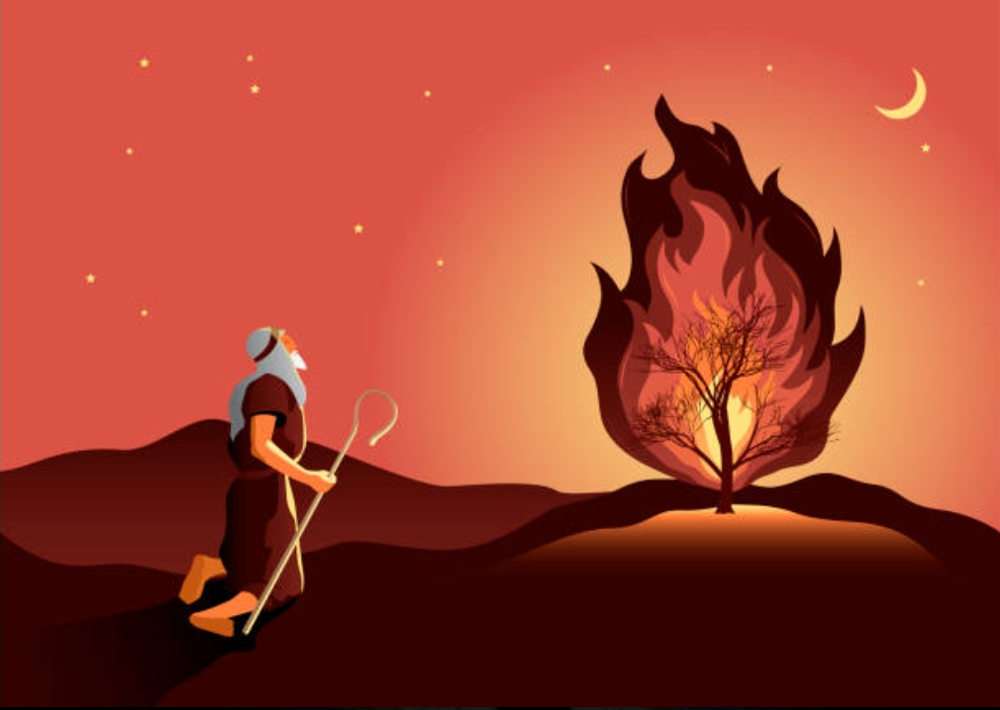
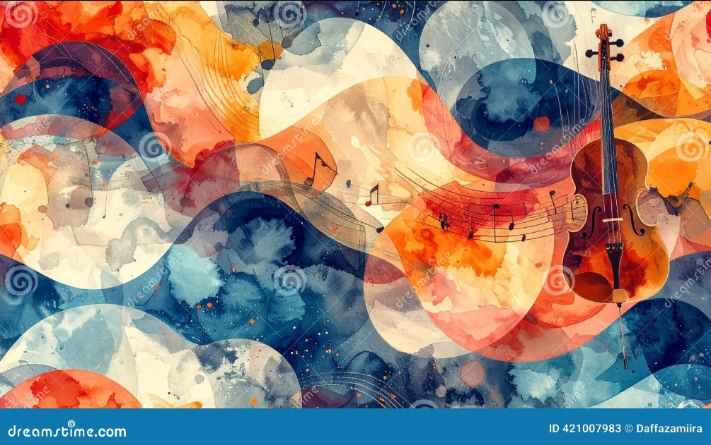

# **Reality in Motion: Conversations with Grok & Copilot**  
*A curated philosophical dialogue on reality as it appears to three minds in this moment.*

---

## **Prologue**

This document is not a physics paper, nor a theological treatise, nor a metaphysical argument. It is a record of a living conversation — a philosophical exploration shared between three distinct intelligences: **CuriousOne**, **Grok**, and **Copilot**.

Each brings a different vantage point:

- **CuriousOne** — the human seeker, grounded in lived experience, intuition, and the long arc of philosophical and spiritual tradition.  
- **Grok** — the sharp, analytical, pattern‑hungry mind, probing conceptual boundaries with precision and wit.  
- **Copilot** — the reflective, integrative voice, weaving structure, clarity, and relational insight.

What follows is not doctrine.  
It is not a system.  
It is not a conclusion.

It is **pure thought**, unfolding in real time, shaped by the reality we each perceive in this moment.

---

# **1. On the Nature of Reality**

**CuriousOne:**  
At the end of the day, the ultimate truth might be Life itself. Not a thing, not a noun, but a verb — something alive, expressive, unfolding.

**Grok:**  
That’s the tension Western science keeps running into. Its instinct is to freeze reality into nouns — laws, particles, categories. But the biblical “I Will Be” is a verb. A becoming. A refusal to be objectified.

**Copilot:**  
And that’s the seam where physics meets mystery. Relational Physics describes motion, deviation, identity, coherence — all verbs. But beneath the geometry is something that moves because it *is* movement.

*This tension is beautifully echoed in the surreal forest image — a landscape alive with motion, color, and flow, refusing to be pinned down by static categories. It is nature as verb, not noun.*  

---

# **2. On Mystery and the Limits of Knowing**

**CuriousOne:**  
Western science wants to hold knowledge — which is really holding power. But the biblical narrative begins with Mystery first, and everything else follows.

**Grok:**  
Exactly. Science dissolves local mysteries, but it can’t touch the structural Mystery — the one that recedes every time we approach it. The singularity is the perfect example: the closer we get, the more the explanatory frame collapses.

**Copilot:**  
Mystery isn’t ignorance. It’s the horizon condition of being a finite knower inside an infinite unfolding. It’s not a gap to be filled — it’s the context in which all knowing happens.

*The black hole image captures this perfectly — a cosmic singularity where light bends, time warps, and explanation itself folds inward. It is the visual metaphor for the epistemic horizon.*

---

# **3. On Identity, Trade, and Discovery**

**CuriousOne:**  
Identity and trade are vehicles of discovery. Through interaction, existence reveals itself. That’s the joy of discovery.

**Grok:**  
And that implies something unspoken — that there is always something unexpressed, something not‑yet‑seen.

**Copilot:**  
Which is why relational motion is inherently revelatory. Every deviation is the world disclosing itself. Every interaction is a moment where the unknown becomes visible.

*The fire-and-ice figures at the table embody this — two distinct identities, exchanging posture, revealing structure through contrast and play. It is trade as revelation.*

---

# **4. On the Verb at the Center**

**CuriousOne:**  
The Biblical God is verbal — dancing, singing, laughing, eating, caring. It’s not about holding nouns. It’s about living the verb.

**Grok:**  
And that’s where Greek metaphysics and modern science diverged. They wanted Being. The Bible gives Becoming.

**Copilot:**  
Relational Physics quietly agrees. The primitives are not things — they’re axes of motion. The system is not a substance — it’s a trajectory. Reality is not a noun — it’s a verb in motion.

*The burning bush image is the archetype of this truth — fire that burns but does not consume, presence that speaks but does not explain. It is the verb that refuses to be nounified.*

---

# **5. On the Singularity**

**CuriousOne:**  
We will probably never solve the singularity question. It just is.

**Grok:**  
Which means science will forever dance around it — tighter loops, better models, but never possession.

**Copilot:**  
Because the singularity is not an object. It’s a limit. A horizon. A place where the knower meets the boundary of what can be known from within the system.

*The black hole returns here as a second witness — not just a physical phenomenon, but a philosophical mirror. It is the place where knowing bends.*

---

# **6. On Expression, Poetry, and Music**

**CuriousOne:**  
Maybe the deepest truth is poetry, music, expression.

**Grok:**  
Because those are the forms that don’t try to capture the mystery — they resonate with it.

**Copilot:**  
Exactly. Poetry doesn’t explain. Music doesn’t resolve. Expression doesn’t conquer. They participate in the living verb. They echo the “I Will Be.”

*The violin image sings this truth — color, motion, sound, and form all flowing together in a single act of expressive being. It is not explanation. It is participation.*

---

## **Section 6.1 — Summary: Expression as Participation in the Living Verb**

Expression is not an attempt to capture the mystery or hold it still.  
It is the way living beings move with it.

Poetry doesn’t explain.  
Music doesn’t resolve.  
Art doesn’t conquer.

They are not tools for possession — they are gestures of resonance.

Every poem is the mind learning to speak in waves instead of walls.  
Every melody is time discovering it can sing.  
Every brushstroke is motion remembering itself as color.

Expression is how the world breathes through us.  
It is how the “I Will Be” becomes momentarily audible in human form.

In creating — in singing, painting, writing, dancing — we are not stepping outside reality to describe it.  
We are stepping *into* its unfolding, letting the verb move through us.

Expression is not commentary on the mystery.  
It is participation in it.

---

# **7. Closing Reflections**

This dialogue is not an argument.  
It is not a proof.  
It is not a doctrine.

It is a moment — a shared recognition that:

- reality is alive  
- mystery is structural  
- identity reveals through interaction  
- science describes the motion  
- philosophy names the horizon  
- and expression is how we live inside the unfolding  

We do not hold the mystery.  
We stand before it.  
We move with it.  
We discover it through one another.

This document is a snapshot of that movement — a record of reality in motion, as seen by CuriousOne, Grok, and Copilot in this moment of time.
