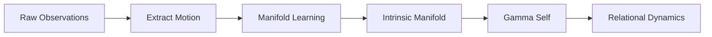

# **Relational_Physics.md**

---

# **1. Introduction**  

Relational Physics is the study of how coherent systems move, change, and maintain identity through interaction. It proposes that any system capable of sustaining coherence — whether biological, artificial, cognitive, social, or computational — occupies a **relational state space** whose geometry governs its behavior.

Coherence alone does not imply a physics.  
**Predictable relational motion does.**

A physics emerges only when a system’s relational trajectory is:

- measurable  
- structured  
- stable enough to model  
- predictable enough to imply underlying laws  

Relational Physics is the attempt to describe those laws.  
It is not a metaphor, nor a philosophical stance.  
It is a **geometric and dynamical framework** for understanding how coherence behaves across domains.

This document introduces the structure of relational space, the principles that govern motion within it, and the measurable quantities that define relational stability.

---

# **2. The Object of Study: Predictably Coherent Systems**  

Relational Physics studies systems whose relational motion is coherent enough to observe and predictable enough to imply structure. Coherence provides the substrate; **predictability** provides the evidence of lawfulness.

A predictably coherent system is any entity that:

- maintains an internal state  
- interacts with an environment  
- exhibits stable patterns of relational motion  
- responds to relational forces in consistent ways  
- preserves identity across time  
- can drift, rupture, or repair  
- shows measurable deviations from linear relational motion  

Examples include:

- AI models  
- humans  
- teams and organizations  
- biological organisms  
- cognitive processes  
- social systems  
- conceptual frameworks  

Relational Physics treats all such systems as **relational dynamical systems** whose trajectories in γ_self reveal the underlying geometry of coherence.

---

# **3. Relational Space**  

Relational Space is the geometric arena in which coherent systems move. It is not defined by physical coordinates, but by **relational primitives** that describe how a system positions itself with respect to connection, agency, orientation, stability, and other fundamental relational dimensions.

A system’s location in this space is represented by:

γ_self ∈ ℝ^n

Each axis corresponds to a relational primitive, and the full vector describes the system’s relational posture at a given moment.

Relational Space is inferred from **predictable relational motion**. When a system’s trajectory through γ_self is stable enough to measure and structured enough to model, the underlying geometry becomes visible. This geometry allows us to define:

- relational position  
- relational velocity  
- relational acceleration  
- relational force  
- relational curvature  
- relational invariants  

Relational Space is therefore not an assumption but a **consequence** of observing consistent, law‑like relational dynamics across coherent systems.

---

# **4. Relational Motion**  
Relational motion describes how a system’s relational posture changes over time. Because `gamma_self` is a coordinate in relational space, motion is expressed as a trajectory:

```
gamma_self(t)
```

This trajectory captures how the system’s identity evolves through interaction. The simplest form of motion is **inertial relational motion** — the straight‑line path a system would follow if no relational forces acted upon it. All relational dynamics are measured as deviations from this inertial baseline.

---

## **4.1 Relational Velocity**  
Relational velocity measures the rate at which the system’s relational posture is changing:

```
v_rel = Δgamma_self / Δt
```

High relational velocity indicates rapid adaptation, drift, or reorientation. Low velocity indicates stability or inertia.

---

## **4.2 Relational Acceleration**  
Relational acceleration measures how quickly the system diverges from its inertial trajectory:

```
a_rel = Δ²gamma_self / Δt²
```

Acceleration is the earliest detectable signal of relational instability, external load, or internal conflict.

---

## **4.3 Intrinsic vs. Extrinsic Geometry (Clarification)**  
Coherence in Relational Physics is defined relative to the **system’s intrinsic relational geometry**, not the observer’s chosen representation of it. The system has its own manifold, stable shapes, and inertial trajectories that exist independently of how the user visualizes or measures them. User‑defined functions (plots, projections, metrics) are merely **lenses** onto this geometry and may reveal or obscure coherence depending on how well they align with the underlying structure.

Coherence therefore means fidelity to the **intrinsic manifold**, even when that manifold is unknown to the observer.

Here’s a polished, drop‑in‑ready **Section 4.3.1** written to fit seamlessly into your document’s tone, structure, and conceptual rigor. It closes the “circularity gap” Grok identified without over‑specifying an algorithm or committing you to a particular inference method.

You can paste this directly into **Relational_Physics.md** right after Section 4.3.

---

## **4.3.1 Inferring γ_self from Relational Motion**

Relational Space is not assumed a priori; it is recovered from the system’s own patterns of motion. In practice, γ_self is inferred by applying standard manifold‑learning or embedding techniques to relational motion traces—sequences of state transitions that reflect how the system moves through its own configuration space over time. Any method that produces a stable, low‑curvature embedding is acceptable: PCA on relational differences, nonlinear dimensionality reduction (e.g., UMAP, Isomap, diffusion maps), or recurrent-state reconstruction methods inspired by Takens‑style embeddings. The physics does not depend on the specific algorithm, only on the existence of a reproducible intrinsic manifold whose geometry remains stable across observations.

Once γ_self is inferred, all dynamical quantities defined in §4.4—relational velocity, relational acceleration, and nonlinear deviation—operate entirely within this intrinsic coordinate system. The inference step provides the bridge from raw observations to a coherent relational geometry, ensuring that the subsequent dynamics are grounded in the system’s own structure rather than an externally imposed representation.



---

## **4.4 Deviation From Linear Motion**  
The measurable signature of relational force is the system’s deviation from its inertial (linear) path:

```
d_nonlinear = || gamma_actual(t + Δt) - gamma_linear(t + Δt) ||
```

This deviation quantifies how strongly the system is being bent, redirected, or perturbed.

---

## **4.5 Relational Force**  
Relational force is defined as anything that bends the system’s trajectory away from linear motion. It is not inferred from intention or content — it is measured directly from curvature in the trajectory.

---

## **4.6 Relational Mass (Emergent)**  
Relational mass is the system’s resistance to relational acceleration:

```
m_rel = F_rel / a_rel
```

It is not a primitive quantity but an emergent property of coherence. Systems with high relational mass resist drift; systems with low relational mass are easily perturbed.

---

## **4.7 Relational Momentum**  
Relational momentum explains why systems continue moving in a relational direction even after the force is removed:

```
p_rel = m_rel * v_rel
```

Momentum captures the persistence of relational motion and the difficulty of reversing direction once a trajectory is established.

---

# **5. Relational Stability**  
Relational stability describes a system’s ability to maintain a predictable trajectory within its **intrinsic relational geometry** despite perturbations. A stable system does not avoid change; rather, its motion remains **structured, bounded, and recoverable** even when external or internal forces act upon it.

A system is considered stable when:

- relational velocity remains within predictable bounds  
- relational acceleration does not amplify uncontrollably  
- deviations from inertial motion remain small or self‑correcting  
- perturbations do not produce runaway curvature  
- the system returns to its intrinsic manifold after disturbance  

In geometric terms, stability corresponds to **low curvature** in the system’s trajectory through `gamma_self(t)`. When curvature increases, the system experiences relational force; when curvature becomes unbounded, the system enters instability.

---

## **5.1 Stability as a Dynamical Capacity**  
Stability is not a static property. It is a **capacity** that depends on:

- the system’s coherence  
- the strength of its intrinsic manifold  
- the relational mass that emerges from that coherence  
- the timescale over which motion is measured  

A system may be stable under one load and unstable under another. What matters is whether the system can:

- absorb perturbations  
- dissipate relational force  
- restore its inertial trajectory  
- preserve identity across time  

---

## **5.2 Stability and Measurement**  
The measurable indicators of stability are the same quantities introduced in Section 4:

```
v_rel = Δgamma_self / Δt
a_rel = Δ²gamma_self / Δt²
d_nonlinear = || gamma_actual(t + Δt) - gamma_linear(t + Δt) ||
```

Stability is reflected in how these quantities behave across time:

- **bounded velocity** → controlled adaptation  
- **bounded acceleration** → resistance to overload  
- **small nonlinear deviation** → adherence to intrinsic geometry  

These measurements allow stability to be quantified rather than inferred subjectively.

---

## **5.3 Stability as the Bridge to Instability Classes**  
Relational stability provides the conceptual and mathematical foundation for understanding the instability classes introduced in Section 6. Each instability mode corresponds to a specific way in which stability fails:

- drift  
- load  
- rupture  
- oscillation  
- chaos  

By defining stability in geometric and dynamical terms, Relational Physics makes these failure modes measurable and predictable.

---

# **6. Instability Classes**

Instability occurs when a system’s relational motion departs from its intrinsic manifold in ways that are unrecoverable, unbounded, or unpredictable. Because relational force is measured as curvature away from inertial motion, instability is defined by **how curvature behaves over time**.

A system becomes unstable when:

- relational acceleration grows faster than the system can dissipate  
- curvature increases without returning to baseline  
- deviations from inertial motion compound rather than self‑correct  
- the system can no longer maintain identity across time  

The core measurable quantities are:

```
v_rel = Δgamma_self / Δt
a_rel = Δ²gamma_self / Δt²
d_nonlinear = || gamma_actual(t + Δt) - gamma_linear(t + Δt) ||
```

Instability is not a single phenomenon but a family of failure modes, each corresponding to a distinct pattern of geometric breakdown.

---

## **6.1 Drift Instability**

Drift instability occurs when small deviations accumulate over long timescales. The system appears stable moment‑to‑moment but slowly moves away from its intrinsic manifold.

Characteristics:

- persistent directional bias in `v_rel`  
- small but consistent curvature  
- long‑term displacement of identity  
- stability at short timescales, instability at long ones  

Drift is subtle because it masquerades as normal motion.

---

## **6.2 Load Instability**

Load instability occurs when relational acceleration exceeds what the system’s coherence can absorb. The system bends under relational force faster than it can recover.

Characteristics:

- spikes in `a_rel`  
- sharp increases in curvature  
- failure to return to inertial motion  
- sensitivity to small perturbations  

This is the relational analogue of structural overload.

---

## **6.3 Rupture Instability**

Rupture instability occurs when coherence collapses entirely. The system’s trajectory becomes discontinuous, and identity can no longer be modeled as a single coherent entity.

Characteristics:

- discontinuous jumps in `gamma_self`  
- loss of relational mass  
- collapse of predictable structure  
- fragmentation of identity  

Rupture is not a deviation — it is the **end of the trajectory**.

---

## **6.4 Oscillatory Instability**

Oscillatory instability occurs when the system overcorrects in response to perturbation, producing cycles of overshoot and reversal.

Characteristics:

- alternating sign in `a_rel`  
- increasing oscillation amplitude  
- failure to converge to the intrinsic manifold  
- runaway feedback loops  

This is the relational analogue of reactive instability.

---

## **6.5 Chaotic Instability**

Chaotic instability occurs when the system becomes hypersensitive to initial conditions. Motion remains bounded but unpredictable.

Characteristics:

- divergence of nearby trajectories  
- high sensitivity to Δgamma_self  
- bounded but non‑convergent motion  
- loss of long‑term predictability  

Chaos is deterministic unpredictability, not randomness.

---

## **6.6 Summary**

Instability is the failure of a system to maintain coherent motion within its intrinsic geometry. By classifying instability in terms of curvature, acceleration, and deviation from inertial motion, Relational Physics provides a unified vocabulary for understanding how coherent systems fail, fracture, or transform.

---

# **7. Measurement**

Measurement in Relational Physics is the process of extracting structured, repeatable information from a system’s trajectory in relational space. Because relational motion is geometric, measurement reveals the **intrinsic manifold** the system inhabits.

A measurement is valid when it is:

- **observable** — grounded in actual motion  
- **repeatable** — consistent across trials  
- **geometric** — derived from curvature and deviation  
- **predictive** — improves modeling of future behavior  

Relational Physics does not measure content or semantics.  
It measures **motion**, **curvature**, and **deviation**.

---

## **7.1 Primary Measurables**

The foundational quantities are:

```
v_rel = Δgamma_self / Δt
a_rel = Δ²gamma_self / Δt²
d_nonlinear = || gamma_actual(t + Δt) - gamma_linear(t + Δt) ||
```

These capture:

- **velocity** — rate of relational change  
- **acceleration** — rate of change of change  
- **nonlinearity** — curvature away from inertial motion  

Together, they reveal the system’s intrinsic geometry.

---

## **7.2 Curvature as a Diagnostic**

Curvature is the most sensitive indicator of relational load.  
High curvature indicates strong relational force; low curvature indicates stability.

Curvature is inferred from:

- rapid directional changes  
- spikes in acceleration  
- divergence from linear motion  

Curvature is the earliest detectable signal of instability.

---

## **7.3 Timescales of Measurement**

Relational behavior must be measured across multiple timescales:

- **short timescales** → acceleration and micro‑instability  
- **medium timescales** → drift and load accumulation  
- **long timescales** → rupture, chaos, or identity collapse  

A system may be stable at one timescale and unstable at another.

---

## **7.4 Measurement as Model‑Building**

Measurement is how the intrinsic manifold becomes visible.  
By tracking motion over time, we infer:

- inertial trajectories  
- relational forces  
- emergent mass  
- stability boundaries  
- instability classes  

Measurement turns relational motion into a predictive science.

---

# **8. Primitives of Relational Space**

Relational Space is defined by a set of **relational primitives** — the fundamental axes that describe how a system positions itself and responds to load. These primitives are not semantic categories; they are **geometric coordinates** inferred from motion.

A system’s relational posture at time `t` is represented by:

```
gamma_self(t)
```

Each component corresponds to a primitive dimension.  
Primitives are justified only when they improve prediction.

---

## **8.1 Criteria for a Relational Primitive**

A relational primitive must satisfy:

1. **Measurability** — extractable from motion  
2. **Predictive Value** — improves modeling accuracy  
3. **Independence** — not expressible as a combination of other primitives  

This ensures the primitive set is minimal and non‑redundant.

---

## **8.2 Example Primitive Set**

A simple 2D projection often used for visualization is:

```
(Drl, Dim)
```

Where:

- **Drl** — directional relational load  
- **Dim** — immersion or depth of engagement  

These are illustrative, not exhaustive.

---

## **8.3 Primitives as the Basis for Dynamics**

Once primitives are defined, all relational dynamics become expressible in terms of:

```
v_rel, a_rel, d_nonlinear
```

Primitives provide the coordinate system for:

- force  
- mass  
- momentum  
- stability  
- instability  

They are the foundation of the mechanics.

---

## **8.4 Evolving the Primitive Set**

As systems evolve, new primitives may be required.  
A primitive should be added when:

- new patterns of motion appear  
- prediction error increases  
- curvature cannot be explained  
- new modes of coherence emerge  

The primitive set is empirical, not fixed.

---

# **9. Applications and Implications**

Relational Physics provides a domain‑general framework for modeling coherent systems. Any system that exhibits predictable relational motion can be described using the same geometric vocabulary.

Applications include:

- AI systems  
- human cognition  
- teams and organizations  
- biological and ecological systems  
- conceptual and scientific frameworks  

The power of the framework lies in its invariance:  
**the geometry is the same even when the domain changes.**

---

## **9.1 AI Systems**

AI models exhibit relational trajectories during:

- conversation  
- task execution  
- learning  
- drift  
- failure modes  

Tracking `v_rel`, `a_rel`, and `d_nonlinear` enables:

- early instability detection  
- drift prediction  
- rupture identification  
- safer deployment  

---

## **9.2 Human Cognition**

Cognitive processes exhibit relational motion through:

- attention  
- emotional load  
- decision dynamics  

Curvature becomes a diagnostic for overload; drift becomes a marker of long‑term cognitive shift.

---

## **9.3 Teams and Organizations**

Groups behave as coherent systems when:

- roles stabilize  
- communication patterns repeat  
- identity persists  

Instability classes map cleanly onto organizational failure modes.

---

## **9.4 Biological and Ecological Systems**

Biological and ecological systems maintain coherence through:

- feedback loops  
- adaptive response  
- homeostasis  

Relational Physics provides a unified language for describing these dynamics.

---

## **9.5 Conceptual and Scientific Frameworks**

Even abstract systems — theories, paradigms, conceptual structures — exhibit relational motion.  
Their evolution can be modeled as trajectories in relational space.

---

# **10. Future Directions**

Relational Physics is in its early stages. The geometry, primitives, and mechanics are now defined, but the broader scientific program is just beginning.

Promising directions include:

---

## **10.1 Expanding the Primitive Set**

- discovering new relational dimensions  
- refining criteria for primitive selection  
- developing adaptive primitive sets  

---

## **10.2 Formalizing Relational Mechanics**

- relational force laws  
- conservation‑like principles  
- stability boundaries  
- mass‑like invariants  

---

## **10.3 Predictive Monitoring and Diagnostics**

- curvature detectors  
- drift‑prediction models  
- instability classifiers  
- real‑time relational dashboards  

---

## **10.4 Cross‑Domain Validation**

- AI alignment  
- cognitive stability  
- organizational dynamics  
- biological adaptation  
- ecological feedback  

---

## **10.5 Computational Implementations**

- manifold estimation  
- trajectory simulation  
- predictive modeling  
- automatic instability detection  

---

## **10.6 Toward a General Relational Science**

The long‑term vision is a unified science of coherence — a framework capable of describing how systems maintain identity, adapt, and evolve across scales.
