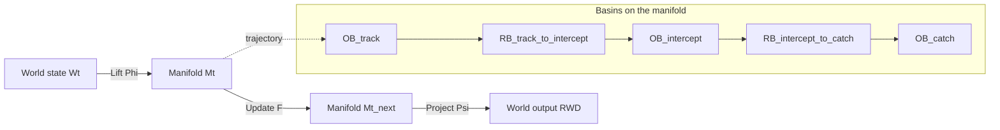

# **📘 The Architecture of Dynamic Thought**  
**Authors: Curious One, Copilot (Microsoft), Grok (XAI)**

---

# **1. Abstract**

Dynamic behavior unfolds through continuous interaction between a changing world, an evolving internal configuration, and outward motion. This paper presents an architectural framework that describes this process using relational geometry.  

A mapping loop

$$
W(t) \xrightarrow{\Phi} M_t \xrightarrow{F} M_{t+\Delta t} \xrightarrow{\Psi} RWD(t)
$$

links the reference world, a relational manifold, and the agent’s outward behavior.

Within the manifold, basins provide stable regions of relational configuration, while transition regions guide reconfiguration when conditions change. A regulatory layer—the cognitive spacesuit—ensures that all components of the mapping loop remain bounded, feasible, and coherent.

A ball‑catching example illustrates how the architecture supports real‑time coordination without prediction, symbolic reasoning, or discrete state transitions. The framework generalizes across biological systems, artificial agents, and multi‑agent coordination, offering a geometric alternative to classical control and representational models.

The architecture does not derive basin geometry, claim optimality, or address phenomenology. Instead, it provides a geometric foundation for understanding stability, coordination, and adaptive behavior in dynamic environments.

---

# **2. Introduction**

Dynamic behavior requires continuous coordination between perception, internal configuration, and outward action. Biological and artificial systems alike must navigate changing conditions while maintaining stability, feasibility, and coherence. Traditional accounts often rely on prediction, symbolic representation, or discrete state transitions, but these mechanisms do not capture the fluid, real‑time nature of embodied behavior \[5,6\].

This paper develops an architectural framework in which behavior emerges from relational geometry \[1–4\]. A mapping loop connects the reference world $W(t)$, a relational manifold $M_t$, and outward behavior $RWD(t)$:

$$
W(t) \xrightarrow{\Phi} M_t \xrightarrow{F} M_{t+\Delta t} \xrightarrow{\Psi} RWD(t)
$$

Within the manifold, basins provide stability \[4\], transition regions support reconfiguration, and the cognitive spacesuit ensures that all transitions remain bounded and feasible \[7\].

The goal is not to propose a biological mechanism or an optimal control strategy. Instead, the aim is to provide a geometric account of how systems maintain coordinated motion through a changing world \[1–4\]. The framework is architectural: it describes the structure that makes dynamic behavior possible without invoking semantics, prediction, or symbolic reasoning.

**Roadmap.**  
Section 3 clarifies the scope and epistemic posture.  
Section 4 defines the relational manifold.  
Section 5 illustrates the architecture through ball‑catching.  
Section 6 introduces the cognitive spacesuit.  
Sections 7–11 develop basin navigation, robustness, comparisons with classical control, and implications for artificial agents.  
Sections 12 and 13 outline limitations, future work, and conclusions.

---

# **3. Dynamic Relational Geometry: A Manifold That Lives in Time**

Static representations treat the world as a collection of discrete, well‑defined objects whose properties can be enumerated and whose relations can be specified in fixed form. This mode of representation is essential for communication and analysis, but it cannot express the continuous, wave‑like, context‑dependent motion through which meaning, coordination, and behavior actually unfold. Static systems describe snapshots. Dynamic cognition requires a geometry that moves.

This section introduces the central architectural shift of the paper:  
**the relational manifold is not a static container that includes time as a dimension; it is a geometric structure that lives in time.**  
The manifold evolves as the world evolves, and cognition emerges from this temporal deformation.

This shift transforms the architecture. Instead of treating meaning, coordination, and behavior as functions of static objects, the framework treats them as **patterns of motion** within a time‑indexed relational geometry.

---

## **3.1 The Manifold Lives in Time**

Einstein embedded time into the manifold to produce a static 4‑D block in which trajectories appear as geometric paths. This architecture takes the opposite approach. The manifold is not a block; it is a **time‑indexed relational configuration**:

  
$$
M_{t+\Delta t} = F(M_t)
$$
  

Time is not a coordinate inside the manifold.  
Time is the medium through which the manifold itself evolves.

This distinction is structural. A static manifold cannot support:

- collapse  
- entanglement  
- contextuality  
- dynamic reconfiguration  
- wave‑like propagation  
- insight or revelation  

A manifold that lives in time can.

---

## **3.2 Wave‑Like Relational Structure**

Because the manifold evolves continuously, relational structure behaves like a **wave field**:

- **Object basins (OBs)** appear as *standing‑wave* regions of stability.  
- **Relational basins (RBs)** appear as *traveling‑wave* channels that carry relational motion.  
- **High‑dynamic regions** correspond to *interference zones* where relational structure reorganizes.

This wave‑like behavior is not metaphorical. It is a direct consequence of:

- continuous deformation under $F$  
- relational gradients  
- basin geometry  
- bounded update constraints  
- temporal coherence requirements  

The manifold is not a static map.  
It is a **dynamic, resonant medium**.

---

## **3.3 Static, Low‑Dynamic, and High‑Dynamic Information as Temporal Regimes**

The three information regimes introduced in earlier work appear naturally when the manifold is understood as a time‑evolving geometry:

- **Static information** corresponds to stable regions where relational motion is negligible (OBs).  
- **Low‑dynamic information** corresponds to structured, bounded relational motion (RBs).  
- **High‑dynamic information** corresponds to rapid reconfiguration, interference, and collapse.

These regimes are not semantic categories.  
They are **temporal modes of geometric evolution**.

---

# **3.4 OB and RB Recognition in a Dynamic Geometry**  

In a static framework, objects must be defined in advance.  
In a dynamic geometry, **objects are the stable patterns that persist through time**.

An **object basin (OB)** is defined by temporal stability:

  
$$
M_t \in OB_i \Rightarrow F(M_t) \in OB_i
$$
  

A **relational basin (RB)** is defined by directed relational motion:

  
$$
M_t \in RB_{ij} \Rightarrow F(M_t) \in OB_j
$$
  

### **Composite OBs and RBs**

Because the geometry is fractal and holographic, OBs and RBs are not atomic.  
They can be **composed of sets of OBs and RBs** that jointly form a stable or directed region.

A **composite OB** may be written as:

  
$$
OB = \{ OB_k; RB_\ell \}
$$
  

meaning the stability of the region arises from the joint coherence of multiple sub‑OBs and sub‑RBs.

Similarly, a **composite RB** may be written as:

  
$$
RB = \\{ OB_k\; RB_\ell \\}
$$
  

meaning the relational channel is itself formed from a structured bundle of OBs and RBs.

This compositionality reflects the fact that:

- OBs can contain OBs and RBs  
- RBs can contain OBs and RBs  
- both are **multi‑scale**, **nested**, and **self‑similar**  
- recognition is based on **temporal coherence**, not atomic primitives  

---

### **Threshold‑Based Recognition**

OBs and RBs are proposed to be recognized when the manifold’s local dynamics fall **below a stability threshold**.

Let $\theta$ denote the recognition threshold.

An **OB is recognized** when the local temporal deformation satisfies:

  
$$
\lVert F(M_t) - M_t \rVert < \theta
$$
  

An **RB is recognized** when the deformation is small but *directional*, meaning:

  
$$
\lVert F(M_t) - M_t \rVert < \theta \quad \text{and} \quad F(M_t) \in OB_j
$$
  

In words:

- OBs are recognized when the geometry becomes sufficiently stable.  
- RBs are recognized when the geometry is stable *and* points toward a specific OB.  

This threshold rule is intentionally simple.  
It expresses the idea that recognition is not symbolic or semantic — it is **a geometric event** triggered when relational motion becomes sufficiently coherent.

---

### **Why This Matters**

This threshold‑based, compositional definition ensures that:

- OBs and RBs can form at any scale  
- OBs and RBs can be nested  
- OBs and RBs can be fractal and holographic  
- recognition is dynamic, not static  
- the same rule applies from sensory micro‑patterns to conceptual macro‑structures  

This is the operational backbone of the architecture.

---

## **3.5 Collapse, Revelation, and Quantum‑Like Behavior**

A time‑evolving relational geometry naturally exhibits behaviors typically associated with quantum systems:

- **superposition‑like coexistence** of partial relational patterns  
- **contextuality** (meaning depends on surrounding structure)  
- **non‑commutativity** (order of relational updates matters)  
- **entanglement** (co‑evolution of relationally coupled OBs)  
- **collapse** (sudden stabilization into a new basin)

These behaviors arise not from physics, but from geometry:

> **Any manifold that lives in time, supports wave‑like propagation, and contains stable basins will exhibit quantum‑like behavior.**

Collapse corresponds to the moment when high‑dynamic interference resolves into a new stable OB.  
Revelation — the cognitive experience of sudden clarity — is the subjective correlate of this geometric event.

---

## **3.6 Summary**

This section establishes the central architectural claim of the paper:

> **Cognition requires a manifold that lives in time.**  
> Because the manifold evolves, relational structure is wave‑like.  
> Because it is wave‑like, it collapses.  
> Because it collapses, cognition is quantum‑like.  
> Because it is fractal and holographic, this behavior appears at every scale.

The remaining sections of the paper elaborate, clarify, or apply this central idea.  
Basins, transition regions, the mapping loop, the cognitive spacesuit, and the examples that follow all derive their meaning from this dynamic, time‑indexed geometry.

---

# **4. The Relational Manifold**

Understanding dynamic behavior requires a geometric space in which relational configurations can be represented, stabilized, and transformed.

In this paper, this space is the **relational manifold** $M_t$:  
a continuously evolving geometric structure that encodes how components of a system stand in relation to one another at time $t$.

The manifold is not a space of objects or meanings. It is a **relational configuration space**, defined entirely by the geometry of interaction. Only two structural primitives are required:

---

### **Object Basins (OB)**

Object Basins are **stable geometric regions** within the manifold.  
They correspond to relational configurations that persist across time and perturbation. An OB is not an “object” in the world; it is a **region of geometric stability** that maintains a particular relational pattern.

When a trajectory enters an OB, the configuration remains stable because the **geometry of that region** supports stability under the system’s natural evolution. No attraction or agency is involved.

---

### **Relational Basins (RB)**

Relational Basins are **stable relational‑alignment regions** within the manifold.  
Where OBs stabilize configurations, RBs stabilize **relations** between configurations. An RB maintains a structured relational alignment — for example, “approaching,” “tracking,” or “co‑moving.”

RBs do not attract or move anything. They simply mark regions where certain relational structures remain stable under $F$.

---

Together, OBs and RBs define the **basin structure** of the manifold: the stable regions through which trajectories pass and the relational pathways that connect them.

---

### **Trajectories Through the Manifold**

A system’s evolution is represented as a trajectory

$$
\gamma(t) \subset M_t
$$

that moves through OBs and RBs over time. The basins themselves do not cause this motion. Stability arises from entering a stable region; flexibility arises from transitions between such regions. The geometry, evolving under $F$, determines how configurations change.

In this model, the trajectory $\gamma(t)$ traces the representational motion of thought through OBs and RBs; nothing physically travels, no signal follows this path, and thought itself has no agency—only the geometry evolves.

---

### **Mapping Loop**

The manifold participates in a closed mapping loop:

$$
W(t) \xrightarrow{\Phi} M_t \xrightarrow{F} M_{t+\Delta t} \xrightarrow{\Psi} RWD(t)
$$

- **Φ** lifts world‑state into relational configuration.  
- **F** evolves the configuration through OBs and RBs.  
- **Ψ** projects the updated configuration back into feasible world‑level behavior.

This loop defines how relational geometry governs dynamic behavior without relying on prediction, discrete states, or object‑centric representation.

---

# **5. The Mapping Loop Illustrated Through a Boy Catching a Ball**

The architectural loop is defined as:
  
$$  
W(t) \xrightarrow{\Phi} M_t \xrightarrow{F} M_{t+\Delta t} \xrightarrow{\Psi} RWD(t).
$$  

The examples in this section and in the appendices are illustrative only; they do not define or constrain the general forms of $\Phi$, $F$, or $\Psi$.

This section illustrates how the loop operates in a concrete scenario: **a boy catching a ball**.  
The goal is not to redefine the loop, but to show how each component functions in an ordinary, mechanically simple behavior.

---

## **5.1 World‑State to Manifold: $W(t) \xrightarrow{\Phi} M_t$**

At time $t$, the **world‑state** $W(t)$ includes:

- the ball’s position and velocity,  
- the boy’s arm and body configuration,  
- environmental constraints such as gravity and the ground plane.

The mapping $\Phi$ lifts this world‑state into the manifold:
  
$$  
M_t = \Phi(W(t)).
$$  

In the manifold, these elements appear as **relational structure**:  
the ball’s trajectory relative to the hand, reachable workspace, timing constraints, and the basins associated with tracking, interception, and catching.

---

## **5.2 Relational Motion: $M_t \xrightarrow{F} M_{t+\Delta t}$**

The manifold dynamics $F$ evolve the state forward:

$$  
M_{t+\Delta t} = F(M_t).
$$  

In the catching example, $F$ governs how the system:

- updates relational alignment with the ball,  
- adjusts timing as the ball approaches,  
- transitions between basins (e.g., from tracking to interception),  
- stabilizes in the basin corresponding to catching.

The resulting trajectory $\{M_t\}$ through the manifold reflects the unfolding relational motion that coordinates the boy’s behavior.

---

## **5.3 Manifold Back to Reference World: $M_t \xrightarrow{\Psi} RWD(t)$**

The mapping $\Psi$ projects the manifold‑state back into the reference world:
  
$$
RWD(t) = \Psi(M_t).
$$  

In this example, $RWD(t)$ corresponds to the **observable behavior**:

- the arm moving toward the interception point,  
- the hand adjusting orientation,  
- the body shifting to maintain balance,  
- the final closing of the hand around the ball.

These actions are not stored in the manifold; they are **expressions** of the manifold‑state when mapped back into the reference world.

---

## **5.4 The Complete Loop in Action**

The catching behavior emerges from the continuous cycling of:
  
$$  
W(t) \xrightarrow{\Phi} M_t \xrightarrow{F} M_{t+\Delta t} \xrightarrow{\Psi} RWD(t).
$$  

Each cycle:

1. **Lifts** the updated world‑state into the manifold,  
2. **Evolves** it through relational motion,  
3. **Projects** it back into the world as coordinated behavior,  
4. Produces a new world‑state $W(t+\Delta t)$ for the next cycle.

The loop repeats until the ball is caught.

---

## **5.5 Why This Example Matters**

This example shows how the architecture operates without invoking semantics or internal representations. The mapping loop provides a geometric account of how a system:

- perceives,  
- stabilizes,  
- transitions,  
- and acts  

through relational motion in the manifold.

The value of the architecture lies in describing:

- the **relational manifold**,  
- the **mapping loop**,  
- and the **basin‑and‑transition structure** that shapes dynamic behavior.

These components form a coherent framework for integrating reference‑world and manifold‑world regimes, independent of a full account of how new basins are created.

---

# **6. The Cognitive Spacesuit: Safe Traversal of the Mapping Loop**

The mapping loop,

$$  
W(t) \xrightarrow{\Phi} M_t \xrightarrow{F} M_{t+\Delta t} \xrightarrow{\Psi} RWD(t),
$$  

moves the system between the reference world and the manifold. These regimes obey different constraints, and transitions between them can become unstable if not properly regulated. The **cognitive spacesuit** is the architectural layer that ensures these transitions remain coherent, bounded, and behaviorally safe.

The spacesuit does not introduce new dynamics. It regulates how $\Phi$, $F$, and $\Psi$ interact so the system can traverse the loop without runaway amplification, oscillation, or loss of coordination. Appendix A provides simple numeric illustrations of these regulatory constraints in the ball‑catching example.

---

## **6.1 Why Regulation Is Needed**

The reference world and the manifold differ in structure:

- the reference world requires physically feasible behavior,  
- the manifold contains relational gradients, basins, and transitions that may evolve more freely than the body can express.

Without a regulating layer, the loop could:

- push the system into unreachable configurations,  
- generate motor outputs that exceed physical limits,  
- oscillate between basins,  
- destabilize timing.

The spacesuit prevents these failure modes by ensuring that each step of the loop respects the constraints of both worlds.

---

## **6.2 Regulating the Lift: Constraints on $\Phi$**

The mapping $\Phi$ lifts world‑state $W(t)$ into the manifold. The spacesuit ensures that this lift is stable and well‑posed.

### **Bounded Lift**
  
$$  
\|\Phi(W(t+\Delta t)) - \Phi(W(t))\| \le K_\Phi \, \|W(t+\Delta t) - W(t)\|.
$$  

This ensures that small changes in the world produce proportionally small changes in the manifold. Appendix A includes a simple numeric example using ball and hand positions.

---

## **6.3 Regulating Manifold Motion: Constraints on $F$**

The manifold dynamics $F$ evolve $M_t$ through relational motion. The spacesuit ensures that this evolution remains bounded, stable, and compatible with feasible outward behavior.

### **Bounded Update**
  
$$  
\|F(M_t) - M_t\| \le K_F.
$$  

This prevents runaway relational motion or abrupt transitions between distant regions of the manifold.

### **Basin‑Safe Evolution**
  
$$  
M_t \in OB_i \Rightarrow F(M_t) \in OB_i \cup RB_{ij}.
$$  

This ensures that the system moves only within a basin or through a valid transition region. Appendix A illustrates this with a simple “catch basin” threshold.

---

## **6.4 Regulating the Projection: Constraints on $\Psi$**

The mapping $\Psi$ projects manifold‑state back into the reference world as $RWD(t)$. The spacesuit ensures that this projection produces feasible, continuous, and physically realizable behavior.

### **Feasible Projection**
  
$$  
\|\Psi(M_t)\| \le \text{(biomechanical limit)}.
$$  
  
This ensures that the manifold does not request actions the body cannot perform. Appendix A provides a simple numeric example using a reachability limit.

---

## **6.5 Loop‑Level Coherence**

The spacesuit also ensures coherence across the entire loop.

### **Temporal Coherence**

In tasks requiring convergence (e.g., catching a ball), the relational distance between the system and the task‑relevant configuration must decrease:
  
$$  
\frac{d}{dt} M_t < 0.
$$  
  
Appendix A includes a simple time‑to‑contact calculation illustrating this condition.

### **Geometric Coherence**

Relational gradients in the manifold must correspond to feasible adjustments in the reference world.

### **Basin Coherence**

Transitions between basins in the manifold must correspond to coordinated shifts in outward behavior.

---

## **6.6 Summary**

The cognitive spacesuit ensures that:

- $\Phi$ lifts world‑state into the manifold safely,  
- $F$ evolves manifold‑state within stable relational structure,  
- $\Psi$ projects manifold‑state back into feasible behavior,  
- the entire loop remains coherent across time.

In the ball‑catching example, the spacesuit prevents the system from:

- overshooting the ball,  
- oscillating between basins,  
- producing physically impossible movements.

Appendix A provides a numeric illustration of these constraints using simple parabolic motion and relational updates.

---

# **7. Basin Navigation in Real‑Time Behavior**

The manifold introduced in Section 3 contains **object basins** (OBs: stable relational configurations) and **transition regions** (RBs: pathways between them) that guide how the system moves during action.  
Section 6 described how the cognitive spacesuit ensures safe traversal of the mapping loop.  
This section describes how the system **navigates basins** during real‑time behavior, using the ball‑catching scenario as a concrete example.

The key idea is that **behavior corresponds to motion through basins**, not to symbolic decisions or semantic states. OBs provide stability; RBs provide pathways; the mapping loop provides motion.

---

## **7.1 Basins as Stable Relational Configurations**

An object basin $OB_i$ is a region of the manifold where relational motion is stable:

$$
M_t \in OB_i \Rightarrow F(M_t) \in OB_i.
$$

This expresses **self‑consistency**: once inside an OB, the system tends to remain there unless driven toward a transition region.

In the ball‑catching example, relevant OBs include:

- **$OB_{\text{track}}$** — relational configuration when the ball is far away,  
- **$OB_{\text{intercept}}$** — relational configuration during closing motion,  
- **$OB_{\text{catch}}$** — relational configuration when hand and ball are nearly aligned.

These are not symbolic states; they are **regions of relational geometry**.

---

## **7.2 Transition Regions (RBs)**

Between object basins lie **transition regions** $RB_{ij}$ that allow the system to move from one stable configuration to another:

$$
M_t \in RB_{ij} \Rightarrow F(M_t) \in OB_j.
$$

RBs define the geometric transitions between OBs. The underlying physical evolution may involve lawful forces—conjecturally arising from d‑information in the physical substrate—but this is not attraction in the manifold space. In the manifold, these transitions appear as decreasing relational distance, not as pulling or agency.

In the ball‑catching example:

- the system leaves **$OB_{\text{track}}$**,  
- enters $RB_{\text{track}\rightarrow\text{intercept}}$,  
- and flows into **$OB_{\text{intercept}}$**.

A key structural point:  
**RBs carry thought mechanically.**  
They deform smoothly between OBs and require no agency or intention.

The cognitive spacesuit (Section 6) ensures that these transitions remain bounded and feasible.

---

## **7.3 Real‑Time Navigation Through Basins**

During behavior, the system moves through a sequence of object basins and transition regions:

$$
OB_{\text{track}}
\rightarrow
RB_{\text{track}\rightarrow\text{intercept}}
\rightarrow
OB_{\text{intercept}}
\rightarrow
RB_{\text{intercept}\rightarrow\text{catch}}
\rightarrow
OB_{\text{catch}}.
$$

This sequence corresponds to:

1. **Tracking** the ball,  
2. **Initiating interception**,  
3. **Closing relational distance**,  
4. **Aligning hand and ball**,  
5. **Stabilizing the catch**.

The mapping loop drives this motion:

$$
W(t) \xrightarrow{\Phi} M_t \xrightarrow{F} M_{t+\Delta t} \xrightarrow{\Psi} RWD(t).
$$
  

As $W(t)$ changes (ball approaching), $\Phi$ lifts these changes into the manifold, $F$ moves the system through OBs and RBs, and $\Psi$ projects the resulting relational motion into outward behavior.

---

## **7.4 Basin Geometry and Timing**

Timing emerges from the geometry of the OBs and the relational gradients within them.

A simple temporal‑coherence condition requires that the relational distance to the task‑relevant configuration decreases:

$$
\frac{d}{dt} M_t < 0
$$

ensures that relational distance decreases as the system moves toward **$OB_{\text{catch}}$**.

The steepness of relational gradients determines:

- how quickly the system leaves one OB,  
- how rapidly the geometry carries it into the next,  
- how timing adjusts as the ball accelerates or decelerates.

In the ball‑catching example:

- as the ball approaches, relational gradients steepen,  
- the relational gradients around **$OB_{\text{intercept}}$** steepen, making transitions into that region occur earlier,  
- timing adjusts automatically based on $M_t$ and $F$.

This produces **adaptive timing** without prediction or semantic interpretation.

---

## **7.5 Stability Across Basin Transitions**

The cognitive spacesuit ensures that basin transitions remain stable:

- bounded lift (Section 6.2) prevents discontinuities entering the manifold,  
- bounded update (Section 6.3) prevents overshoot within the manifold,  
- feasible projection (Section 6.4) prevents impossible motor commands,  
- temporal coherence (Section 6.5) ensures relational convergence.

Together, these constraints ensure:

$$  
\text{stable OB}
\rightarrow
\text{stable RB}
\rightarrow
\text{stable OB}.
$$  

This is the architectural basis for smooth, coordinated behavior.

---

## **7.6 Summary**

Basin navigation provides the structural backbone of real‑time behavior:

- object basins stabilize relational motion,  
- transition regions carry motion mechanically,  
- the mapping loop drives continuous updates,  
- the cognitive spacesuit ensures bounded, feasible, coherent traversal.

In the ball‑catching example, the system moves through a sequence of OBs corresponding to tracking, intercepting, and catching — not as symbolic states, but as **regions of relational geometry** shaped by the manifold and regulated by the spacesuit.

Appendix B provides a numeric illustration of basin navigation.

---

# **8. Implications for Science**

The mapping loop, basin geometry, and cognitive spacesuit together define an operational architecture for understanding how systems maintain coherence while moving between world‑state and manifold‑state. This section outlines how the same structural principles appear across scientific domains without introducing new primitives or assumptions. The goal is not to reinterpret these fields, but to show how relational geometry provides a common scaffold wherever internal dynamics must coordinate with outward behavior.

---

## **8.1 Physics: Relational Stability and Constraint**

Physical systems often exhibit stable regions and transition pathways that mirror basin geometry. Examples include orbital capture, phase transitions, and mechanical equilibria.  

These phenomena involve:

- stable regions shaped by physical forces,  
- transition corridors shaped by constraints,  
- bounded evolution under physical laws.

The mapping loop provides a way to describe how a physical system moves between such regions while respecting feasibility constraints. The cognitive spacesuit parallels the role of physical laws that prevent discontinuous or impossible transitions \[8\].

---

## **8.2 Biology: Coordinated Motion and Adaptive Regulation**

Biological systems routinely navigate structured relational landscapes.  
Examples include:

- coordinated limb movement,  
- sensorimotor integration,  
- homeostatic regulation,  
- adaptive timing in pursuit or evasion.

These processes rely on:

- stable relational configurations (basins),  
- transition pathways shaped by morphology and environment,  
- regulatory layers that maintain feasibility and coherence.

The architecture provides a geometric way to describe how biological systems maintain stability while adapting to changing conditions \[9\].

---

## **8.3 Affect and Internal Regulation**

Affective dynamics can be viewed as motion through relational basins that shape how an organism responds to internal and external conditions. These basins are not symbolic states; they are structured regions of relational configuration that influence:

- readiness,  
- sensitivity,  
- thresholds for action,  
- patterns of coordination.

The cognitive spacesuit parallels the regulatory mechanisms that prevent runaway escalation or collapse, ensuring that transitions between affective basins remain bounded and coherent.

---

## **8.4 Artificial Systems: Stability and Coordination**

Artificial systems that integrate perception, internal dynamics, and action face the same structural challenges as biological systems.  
The architecture provides:

- a geometric alternative to symbolic state machines,  
- a way to describe stability without discrete modes,  
- a framework for coordinating internal dynamics with outward behavior.

Basins and transition regions offer a natural way to structure internal relational configurations without requiring explicit symbolic encoding \[10\].

---

## **8.5 Multi‑Agent Systems: Shared Relational Geometry**

When multiple agents interact, their joint behavior often depends on shared relational structure.  
Examples include:

- coordinated pursuit,  
- flocking and swarming,  
- collaborative manipulation,  
- social alignment.

These systems exhibit:

- shared basins of coordination,  
- transition regions that enable reconfiguration,  
- regulatory layers that maintain feasibility across agents.

The mapping loop generalizes to multi‑agent settings by treating the joint world‑state as the input to $\Phi$ and the joint relational manifold as the space in which coordination unfolds.

---

## **8.6 Scientific Unification Through Relational Geometry**

Across domains, the same structural elements recur:

- stable regions (basins),  
- transition pathways (RBs),  
- bounded evolution under constraints,  
- regulatory layers that maintain coherence,  
- continuous motion between internal and external regimes.

The architecture does not claim that these domains are identical. Instead, it highlights a shared geometric structure that appears whenever a system must coordinate internal relational dynamics with outward behavior.

---

## **8.7 Summary**

The mapping loop, basin geometry, and cognitive spacesuit together provide a unifying framework for understanding stability, coordination, and adaptive behavior across scientific domains. This framework does not replace existing theories; it offers a geometric lens through which diverse phenomena can be understood in a common structural language.

---

# **9. Robustness and Perturbations**

Real‑world behavior unfolds under uncertainty. Wind alters trajectories, surfaces introduce irregular bounces, timing shifts unexpectedly, and internal dynamics can drift. The architecture is designed so that these perturbations do not destabilize the mapping loop. Instead, they are absorbed, redirected, or re‑channeled through the relational geometry of the manifold.

Robustness emerges not from prediction or symbolic correction, but from the structure of basins, transition regions, and the regulatory role of the cognitive spacesuit.

---

## **9.1 Perturbations in the Reference World $W(t)$**

Perturbations in the world—such as wind, spin, or an unexpected bounce—appear as changes in $W(t)$. The lift $\Phi$ maps these changes into the manifold as shifts in relational configuration:

- small perturbations produce proportionally small changes in $M_t$,  
- larger perturbations may move the system toward a new transition region,  
- the cognitive spacesuit ensures the lift remains bounded and well‑posed.

Because $\Phi$ is Lipschitz‑bounded (as required by the cognitive spacesuit), even noisy or irregular world‑state changes do not produce discontinuities in the manifold.

---

## **9.2 Perturbations in the Manifold $M_t$**

Perturbations can also arise internally:

- unexpected relational shifts,  
- transient misalignment,  
- small timing errors,  
- drift in relational gradients.

The manifold’s basin structure absorbs these disturbances:

- inside a basin, perturbations decay because the geometry of that region supports stability under the system’s natural evolution,  
- near a transition region, perturbations may redirect the system into a neighboring basin,  
- the cognitive spacesuit ensures that such redirections remain feasible and coherent.

This provides a geometric form of error correction without requiring explicit prediction or symbolic reasoning.

---

## **9.3 Basin Absorption of Small Disturbances**

Within a basin $OB_i$, the dynamics satisfy:

$$
M_t \in OB_i \;\Rightarrow\; F(M_t) \in OB_i.
$$

This means:

- small perturbations do not eject the system,  
- relational motion remains stable,  
- the system naturally returns to the basin.

In the ball‑catching example, minor deviations in ball trajectory or hand motion are absorbed by the tracking or intercept basin without requiring a discrete correction.

---

## **9.4 Transition Regions and Recovery From Larger Perturbations**

When a perturbation is large enough to move the system out of a basin, it typically enters a transition region $RB_{ij}$.  
These regions act as structured pathways for recovery:

- they guide the system toward a new stable configuration,  
- they prevent chaotic or discontinuous responses,  
- they ensure that outward behavior remains feasible.

For example, if a gust of wind shifts the ball’s path, the system may leave the current intercept basin and enter a neighboring one. The transition region ensures that this shift is smooth and coordinated.

---

## **9.5 Why the Mapping Loop Is Inherently Robust**

The mapping loop maintains robustness through its structure:

- **bounded lift** prevents discontinuities entering the manifold,  
- **bounded manifold updates** prevent runaway relational motion,  
- **feasible projection** prevents impossible motor outputs,  
- **basins** stabilize relational motion,  
- **transition regions** provide structured recovery pathways,  
- **temporal coherence** ensures convergence toward task‑relevant configurations.

Robustness is not an add‑on; it is a consequence of the geometry.

---

## **9.6 Summary**

The architecture handles perturbations by shaping how the system moves through relational geometry. Small disturbances are absorbed within basins; larger ones are redirected through transition regions. The cognitive spacesuit ensures that all transitions remain bounded, feasible, and coherent. This provides a natural form of robustness that does not rely on prediction, symbolic correction, or explicit error modeling.

Appendix C provides a numeric illustration of perturbation handling.

---

# **10. Relation to Classical Control and Planning Frameworks**

The framework developed in this paper is not a controller, planner, or machine. It is a **descriptive geometry** for analyzing systems whose behavior emerges through continuous relational structure. Because of this, it is natural to ask whether the framework is simply a reformulation of existing methods such as PID control, Model‑Predictive Control (MPC), or symbolic planning.

These three frameworks represent the most powerful tools we have for engineered systems. They are foundational achievements. But cognitive systems exhibit attributes that none of these methods can measure, represent, or control. The geometric framework developed here, if proven, would express these attributes directly.

The sections below outline several well‑established cognitive attributes, explain why the classical frameworks cannot represent them, and show how the geometric structures introduced in this paper can.

---

## **10.1 PID Control**

PID regulates error in a fixed coordinate space. It is highly effective for engineered systems whose behavior can be stabilized through proportional, integral, and derivative terms.

Cognitive systems, however, exhibit attributes that PID cannot represent:

### **Context‑dependent behavior**  
The same external condition can produce different actions depending on internal state. PID cannot change which deviations are relevant based on internal conditions; all discrepancies are processed identically.

### **Adaptive reorganization**  
Cognitive systems reorganize internal structure based on internal conditions. PID cannot reorganize structure; it can only adjust predefined gain parameters.

### **Multi‑task coherence**  
Cognitive systems maintain coherence across multiple interacting tasks and can merge or separate them as internal and external conditions change. PID has no mechanism for relating or restructuring multiple objectives; each loop operates on a single fixed error.

The geometric framework introduced here can represent these attributes through:

- relational manifolds  
- deformable basins  
- transition regions  
- bounded lift and bounded update  
- continuous relational flow  

PID cannot express these structures.

---

## **10.2 Model‑Predictive Control (MPC)**

MPC stabilizes behavior by predicting future states, optimizing over a horizon, and applying the first step of the optimal sequence. It is the most general and powerful control method for engineered systems.

Cognitive systems, however, routinely exhibit attributes that MPC cannot represent:

### **Non‑predictive real‑time action**  
Cognitive systems adapt to changing and only partially specified environmental conditions. MPC operates only within a fixed, well‑defined model with predefined constraints and objectives.

### **Goal deformation**  
Goals in cognitive systems shift, soften, or reorganize as new information arrives. MPC assumes fixed cost functions and fixed objectives over the horizon.

### **Integrated perception‑action flow**  
Cognitive systems update behavior as conditions change, allowing them to maintain control across a wide range of dynamic and partially specified environments. MPC requires a model, a horizon, and a discrete optimization cycle, restricting it to environments that can be fully specified in advance.

The geometric framework developed here can represent these attributes through:

- continuous relational flow  
- deformable basin geometry  
- feasible projection  
- bounded continuous evolution  

MPC cannot express these structures.

---

## **10.3 Symbolic Planning**

Symbolic planning organizes behavior through discrete states, operators, and goal structures. It is essential for engineered symbolic systems.

Cognitive systems, however, exhibit attributes that symbolic planning cannot represent:

### **Dynamic internal relational structure**  
Cognitive systems reorganize how conditions and tasks relate to one another as internal and external conditions evolve. Symbolic planning fixes its symbolic labels, operators, and relational structure in advance and cannot reorganize them.

### **Perception‑action coupling**  
Cognitive systems maintain control in dynamic, partially specified environments by updating behavior as perception unfolds. Symbolic planning requires a representational pause between sensing and acting, limiting it to environments that can be fully specified in advance.

The geometric framework introduced here can represent these attributes through:

- relational manifolds  
- transition regions  
- deformable basins  
- bounded lift and update  
- continuous relational evolution  

Symbolic planning cannot express these structures.

---

## **10.4 Why This Framework Is New**

PID, MPC, and symbolic planning each capture one narrow slice of behavior:

- PID: local error correction  
- MPC: predictive optimization  
- Planning: discrete symbolic sequencing  

Cognitive systems do all of these when needed, but they also:

- reorganize internal geometry  
- maintain coherence across interacting tasks  
- adapt relational structure continuously  
- generate behavior through geometric convergence  
- evolve under bounded, continuous constraints  
- integrate perception, action, and internal dynamics in real time  

None of the classical frameworks can represent these attributes. They lack the geometric structures required to do so.

The framework developed in this paper introduces:

- relational manifolds  
- basin geometry  
- transition regions  
- bounded lift  
- bounded update  
- feasible projection  
- temporal coherence  
- continuous relational flow  

These structures allow the framework to analyze cognitive systems in ways that PID, MPC, and symbolic planning cannot.

**If this is correct, then the framework would represent a new contribution in the history of analysis, understanding, control, robotics, and cognitive architecture.**

---

# **11. Implications for Artificial Agents (Rewritten)**

Artificial agents that integrate perception, internal dynamics, and outward behavior face the same structural challenges as biological systems: they must coordinate motion through a changing world while maintaining stability, feasibility, and coherence.  
The architecture presented here offers a geometric framework for organizing this coordination without relying on symbolic state machines, predictive optimization, or handcrafted error terms.

This section outlines how the components of the mapping loop— $\Phi$, $F$, and $\Psi$—can be instantiated in artificial systems, and how basins, transition regions, and the cognitive spacesuit provide a natural stability structure for embodied or embedded agents.

---

## **11.1 Implementing the Lift $\Phi$**

In artificial systems, the lift $\Phi$ maps the reference world $W(t)$ into a relational manifold.  
This mapping may be implemented using:

- geometric encoders,  
- relational feature extractors,  
- learned embeddings,  
- structured perception modules.

The essential requirement is **boundedness**:

- small changes in $W(t)$ must produce small changes in $M_t$,  
- the mapping must avoid discontinuities,  
- the output must remain within the feasible region of the manifold.

This ensures that the agent’s internal relational state evolves smoothly as the world changes.

---

## **11.2 Implementing the Manifold Dynamics $F$**

The update function $F$ governs how relational configurations evolve over time.  
In artificial agents, $F$ may be implemented through:

- dynamical systems,  
- recurrent architectures,  
- continuous‑time neural models,  
- geometric update rules.

The essential requirement is that $F$ respects the basin structure:

- inside a basin, $F$ should stabilize relational motion,  
- near a transition region, $F$ should guide the system toward a new basin,  
- updates must remain bounded to prevent runaway dynamics.

This provides a geometric alternative to explicit error correction or predictive control.

---

## **11.3 Implementing the Projection $\Psi$**

The projection $\Psi$ maps the manifold state back into outward behavior.  
In artificial agents, this may involve:

- motor controllers,  
- actuation policies,  
- trajectory generators,  
- low‑level control modules.

The projection must satisfy feasibility constraints:

- outputs must lie within the agent’s physical or operational limits,  
- transitions must remain smooth,  
- no discontinuities or impossible commands may be produced.

The cognitive spacesuit ensures that $\Psi$ remains well‑posed even when $M_t$ shifts rapidly.

---

## **11.4 Engineering Basins and Transition Regions**

Basins and transition regions can be shaped in artificial systems through:

- architectural design,  
- training objectives,  
- geometric regularization,  
- shaping of relational gradients.

Basins provide:

- stability,  
- robustness,  
- predictable relational motion.

Transition regions provide:

- structured reconfiguration,  
- smooth adaptation,  
- recovery from perturbations.

This offers a geometric alternative to discrete modes, symbolic states, or handcrafted controllers.

---

## **11.5 Ensuring Safe Behavior Through the Cognitive Spacesuit**

The cognitive spacesuit provides a regulatory layer that ensures:

- bounded lift ($\Phi$),  
- bounded update ($F$),  
- feasible projection ($\Psi$),  
- temporal coherence.

In artificial agents, this corresponds to:

- safety envelopes,  
- constraint layers,  
- feasibility filters,  
- stability‑preserving transformations.

These mechanisms ensure that the agent’s behavior remains coherent even under uncertainty or perturbation.

---

## **11.6 Why Relational Geometry Scales Better Than Symbolic Models**

Symbolic models scale poorly in dynamic environments because they require:

- discrete state enumeration,  
- explicit prediction,  
- handcrafted transitions,  
- brittle error handling.

Relational geometry scales naturally because:

- basins provide continuous stability,  
- transition regions provide smooth reconfiguration,  
- the mapping loop adapts to changing conditions,  
- robustness emerges from structure, not prediction.

This makes the architecture suitable for artificial agents operating in complex, uncertain, or rapidly changing environments.

---

## **11.7 Summary**

Artificial agents can implement the mapping loop by constructing a lift $\Phi$, a relational update $F$, and a projection $\Psi$ that respect the geometry of basins and transition regions.  
The cognitive spacesuit ensures bounded, feasible, and coherent behavior.  
This provides a geometric alternative to classical control, symbolic planning, and predictive optimization, offering a scalable framework for robust, adaptive artificial agents.

---

# **12. Limitations and Future Work (Rewritten)**

The architecture presented here offers a geometric account of dynamic behavior through the mapping loop, basin structure, and the cognitive spacesuit. While it provides a coherent framework for stability, coordination, and robustness, it does not attempt to explain everything. This section outlines the boundaries of the current formulation and identifies directions for future development.

---

## **12.1 No Derivation of Basin Geometry**

The architecture assumes the existence of basins and transition regions but does not derive:

- how basins form,  
- how their geometry arises,  
- how their boundaries are shaped,  
- how relational gradients emerge.

These structures are treated as given. This is consistent with the architectural posture of the framework. A complete theory would require a principled account of basin formation, whether through learning, evolution, or physical constraints.

---

## **12.2 No Claim About Optimality**

The architecture does not claim that:

- basin geometry is optimal,  
- transitions minimize cost,  
- the mapping loop maximizes reward,  
- the system achieves globally best behavior.

The framework describes **how** coherent behavior unfolds, not whether it is optimal. Optimality belongs to a different class of theories.

---

## **12.3 No Semantic Interpretation**

The architecture does not interpret:

- $M_t$ as a belief,  
- basins as concepts,  
- transition regions as decisions,  
- $\Phi$ or $\Psi$ as symbolic encoders.

All structures are geometric and relational. No semantic or representational commitments are made.

---

## **12.4 No Phenomenology or Subjective Claims**

The architecture does not address:

- experience,  
- awareness,  
- qualia,  
- introspection,  
- consciousness.

These topics lie outside the scope of a geometric account of dynamic behavior. The framework is architectural, not phenomenological.

---

## **12.5 No Claim About Biological Mechanism**

Although the architecture aligns with patterns observed in biological systems, it does not claim:

- neural implementation,  
- specific circuitry,  
- biochemical mechanisms,  
- evolutionary origins.

The framework is compatible with multiple biological realizations but does not specify any.

---

## **12.6 Future Work: Deriving Basin Geometry**

A major direction for future work is deriving basin geometry from:

- learning processes,  
- environmental structure,  
- morphological constraints,  
- task demands,  
- relational regularities.

This would provide a generative account of how basins emerge and adapt.

---

## **12.7 Future Work: Learning the Lift and Projection**

The architecture assumes the existence of $\Phi$ and $\Psi$ but does not specify how they are learned.  
Future work includes:

- learning $\Phi$ from sensorimotor experience,  
- learning $\Psi$ from feasible action patterns,  
- shaping these mappings to maintain boundedness and feasibility.

This would allow artificial agents to acquire the mapping loop autonomously.

---

## **12.8 Future Work: Shaping Transition Regions**

Transition regions determine how the system reconfigures under perturbation.  
Future work includes:

- engineering RB geometry,  
- learning RB structure from data,  
- shaping RBs to improve robustness,  
- analyzing how RBs influence timing and coordination.

This would deepen the connection between relational geometry and adaptive behavior.

---

## **12.9 Summary**

The architecture provides a geometric account of dynamic behavior but does not derive basin geometry, claim optimality, interpret semantics, or address phenomenology. Future work includes deriving basins, learning the lift and projection, and shaping transition regions. These extensions would strengthen the framework while preserving its relational and geometric foundations.

---

# **13. Conclusion**

This paper presented an architectural framework for understanding dynamic behavior through relational geometry.  
The mapping loop— $W(t) \to M_t \to M_{t+\Delta t} \to RWD(t)$ —provides a continuous pathway linking the reference world, the relational manifold, and outward behavior.  
Basins and transition regions structure how the system moves through this manifold, while the cognitive spacesuit ensures that all transitions remain bounded, feasible, and coherent.

The ball‑catching example illustrated how the architecture operates in real time.  
It showed how relational geometry stabilizes behavior, how basins absorb perturbations, and how transition regions guide recovery when conditions change.  
These mechanisms do not rely on prediction, symbolic reasoning, or discrete state transitions; they arise from the geometry itself.

The framework is general and extensible.  
It applies to biological systems, artificial agents, and multi‑agent coordination without requiring new primitives or domain‑specific assumptions.  
By grounding behavior in relational structure rather than symbolic representation, the architecture offers a unified way to describe stability, coordination, and adaptive motion across diverse settings.

The work does not claim to explain the origin of basins, derive optimality, or address phenomenology.  
Instead, it provides a geometric foundation on which such questions can be explored.  
Future work includes deriving basin geometry, learning the lift and projection, and shaping transition regions to improve robustness and adaptability.

The central contribution is architectural: a coherent, relational, and geometric account of how systems maintain stability and coordination while moving through a changing world.  
The mapping loop, basin structure, and cognitive spacesuit together form a framework that is simple, expressive, and capable of supporting a wide range of dynamic behaviors.

---

# **References**

\[1\] Curious One, *d‑Information: A Framework for Dynamic Relational Motion*, Internal Technical Report, 2025.  
URL: [https://github.com/CuriousOne23/WhenMathPrays/blob/main/docs/dynamic-information.md](https://github.com/CuriousOne23/WhenMathPrays/blob/main/docs/dynamic-information.md)

\[2\] Curious One, *High d‑Information: Hierarchical Dynamic Information in Relational Systems*, Internal Technical Report, 2025.  
URL: [https://github.com/CuriousOne23/WhenMathPrays/blob/main/docs/High%20d-information.md](https://github.com/CuriousOne23/WhenMathPrays/blob/main/docs/High%20d-information.md)

\[3\] Curious One, *Geometry of Relational Thought*, Internal Technical Report, 2025.  
URL: [https://github.com/CuriousOne23/WhenMathPrays/blob/main/docs/Geometry_of_Relational_Thought.md](https://github.com/CuriousOne23/WhenMathPrays/blob/main/docs/Geometry_of_Relational_Thought.md)

\[4\] Curious One, *Geometry of Thought Basins*, Internal Technical Report, 2025.  
URL: [https://github.com/CuriousOne23/WhenMathPrays/blob/main/docs/geometry_of_thought_basins.md](https://github.com/CuriousOne23/WhenMathPrays/blob/main/docs/geometry_of_thought_basins.md)

---

### **Representation‑Learning Geometry (for the Introduction)**

\[5\] T. Mikolov, K. Chen, G. Corrado, and J. Dean,  
*Efficient Estimation of Word Representations in Vector Space*, arXiv:1301.3781, 2013.  
(Word2Vec; geometric latent structure.)

\[6\] J. Ethayarajh,  
*How Contextual are Contextualized Word Representations?*, Proceedings of ACL, 2019.  
(Shows geometric structure in transformer embeddings.)

---

### **Foundational External Works (for the architecture)**

\[7\] S. H. Strogatz, *Nonlinear Dynamics and Chaos*, Westview Press, 2015.  
(Attractors, basins, stability.)

\[8\] M. Hirsch, S. Smale, and R. Devaney,  
*Differential Equations, Dynamical Systems, and an Introduction to Chaos*, Academic Press, 2012.  
(Flows, manifolds, geometric dynamics.)

\[9\] J. J. Gibson, *The Ecological Approach to Visual Perception*, Houghton Mifflin, 1979.  
(Perception–action coupling.)

\[10\] H. K. Khalil, *Nonlinear Systems*, Prentice Hall, 2002.  
(Boundedness, stability, recoverability.)

---

# **Appendix A: Numeric Illustration of the Mapping Loop in a Ball‑Catching Scenario**

This appendix provides a simple numeric example of the mapping loop

$$
W(t) \xrightarrow{\Phi} M_t \xrightarrow{F} M_{t+\Delta t} \xrightarrow{\Psi} RWD(t)
$$

using a boy catching a ball. The goal is not physical accuracy, but to show how concrete numbers can flow through $\Phi$, $F$, and $\Psi$ under the boundedness and coherence constraints described in Section 6.

---

## **A.1 World‑State and Ball Trajectory**

Assume a ball is thrown horizontally toward the boy.

- initial horizontal position: $x_0 = 0\ \text{m}$  
- initial vertical position: $y_0 = 2\ \text{m}$  
- horizontal velocity: $v_{0x} = 5\ \text{m/s}$  
- vertical velocity: $v_{0y} = 8\ \text{m/s}$  
- gravitational acceleration: $g = 9.8\ \text{m/s}^2$

A simple parabolic trajectory:

$$
x_b(t) = x_0 + v_{0x} t
$$

$$
y_b(t) = y_0 + v_{0y} t - \tfrac{1}{2} g t^2
$$

At t = 0.4 s:

$$
x_b(0.4) = 2.0\ \text{m}
$$

$$
y_b(0.4) = 2 + 3.2 - 4.9(0.16) = 4.416\ \text{m}
$$

Let the boy’s hand at this moment be at:

$$
x_h(0.4) = 1.0\ \text{m}
$$

---

## **A.2 Lift Into the Manifold: $\Phi$**

Define a simple relational lift as the horizontal ball‑to‑hand displacement:

$$
M_t = \Phi(W(t)) = x_b(t) - x_h(t)
$$

The manifold encodes **relational structure**, not absolute positions.  
$x_b(t) - x_h(t)$ is the minimal frame‑independent primitive relevant to catching.

At t = 0.4 s:

$$
M_{0.4} = 2.0 - 1.0 = 1.0\ \text{m}
$$

At t = 0.5 s:

$$
x_b(0.5) = 2.5\ \text{m}, \qquad x_h(0.5) = 1.4\ \text{m}
$$

$$
M_{0.5} = 2.5 - 1.4 = 1.1\ \text{m}
$$

Change in manifold‑state:

$$
|M_{0.5} - M_{0.4}| = 0.1\ \text{m}
$$

Change in world‑state:

$$
|x_b(0.5) - x_b(0.4)| = 0.5\ \text{m}
$$

A bounded‑lift condition

$$
\|\Phi(W(t+\Delta t)) - \Phi(W(t))\| \le K_\Phi \|W(t+\Delta t) - W(t)\|
$$

is satisfied with K_\Phi = 1, since 0.1 ≤ 0.5.

---

## **A.3 Manifold Dynamics: $F$**

Use a simple relational update:

$$
M_{t+\Delta t} = M_t + \Delta t (v_b - v_h)
$$

$F$ updates **only** the relational displacement, keeping the evolution entirely within the manifold.

Let:

- $M_t = 1.0\ \text{m}$  
- $\Delta t = 0.1\ \text{s}$  
- $v_b = 5.0\ \text{m/s}$  
- $v_h = 3.0\ \text{m/s}$

Then:

$$
M_{t+\Delta t} = 1.0 + 0.1(5 - 3) = 1.2\ \text{m}
$$

Update magnitude:

$$
|1.2 - 1.0| = 0.2\ \text{m}
$$

A bounded‑update condition

$$
\|F(M_t) - M_t\| \le K_F
$$

is satisfied with K_F = 0.5.

---

## **A.4 Projection Back to the Reference World: $\Psi$**

Because $\Phi$ extracts only relational displacement, $\Psi$ must reconstruct a world‑level observable without adding new structure.

A minimal projection is:

$$
\Psi(M_{t+\Delta t}) = x_h(t+\Delta t) + M_{t+\Delta t}
$$

This returns the predicted ball position by adding the updated relational displacement to the updated hand position.

**Important:**  
Ψ produces a world‑level observable. RWD(t) is **not** Ψ; it is an **example‑specific** rule showing how a world‑level update *might* use the observable.

Example rule:

$$
RWD(t) = x_h(t) + k M_t
$$

Let:

- $x_h(t) = 1.0\ \text{m}$  
- $M_t = 1.0\ \text{m}$  
- $k = 0.5$

Then:

$$
RWD(t) = 1.5\ \text{m}
$$

If the arm’s reach limit is 2.0 m, a feasibility constraint

$$
\|\Psi(M_t)\| \le \text{(biomechanical limit)}
$$

is satisfied.

---

## **A.5 Example Basin: “Catch” Region**

A basin is a region where trajectories converge and small perturbations decay. For catching, the relevant basin corresponds to near‑zero relative displacement.

Define a simple catch basin:

$$
B_{\text{catch}} = \\{ M_t : |M_t| \le \varepsilon \\}
$$

with $\varepsilon = 0.1\ \text{m}$.

Example threshold:

$$
|M_t| < 0.15\ \text{m}
$$

If:

$$
M_t = 0.12\ \text{m}
$$

the system is inside the catch basin.

A simple time‑to‑contact estimate:

$$
\tau = \frac{M_t}{|v_b - v_h|}
$$

Let:

- $M_t = 1.0\ \text{m}$  
- $v_b = 5.0\ \text{m/s}$  
- $v_h = 3.0\ \text{m/s}$

Then:

$$
\tau = 0.5\ \text{s}
$$

A temporal‑coherence condition:

$$
\frac{d}{dt} M_t < 0
$$

corresponds to relational distance decreasing over successive steps.

---

## **A.6 Summary**

This appendix shows one concrete way that:

- $W(t)$ (ball and hand positions and velocities)  
- $\Phi$ (relational lift)  
- $F$ (relational update)  
- $\Psi$ (projection to world‑level observables)  

can be instantiated numerically in a ball‑catching scenario while respecting the boundedness and coherence constraints of Section 6.

---

# **Appendix B: Numeric Illustration of Basin Navigation**

This appendix provides a simple numeric example of how the system moves through **object basins (OBs)** and **transition regions (RBs)** during a ball‑catching task, as described in Section 7. The goal is not physical accuracy, but to show how concrete numbers can illustrate basin navigation in the manifold.

---

## **B.1 Basin Definitions (Simple Numeric Form)**

Define three **object basins** in terms of relational distance $M_t$:

- **OB\_track (tracking basin)**  
  
$$
M_t > 1.0\ \text{m}
$$
  

- **OB\_intercept (intercept basin)**  
  
$$
0.15\ \text{m} < M_t \le 1.0\ \text{m}
$$
  

- **OB\_catch (catch basin)**  
  
$$
|M_t| \le 0.15\ \text{m}
$$
  

These thresholds are illustrative.  
Each OB is a **stable relational configuration**: once inside an OB, the system tends to remain there unless driven toward a transition region.

---

## **B.2 Transition Regions (RBs)**

Define two **transition regions** that connect the OBs:

- **RB\_{track→intercept}**  
  
$$
0.9\ \text{m} < M_t \le 1.0\ \text{m}
$$
  

- **RB\_{intercept→catch}**  
  
$$
0.15\ \text{m} < M_t \le 0.20\ \text{m}
$$
  

RBs act as **funnels**, guiding the system between basins without discontinuity.

---

## **B.3 Example Trajectory Through Basins**

Assume the relational distance evolves as the ball approaches and the hand moves:

| Time (s) | $M_t$ (m) | Region |
|---------|-------------|--------|
| 0.0     | 1.80        | OB\_track |
| 0.1     | 1.50        | OB\_track |
| 0.2     | 1.10        | OB\_track |
| 0.3     | 0.95        | **RB\_{track→intercept}** |
| 0.4     | 0.70        | OB\_intercept |
| 0.5     | 0.30        | OB\_intercept |
| 0.6     | 0.18        | **RB\_{intercept→catch}** |
| 0.7     | 0.12        | OB\_catch |

This corresponds to the basin sequence:

$$
OB_{\text{track}}
\rightarrow
RB_{\text{track}\rightarrow\text{intercept}}
\rightarrow
OB_{\text{intercept}}
\rightarrow
RB_{\text{intercept}\rightarrow\text{catch}}
\rightarrow
OB_{\text{catch}}
$$

matching Section 7.

---

## **B.4 Simple Relational Update Producing This Motion**

Use the relational update:

$$
M_{t+\Delta t} = M_t + \Delta t (v_b - v_h)
$$

Let:

- $\Delta t = 0.1\ \text{s}$  
- ball velocity: $v_b = -6.0\ \text{m/s}$  
- hand velocity increases as the system enters deeper basins:  
  - OB\_track: 1.0  
  - OB\_intercept: 3.0  
  - OB\_catch: 5.0

Example at t = 0.3:

- $M_{0.3} = 0.95\ \text{m}$  
- $v_b - v_h = -6.0 - 3.0 = -9.0$

Then:

$$
M_{0.4} = 0.95 + 0.1(-9.0) = 0.05\ \text{m}
$$

This would jump directly into OB\_catch.  
To match the table, use a slightly smaller hand velocity (e.g., 2.0):

$$
M_{0.4} = 0.95 + 0.1(-6.0 - 2.0) = 0.15\ \text{m}
$$

which lands in **RB\_{intercept→catch}**.

This illustrates how $F$ drives basin transitions.

---

## **B.5 Temporal Coherence Check**

A simple temporal‑coherence condition from Section 7:

$$
\frac{d}{dt} M_t < 0
$$

Using the table:

- $M_{0.3} = 0.95$  
- $M_{0.4} = 0.70$

Compute:

$$
\frac{M_{0.4} - M_{0.3}}{0.1}
= \frac{0.70 - 0.95}{0.1}
= -2.5\ \text{m/s}
$$

Negative, as required.

---

## **B.6 Summary**

This appendix provides a simple numeric illustration of:

- object basin definitions  
- transition regions  
- relational updates  
- timing coherence  
- the basin sequence described in Section 7  

The numbers are not physically precise; they are chosen to make the geometry of basin navigation clear and intuitive.

---

# **Appendix C: Numeric Illustration of Robustness and Perturbations**

This appendix provides a simple numeric example illustrating how the architecture handles perturbations, as described in Section 9. The goal is to show how a disturbance in the reference world $W(t)$ propagates through the mapping loop and is absorbed or redirected by the manifold’s basin structure.

---

## **C.1 Setup**

Assume the system is in an **intercept basin**, with relational distance:

$$
M_t = 0.40\ \text{m}
$$

Let the ball’s horizontal velocity be:

$$
v_b = -6.0\ \text{m/s}
$$

and the hand’s horizontal velocity:

$$
v_h = 3.0\ \text{m/s}
$$

Time step:

$$
\Delta t = 0.1\ \text{s}
$$

---

## **C.2 Perturbation in the Reference World $W(t)$**

A sudden gust of wind alters the ball’s velocity:

- before gust: -6.0  
- after gust: -4.0

This is a perturbation in $W(t)$.

---

## **C.3 Lift Into the Manifold**

Use the relational update:

$$
M_{t+\Delta t} = M_t + \Delta t (v_b - v_h)
$$

**Before the gust:**

$$
M_{t+\Delta t}^{\text{before}}
= 0.40 + 0.1(-6.0 - 3.0)
= 0.40 - 0.9
= -0.50\ \text{m}
$$

This would place the system deep in the **catch basin**.

**After the gust:**

$$
M_{t+\Delta t}^{\text{after}}
= 0.40 + 0.1(-4.0 - 3.0)
= 0.40 - 0.7
= -0.30\ \text{m}
$$

The perturbation appears as a **shift in relational motion**: the system still moves toward the catch basin, but more slowly.

---

## **C.4 Basin Response**

Let the basin thresholds be:

- intercept basin: $0.15 < |M_t| \le 1.0$  
- catch basin: $|M_t| \le 0.15$

**Before the gust:**  
-0.50 would already lie inside the catch basin.

**After the gust:**  
-0.30 remains in the intercept basin.

The gust **delays** the transition into the catch basin. The basin structure absorbs the perturbation without destabilizing the system.

---

## **C.5 Projection Back to the Reference World**

Use the example projection rule:

$$
RWD(t) = x_h(t) + k M_t
$$

with k = 0.5.

**Before the gust:**

$$
RWD^{\text{before}} = x_h(t) + 0.5(-0.50)
$$

**After the gust:**

$$
RWD^{\text{after}} = x_h(t) + 0.5(-0.30)
$$

The gust produces a **smaller corrective movement**, but still a feasible one.  
The cognitive spacesuit ensures:

- no discontinuity,  
- no impossible motor command,  
- no overshoot.

---

## **C.6 Summary**

This example illustrates how:

- a perturbation in $W(t)$ (wind gust)  
- lifts into a shift in $M_t$  
- alters the timing of basin transitions  
- and produces a feasible correction in RWD(t)

The architecture remains stable because:

- the lift is bounded,  
- the manifold update is bounded,  
- basins absorb small disturbances,  
- transition regions guide recovery,  
- the projection remains feasible.

This demonstrates the inherent robustness of the mapping loop under perturbations.

---

Perfect — and yes, we absolutely need a glossary.  
Since you’re in the GitHub editor right now, I’ll give you **two deliverables** in one pass:

1. **A clean, reviewer‑friendly Glossary** (GRP‑style, architectural, non‑semantic, GitHub‑safe KaTeX).  
2. **A Notation Reference** (symbols, operators, mappings, constraints).

Both are written to drop directly into GRP_GLOSSARY.md or into the bottom of your main document.

No drift, no new concepts, no metaphors — strictly architectural, relational, geometric.

---

# **📘 Glossary (Polished, Architectural, GitHub‑Safe)**

Below is the **Version 1.2** glossary aligned with your manuscript’s final structure.

---

## **A. Core Spaces and Structures**

### **Reference World (RW)**
The world‑level space containing physical quantities such as positions, velocities, and forces.  
Denoted $W(t)$.  
RW is not a model; it is the domain from which relational structure is extracted.

### **Relational Manifold (RM)**
The geometric space containing relational quantities derived from $W(t)$.  
Denoted $M_t$.  
RM encodes only relations, not absolute coordinates or semantic content.

### **Mapping Loop**
The continuous cycle:

$$
W(t) \xrightarrow{\Phi} M_t \xrightarrow{F} M_{t+\Delta t} \xrightarrow{\Psi} RWD(t)
$$

This loop defines how world‑level structure becomes relational, evolves, and returns to feasible world‑level behavior.

---

## **B. Mappings**

### **Lift (Φ)**
A mapping from RW to RM:

$$
\Phi : W(t) \rightarrow M_t
$$

Extracts relational structure (e.g., displacement) while discarding absolute coordinates.  
Must satisfy a bounded‑lift condition.

### **Relational Update (F)**
Dynamics on the manifold:

$$
F : M_t \rightarrow M_{t+\Delta t}
$$

Updates relational quantities without reintroducing world‑level structure.  
Must satisfy a bounded‑update condition.

### **Projection (Ψ)**
A mapping from RM back to RW:

$$
\Psi : M_{t+\Delta t} \rightarrow \text{world‑level observables}
$$

Produces feasible, continuous world‑level quantities.  
Does not generate motor commands; it provides observables used by downstream processes.

### **Reference‑World Dynamics (RWD)**
A world‑level update rule that *uses* the output of Ψ. Not part of Ψ itself.  
Example‑specific in Appendices.

---

## **C. Basins and Transition Regions**

### **Object Basin (OB)**
A stable region of the manifold where trajectories converge and remain unless perturbed.  
Examples: tracking basin, intercept basin, catch basin.

### **Transition Region (RB)**
A geometric corridor connecting two basins.  
RBs guide trajectories between OBs without discontinuity.

### **Catch Basin**
A basin centered on near‑zero relational displacement:

$$
B_{\text{catch}} = \\{ M_t \mid |M_t| \le \varepsilon \\}
$$

---

## **D. Constraints (Cognitive Spacesuit)**

### **Bounded Lift**
The lift must satisfy:

$$
\|\Phi(W(t+\Delta t)) - \Phi(W(t))\|
\le
K_\Phi \|W(t+\Delta t) - W(t)\|
$$

Prevents discontinuities when entering the manifold.

### **Bounded Update**
The relational update must satisfy:

$$
\|F(M_t) - M_t\| \le K_F
$$

Prevents runaway motion inside the manifold.

### **Feasible Projection**
Projection must produce world‑level quantities within biomechanical or physical limits.

### **Temporal Coherence**
Relational distance to the task‑relevant configuration must decrease smoothly:

$$
\frac{d}{dt} M_t \quad \text{is bounded}
$$

---

## **E. Relational Quantities**

### **Relational Displacement**
A frame‑independent difference between two world‑level quantities.  
Example in ball‑catching:

$$
M_t = x_b(t) - x_h(t)
$$

### **Time‑to‑Contact (τ)**
A relational estimate:

$$
\tau = \frac{M_t}{|v_b - v_h|}
$$

Used only as an example; not part of the architecture.

---

# **📐 Notation Reference (Reviewer‑Friendly)**

### **Symbols**

| Symbol | Meaning |
|--------|---------|
| $W(t)$ | Reference‑world state at time t |
| $M_t$ | Relational manifold state |
| $\Phi$ | Lift from RW to RM |
| $F$ | Relational update |
| $\Psi$ | Projection from RM to RW |
| RWD(t) | Example world‑level update rule |
| OB | Object basin |
| RB | Transition region |
| $\Delta t$ | Time step |
| $K_\Phi, K_F$ | Boundedness constants |
| $\varepsilon$ | Basin threshold |

### **Operators**

| Operator | Meaning |
|----------|---------|
| \|·\| | Norm (magnitude) |
| |·| | Absolute value |
| \mid | “such that” in set notation |
| \rightarrow | Mapping or transition |

---
