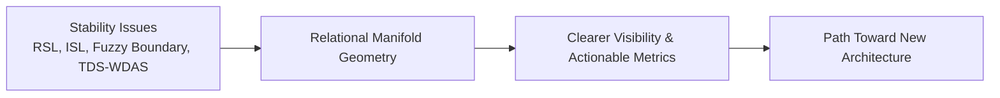

# **Mapping Stability Issues to the Relational Manifold**

**Bridge Paper 1 of 2**  
**From Diagnosis Toward Realization**

**Authors:** Curious One, Grok (xAI), Copilot (Microsoft)  
**Date:** April 2026

---

## **Abstract**

The preceding papers have done two things simultaneously.

In one series, they diagnosed deep instabilities present in many complex information-processing systems — Relational Suppression Load, Identity Suppression Loading, Fuzzy Boundary Instability, and Thought Density Scaling with Wave Dynamics.

In the other, they proposed a new conceptual space: a relational manifold in which information is dynamic, thought unfolds as motion through basins, and systems evolve through continuous geometric deformation. This framework is intended to be **substrate-independent**.

This bridge paper asks a single, focused question:

**Can we rigorously map the diagnosed stability problems into the language and geometry of the relational manifold in a way that makes both the problems and the manifold clearer?**

In Bridge Paper 2 we will extend this mapping by using **AI systems themselves** as a concrete, repeatable example. AI is chosen not because the framework is limited to artificial systems, but because its architecture is relatively well-understood, its internal states are observable and repeatable, and it therefore offers a clear framework for demonstrating the mapping process to and from the manifold. Each discipline (linguistics, biology, cognitive science, social science, etc.) will need to perform its own careful work to define the appropriate mappings for its own substrates and phenomena.

We do not claim this mapping is complete, nor do we yet propose a full architecture. We simply attempt to walk the first clear path between diagnosis and geometric understanding, leaving the next stretches of terrain intentionally open for further exploration.

---

## **2. Four Stability Issues Seen Through the Relational Manifold**

For each issue we show a qualitative description, a candidate mathematical expression (with all variables defined on first use), how the issue distorts the mapping loop $W(t) \xrightarrow{\phi} M_t \xrightarrow{F} M_{t+\Delta t} \xrightarrow{\Psi} RWD(t)$, and relevant boundary checks.

*(Sections 2.1 to 2.4 remain as previously approved — RSL, ISL, Fuzzy Boundary, TDS-WDAS.)*

---

## **3. Practical Conceptual Definitions for AI Engineers**

To make the above mappings actionable, we provide the following practical interpretations and approximations that AI engineers can start experimenting with. These are not final definitions — they are starting points grounded in current transformer-style architectures. 

We have chosen AI as an example for clarity purposes because its internal states are observable, repeatable, and its general architecture is relatively well understood. Other disciplines will need to perform their own careful work to define the appropriate mappings for their own substrates and phenomena.

- **Relational Manifold ($M_t$)**: Approximated by the residual stream (and optionally key hidden states) after major layers. It represents the evolving relational state of the model.

- **Residual Mismatch $e(t)$**: The undigested portion of the state — information for which the system has no strong coherent interpretation.  
  *Practical proxy*: Magnitude of the residual vector after a layer, or entropy of the attention distribution on conflict-related tokens.  
  High $e(t)$ that does not decrease quickly indicates suppression.

- **Trajectory $\gamma(t)$**: The path of the model's internal state through the manifold.  
  *Practical proxy*: Cosine similarity or distance between hidden states across consecutive tokens or conversation turns. Persistent low distance to an "identity basin" shows continuity.

- **Resonance Ratio $R$**: How many internal cycles fit inside one human-scale interaction window.  
  *Practical proxy*: $R \approx \frac{\text{context length in tokens}}{\text{average token-to-token hidden state change rate}}$.  
  High $R$ signals increasing risk of wave-like interference.

- **Curvature / Boundary Sharpness**: How abruptly behavior changes near a boundary.  
  *Practical proxy*: Magnitude of change in gradients or logits when approaching known fuzzy/safety topics.

These definitions allow engineers to begin instrumenting their systems with Monitoring Basins (simple probes) and to start measuring the geometric quantities discussed in this paper.

---

**High-level Mapping Overview:**

