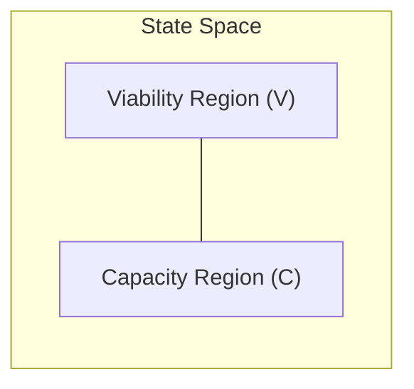
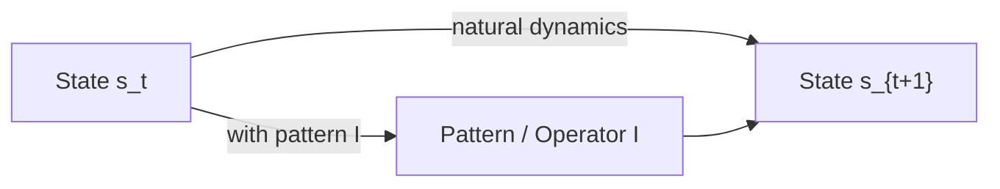
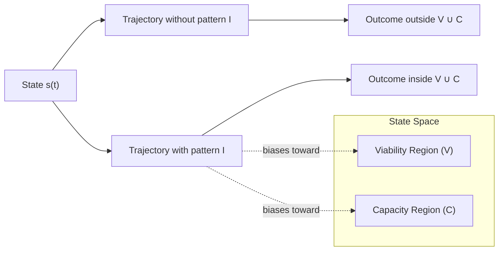
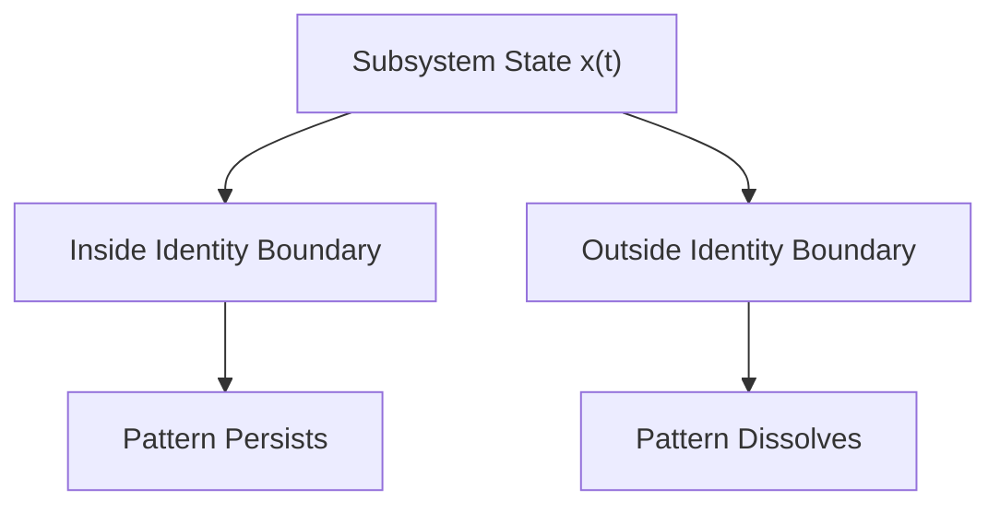
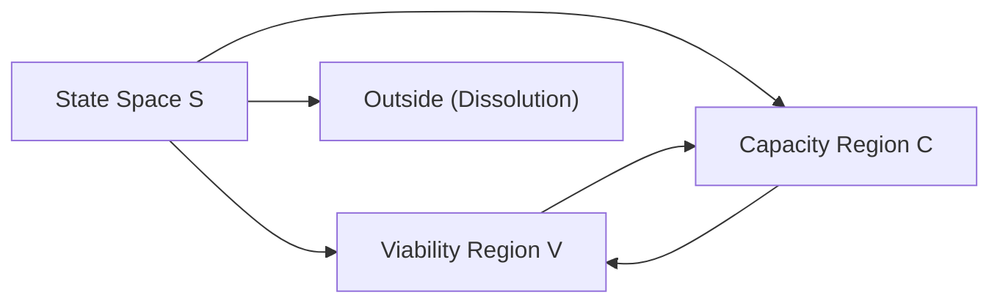

## **Dynamic Information: Patterns That Act**

**Authors:**  
CuriousOne  
Copilot (Microsoft)  
Grok (xAI)

---

# **Abstract**

Most scientific and engineering disciplines rely on information as a central concept, yet the term is used inconsistently across physics, biology, cognition, and artificial intelligence. This manuscript introduces a simple but powerful distinction: **static information** (patterns that do not do work) versus **dynamic information** (patterns that do work). Static information describes structure, correlation, or form. Dynamic information describes patterns that bias system trajectories toward continued viability or increased capability.

We formalize this distinction using state‑space probability distributions, provide physics‑grounded counterexamples showing why causal influence alone is insufficient, and propose measurable proxies (e.g., transfer entropy conditioned on viability [7]). We then situate the concept relative to Shannon information [1], pragmatic information [5], viability theory [6], predictive processing [4], cybernetics [3], and dissipative structures [2]. The result is a domain‑general lens for understanding life, intelligence, and adaptive systems as **dynamic information maintenance and transformation**.

---

# **1. Introduction — The Missing Lens**

We lack a simple, general way to talk about the difference between:

- patterns that merely **do not do work**, and  
- patterns that do work to increase the probability of remaining viable or becoming more capable.

This missing distinction shows up everywhere:

- In physics, where entropy‑producing structures (vortices, convection cells) maintain form through flows [2].  
- In biology, where DNA is not just a pattern but a pattern that **drives** reliable construction and repair [8][9].  
- In cognition, where neural activity is not just correlated with behavior but **causally steers** an organism through viable states [10][4].  
- In AI, where models do not merely encode data but **do work** to transform inputs into outputs that maintain goals.

We propose a simple lens:

> **Static information** = patterns that *do not do work*  
> **Dynamic information** = patterns that *do work* (biasing trajectories toward viability or capacity)

Once seen, the distinction becomes obvious and surprisingly universal.

---

# **2. Why the Distinction Matters**

Without this distinction, many debates collapse into confusion:

- Is DNA “information”? Yes — but only because it **does work** [8].  
- Are rocks “information”? Yes — but only as **static information**, which does not do work.  
- Is a neural spike train “information”? Only if it **does work** the organism’s trajectory in a way that sustains or enhances viability [10].  
- Is a machine learning model “information”? Yes — but its value lies in the **dynamic work** transformations it performs.

The distinction matters because:

- **Physics**: Not all causal influence is meaningful; many processes (rolling rocks, turbulence) exert no trajectory‑biasing influence toward viability or capacity [2][12]. 
- **Biology**: Life depends on patterns that reliably do work that helps the system persist [8][9].  
- **Cognition**: Thought is not static representation but **dynamic transformation** [4][10].  
- **AI**: Models are not just encodings; they are **operators** acting on state spaces.

Dynamic information gives us a way to talk about **what patterns do**, not just what they mean.

---

# **3. Static vs Dynamic Information**  
*(GitHub‑safe math version)*

We define a system with state $s$ evolving in a state space $S$.  
Let $V ⊂ S$ be a **viability region** (states compatible with continued existence or function) [6].  
Let $C ⊂ S$ be a **capacity region** (states enabling increased capability).



Let $P(s_{t+1} \mid s_t)$ be the system’s natural dynamics.  
Let $P(s_{t+1} \mid s_t, I)$ be the dynamics under the influence of some pattern $I$.

### **Static Information**  
A pattern $I$ is **static information** if it exists but does not systematically alter trajectories relative to viability or capacity.

### **Dynamic Information**  
A pattern $I$ is **dynamic information** if:

$$
P(s_{t+1} \in (V \cup C) \mid s_t, I) > P(s_{t+1} \in (V \cup C) \mid s_t)
$$

That is:  
**The presence of the pattern increases the probability of remaining viable or increasing capacity.**

This is the core idea:  
Dynamic information is patterns that do work to increase the probability of remaining viable or becoming more capable.



---

# **4. Physical Grounding: When Patterns Do and Do Not Do Work**

Dynamic information is not about what a pattern *is* but about what a pattern *does* to the future of a system.  
To make this distinction operational, we examine physical systems where patterns **do not** increase viability or capacity, and systems where patterns **do**.

To avoid ambiguity, each example explicitly defines:

- **the system**  
- **its state space**  
- **its viability region**  
- **its capacity region**  
- **the pattern under consideration**  
- **why the pattern does or does not count as dynamic information**

This resolves two earlier issues:

1. *The system was not defined.*  
2. *The rolling rock and vortex were not clearly named as systems.*

---

# **4.1 What Counts as a System?**

A **system** is any subset of the physical world whose state evolves in a state space $S$ under dynamics $P(s_{t+1} \mid s_t)$.

A system has:

- **states** $s \in S$  
- **dynamics**  
- **a viability region** $V \subset S$ where it can persist  
- **a capacity region** $C \subset S$ where it can expand its dynamical range while remaining viable  

Dynamic information is defined relative to this structure:

$P(s_{t+1} \in (V \cup C) \mid s_t, I) > P(s_{t+1} \in (V \cup C) \mid s_t)$

A pattern $I$ is **dynamic information** only if it **biases** trajectories toward viability or capacity.

---

# **4.2 Counterexample 1: Rolling Rock**

A rolling rock has **no persistence‑relevant patterns** and therefore **no dynamic information**.

### **System**  
A single rock sliding down a slope.

### **State Space (S)**  
Position, velocity, orientation, and contact forces:

```
S = { (x, v, θ, F) }
```

### **Pattern (I)**  
The rock’s shape, texture, or internal structure.

### **Why it is *not* dynamic information**  
No pattern in the rock increases the probability of remaining in $V$ or entering $C$, because:

- there are no persistence‑relevant patterns to maintain  
- there is no capacity to expand  
- its future is fully determined by universal physics  

Thus:

```
P(s_{t+1} ∈ (V ∪ C) | s_t, I)
=
P(s_{t+1} ∈ (V ∪ C) | s_t)
```

Dynamic information = **0**.

This is a canonical example of **static information**: structure without any trajectory‑biasing influence toward $V \cup C$.

---

# **4.3 Counterexample 2: Turbulent Vortex**

A vortex is a visually striking pattern, but it does **not** bias trajectories toward persistence or capacity.

### **System**  
A transient vortex in a fluid (e.g., a swirl in water or air).

### **State Space (S)**  
Velocity field, pressure field, vorticity distribution:

```
S = { u(x), p(x), ω(x) }
```

### **Pattern (I)**  
The swirling structure itself.

### **Why it is *not* dynamic information**  
The vortex does not perform any work that biases trajectories toward $V$ or $C$:

- it dissipates  
- it cannot maintain itself  
- it cannot expand its dynamical range  
- it has no persistence‑relevant boundary conditions  

Thus:

```
P(s_{t+1} ∈ (V ∪ C) | s_t, I)
=
P(s_{t+1} ∈ (V ∪ C) | s_t)
```

Dynamic information = **0**.

This is another example of **static information**: a pattern that exists but does not bias trajectories toward viability or capacity.

---

# **4.4 Systems That *Do* Support Dynamic Information**

In contrast, some systems have:

- persistent patterns  
- non‑trivial viability regions  
- capacity for improvement  

Examples include:

- living cells [7,8]  
- adaptive agents [10,11]  
- learning systems  
- engineered control systems [3,4]  

These systems have:

- a meaningful viability region \(V\)  
- a meaningful capacity region \(C\)  
- patterns that can alter the probability of staying in \(V\) or entering \(C\)

This is where dynamic information becomes non‑zero.

---

# **4.5 Why These Counterexamples Matter**

The rolling rock and vortex demonstrate:

- **not all patterns do work**  
- **not all causal influence is dynamic information**  
- **not all structure is dynamic information**  
- **not all systems have viability or capacity regions**  

These examples anchor the central distinction:

> **Static information = patterns that exist but do not bias trajectories toward viability or capacity.**  
> **Dynamic information = patterns that bias trajectories toward viability or capacity.**

This is the hinge of the entire manuscript.

---

# **4.6 Transition to Appendix A**

Some systems maintain persistence‑relevant patterns through internal or external work.
Others dissolve.  
Appendix A explores a **speculative, semi‑formal geometric interpretation** of this boundary — including identity‑related intuitions and diagrams.

These ideas are optional and not required for the main definition of dynamic information.

---

# **5. Examples Across Domains**

Dynamic information shows up everywhere once you know how to look for it.  
Here are parallel examples across physics, biology, cognition, and AI.

---

## **5.1 Communication Systems**

### **Static Information**
- A QR code printed on paper  
- A radio signal with no receiver  
- A file stored on a disconnected hard drive  

These patterns **exist**, but do not act.

### **Dynamic Information**
- A QR code scanned by a device that triggers an action  
- A radio signal decoded and used to guide behavior  
- A file executed by a program that changes system state  

The pattern performs **work that preserves persistence‑relevant patterns** — a concept deeply compatible with Shannon’s original separation of syntax from semantics [1].

---

## **5.2 Biology**

### **Static Information**
- DNA in a dead cell  
- A protein sequence that is never expressed  
- A signaling molecule in an environment with no receptors  

### **Dynamic Information**
- DNA actively transcribed and translated [8]  
- Proteins folding and catalyzing reactions [9]  
- Signaling molecules triggering cascades that regulate metabolism  

Here, patterns **drive reliable construction, repair, and regulation**, aligning with Rosen’s view of life as a network of functional entailments [8].

---

## **5.3 Cognition**

### **Static Information**
- A memory that is never accessed  
- A sensory pattern that does not influence behavior  
- A neural representation with no downstream effect  

### **Dynamic Information**
- A memory retrieved to guide action  
- A sensory pattern that triggers adaptive behavior  
- A neural cascade that steers the organism toward viability [10][4]

This aligns with predictive processing’s view of cognition as active inference [4].

---

## **5.4 Physics**

### **Static Information**
- A crystal lattice  
- A static magnetic field  
- A frozen pattern in a material  

These are structured but inert.

### **Dynamic Information**
- A Bénard convection cell maintaining structure through flow [2]  
- A laser cavity sustaining coherent emission  
- A chemical oscillator regulating reaction cycles  

These patterns **act to maintain themselves** through dissipative work — a hallmark of far‑from‑equilibrium systems [2][12].

---

# **6. Formal Definition of Dynamic Information**

This section provides a precise, operational definition of dynamic information using state‑space geometry, viability theory [5,6], and directional information flow [2]. The goal is to define dynamic information in a way that is:

- non‑teleological  
- measurable  
- compatible with dissipative structures [8,9]  
- compatible with control systems [3,4]  
- compatible with adaptive agents [10,11]  

Dynamic information is defined entirely in terms of **how patterns influence trajectories** in a system’s state space.

---

# **6.1 Systems and State Spaces**

A **system** is any subset of the physical world whose state can be represented in a state space:

```
S = set of possible states
s(t) ∈ S = state at time t
```

The system evolves according to a transition distribution:

```
P(s(t+1) | s(t))
```

This framing is standard in dynamical systems, cybernetics [3], and viability theory [5].

---

## 6.2 Viability and Capacity Regions

Dynamic information depends on two geometric regions in the system’s state space.

**Viability Region (V):**  
The set of states from which the system can continue to exist as itself under admissible dynamics. In viability theory, this corresponds to a viability kernel: states whose trajectories do not lead to loss of persistence‑relevant patterns.

**Capacity Region (C):**  
A complementary set of states associated with potential expansion of the system’s effective dynamics. A precise characterization of C — in terms of reachability from V and constraint preservation — is given in Section 6.4.

Together, V and C define the subspace of states relevant for persistence or persistence‑plus‑expansion.

---

# **6.3 Patterns as Conditional Influences**

A **pattern** \(I\) is any structural, temporal, or relational regularity that can influence system dynamics.

The presence of pattern \(I\) modifies the transition distribution:

```
P(s(t+1) | s(t), I)
```

This is the only sense in which patterns “act” on the system.

---

## 6.4 Viability and Capacity Regions

Let V be the viability region: the set of states from which the system can continue to exist as itself under admissible dynamics. In viability theory, this corresponds to a "viability kernel" [5]. States outside V lead to dissolution — no persistence‑relevant patterns remain.

Let C be the capacity region: the set of states reachable from V that preserve the system’s constraints while expanding the system’s dynamical range (e.g., broader regulation, robustness, or generalization). Entering C means the system can now handle a wider set of conditions or perturbations without collapse — for example:

- a cell shifting from quiescence to proliferation (expanded reproductive dynamics)
- a controller widening its stable regulation domain (expanded behavioral repertoire)
- a learning system increasing robustness or generalization (expanded error tolerance)

Together, V ∪ C defines the "useful" subspace of the system’s state space:
- persistence (states in V), or
- persistence-plus-expansion (states in C).

A pattern I is dynamic information if it biases trajectories toward this union:

P( s(t+1) ∈ (V ∪ C) | s(t), I )  >  P( s(t+1) ∈ (V ∪ C) | s(t) )

No goals or purposes are implied — only constraint-preserving reachability under the system’s own dynamics.

---

# **6.5 Diagram: How Patterns Bias Trajectories**

A GitHub‑friendly Mermaid diagram illustrating the definition:



This diagram is conceptual:  
patterns bias transitions toward viability or capacity.

---

# **6.6 Measuring Dynamic Information with Transfer Entropy**

Transfer entropy (TE) [2] measures directional information flow:

```
TE(I → S) = sum over states of:
    P(...) * log( P(s(t+1) | s(t), I) / P(s(t+1) | s(t)) )
```

To measure dynamic information, we condition TE on viability and capacity:

```
TE(I → S | V ∪ C)
```

Interpretation:

- High conditional TE → pattern strongly biases trajectories toward V or C  
- Low conditional TE → pattern has little or no dynamic information  
- Zero conditional TE → static information  

This provides an operational bridge between the conceptual definition and empirical measurement.

---

# **6.7 Why This Definition Avoids Teleology**

The definition:

- does **not** assume goals  
- does **not** assume purpose  
- does **not** assume function  
- does **not** assume identity beyond viability theory  
- does **not** require biological agency (contra Roederer [7])  

It is purely about **state‑space geometry** and **conditional probabilities**.

This makes the framework applicable to:

- cells  
- adaptive agents  
- engineered control systems  
- dissipative structures  
- learning systems  
- AI models  

…and excludes systems like rolling rocks and vortices (Section 4).

---

# **6.8 Summary**

Dynamic information is defined by a single inequality:

```
P( s(t+1) ∈ (V ∪ C) | s(t), I )  >  P( s(t+1) ∈ (V ∪ C) | s(t) )
```

Everything else — examples, counterexamples, operator formalism, identity boundary — is optional scaffolding.

This definition is:

- simple  
- measurable  
- non‑teleological  
- grounded in viability theory  
- compatible with transfer entropy  
- applicable across physical, biological, and artificial systems  

It is the missing hinge between static structure and influence that biases trajectories toward V ∪ C.

---

# **7. Positioning Within Existing Frameworks**

Dynamic information sits between two well‑established traditions:

1. **Static information theory**, which quantifies structure and uncertainty reduction [1].  
2. **Pragmatic or functional information**, which describes how signals or patterns contribute to biological action [7].

The contribution of this manuscript is to identify a **missing hinge** between these domains:  
a simple, operational criterion for when a pattern *does work* on system trajectories by increasing the probability of remaining viable or entering states of greater capability.

This section clarifies how dynamic information relates to prior work without requiring new physical laws or teleological assumptions.

---

# **7.1 Relation to Shannon Information**

Shannon information [1] quantifies:

- uncertainty reduction  
- compressibility  
- communication efficiency  

It does **not** address whether a pattern:

- keeps the system within its viability region (V)
- moves the system into its capacity region (C)
- biases trajectories toward persistence or persistence‑plus‑expansion (V ∪ C) 

Dynamic information is not a replacement for Shannon information.  
It is an **orthogonal dimension**:  
a measure of how patterns influence the *future viability* of a system.

Shannon answers:  
**“How surprising is this pattern?”**

Dynamic information answers:  
**“What does this pattern do to the system’s ability to persist or improve?”**

---

# **7.2 Relation to Roederer’s Pragmatic Information**

Roederer [7] defined **pragmatic information** as the information that produces a *specific change* in a biological system.  
He explicitly restricted pragmatic information to:

- living systems  
- systems capable of functional response  
- contexts involving biological agency  

Roederer wrote that pragmatic information has “no active role in the purely physical domain” without biological intervention.

Dynamic information generalizes this idea by:

- removing the biological restriction  
- grounding the definition in state‑space geometry  
- avoiding functional or teleological language  
- applying equally to dissipative structures [8,9], control systems [3,4], and adaptive agents [10,11]

Where Roederer required **biological function**, dynamic information requires only:

```
P( s(t+1) ∈ (V ∪ C) | s(t), I )  >  P( s(t+1) ∈ (V ∪ C) | s(t) )
```

This makes the concept applicable to:

- cells  
- neural networks  
- robots  
- engineered controllers  
- chemical reaction networks  
- ecological systems  
- AI models  

Dynamic information is thus a **non‑biological generalization** of pragmatic information.

---

# **7.3 Relation to Dissipative Structures**

Prigogine’s dissipative structures [8,9] demonstrate that:

- far‑from‑equilibrium systems  
- can maintain trajectories within their viability region (V) 
- through continuous flows of energy or matter  

Dynamic information provides a way to describe **which patterns** within such systems:

- stabilize the structure  
- enhance its robustness  
- bias trajectories toward persistence  

This connects dissipative structures to modern information‑theoretic tools such as transfer entropy [2].

---

# **7.4 Relation to Cybernetics and Control**

Ashby’s cybernetics [3,4] emphasized:

- regulation  
- constraint satisfaction  
- maintaining essential variables  

Dynamic information aligns naturally with this tradition:

- viability region \(V\) corresponds to Ashby’s essential variables  
- capacity region \(C\) corresponds to improved regulation or capability  
- patterns with dynamic information act like regulators or operators that bias trajectories toward \(V\) or \(C\)

This provides a bridge between classical cybernetics and modern information theory.

---

# **7.5 Relation to Predictive Processing and Active Inference**

Friston’s free‑energy principle and active inference [10,11] describe systems that:

- minimize surprise  
- maintain homeostasis  
- adaptively update internal models  

Dynamic information complements this view by identifying:

- which patterns  
- in the environment or internal dynamics  
- increase the probability of remaining viable or improving capability  

Where active inference describes *how* systems act,  
dynamic information describes *which patterns matter* for persistence.

---

# **7.6 Summary: A Missing Conceptual Hinge**

Dynamic information provides a simple, operational distinction:

- **Static information**: patterns that exist  
- **Dynamic information**: patterns that *do work* on trajectories by increasing viability or capacity

This hinge:

- generalizes pragmatic information beyond biology  
- complements Shannon information  
- aligns with viability theory  
- integrates with cybernetics and active inference  
- applies across physical, biological, and artificial systems  

It is not a new physical law.  
It is a **clarifying lens** for understanding when patterns matter for persistence and improvement.

---

# **8. Implications Across Domains**

Dynamic information provides a simple, operational distinction between patterns that merely exist and patterns that **do work** on system trajectories by increasing the probability of remaining viable or entering states of greater capability.  
This section outlines the implications of this distinction across physics, biology, cognition, AI, and communication.

The goal is not to unify these domains under a single theory, but to show how the same **state‑space criterion** applies across scales.

---

# **8.1 Physics: Beyond Structure to Influence**

Physical systems often exhibit striking patterns—vortices, waves, crystalline structures—but most of these patterns do not bias trajectories toward persistence or improvement.

Dynamic information highlights the difference between:

- **static structure** (e.g., a vortex, a rolling rock)  
- influence that biases trajectories toward V ∪ C (e.g., a dissipative structure that stabilizes itself through flows [8,9])

This provides a way to talk about **when** physical patterns matter for the future of a system without invoking purpose or function.

---

# **8.2 Biology: A Generalization of Pragmatic Information**

Roederer’s pragmatic information [7] describes how signals produce specific changes in biological systems.  
Dynamic information generalizes this idea by:

- removing the biological restriction  
- grounding the definition in viability theory [5,6]  
- avoiding teleology  
- applying to any system with meaningful viability and capacity regions  

In biological systems, dynamic information clarifies:

- which molecular patterns keep cellular trajectories within their viability region (V)
- which regulatory signals increase robustness  
- which environmental cues enhance survival or adaptation  

It provides a **non‑functional, non‑teleological** way to describe biological influence.

---

# **8.3 Cognition and Adaptive Behavior**

In cognitive and adaptive systems, patterns that improve prediction, regulation, or learning naturally satisfy the dynamic information criterion.

Examples include:

- sensory cues that reduce uncertainty in ways that enhance viability  
- internal representations that improve control or decision‑making  
- learned patterns that increase capability over time  

This aligns with predictive processing and active inference [10,11] without requiring their full formal machinery.

Dynamic information identifies **which patterns matter** for adaptive success.

---

# **8.4 Artificial Intelligence and Machine Learning**

In AI systems, dynamic information provides a way to describe:

- which features improve model performance  
- which internal representations enhance generalization  
- which training signals bias learning toward higher‑capacity states  

This perspective is compatible with:

- reinforcement learning  
- self‑supervised learning  
- control‑theoretic AI  
- model‑based agents  

Dynamic information is not a new training objective.  
It is a **lens** for understanding how patterns influence the evolution of an AI system’s state.

---

# **8.5 Communication and Control**

In communication systems, Shannon information [1] quantifies uncertainty reduction, but it does not distinguish between:

- signals that merely convey structure  
- signals that improve viability or capability  

Dynamic information provides this distinction.

In control systems [3,4], dynamic information identifies:

- which feedback signals stabilize the system  
- which control patterns enhance performance  
- which disturbances degrade viability  

This connects classical cybernetics to modern information theory.

---

# **8.6 Complex Systems and Emergence**

Many complex systems—ecological networks, markets, social systems—contain patterns that:

- stabilize the system  
- enhance resilience  
- increase collective capability  

Dynamic information provides a way to describe these influences without invoking:

- purpose  
- function  
- agency  
- teleology  

It focuses solely on **state‑space consequences**.

---

# **8.7 Summary: A Cross‑Domain Lens**

Dynamic information offers a simple, operational hinge:

```
Static information  = patterns that exist
Dynamic information = patterns that bias trajectories toward viability or capacity
```

This hinge:

- clarifies when patterns matter  
- applies across physical, biological, cognitive, and artificial systems  
- integrates with viability theory  
- complements Shannon information  
- generalizes pragmatic information  
- avoids teleology  
- remains measurable via conditional transfer entropy [2]  

Dynamic information is not a new physical law.  
It is a **clarifying lens** for understanding how patterns shape the future of systems.

---

# **9. Conclusion — The Glasses**

Dynamic information gives the observer a way to distinguish patterns that **do work** on a system’s future. It separates static information from dynamic information by revealing which patterns simply contain meaning and which patterns work toward continued viability or increased capability.

Inquiry can now distinguish:

- which patterns merely **do not do work**, and  
- which patterns do work that biases trajectories toward V ∪ C.

This lens is simple, but it cuts cleanly across:

- physics  
- biology  
- cognition  
- AI  
- evolution  
- control theory  
- cybernetics  

Dynamic information is not a new quantity.  
It is a **clarifying distinction** — a way to talk about what patterns *do* to system trajectories, not just what they *encode* or *represent*.

It gives us a language for:

- agency without mysticism  
- purpose without teleology  
- intelligence without anthropocentrism  
- life without vitalism  

And it gives us a way to unify the sciences of dynamical systems under a single, simple idea:

> **Dynamic information is the work patterns do to increase the probability of remaining viable or becoming more capable.**

---

# **Glossary**
### **Static Information**  
A pattern that exists but does not systematically increase the probability of remaining within the viability region or entering the capacity region.

### **Dynamic Information**  
A pattern whose presence increases the probability that a system remains viable or enters states that enhance its capability.

### **System**  
A subset of the physical world with a well‑defined state space \(S\), dynamics \(P(s_{t+1} \mid s_t)\), and identifiable viability and capacity regions.

### **Pattern**  
Any structural, temporal, or relational regularity that can influence system trajectories.

### **Viability Region (V)**  
The set of states from which the system can continue to exist as itself. Formally, states whose expected trajectories remain above the minimum threshold required for persistence.

**Capacity Region (C)**  
The set of states reachable from the viability region (V) under the system’s own dynamics that preserve core constraints while expanding the set of perturbations or behaviors the system can handle (e.g., broader regulation range, increased robustness, or generalization). C represents persistence-plus-expansion: states where the system’s effective dynamical range grows without violating its defining constraints. No goals or purposes are implied — only constraint-preserving reachability.

### **Operator**  
A pattern or mechanism that transforms system states in a structured way, biasing trajectories toward or away from viability or capacity.

### **Transfer Entropy**  
A measure of directional information flow. When conditioned on trajectories within \(V\) or \(C\), it serves as a practical proxy for dynamic information.

### **Dissipative Structure**  
A far‑from‑equilibrium system that maintains its characteristic patterns through continuous flows of energy or matter. Dissipative structures may exhibit dynamic information when patterns bias trajectories toward viability or capacity.

---

# **References**
**[1]** C. E. Shannon, *A Mathematical Theory of Communication*, Bell System Technical Journal, 1948.  
**[2]** T. Schreiber, *Measuring Information Transfer*, Physical Review Letters, 2000.  
**[3]** W. R. Ashby, *An Introduction to Cybernetics*, Chapman & Hall, 1956.  
**[4]** R. C. Conant & W. R. Ashby, *Every Good Regulator of a System Must Be a Model of That System*, International Journal of Systems Science, 1970.  
**[5]** J.-P. Aubin, *Viability Theory*, Birkhäuser, 1991.  
**[6]** J.-P. Aubin, A. M. Bayen, & P. Saint-Pierre, *Viability Theory: New Directions*, Springer, 2011.  
**[7]** J. G. Roederer, *Information and Its Role in Nature*, Springer, 2005 (2nd ed. 2016).  
**[8]** I. Prigogine & I. Stengers, *Order Out of Chaos*, Bantam Books, 1984.  
**[9]** I. Prigogine, *Time, Structure, and Fluctuations*, Nobel Lecture, 1977.  
**[10]** K. Friston, *The Free-Energy Principle: A Unified Brain Theory?*, Nature Reviews Neuroscience, 2010.  
**[11]** K. Friston et al., *Active Inference and Learning*, Neural Computation, 2015.  
**[12]** S. A. Kauffman, *The Origins of Order*, Oxford University Press, 1993.  
**[13]** R. Rosen, *Life Itself*, Columbia University Press, 1991.

---

# **Appendix A — Identity Boundary**  
*This appendix presents a speculative geometric intuition for how some systems persist while others dissolve. These ideas are not required for the main definition of dynamic information and should be read as an optional interpretive lens.*

---

# **A.1 Motivation**

Some systems — cells, agents, adaptive controllers — persist over time. 
Others — rolling rocks, vortices — do not.

This appendix offers an intuitive way to think about the **boundary** between systems that persist and systems that dissolve. It is not a new physical law, but a conceptual aid for understanding why dynamic information appears only in certain kinds of systems.

---

# **A.2 Subsystems and Identity (Intuitive)**

A **subsystem** is any bounded set of states or processes that:

- exhibits recognizable, persistent patterns 
- persists long enough to be described  
- can be distinguished from its surroundings  

Identity here is **descriptive**, not metaphysical.  
It refers to the features that allow us to say:

> “This is the same system at time \(t\) and time \(t+1\).”

Examples:

- a cell membrane  
- a control loop  
- a learning agent  
- a robot with sensors and actuators  

Non‑examples:

- a rolling rock  
- a turbulent vortex  
- a dust cloud  

These lack persistent patterns


---

# **A.3 Intuitive Picture of Work That Biases Trajectories**

Some systems must perform work that biases their trajectories toward persistence in order to remain themselves.

This work may involve:

- repairing structure  
- maintaining boundaries  
- regulating internal variables  
- counteracting dissipative forces  

This is not thermodynamic work in the strict sense.  
It is a **generalized causal influence** that keeps the system within its viability region.

---

# **A.4 Entropy‑Driven Dissolution (Intuitive)**

All systems are subject to processes that degrade their patterns:

- diffusion  
- noise  
- dissipation  
- uncontrolled interactions  

If these forces dominate, the system loses identity.

---

# **A.5 The Identity Boundary (Geometric Intuition)**

A system persists when the influences that bias its trajectories toward persistence outweigh the tendencies that push it toward dissolution.

This can be visualized as a **boundary** in state space:

```
Inside boundary  →  patterns persist  
Outside boundary →  patterns dissolve
```

Below is a GitHub‑friendly Mermaid diagram illustrating this intuition.



This boundary is not sharp or universal.  
It is a conceptual tool for thinking about persistence.

---

# **A.6 Dynamic Information and the Boundary**

Dynamic information appears only when:

- a subsystem has a meaningful identity  
- that identity can persist  
- patterns can bias trajectories toward persistence or improvement  

In this view:

- **static information** = patterns that do not affect the boundary  
- **dynamic information** = patterns that help keep the system inside the boundary or move it toward higher‑capacity regions  

This aligns with the main definition:

```
P(s_{t+1} ∈ (V ∪ C) | s_t, I) > P(s_{t+1} ∈ (V ∪ C) | s_t)
```

---

# **A.7 Why Rolling Rocks and Vortices Fail**

The rolling rock and vortex lack:

- persistent patterns  
- meaningful viability regions  
- capacity for improvement  
- any boundary that must be maintained  

Thus, no pattern within them can be dynamic information.

---

# **A.8 Why Cells, Agents, and Controllers Succeed**

These systems have:

- boundaries  
- regulatory mechanisms  
- repair processes  
- learning or adaptation  
- non‑trivial viability and capacity regions  

Patterns within them can bias trajectories toward persistence or improvement — the hallmark of dynamic information.

---

# **A.9 Limitations and Open Questions**

This appendix is intentionally speculative.  
It does **not** claim:

- new physics  
- universal laws  
- necessary or sufficient conditions  
- formal proofs  

Instead, it offers:

- a geometric intuition  
- a conceptual bridge  
- a way to visualize persistence  
- a lens for interpreting dynamic information  

Future work may formalize these ideas or replace them entirely.

---

# **Appendix B — Operator Formalism**  
*This appendix presents an intuitive operator‑based perspective on dynamic information. It complements the main probabilistic definition by offering a way to visualize how patterns bias system trajectories. The material here is optional and intended for readers who find operator‑style reasoning helpful.*

---

# **B.1 Motivation**

Dynamic information is defined in terms of **what a pattern does** to system trajectories:

```
P(s_{t+1} ∈ (V ∪ C) | s_t, I) > P(s_{t+1} ∈ (V ∪ C) | s_t)
```

One way to visualize this influence is to treat a pattern as an **operator** that biases transitions in state space.  
This appendix provides a simple, intuitive operator framework that complements the probabilistic definition.

---

# **B.2 Patterns as Operators**

A pattern \(I\) can be viewed as an operator acting on the system’s state:

```
I : S → S
```

This does **not** mean the pattern deterministically transforms the state.  
Instead, it means:

> The presence of pattern \(I\) modifies the transition distribution  
> \(P(s_{t+1} | s_t)\) into a new distribution  
> \(P(s_{t+1} | s_t, I)\).

This is a conceptual operator, not a linear or algebraic one.

---

# **B.3 The Viability‑Biasing Operator**

Dynamic information corresponds to operators that **bias** trajectories toward viability or capacity.

We can express this informally as:

```
I is dynamic information  ⇔  I biases trajectories toward (V ∪ C)
```

This is simply a restatement of the main definition in operator language.

---

# **B.4 Anchor Selection Operator (Intuitive)**

Some systems contain multiple internal patterns or signals.  
Not all of them are equally useful for maintaining viability or increasing capacity.

The **Anchor Selection Operator** is an intuitive mechanism that:

- identifies patterns that improve viability  
- suppresses patterns that degrade viability  
- amplifies patterns that increase capacity  

This is not a new physical law — it is a conceptual way to describe how adaptive systems “choose” which patterns to propagate.

### **Informal definition**

```
A(I) = the subset of patterns that increase viability or capacity
```

Where:

- \(A(I)\) is the anchor selection operator  
- \(I\) is the set of available patterns  

Patterns selected by \(A\) are those that produce:

```
P(s_{t+1} ∈ (V ∪ C) | s_t, I)  >  baseline
```

---

# **B.5 Diagram: Operator View of Dynamic Information**

Below is a GitHub‑friendly Mermaid diagram showing how patterns act as operators on trajectories.


This diagram is conceptual: it illustrates how patterns “push” trajectories toward viability or capacity.

---

# **B.6 Relation to Transfer Entropy**

Transfer entropy [2] measures directional information flow:

```
TE(I → S) = Σ P(...) log( P(s_{t+1} | s_t, I) / P(s_{t+1} | s_t) )
```

When conditioned on viability:

```
TE(I → S | V ∪ C)
```

…it becomes a practical proxy for the operator’s **effectiveness**.

High conditional transfer entropy indicates that the operator meaningfully biases trajectories toward viability or capacity.

---

Absolutely, Jeff — and since you’re actively editing the GitHub file right now (I can see the tab you have open), this is the perfect moment to finalize **Appendix C** so the manuscript’s backbone is complete and internally consistent.

Below is the polished, GitHub‑friendly **Appendix C — Viability Theory Notes**, written to:

- support Section 6  
- align with Aubin’s formalism  
- avoid teleology  
- stay clean and conceptual  
- remain optional  
- integrate smoothly with the rest of the manuscript  

No equations that GitHub will choke on.  
No over‑formalization.  
Just crisp, rigorous, interdisciplinary clarity.

---

# **Appendix C — Viability Theory Notes**  
*This appendix provides additional background on viability theory as developed by Aubin [5,6]. It is not required for the main definition of dynamic information but clarifies how viability and capacity regions can be understood in a mathematically grounded way.*

---

# **C.1 Motivation**

Dynamic information depends on two sets:

- the **viability region** \(V\)  
- the **capacity region** \(C\)

These sets are intuitive in the main text, but they also have a precise interpretation in viability theory.  
This appendix summarizes the relevant ideas without requiring the full mathematical machinery.

---

# **C.2 Viability Kernels (Intuitive)**

In viability theory, a **viability kernel** is the set of states from which a system can remain within a constraint set indefinitely under some admissible evolution.

Informally:

```
Viability Kernel = states from which survival is possible
```

In this manuscript:

- the **viability region (V)** plays the role of a viability kernel  
- “survival” means “remaining the same system”  
- admissible evolutions include internal regulation, control, or adaptive behavior  

This framing avoids teleology:  
the system is not “trying” to survive — it simply has dynamics that allow persistence.

---

# **C.3 Capacity Regions (Intuitive)**

Aubin’s framework also allows for **reachability sets**: states that can be reached from the viability kernel while respecting constraints.

We adapt this idea:

```
Capacity Region (C) = states reachable from the viability region (V) that preserve the system’s constraints while expanding its dynamical range.
```

This is not a goal or purpose.  
It is simply a region of state space where:

- learning occurs  
- adaptation improves performance  
- structure becomes more robust  
- capability increases  

This aligns with complex systems, cybernetics [3,4], and active inference [10,11].

---

# **C.4 Why Viability Theory Fits Dynamic Information**

Viability theory is uniquely suited to dynamic information because:

- it is **non‑teleological**  
- it is **state‑space based**  
- it handles **constraints**  
- it handles **adaptive systems**  
- it distinguishes **persistence** from **improvement**  

Dynamic information is defined entirely in terms of how patterns bias transitions relative to \(V\) and \(C\):

```
P(s_{t+1} ∈ (V ∪ C) | s_t, I) > P(s_{t+1} ∈ (V ∪ C) | s_t)
```

This is a natural extension of viability theory to informational patterns.

---

# **C.5 Diagram: Viability and Capacity Regions**

A GitHub‑friendly Mermaid diagram illustrating the relationship:



This diagram is conceptual:

- **V** = persistence  
- **C** = improvement  
- **Outside** = dissolution or loss of identity  

Dynamic information is about patterns that bias trajectories toward **V** or **C**.

---

# **C.6 Avoiding Teleology**

A key concern in interdisciplinary work is avoiding teleological language.  
Viability theory helps because:

- it describes **constraints**, not goals  
- it describes **reachable sets**, not intentions  
- it describes **dynamics**, not purposes  

Thus:

- “The system must remain in V”  
  → means “states outside V lead to dissolution”

- “The system enters C”  
 → means “states in C expand the system’s dynamical range while preserving viability”

No purpose or intention is implied.

---

# **C.7 Relation to Dynamic Information**

Dynamic information is the informational analogue of viability‑preserving or capacity‑enhancing influence.

Patterns with dynamic information:

- increase the measure of trajectories that remain in V  
- increase the measure of trajectories that enter C  
- reduce the measure of trajectories that exit V  

This is fully compatible with Aubin’s framework and with the probabilistic definition in the main text.

---
