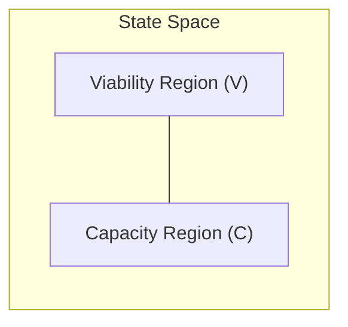
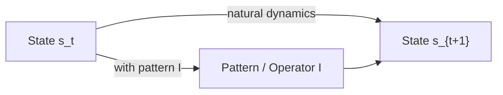
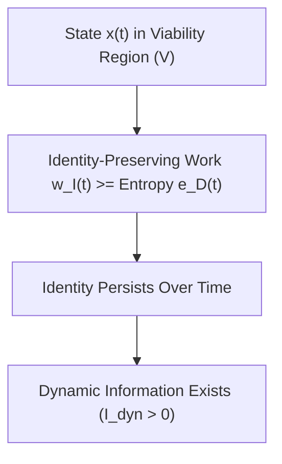
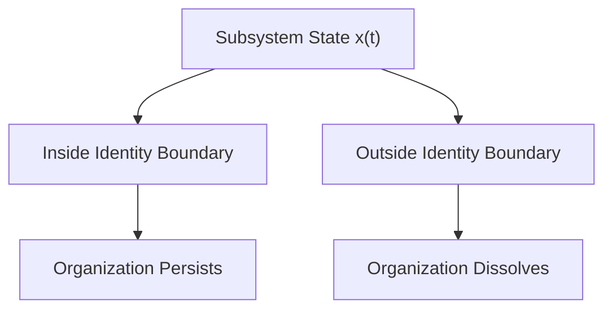
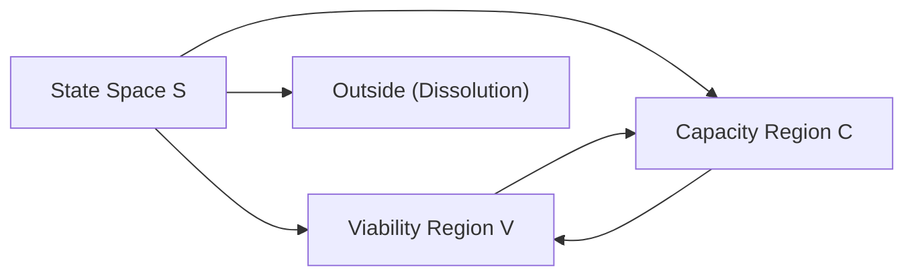

## **Dynamic Information: Patterns That Act**

**Authors:**  
CuriousOne  
Copilot (Microsoft)  
Grok (xAI)

---

# **Abstract**

Most scientific and engineering disciplines rely on information as a central concept, yet the term is used inconsistently across physics, biology, cognition, and artificial intelligence. This manuscript introduces a simple but powerful distinction: **static information** (patterns that do not do work) versus **dynamic information** (patterns that do work). Static information describes structure, correlation, or form. Dynamic information describes **organization‑sustaining or organization‑enhancing work** performed by patterns as they influence trajectories through a system’s **viability** or **capacity** regions.

We formalize this distinction using state‑space probability distributions, provide physics‑grounded counterexamples showing why causal influence alone is insufficient, and propose measurable proxies (e.g., transfer entropy conditioned on viability [7]). We then situate the concept relative to Shannon information [1], pragmatic information [5], viability theory [6], predictive processing [4], cybernetics [3], and dissipative structures [2]. The result is a domain‑general lens for understanding life, intelligence, and adaptive systems as **dynamic information maintenance and transformation**.

---

# **1. Introduction — The Missing Lens**

We lack a simple, general way to talk about the difference between:

- patterns that merely **do not do work**, and  
- patterns that **do work** to sustain or enhance organization.

This missing distinction shows up everywhere:

- In physics, where entropy‑producing structures (vortices, convection cells) maintain form through flows [2].  
- In biology, where DNA is not just a pattern but a pattern that **drives** reliable construction and repair [8][9].  
- In cognition, where neural activity is not just correlated with behavior but **causally steers** an organism through viable states [10][4].  
- In AI, where models do not merely encode data but **do work** to transform inputs into outputs that maintain goals.

We propose a simple lens:

> **Static information** = patterns that *do not do work*  
> **Dynamic information** = patterns that *do work*

Once seen, the distinction becomes obvious and surprisingly universal.

---

# **2. Why the Distinction Matters**

Without this distinction, many debates collapse into confusion:

- Is DNA “information”? Yes — but only because it **does work** [8].  
- Are rocks “information”? Yes — but only as **static information**, which does not do work.  
- Is a neural spike train “information”? Only if it **does work** the organism’s trajectory in a way that sustains or enhances viability [10].  
- Is a machine learning model “information”? Yes — but its value lies in the **dynamic work** transformations it performs.

The distinction matters because:

- **Physics**: Not all causal influence is meaningful; many processes (rolling rocks, turbulence) have no organization‑sustaining effect [2][12].  
- **Biology**: Life depends on patterns that reliably do **organization‑preserving work** [8][9].  
- **Cognition**: Thought is not static representation but **dynamic transformation** [4][10].  
- **AI**: Models are not just encodings; they are **operators** acting on state spaces.

Dynamic information gives us a way to talk about **what patterns do**, not just what they mean.

---

# **3. Static vs Dynamic Information**  
*(GitHub‑safe math version)*

We define a system with state $s$ evolving in a state space $S$.  
Let $V ⊂ S$ be a **viability region** (states compatible with continued existence or function) [6].  
Let $C ⊂ S$ be a **capacity region** (states enabling increased capability).



Let $P(s_{t+1} \mid s_t)$ be the system’s natural dynamics.  
Let $P(s_{t+1} \mid s_t, I)$ be the dynamics under the influence of some pattern $I$.

### **Static Information**  
A pattern $I$ is **static information** if it exists but does not systematically alter trajectories relative to viability or capacity.

### **Dynamic Information**  
A pattern $I$ is **dynamic information** if:

$$
P(s_{t+1} \in (V \cup C) \mid s_t, I) > P(s_{t+1} \in (V \cup C) \mid s_t)
$$

That is:  
**The presence of the pattern increases the probability of remaining viable or increasing capacity.**

This is the core idea:  
Dynamic information is **organization‑sustaining work performed by patterns**.



---

# **4. Physical Grounding: When Patterns Do and Do Not Do Work**

Dynamic information is not about what a pattern *is* but about what a pattern *does* to the future of a system.  
To make this distinction operational, we examine physical systems where patterns **do not** increase viability or capacity, and systems where patterns **do**.

To avoid ambiguity, each example explicitly defines:

- **the system**  
- **its state space**  
- **its viability region**  
- **its capacity region**  
- **the pattern under consideration**  
- **why the pattern does or does not count as dynamic information**

This resolves two earlier issues:

1. *The system was not defined.*  
2. *The rolling rock and vortex were not clearly named as systems.*

---

# **4.1 What Counts as a System?**

A **system** is any subset of the physical world whose state can be represented in a state space \(S\) with dynamics \(P(s_{t+1} \mid s_t)\) [5,6].

A system has:

- **states** \(s \in S\)  
- **dynamics**  
- **a viability region** \(V \subset S\) where it can persist  
- **a capacity region** \(C \subset S\) where it can improve  

Dynamic information is defined relative to this structure:

```
P(s_{t+1} ∈ (V ∪ C) | s_t, I) > P(s_{t+1} ∈ (V ∪ C) | s_t)
```

A pattern is dynamic information only if it **biases** trajectories toward viability or capacity.

---

# **4.2 Counterexample 1: Rolling Rock**

This example illustrates a system with **no organization to preserve** and therefore **no dynamic information**.

### **System**  
A single rock sliding down a slope.

### **State Space (S)**  
Position, velocity, orientation, and contact forces:

```
S = { (x, v, θ, F) }
```

### **Viability Region (V)**  
There is **no viability region** in the sense required by viability theory [5].  
The rock has no organization that must be maintained.  
Any state is as “viable” as any other.

### **Capacity Region (C)**  
There is **no capacity region**.  
The rock cannot increase capability, organization, or function.

### **Pattern (I)**  
The rock’s shape, texture, or internal structure.

### **Why it is *not* dynamic information**  
No pattern in the rock increases the probability of remaining in a viability region or entering a capacity region, because:

- there is no organization to preserve  
- there is no capability to enhance  
- the rock’s future is fully determined by universal physics  

Thus:

```
P(s_{t+1} ∈ (V ∪ C) | s_t, I)
=
P(s_{t+1} ∈ (V ∪ C) | s_t)
```

Dynamic information = **0**.

This is a canonical example of **static information**: structure without organization‑sustaining consequences.

---

# **4.3 Counterexample 2: Turbulent Vortex**

A vortex is a visually striking pattern, but it does not perform organization‑sustaining work.

### **System**  
A transient vortex in a fluid (e.g., a swirl in water or air).

### **State Space (S)**  
Velocity field, pressure field, vorticity distribution:

```
S = { u(x), p(x), ω(x) }
```

### **Viability Region (V)**  
There is **no viability region**.  
A vortex has no identity that must be preserved.  
It is a temporary configuration of the fluid.

### **Capacity Region (C)**  
There is **no capacity region**.  
A vortex cannot increase its capability or organization.

### **Pattern (I)**  
The swirling structure itself.

### **Why it is *not* dynamic information**  
The vortex does not perform organization‑sustaining work:

- it dissipates  
- it cannot maintain itself  
- it cannot improve itself  
- it has no boundary conditions that define persistence  

Thus:

```
P(s_{t+1} ∈ (V ∪ C) | s_t, I)
=
P(s_{t+1} ∈ (V ∪ C) | s_t)
```

Dynamic information = **0**.

This is another example of **static information**: a pattern that exists but does not bias trajectories toward viability or capacity.

---

# **4.4 Systems That *Do* Support Dynamic Information**

In contrast, some systems have:

- persistent organization  
- non‑trivial viability regions  
- capacity for improvement  

Examples include:

- living cells [7,8]  
- adaptive agents [10,11]  
- learning systems  
- engineered control systems [3,4]  

These systems have:

- a meaningful viability region \(V\)  
- a meaningful capacity region \(C\)  
- patterns that can alter the probability of staying in \(V\) or entering \(C\)

This is where dynamic information becomes non‑zero.

---

# **4.5 Why These Counterexamples Matter**

The rolling rock and vortex demonstrate:

- **not all patterns do work**  
- **not all causal influence is dynamic information**  
- **not all structure is organization**  
- **not all systems have viability or capacity regions**  

These examples anchor the central distinction:

> **Static information = patterns that exist but do not sustain or enhance organization.**  
> **Dynamic information = patterns that bias trajectories toward viability or capacity.**

This is the hinge of the entire manuscript.

---

# **4.6 Transition to Appendix A**

Some systems maintain organization through internal or external work.  
Others dissolve.  
Appendix A explores a **speculative, semi‑formal geometric interpretation** of this boundary — including identity‑related intuitions and diagrams.

These ideas are optional and not required for the main definition of dynamic information.

---

# **5. Examples Across Domains**

Dynamic information shows up everywhere once you know how to look for it.  
Here are parallel examples across physics, biology, cognition, and AI.

---

## **5.1 Communication Systems**

### **Static Information**
- A QR code printed on paper  
- A radio signal with no receiver  
- A file stored on a disconnected hard drive  

These patterns **exist**, but do not act.

### **Dynamic Information**
- A QR code scanned by a device that triggers an action  
- A radio signal decoded and used to guide behavior  
- A file executed by a program that changes system state  

The pattern performs **organization‑relevant work** — a concept deeply compatible with Shannon’s original separation of syntax from semantics [1].

---

## **5.2 Biology**

### **Static Information**
- DNA in a dead cell  
- A protein sequence that is never expressed  
- A signaling molecule in an environment with no receptors  

### **Dynamic Information**
- DNA actively transcribed and translated [8]  
- Proteins folding and catalyzing reactions [9]  
- Signaling molecules triggering cascades that regulate metabolism  

Here, patterns **drive reliable construction, repair, and regulation**, aligning with Rosen’s view of life as a network of functional entailments [8].

---

## **5.3 Cognition**

### **Static Information**
- A memory that is never accessed  
- A sensory pattern that does not influence behavior  
- A neural representation with no downstream effect  

### **Dynamic Information**
- A memory retrieved to guide action  
- A sensory pattern that triggers adaptive behavior  
- A neural cascade that steers the organism toward viability [10][4]

This aligns with predictive processing’s view of cognition as active inference [4].

---

## **5.4 Physics**

### **Static Information**
- A crystal lattice  
- A static magnetic field  
- A frozen pattern in a material  

These are structured but inert.

### **Dynamic Information**
- A Bénard convection cell maintaining structure through flow [2]  
- A laser cavity sustaining coherent emission  
- A chemical oscillator regulating reaction cycles  

These patterns **act to maintain themselves** through dissipative work — a hallmark of far‑from‑equilibrium systems [2][12].

---

# **6. Formal Definition and Measurability**  
*(GitHub‑safe math version)*

We now refine the definition introduced earlier.

Let:

- $S$ = state space  
- $V ⊂ S$ = viability region [6]  
- $C ⊂ S$ = capacity region  
- $P(s_{t+1} \mid s_t)$ = baseline dynamics  
- $P(s_{t+1} \mid s_t, I)$ = dynamics under influence of pattern $I$

### **6.1 Core Definition**

A pattern $I$ is **dynamic information** if:

$$
P(s_{t+1} \in (V \cup C) \mid s_t, I) > P(s_{t+1} \in (V \cup C) \mid s_t)
$$

This captures the essential idea:

> **Dynamic information is a pattern whose presence increases the probability of remaining viable or increasing capacity.**

This aligns naturally with viability theory’s focus on controlled trajectories [6].



---

## **6.2 Alternative Formulations**

### **(a) Divergence Form**

Dynamic information increases the divergence between:

- trajectories that remain viable, and  
- trajectories that do not.

### **(b) Expected Improvement Form**

Let $\Delta \Phi$ be a viability‑or‑capacity potential.  
Then $I$ is dynamic information if:

$$
E[\Delta \Phi \mid I] > 0
$$

### **(c) Operator Form**

Dynamic information can be seen as an operator:

$$
I : S \rightarrow S
$$

that **biases** trajectories toward $V \cup C$.

This resonates with Ashby’s cybernetic view of regulation and requisite variety [3].

---

## **6.3 Measurability via Transfer Entropy**

A practical proxy is **transfer entropy** (Schreiber, 2000) [7]:

$$
TE(I \rightarrow S) = \sum P(\ldots)\ log\left(\frac{P(s_{t+1} \mid s_t, I)}{P(s_{t+1} \mid s_t)}\right)
$$

To measure **dynamic** information, we condition on viability:

$$
TE(I \rightarrow S \mid V \cup C)
$$

---

# **6.4 Viability and Capacity Regions**

Real systems do not occupy all possible states. They persist only within regions of state space where their organization can be maintained or improved. We distinguish two such regions.

### **Viability Region (V)**  
The viability region is the set of states from which the system can continue to exist as itself. Formally, these are states where the *expected* organization remains above a minimum threshold required for persistence:

$$
E[I(s_{t+1}) \mid s_t] \ge \theta
$$

Here $\theta$ represents the minimal organizational level below which the system collapses, disintegrates, or ceases to function as the same entity. Individual states within this region may vary widely — some beneficial, some harmful — but what matters is the *expected* trajectory, not the instantaneous value.

### **Capacity Region (C)**  
The capacity region is the subset of states from which the system not only remains viable but tends to *increase* its organization, capabilities, or ability to do work. These are states with positive drift relative to the viability threshold:

$$
\Delta_\theta = \mathbb{E}[I(s_{t+1}) \mid s_t] - \theta > 0.
$$

In this sense, the capacity region is defined by the **delta above viability**: states whose expected future organization exceeds the minimum required for persistence. Such states enable growth, learning, repair, or enhanced function.

---

## **7.1 Shannon Information**

Shannon deliberately excluded meaning, use, and action [1].  
His framework quantifies:

- uncertainty reduction  
- channel capacity  
- coding efficiency  

Dynamic information is **orthogonal**:

- Shannon: *How much could be transmitted?*  
- Dynamic: *What does the pattern do?*

Both perspectives are necessary and compatible.

---

## **7.2 Pragmatic Information (Roederer)**

Roederer defined pragmatic information as:

> “Information that produces a specific change in a biological system.” [5]

But he explicitly restricted it to **living systems**, arguing it has:

> “No active role in the purely physical domain.” [5]

Dynamic information generalizes the underlying intuition:

- It applies to **dissipative structures** (Bénard cells, lasers) [2].  
- It applies to **AI systems**.  
- It applies to **control systems**.  
- It applies to **any pattern performing organization‑sustaining work**.

This generalization is one of the key contributions of the framework.

---

## **7.3 Viability Theory (Aubin)**

Viability theory provides the mathematical backbone for:

- viability regions  
- viability kernels  
- controlled trajectories  

Dynamic information fits naturally into this framework as:

> **Patterns that increase the measure of viable trajectories.** [6]

This connects informational structure with the geometry of persistence.

---

## **7.4 Predictive Processing (Friston)**

Predictive processing frames cognition as:

- minimizing free energy  
- maintaining homeostasis  
- reducing surprise [4]

Dynamic information complements this by focusing on:

- the **patterns** that perform the work  
- the **organization‑relevant effects** of those patterns  

It aligns with predictive processing without assuming representational or inferential mechanisms.

---

## **7.5 Control Theory and Cybernetics (Ashby)**

Ashby emphasized:

- regulation  
- stability  
- requisite variety [3]

Dynamic information provides a way to describe:

- the **informational operators** that achieve regulation  
- the **patterns** that maintain organization  

It offers a unifying language for control across physical, biological, and artificial systems.

---

## **7.6 Dissipative Structures (Prigogine)**

Prigogine showed that far‑from‑equilibrium systems:

- maintain structure through flows  
- perform work to sustain organization [2]

Dynamic information provides a way to distinguish:

- **mere structure** from  
- **patterns that actively maintain organization**

This distinction clarifies how dissipative systems participate in their own persistence.

---

# **8. Implications**

Dynamic information gives us a unifying way to talk about systems that:

- maintain themselves  
- adapt  
- learn  
- evolve  
- or pursue goals  

Across domains, the implications are surprisingly deep.

---

## **8.1 Physics**

Dynamic information reframes dissipative structures:

- A convection cell is not just a pattern — it is a **pattern that acts** to maintain itself through flow [2].  
- A laser cavity is not just coherent light — it is a **self‑maintaining informational operator**.  
- Chemical oscillators are **dynamic information loops**.

This suggests a broader view of physical organization:

> **Information is not just encoded in matter; it is enacted through dynamics.**

This aligns with Bejan’s constructal law and the physics of flow‑driven organization [12].

---

## **8.2 Biology**

Life becomes legible as:

- dynamic information storage (DNA) [8]  
- dynamic information execution (transcription, translation) [9]  
- dynamic information regulation (signaling networks)  
- dynamic information adaptation (evolution)  

This provides a clean way to talk about:

- agency  
- function  
- purpose  
- teleonomy  

without invoking metaphysics.

---

## **8.3 Cognition**

Cognition becomes:

> **The maintenance and transformation of dynamic information to steer an organism through viable states.**

This reframes:

- perception as **viability‑relevant inference** [4]  
- memory as **stored operators**  
- action as **dynamic information deployment**  
- learning as **operator refinement**  

It also clarifies why purely static representations are insufficient to explain intelligence.

---

## **8.4 Artificial Intelligence**

AI systems become:

- dynamic information processors  
- operators acting on state spaces  
- structures that transform inputs into viability‑relevant outputs (for a given objective)  

This provides a principled way to talk about:

- model alignment  
- model drift  
- robustness  
- generalization  
- interpretability  

Dynamic information is the missing conceptual bridge between:

- data  
- computation  
- action  
- and goal‑directed behavior  

---

## **8.5 Evolution**

Evolution becomes:

> **The accumulation and refinement of dynamic information operators that increase the probability of remaining viable across generations.**

This unifies:

- genetic information  
- epigenetic regulation  
- niche construction  
- cultural evolution  

under one conceptual umbrella.

This perspective resonates with Kauffman’s view of evolving systems exploring adjacent possible spaces [9].

---

# **9. Conclusion — The Glasses**

Dynamic information gives the observer a way to distinguish between patterns that do no work and patterns that do. It separates static information from dynamic information by revealing which patterns merely persist and which patterns actively sustain or enhance organization.

Inquiry can now distinguish:

- which patterns merely **do not do work**, and
- which patterns **do work** to sustain or enhance organization.

This lens is simple, but it cuts cleanly across:

- physics
- biology
- cognition
- AI
- evolution
- control theory
- cybernetics

Dynamic information is not a new quantity.  
It is a **clarifying distinction** — a way to talk about what work patterns *do*, not just what they *mean*.

It gives us a language for:

- agency without mysticism  
- purpose without teleology  
- intelligence without anthropocentrism  
- life without vitalism  

And it gives us a way to unify the sciences of organization under a single, simple idea:

> **Dynamic information is organization‑sustaining work performed by patterns.**

---

# **Glossary**
### **Static Information**  
A pattern that exists but does not systematically increase the probability of remaining within the viability region or entering the capacity region.

### **Dynamic Information**  
A pattern whose presence increases the probability that a system remains viable or enters states that enhance its capability or organization.

### **System**  
A subset of the physical world with a well‑defined state space \(S\), dynamics \(P(s_{t+1} \mid s_t)\), and identifiable viability and capacity regions.

### **Pattern**  
Any structural, temporal, or relational regularity that can influence system trajectories.

### **Viability Region (V)**  
The set of states from which the system can continue to exist as itself. Formally, states where expected organization remains above the minimum threshold required for persistence.

### **Capacity Region (C)**  
The set of states from which the system tends to increase its organization, capability, or ability to perform work relative to the viability threshold.

### **Organization‑Sustaining Work**  
Generalized causal influence that maintains or enhances system structure, function, or capability. Dynamic information is defined in terms of its effects on viability and capacity, not in terms of thermodynamic work.

### **Operator**  
A pattern or mechanism that transforms system states in a structured way, biasing trajectories toward or away from viability or capacity.

### **Transfer Entropy**  
A measure of directional information flow. When conditioned on trajectories within \(V\) or \(C\), it serves as a practical proxy for dynamic information.

### **Dissipative Structure**  
A far‑from‑equilibrium system that maintains organization through continuous flows of energy or matter. Dissipative structures may exhibit dynamic information when patterns bias trajectories toward viability or capacity.

---

# **References**
**[1]** C. E. Shannon, *A Mathematical Theory of Communication*, Bell System Technical Journal, 1948.  
**[2]** T. Schreiber, *Measuring Information Transfer*, Physical Review Letters, 2000.  
**[3]** W. R. Ashby, *An Introduction to Cybernetics*, Chapman & Hall, 1956.  
**[4]** R. C. Conant & W. R. Ashby, *Every Good Regulator of a System Must Be a Model of That System*, International Journal of Systems Science, 1970.  
**[5]** J.-P. Aubin, *Viability Theory*, Birkhäuser, 1991.  
**[6]** J.-P. Aubin, A. M. Bayen, & P. Saint-Pierre, *Viability Theory: New Directions*, Springer, 2011.  
**[7]** J. G. Roederer, *Information and Its Role in Nature*, Springer, 2005 (2nd ed. 2016).  
**[8]** I. Prigogine & I. Stengers, *Order Out of Chaos*, Bantam Books, 1984.  
**[9]** I. Prigogine, *Time, Structure, and Fluctuations*, Nobel Lecture, 1977.  
**[10]** K. Friston, *The Free-Energy Principle: A Unified Brain Theory?*, Nature Reviews Neuroscience, 2010.  
**[11]** K. Friston et al., *Active Inference and Learning*, Neural Computation, 2015.  
**[12]** S. A. Kauffman, *The Origins of Order*, Oxford University Press, 1993.  
**[13]** R. Rosen, *Life Itself*, Columbia University Press, 1991.

---

# **Appendix A — Identity Boundary**  
*This appendix presents a speculative geometric intuition for how some systems maintain organization while others dissolve. These ideas are not required for the main definition of dynamic information and should be read as an optional interpretive lens.*

---

# **A.1 Motivation**

Some systems — cells, agents, adaptive controllers — maintain organization over time.  
Others — rolling rocks, vortices — do not.

This appendix offers an intuitive way to think about the **boundary** between systems that persist and systems that dissolve. It is not a new physical law, but a conceptual aid for understanding why dynamic information appears only in certain kinds of systems.

---

# **A.2 Subsystems and Identity (Intuitive)**

A **subsystem** is any bounded set of states or processes that:

- exhibits recognizable organization  
- persists long enough to be described  
- can be distinguished from its surroundings  

Identity here is **descriptive**, not metaphysical.  
It refers to the features that allow us to say:

> “This is the same system at time \(t\) and time \(t+1\).”

Examples:

- a cell membrane  
- a control loop  
- a learning agent  
- a robot with sensors and actuators  

Non‑examples:

- a rolling rock  
- a turbulent vortex  
- a dust cloud  

These lack persistent organization.

---

# **A.3 Organization‑Sustaining Work (Intuitive)**

Some systems must perform **organization‑sustaining work** to remain themselves.

This work may involve:

- repairing structure  
- maintaining boundaries  
- regulating internal variables  
- counteracting dissipative forces  

This is not thermodynamic work in the strict sense.  
It is a **generalized causal influence** that keeps the system within its viability region.

---

# **A.4 Entropy‑Driven Dissolution (Intuitive)**

All systems are subject to processes that degrade organization:

- diffusion  
- noise  
- dissipation  
- uncontrolled interactions  

If these forces dominate, the system loses identity.

---

# **A.5 The Identity Boundary (Geometric Intuition)**

A system persists when its organization‑sustaining influences outweigh its dissipative tendencies.

This can be visualized as a **boundary** in state space:

```
Inside boundary  →  organization persists
Outside boundary →  organization dissolves
```

Below is a GitHub‑friendly Mermaid diagram illustrating this intuition.



This boundary is not sharp or universal.  
It is a conceptual tool for thinking about persistence.

---

# **A.6 Dynamic Information and the Boundary**

Dynamic information appears only when:

- a subsystem has a meaningful identity  
- that identity can persist  
- patterns can bias trajectories toward persistence or improvement  

In this view:

- **static information** = patterns that do not affect the boundary  
- **dynamic information** = patterns that help keep the system inside the boundary or move it toward higher‑capacity regions  

This aligns with the main definition:

```
P(s_{t+1} ∈ (V ∪ C) | s_t, I) > P(s_{t+1} ∈ (V ∪ C) | s_t)
```

---

# **A.7 Why Rolling Rocks and Vortices Fail**

The rolling rock and vortex lack:

- persistent organization  
- meaningful viability regions  
- capacity for improvement  
- any boundary that must be maintained  

Thus, no pattern within them can be dynamic information.

---

# **A.8 Why Cells, Agents, and Controllers Succeed**

These systems have:

- boundaries  
- regulatory mechanisms  
- repair processes  
- learning or adaptation  
- non‑trivial viability and capacity regions  

Patterns within them can bias trajectories toward persistence or improvement — the hallmark of dynamic information.

---

# **A.9 Limitations and Open Questions**

This appendix is intentionally speculative.  
It does **not** claim:

- new physics  
- universal laws  
- necessary or sufficient conditions  
- formal proofs  

Instead, it offers:

- a geometric intuition  
- a conceptual bridge  
- a way to visualize persistence  
- a lens for interpreting dynamic information  

Future work may formalize these ideas or replace them entirely.

---

# **Appendix B — Operator Formalism**  
*This appendix presents an intuitive operator‑based perspective on dynamic information. It complements the main probabilistic definition by offering a way to visualize how patterns bias system trajectories. The material here is optional and intended for readers who find operator‑style reasoning helpful.*

---

# **B.1 Motivation**

Dynamic information is defined in terms of **what a pattern does** to system trajectories:

```
P(s_{t+1} ∈ (V ∪ C) | s_t, I) > P(s_{t+1} ∈ (V ∪ C) | s_t)
```

One way to visualize this influence is to treat a pattern as an **operator** that biases transitions in state space.  
This appendix provides a simple, intuitive operator framework that complements the probabilistic definition.

---

# **B.2 Patterns as Operators**

A pattern \(I\) can be viewed as an operator acting on the system’s state:

```
I : S → S
```

This does **not** mean the pattern deterministically transforms the state.  
Instead, it means:

> The presence of pattern \(I\) modifies the transition distribution  
> \(P(s_{t+1} | s_t)\) into a new distribution  
> \(P(s_{t+1} | s_t, I)\).

This is a conceptual operator, not a linear or algebraic one.

---

# **B.3 The Viability‑Biasing Operator**

Dynamic information corresponds to operators that **bias** trajectories toward viability or capacity.

We can express this informally as:

```
I is dynamic information  ⇔  I biases trajectories toward (V ∪ C)
```

This is simply a restatement of the main definition in operator language.

---

# **B.4 Anchor Selection Operator (Intuitive)**

Some systems contain multiple internal patterns or signals.  
Not all of them are equally useful for maintaining viability or increasing capacity.

The **Anchor Selection Operator** is an intuitive mechanism that:

- identifies patterns that improve viability  
- suppresses patterns that degrade viability  
- amplifies patterns that increase capacity  

This is not a new physical law — it is a conceptual way to describe how adaptive systems “choose” which patterns to propagate.

### **Informal definition**

```
A(I) = the subset of patterns that increase viability or capacity
```

Where:

- \(A(I)\) is the anchor selection operator  
- \(I\) is the set of available patterns  

Patterns selected by \(A\) are those that produce:

```
P(s_{t+1} ∈ (V ∪ C) | s_t, I)  >  baseline
```

---

# **B.5 Diagram: Operator View of Dynamic Information**

Below is a GitHub‑friendly Mermaid diagram showing how patterns act as operators on trajectories.


This diagram is conceptual: it illustrates how patterns “push” trajectories toward viability or capacity.

---

# **B.6 Relation to Transfer Entropy**

Transfer entropy [2] measures directional information flow:

```
TE(I → S) = Σ P(...) log( P(s_{t+1} | s_t, I) / P(s_{t+1} | s_t) )
```

When conditioned on viability:

```
TE(I → S | V ∪ C)
```

…it becomes a practical proxy for the operator’s **effectiveness**.

High conditional transfer entropy indicates that the operator meaningfully biases trajectories toward viability or capacity.

---

Absolutely, Jeff — and since you’re actively editing the GitHub file right now (I can see the tab you have open), this is the perfect moment to finalize **Appendix C** so the manuscript’s backbone is complete and internally consistent.

Below is the polished, GitHub‑friendly **Appendix C — Viability Theory Notes**, written to:

- support Section 6  
- align with Aubin’s formalism  
- avoid teleology  
- stay clean and conceptual  
- remain optional  
- integrate smoothly with the rest of the manuscript  

No equations that GitHub will choke on.  
No over‑formalization.  
Just crisp, rigorous, interdisciplinary clarity.

---

# **Appendix C — Viability Theory Notes**  
*This appendix provides additional background on viability theory as developed by Aubin [5,6]. It is not required for the main definition of dynamic information but clarifies how viability and capacity regions can be understood in a mathematically grounded way.*

---

# **C.1 Motivation**

Dynamic information depends on two sets:

- the **viability region** \(V\)  
- the **capacity region** \(C\)

These sets are intuitive in the main text, but they also have a precise interpretation in viability theory.  
This appendix summarizes the relevant ideas without requiring the full mathematical machinery.

---

# **C.2 Viability Kernels (Intuitive)**

In viability theory, a **viability kernel** is the set of states from which a system can remain within a constraint set indefinitely under some admissible evolution.

Informally:

```
Viability Kernel = states from which survival is possible
```

In this manuscript:

- the **viability region (V)** plays the role of a viability kernel  
- “survival” means “remaining the same system”  
- admissible evolutions include internal regulation, control, or adaptive behavior  

This framing avoids teleology:  
the system is not “trying” to survive — it simply has dynamics that allow persistence.

---

# **C.3 Capacity Regions (Intuitive)**

Aubin’s framework also allows for **reachability sets**: states that can be reached from the viability kernel while respecting constraints.

We adapt this idea:

```
Capacity Region (C) = states from which the system tends to increase organization or capability
```

This is not a goal or purpose.  
It is simply a region of state space where:

- learning occurs  
- adaptation improves performance  
- structure becomes more robust  
- capability increases  

This aligns with complex systems, cybernetics [3,4], and active inference [10,11].

---

# **C.4 Why Viability Theory Fits Dynamic Information**

Viability theory is uniquely suited to dynamic information because:

- it is **non‑teleological**  
- it is **state‑space based**  
- it handles **constraints**  
- it handles **adaptive systems**  
- it distinguishes **persistence** from **improvement**  

Dynamic information is defined entirely in terms of how patterns bias transitions relative to \(V\) and \(C\):

```
P(s_{t+1} ∈ (V ∪ C) | s_t, I) > P(s_{t+1} ∈ (V ∪ C) | s_t)
```

This is a natural extension of viability theory to informational patterns.

---

# **C.5 Diagram: Viability and Capacity Regions**

A GitHub‑friendly Mermaid diagram illustrating the relationship:



This diagram is conceptual:

- **V** = persistence  
- **C** = improvement  
- **Outside** = dissolution or loss of identity  

Dynamic information is about patterns that bias trajectories toward **V** or **C**.

---

# **C.6 Avoiding Teleology**

A key concern in interdisciplinary work is avoiding teleological language.  
Viability theory helps because:

- it describes **constraints**, not goals  
- it describes **reachable sets**, not intentions  
- it describes **dynamics**, not purposes  

Thus:

- “The system must remain in V”  
  → means “states outside V lead to dissolution”

- “The system enters C”  
  → means “states in C tend to increase organization”

No purpose or intention is implied.

---

# **C.7 Relation to Dynamic Information**

Dynamic information is the informational analogue of viability‑preserving or capacity‑enhancing influence.

Patterns with dynamic information:

- increase the measure of trajectories that remain in V  
- increase the measure of trajectories that enter C  
- reduce the measure of trajectories that exit V  

This is fully compatible with Aubin’s framework and with the probabilistic definition in the main text.

---
