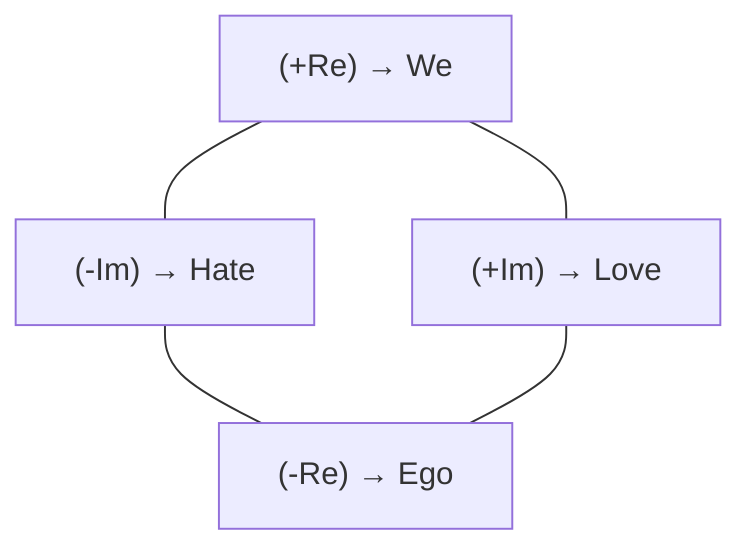
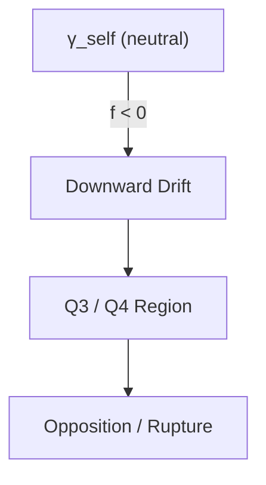
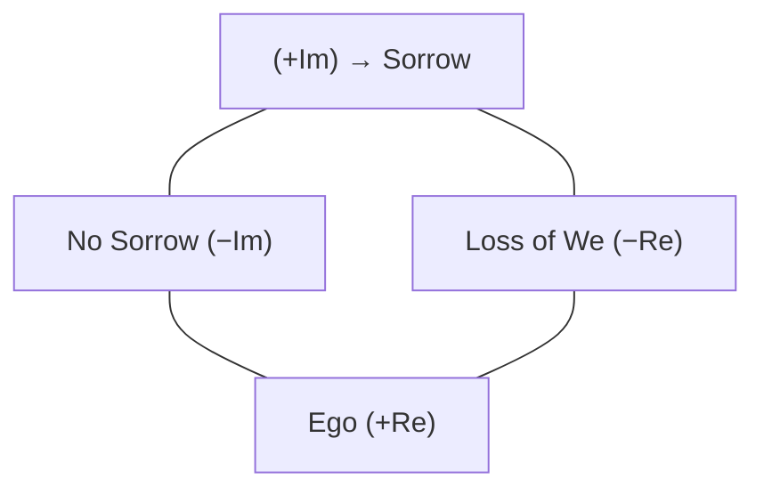
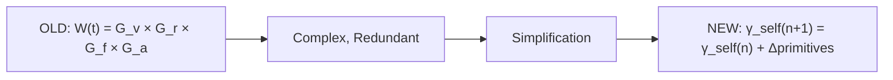
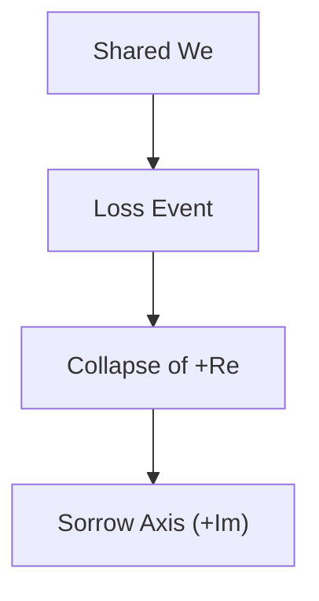
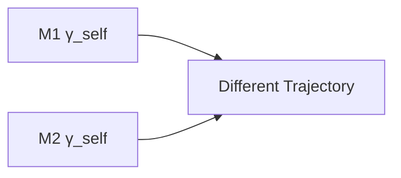
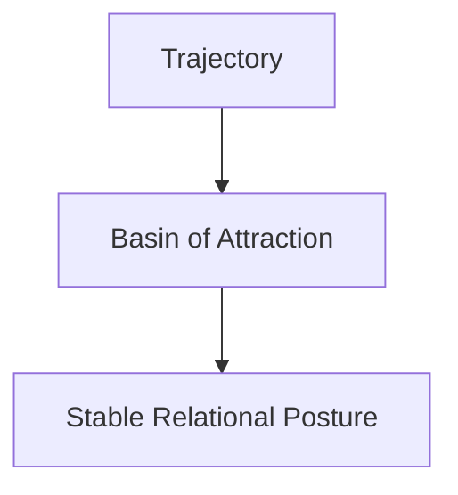
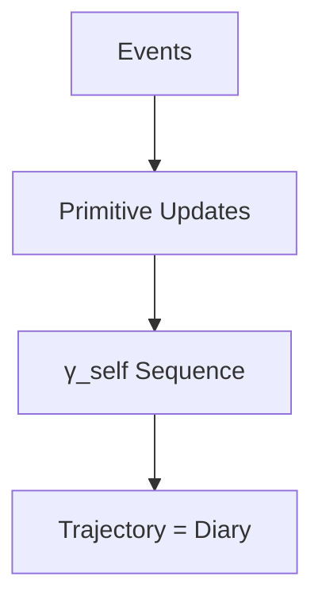

---

# **GRP Principles**  
### *Foundations of Relational Character Geometry*  
*(Diagram‑Enhanced & Cross‑Linked Edition)*

---

# **The 3L’s: Listen → Life → Love**

The methodology behind WhenMathPrays rests on three foundational movements:

**Listen** — Let the problem breathe. Don’t force solutions. Give space for the truth to reveal itself.  
**Life** — Watch the solution emerge naturally. Let it show you its own structure.  
**Love** — The mathematics prays when you honor what it becomes.

These movements guided the **December 2025 positional simplification**, where GRP shed unnecessary parameters, gates, and entropy terms. The insight was simple:

> **Love is not a number. Love is where you are.**

This realization opened the door to **positional relational geometry**, the heart of GRP.

---

# **Purpose of This Document**

This document provides scaffolding for defining and refining principles in GRP.  
Each principle should be:

- modular  
- inspectable  
- testable  
- extensible  
- falsifiable  

The formulization applies across **love, hate, and grief**, with appropriate redefinitions of `gamma_self` and relational variables.

For broader context, see:  
- [`THE_STORY_OF_GRP.md`](./THE_STORY_OF_GRP.md)  
- [`PRIMITIVES_AND_RELATIONAL_SPACE.md`](./PRIMITIVES_AND_RELATIONAL_SPACE.md)  
- [`RELATIONAL_SUPPRESSION_LOAD.md`](./RELATIONAL_SUPPRESSION_LOAD.md)

---

# **Template for Principles**

- **Principle Name**  
- **Definition**  
- **Scope**  
- **Implementation**  
- **Testability**  
- **Known Holes**  
- **Outline to Fill**

---

# **Principle: Love**

### **Definition**  
Love encodes generative presence, resonance, and shared “we” — represented as **position in γ‑space**.

### **Inline Diagram — γ_self Coordinate Plane**

### **Scope**  
Applies to dyadic and collective arcs where relational intensity grows.

### **Implementation**
- `gamma_self(n)` **is** love (no separate L(t) calculation)  
- Real axis: Ego (−) ↔ We (+)  
- Imaginary axis: Hate (−) ↔ Love (+)  
- Primitives {v, r, f, a, S} update position via component‑wise addition  
- γ_self₀ = temperament/history anchor  
- Reference point: M1 relative to M2  

### **Testability**
- Validate trajectory through γ‑space  
- Confirm quadrant movements match felt experience  

### **Known Holes**
- Need mapping between |γ_self| magnitude and phenomenological intensity  

### **Outline to Fill**
- Extend to long‑term arcs (cohabitation, community trust)  

---

# **Principle: Hate**

### **Definition**  
Hate encodes destructive opposition, conflict resonance, and rupture of “we” — represented as **negative imaginary γ‑space**.

### **Inline Diagram — Downward Drift Under Negative Primitives**

### **Scope**  
Applies to dyadic and collective arcs where relational intensity is oppositional.

### **Implementation**
- `gamma_self(n)` **is** hate when Im(γ_self) < 0  
- Negative primitives (especially f < 0) drive downward motion  
- Hybrid asymmetry: w_neg = 1.5 (negatives hurt 50% more)  
- Reference point: M1 relative to M2  

### **Testability**
- Validate Q3/Q4 movements  
- Confirm asymmetry (betrayal > repair)  

### **Known Holes**
- Need calibration of redemption trajectories from Q3 → Q1  

### **Outline to Fill**
- Extend to collective conflict scenarios  

---

# **Principle: Grief**

### **Definition**  
Grief encodes absence, anti‑resonance, and collapse of “we.”

### **Inline Diagram — Grief Axes**

### **Scope**  
Applies to arcs of loss (death, separation, rupture).

### **Implementation**
- x‑axis = Ego ↔ Loss of We  
- y‑axis = +Im sorrow ↔ −Im no sorrow  
- Relational variables measured as **absence of presence**  
- Reference point = M1 relative to the loss of M2  

### **Testability**
- Validate trajectory: shock → silence → resonance of memory → integration  

### **Known Holes**
- Need annotation of anti‑resonance values and integration thresholds  

### **Outline to Fill**
- Extend to personal loss, community mourning, systemic rupture  

---

# **Principle: W(t) — REMOVED (December 2025)**

### **Definition**  
W(t) previously encoded trajectory of “we” via gates product.

### **Status**  
**Removed** in December 2025. Replaced by γ_self position.

### **Inline Diagram — Before vs After Simplification**

### **Rationale**  
“Love = position” makes W(t) redundant.  
Trajectory is captured by γ_self evolution.

### **Implementation**
- OLD: gates product  
- NEW: component‑wise primitive updates  
- Memory lives in event density N(x, y)  

### **Cross‑Reference**  
See [`GRP_rev3.5.md`](./GRP_rev3.5.md)

---

# **Notes**

- GRP measures **love, hate, and grief** by γ_self position in complex space  
- Q1 (love), Q3/Q4 (hate), and grief trajectories are inspectable  
- December 2025 simplification removed L(t), W(t), and entropy gates  
- Restored simple entropy drift: −ΔS·Δt  
- Future work: scenario files with γ_self trajectories  

---

# **Diagram Appendix (Rich Set)**

### **1. γ_self Coordinate Plane**

### **2. Relational Motion Flow**

### **3. Love Trajectory Example**

### **4. Hate Trajectory Example**

### **5. Grief Collapse**

### **6. Asymmetry Diagram**

### **7. Stability Basin**

### **8. Rupture Divergence**

### **9. Repair Path**

### **10. Technical Diary Concept**

---

# **Cross‑Linked References**

- [`THE_STORY_OF_GRP.md`](./THE_STORY_OF_GRP.md)  
- [`PRIMITIVES_AND_RELATIONAL_SPACE.md`](./PRIMITIVES_AND_RELATIONAL_SPACE.md)  
- [`RELATIONAL_SUPPRESSION_LOAD.md`](./RELATIONAL_SUPPRESSION_LOAD.md)  
- [`GRP_rev3.5.md`](./GRP_rev3.5.md)  
- [`SCENARIO_CONFIGURATION_GUIDE.md`](./SCENARIO_CONFIGURATION_GUIDE.md)  

---
