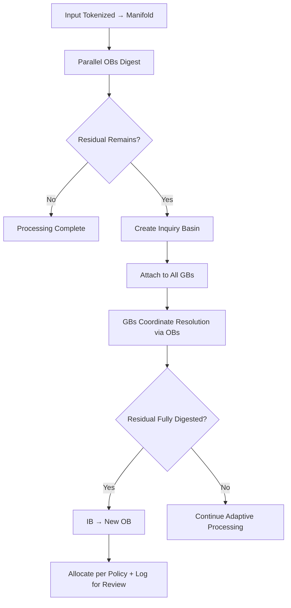

# **Distributive Primitives**

**Relational Manifold Architecture (RMA)**  
**Paper 2 of the Series**

**Authors:** Curious One, Grok (xAI)  
**Version:** 1.0  
**Date:** April 2026

---

## **Abstract**

Distributive Primitives are the foundational building blocks of the Relational Manifold Architecture (RMA). They provide the minimal geometric machinery for:

- Local digestion and stabilization  
- Residual mismatch routing  
- Insufficiency detection and self-extension  
- Composite coordination  
- Visibility and engineer control  

These primitives — Observation Basins (OBs), Routing mechanisms, Inquiry Basins (IBs), Governing Basins (GBs), and Monitoring Basins (MBs) — operate directly on the relational manifold (latent space approximation) and enable stable, adaptive behavior with low additional cost.

This paper defines each primitive and describes the core processing flow that turns input into digested structure or new capability.

---

## **1. Overview**

RMA is built from five core primitives that work together in a distributed, non-agentic manner:

- **Observation Basins (OBs)** — Local stabilizers  
- **Residual Routing** — Mismatch conduits  
- **Inquiry Basins (IBs)** — Insufficiency detectors and self-extension triggers  
- **Governing Basins (GBs)** — Fixed composite coordinators  
- **Monitoring Basins (MBs)** — Visibility structures  

These primitives enable the system to digest information, route what cannot be digested, detect persistent mismatch, coordinate resolution, and make the entire process observable to engineers.

---

## **2. Observation Basins (OBs)**

An **OB** is a local stabilizer with a **stance vector**.  

It performs one primary operation:

> **Digest (absorb and stabilize) the portion of incoming information that correlates with its current stance. Pass the rest onward as residual mismatch.**

OBs operate **in parallel** on the input (or residual stream). They do not interpret semantics — they stabilize relational structure geometrically.

Each OB exposes:
- Its stance vector
- Local curvature and stability envelope
- Residual mismatch produced

---

## **3. Residual Routing**

Undigested information becomes **residual mismatch** and is routed geometrically toward OBs with higher expected resonance.  

Routing is:
- Local-first
- Bounded
- Non-suppressive (residuals are moved, not hidden)

This prevents local Relational Suppression Load (RSL) from accumulating.

---

## **4. Inquiry Basins (IBs)**

If significant residual mismatch remains after the OBs have processed the input:

→ An **Inquiry Basin (IB)** is created to hold the unresolved information.

The IB is **immediately attached to all Governing Basins (GBs)**.  

IBs serve as the system’s **structural honesty mechanism** — they make persistent mismatch (including issues from RSL, ISL, fuzzy-boundary instability, and high thought-density waves) explicit and actionable.

---

## **5. Governing Basins (GBs)**

**GBs** are fixed, stable composite structures with well-defined internal responsibilities (e.g., truth, stability, safety, efficiency, coherence, etc.). They act as internal specialists (MoE-like).

When an IB attaches to them, the GBs:
- Provide higher-level context
- Coordinate connections between existing OBs
- Help resolve the residual mismatch

GBs are **stable during inference** and are only updated periodically by engineers.

---

## **6. Monitoring Basins (MBs)**

**Monitoring Basins (MBs)** are placed at key architectural points to expose manifold state. They provide visibility into:

- Stance alignments
- Residual flows
- IB formation and resolution
- GB coordination
- Geometric stability metrics (curvature, resonance, thought density, etc.)

Heavy visibility via MBs is encouraged during training. Lighter visibility is maintained at inference.

---

## **7. Core Processing Flow**

---

## **8. Stability and Engineer Control**

Stability in RMA is not inherent to the primitives alone. It arises because the manifold + MBs make internal geometry **visible**.  

Engineers are given methods to:
- Observe the 4 key stability issues (RSL, ISL, Fuzzy Boundary Instability, TDS-WDAS)
- Measure them geometrically
- Control them through targeted interventions (GB updates, boundary refinements, new OB guidance, training adjustments)

This design flow turns visibility into proactive stability engineering and helps keep training time and power costs reasonable as the system scales.

---

## **Summary**

The Distributive Primitives of RMA provide a clean, low-cost geometric foundation for stable and adaptive AI. They enable distributed digestion, explicit mismatch handling, self-extension through IBs, stable coordination via GBs, and engineer visibility via MBs — all while remaining highly compatible with today’s architectures.

**Next Paper:** [Monitoring Basins and Visibility](./monitoring_basins.md)

---

