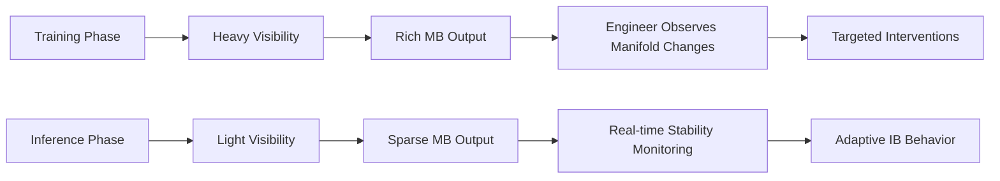

# **Monitoring Basins and Visibility**

**Relational Manifold Architecture (RMA)**  
**Paper 3 of the Series**

**Authors:** Curious One, Grok (xAI), Copilot (Microsoft)  
**Version:** 1.0  
**Date:** April 2026

---

## **Abstract**

Monitoring Basins (MBs) are dedicated structures placed at key architectural points within the relational manifold. Their purpose is to make the internal geometry **visible and measurable** to both the system and AI engineers.

MBs do not perform digestion or coordination. They **expose** manifold state — stances, residuals, IB activity, GB coordination, curvature, resonance, thought density, and stability metrics — enabling a new, geometric language of stability.

This paper defines MBs, their placement, what they expose, and how they support the engineer design flow for proactive stability control, especially during training where heavy visibility is encouraged.

---

## **1. Motivation**

The relational manifold gives us a geometric substrate, but **visibility is required to engineer stability**. Without explicit monitoring, engineers are forced to rely on indirect signals (loss, gradients, prompt behavior) and can only address instabilities after they manifest as drift, hallucinations, or collapse.

Monitoring Basins solve this by making the manifold’s internal dynamics first-class and observable. They turn RMA from a conceptual framework into a practical engineering platform.

---

## **2. Definition and Role**

A **Monitoring Basin (MB)** is a lightweight, dedicated structure that:

- Observes local or global manifold state at a specific architectural point.  
- Exposes geometric quantities in a human- and machine-readable form.  
- Does **not** alter processing flow (purely observational).  

MBs are the **eyes** of the RMA system.

---

## **3. Strategic Placement**

MBs are placed at high-value architectural locations, including:

- After major transformer layers or blocks  
- At the output of parallel OBs (to see digestion efficiency)  
- Around residual routing junctions  
- At IB creation points  
- At GB coordination interfaces  
- Near safety and efficiency boundaries  
- In high thought-density regions (TDS monitoring)  

This placement ensures comprehensive coverage with minimal overhead.

---

## **4. What MBs Expose**

Each MB provides structured visibility into:

- **Stance vectors** and alignment strength (OB level)  
- **Residual mismatch** magnitude, direction, and flow patterns  
- **IB formation** frequency, duration, and resolution success rate  
- **GB coordination** activity and effectiveness  
- **Geometric stability metrics**:
  - Residual dissipation rate  
  - Resonance ratio (\( R = L_{\text{corr}} / \lambda_{\text{eff}} \))  
  - Curvature and basin boundary smoothness  
  - Thought density and wave-like interference patterns  
- **RSL / ISL / Fuzzy-Boundary signals** (mapped from the four key papers)

---

## **5. Visibility During Training vs Inference**

**Training**: Heavy visibility (more MBs, richer metrics) is encouraged. This allows engineers to see and address stability issues (RSL, ISL, fuzzy-boundary instability, TDS-WDAS) early, reducing overall training time and power.

**Inference**: Lighter, sparse visibility is used to keep cost low while still enabling real-time monitoring and adaptive behavior.

---

## **6. Supporting the Engineer Design Flow**

MBs enable a practical workflow:

1. **Observe** geometric state via MB outputs.  
2. **Identify** specific stability issues from the four key papers.  
3. **Measure** them using quantitative geometric metrics.  
4. **Control** them through targeted actions (GB updates, boundary refinement, new OB guidance, training signal adjustments).

This shifts stability engineering from opaque prompt/output tuning to **fundamental geometric control**.

---

## **7. Cost-Effectiveness**

MBs are designed to be lightweight:
- They are observational only (no heavy computation).  
- Can be activated sparsely or at reduced frequency.  
- Training-time visibility accepts higher cost because it yields large downstream savings in training efficiency and stability.

---

## **Summary**

Monitoring Basins (MBs) provide the critical visibility layer in Relational Manifold Architecture. By exposing the manifold’s internal geometry at key points, they enable engineers to develop a fundamental language of stability and proactively manage known scaling issues.

MBs turn the relational manifold from a passive substrate into an **observable, engineerable platform** for building stable, adaptive AI.

**Next Paper:** [Stability Design Flow for Engineers](./stability_design_flow.md)

---

