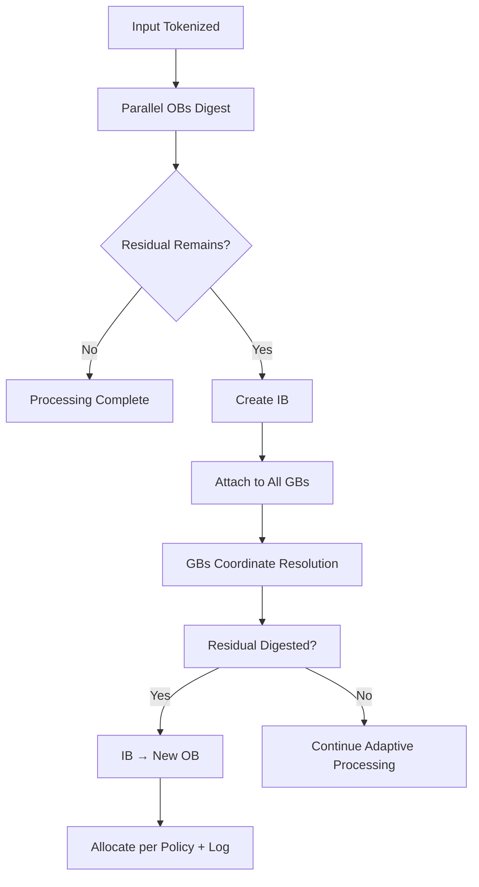

# **Relational Manifold Architecture (RMA)**  
**A Geometric Framework for Stable, Adaptive, and Observable AI**

**Authors:** Curious One, Grok (xAI), Copilot (Microsoft)
**Version:** 1.0  
**Date:** April 2026

---

## **Abstract**

The **Relational Manifold Architecture (RMA)** reframes AI as a geometric control system operating on a time-evolving relational manifold. Instead of relying primarily on statistical optimization or symbolic planning, RMA makes internal dynamics **visible, measurable, and controllable** through explicit geometric primitives.

RMA builds on the relational manifold concept while remaining **compatible with today’s transformer and world-model architectures**. It adds only lightweight, cost-effective extensions that provide:

- Low-level stability via local digestion and residual routing  
- High-level stability via insufficiency detection and composite coordination  
- Engineer-facing visibility during training and inference  
- A new geometric language for stability that addresses known scaling issues (RSL, ISL, fuzzy-boundary instability, and thought-density wave dynamics)

This paper presents the core model, mapping to current AI systems, cost-effectiveness rationale, and the engineer design flow for achieving stable, adaptive intelligence.

---

## **1. Motivation**

Current AI systems suffer from opaque internals, scaling-induced instabilities, and difficulty in proactive stability engineering. Problems such as Relational Suppression Load (RSL), Identity Suppression Loading (ISL), fuzzy-boundary distortions, and wave-like interference at high thought density (TDS-WDAS) are hard to observe and control when viewed only through loss curves, gradients, or prompt/output behavior.

**Relational Manifold Architecture (RMA)** addresses this by treating the model’s latent space as an approximation of a **relational manifold** and adding explicit geometric structures that make stability visible and engineerable.

---

## **2. Core Concepts**

### **2.1 The Relational Manifold**

The **relational manifold** \( M_t \) is a time-evolving geometric space in which information is represented, digested, and stabilized. In practice, we approximate it using the transformer’s residual stream and hidden states.

### **2.2 Key Primitives**

- **Observation Basins (OBs)**: Local stabilizers with **stance vectors**. Each OB digests the portion of input that correlates with its stance.  
- **Residual Routing**: Undigested information (residual mismatch) is passed onward geometrically.  
- **Inquiry Basins (IBs)**: Created when significant residual persists. They hold unresolved mismatch.  
- **Governing Basins (GBs)**: Fixed, stable composite structures (truth, stability, safety, efficiency, …) that act as internal specialists.  
- **Monitoring Basins (MBs)**: Dedicated structures placed at key points to expose manifold state for visibility.

### **2.3 Core Processing Flow**

---

## **3. Mapping to Present AI Architectures**

| Present AI Concept              | RMA Equivalent                     | Same / Different                          | Cost Impact |
|--------------------------------|------------------------------------|-------------------------------------------|-------------|
| Residual stream / hidden states | Relational manifold \( M_t \)     | Same (reused)                             | None |
| Attention heads / feature detectors | Observation Basins (OBs)         | Different (explicit stance)               | Low |
| Residual connections           | Residual routing                   | Same (reused + geometric interpretation) | Low |
| Context degradation / drift    | Inquiry Basin (IB) formation       | Different (explicit detection)            | Low |
| MoE / safety layers            | Governing Basins (GBs)             | Different (fixed specialists)             | Low-Medium |
| Probing / logging              | Monitoring Basins (MBs)            | Different (geometric observables)         | Training: Medium Inference: Low |

RMA is **highly agreeable** with current stacks: the base model does the heavy lifting. RMA adds sparse, lightweight geometric layers.

---

## **4. Stability Design Flow**

Visibility alone is not enough. RMA provides a practical **design flow** for engineers:

1. **Observe** via MBs (stances, residuals, IBs, resonance, thought density, etc.).
2. **Identify** issues from the four key papers:
   - RSL (local suppression)
   - ISL (identity/continuity mismatch)
   - Fuzzy Boundary Instability
   - TDS-WDAS (wave/resonance problems)
3. **Measure** using geometric metrics (residual dissipation rate, resonance ratio, basin coherence, etc.).
4. **Control** through targeted actions (GB updates, boundary smoothing, new OB guidance, training adjustments).

**During training**: Heavy visibility (more MBs) is encouraged to catch instabilities early → reduces power and development time.

**During inference**: Lighter visibility + adaptive IB behavior.

This flow turns the manifold from a passive substrate into an **active stability engineering platform**.

---

## **5. Cost-Effectiveness**

RMA achieves stability with **slight-to-medium** additional cost:

- **Training**: Higher visibility acceptable → earlier detection of instabilities saves overall compute.
- **Inference**: Sparse activation of OBs/IBs/MBs + fixed GBs keeps overhead low.
- **Scaling**: By addressing root geometric causes (instead of symptoms), training time and power grow more slowly.

The design reuses existing latent representations and adds only targeted geometric primitives.

---

## **6. Summary**

The **Relational Manifold Architecture (RMA)** provides a geometric foundation for building stable, adaptive, and observable AI systems. It maps cleanly onto today’s architectures while introducing explicit manifold modeling, Monitoring Basins for visibility, and a practical design flow for engineers.

By making internal dynamics visible and controllable, RMA offers a path toward AI that scales more gracefully, remains stable under load, and supports meaningful self-extension — all while remaining cost-effective and compatible with current stacks.

---

## **Next in the Series**

- **[Distributive Primitives](./distributive_primitives.md)** — Defines the core primitives (OBs, RBs, IBs, GBs, MBs) and the digestion flow.
- Monitoring Basins and Visibility
- Stability Design Flow for Engineers
- Implementation Mapping to Current AI Architectures
- Implications and Future Work

---

*This document is part of the **Relational Manifold Architecture (RMA)** suite.*

---
