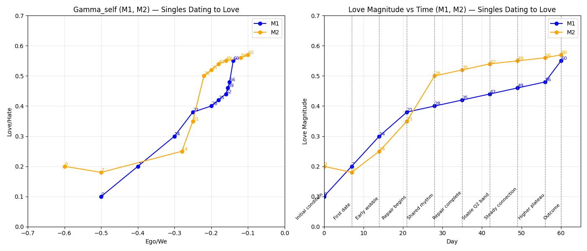

# Singles Dating to Love

This scenario documents the relational arc of **M1** and **M2** across 60 days, moving from initial conditions through wobble, repair, and stable plateau. It combines quantitative measures (gamma_self coordinates, love magnitude) with narrative events to create an inspectable framework.

---

## 📊 Scenario Overview
- **Duration:** 60 days (extended view to 65 for plotting clarity)
- **Entities:** M1 (ego‑heavy start, moderates over time), M2 (cautious start, warms steadily)
- **Metrics tracked:**
  - Gamma_self (Ego/We vs Love/Hate coordinates)
  - Love Magnitude vs Time
  - Event markers (Initial condition → Outcome)

---

## 📈 Plots

### Dual Plot

- **Left:** Gamma_self trajectories for M1 and M2 (Ego/We vs Love/Hate).  
- **Right:** Love Magnitude vs Time with vertical event markers.  
- **Events:** Initial condition, First date, Early wobble, Repair begins, Shared rhythm, Repair complete, Stable Q2 band, Steady connection, Higher plateau, Outcome.

---

## 📑 Data Tables

### Love Magnitude Table
**Input data:**  
- [M1 γ_self](/data/Single_Dating_2_Love_M1_gamma_self_table.csv)  
- [M2 γ_self](/data/Single_Dating_2_Love_M2_gamma_self_table.csv)

See [`love_magnitude_table.csv`](/results/Single_Dating_2_love_magnitude_table.csv) for raw values.

| Day | M1_Love | M2_Love | Event            |
|-----|---------|---------|------------------|
| 0   | 0.10    | 0.20    | Initial condition |
| 7   | 0.20    | 0.18    | First date        |
| 14  | 0.30    | 0.25    | Early wobble      |
| 21  | 0.38    | 0.35    | Repair begins     |
| 28  | 0.40    | 0.50    | Shared rhythm     |
| 35  | 0.42    | 0.52    | Repair complete   |
| 42  | 0.44    | 0.54    | Stable Q2 band    |
| 49  | 0.46    | 0.55    | Steady connection |
| 56  | 0.48    | 0.56    | Higher plateau    |
| 60  | 0.55    | 0.57    | Outcome           |

---

## 📝 Notes
- **Gamma_self:** Both M1 and M2 remain in the negative x domain (ego/“we”), rising steadily in y (love).  
- **Love Magnitude:** M1 shows ego moderation and repair; M2 shows cautious dip then trust growth.  
- **Convergence:** By Day 60, both stabilize near 0.55–0.57, reflecting relational coherence.  
- **Event markers:** Plotted once on the Love Magnitude chart to avoid duplication.

---

## 📂 Provenance
- **Plot file:** `Singles_Dating_to_Love.png`  
- **Tables:** `love_magnitude_table.csv`, `gamma_self_table.csv`  
- **Narrative notes:** `notes.md`  

This documentation ensures clarity, reproducibility, and interpretability for future stewards.

