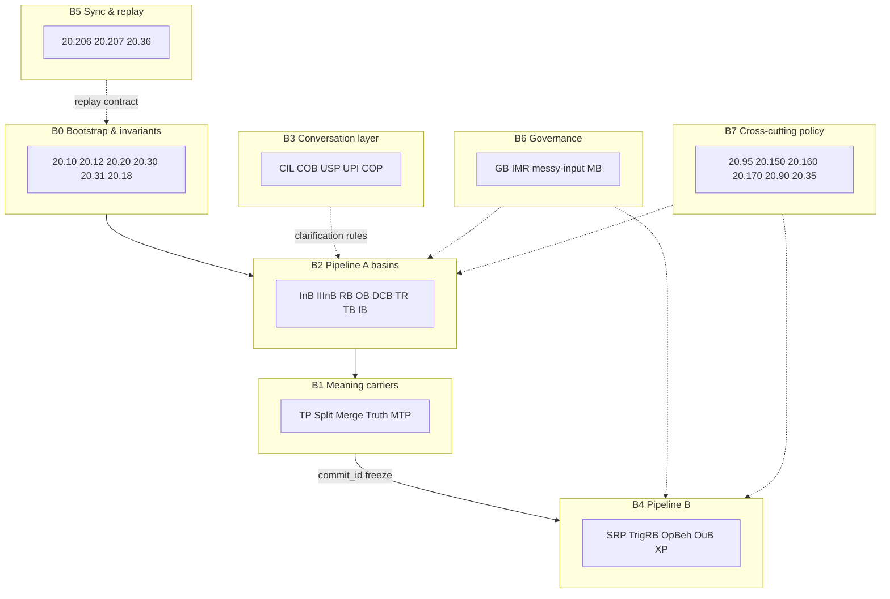
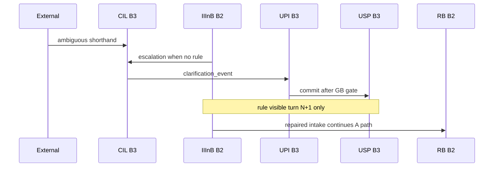
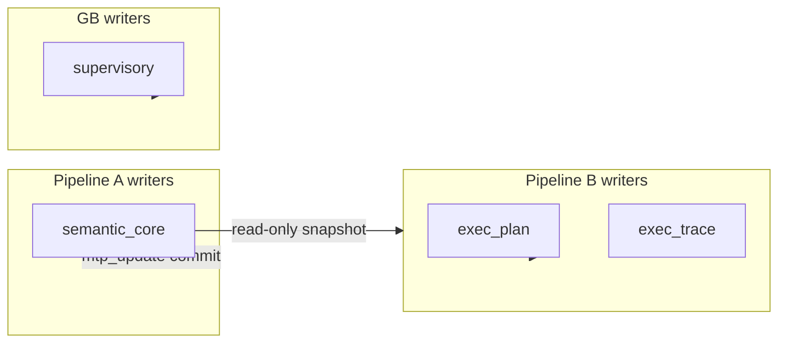

# 20.01 Architecture Map

**Document ID:** 20.01  
**Version:** 0.1  
**Date:** 2026-06-07  
**Status:** Draft v0.1 — runtime-pipeline partition (Option A)

## Purpose

Provides a **conceptual map** of the `20_requirements/` directory — grouping documents into higher-level blocks aligned with **runtime pipeline order**. This document is an **index and reading guide**; it does **not** override normative HLRs in individual 20.xx modules or bootstrap documents (20.10, 20.12, 20.20, 20.30).

**Use this document when:** onboarding to the 20-series, locating which module owns a primitive, or planning cross-doc edits without scanning every filename.

**Companion artifacts:**
- Term definitions and drift guards → [20.190_glossary.md](20.190_glossary.md) (Primitive Intent Catalog)
- Per-doc verification anchors → [20.200_traceability_matrix.md](20.200_traceability_matrix.md)
- Flat authoritative list → [README.md](README.md)

---

## How to read the 20-series

1. **Bootstrap** — [20.10](20.10_ts_architectural_principles.md), [20.12](20.12_ts_invariants.md), [20.20](20.20_ts_primitives.md), [20.30](20.30_ts_functional_model.md) establish the dual-pipeline mental model.
2. **Pick a block** below matching your question (intake, meaning, execution, governance, replay).
3. **Open the normative module** for that block — HLRs live there, not here.
4. **Check the catalog** — [20.190](20.190_glossary.md) for “what it is / is not.”
5. **Prototype alignment** — [20.38](20.38_ts_implementation_guidelines.md), [20.39](20.39_ts_core_data_structures.md), [20.36](20.36_canonical_end_to_end_trace.md) bridge to 40-series.

**Coordination programs** ([20.500](20.500_refactoring_for_dual_TS_pipeline.md), [20.510](20.510_refactoring_for_input_correction_track_h.md)) are **closed archives** — useful for program history, not runtime law.

---

## Block overview (Option A — runtime order)



| Block | Concept | One-line summary |
|-------|---------|------------------|
| **B0** | Bootstrap & invariants | What TS is; what must never break |
| **B1** | Meaning carriers | Lane-local TP → global MTP / `semantic_core` |
| **B2** | Pipeline A basins | Deterministic meaning construction chain |
| **B3** | Conversation layer | Multi-turn durable state (not per-cycle envelopes) |
| **B4** | Pipeline B | Singular realization per `commit_id` |
| **B5** | Sync & replay | A↔B handoff and falsifiable fixtures |
| **B6** | Governance | Supervisory bounds without meaning authority |
| **B7** | Cross-cutting policy | Numeric, TCU, safety, parameters, algorithms |
| **B8** | Implementation bridge | Guidance for 40-series prototypes |
| **Meta** | Index & programs | Glossary, matrix, closed coordination docs |

---

## B0 — Bootstrap & invariants

**Concept:** Architectural spine and semantic authority. These documents define dual-pipeline topology, envelope partition, and deterministic replay boundaries. Refactor programs treat them as **bootstrap-stable** (additive clarifications only).

| Document | Role |
|----------|------|
| [20.10](20.10_ts_architectural_principles.md) | Architectural principles; dual-pipeline rationale |
| [20.12](20.12_ts_invariants.md) | **Authoritative** invariants; write authority; replay equivalence |
| [20.20](20.20_ts_primitives.md) | Primitive semantics and namespace |
| [20.30](20.30_ts_functional_model.md) | End-to-end functional model; Pipeline A/B topology |
| [20.31](20.31_semantic_specification.md) | Canonical meaning fields and semantic contracts |
| [20.18](20.18_failure_modes_and_success_criteria.md) | Failure modes and success criteria |

**Key primitives:** four envelopes (`semantic_core`, `exec_plan`, `exec_trace`, `supervisory`); Pipeline A lane-parallel vs Pipeline B singular per cycle.

---

## B1 — Meaning carriers

**Concept:** Where meaning is **carried**, **merged**, **evaluated**, and **committed** before Pipeline B reads a frozen snapshot.

| Document | Role |
|----------|------|
| [20.105](20.105_tp_requirements.md) | TP identity, lifecycle, audit; intake-bound Track H fields |
| [20.130](20.130_splitting_and_merging_requirements.md) | Split / merge; `lineage_delta`; ΔH% accounting |
| [20.140](20.140_truth_evaluation_requirements.md) | Truth / done terminal evaluation |
| [20.115](20.115_mtp_requirements.md) | MTP aggregated state and lifecycle |
| [20.120](20.120_mtp_schema_requirements.md) | MTP schema; `commit_id`; snapshot refs |

**Commit boundary:** `mtp_update` freezes meaning → `commit_id` + `semantic_snapshot_ref` → Pipeline B handoff ([20.206](20.206_pipeline_a_b_synchronization_contract.md)).

---

## B2 — Pipeline A basins

**Concept:** Deterministic processing containers on the **meaning construction** hot path. Order below is normative for fixtures ([20.36](20.36_canonical_end_to_end_trace.md) §2.1).

```text
InB → [IIInB when profile_enabled] → RB → splitting → OB → DCB → TR → TB
  → ΔH% → merging → truth_done → mtp_update
```

| Document | Stage / primitive | Role |
|----------|-------------------|------|
| [20.100](20.100_inb_requirements.md) | InB | Surface intake; non-inferential canonicalization (**closed** scope) |
| [20.101](20.101_iiinb_requirements.md) | IIInB | Optional `input_semantic_repair`; USP rule apply; CIL escalation |
| [20.50](20.50_rb_requirements.md) | RB | Relational routing; fan-out |
| [20.40](20.40_ob_requirements.md) | OB | Lane-local evidence extraction |
| [20.106](20.106_dcb_requirements.md) | DCB | Geometric trajectory observation |
| [20.165](20.165_dcb_stability_requirements.md) | DCB stability | Geometric feedback stability |
| [20.37](20.37_thought_router_tr_specification.md) | TR | Thought Router derivation |
| [20.60](20.60_tb_requirements.md) | TB | Truth interpretation (pre–Truth/Done) |
| [20.90](20.90_ib_requirements.md) | IB | Ambiguity / inquiry pathways |

**Track H note:** IIInB sits in B2; durable USP/UPI state lives in B3. IIInB writes **intake-bound TP fields only** — not `semantic_core` or `TP.TR`.

---

## B3 — Conversation & object integration

**Concept:** **Conversation-scoped** and **durable** integration — distinct from per-cycle `semantic_core` and Pipeline B envelopes.

| Document | Role |
|----------|------|
| [20.33](20.33_cil_requirements.md) | CIL — clarification FIFO; `clarification_event` → UPI |
| [20.32](20.32_cob_requirements.md) | COB — object promotion; USP snapshot version pins |
| [20.102](20.102_usp_requirements.md) | USP — shorthand rule store (read-only to IIInB) |
| [20.103](20.103_upi_requirements.md) | UPI — sole USP writer after clarification + GB gate |
| [20.34](20.34_cop_requirements.md) | COP — deterministic async coprocessor |
| [20.180](20.180_conversational_relevance_requirements.md) | Multi-turn relevance |



---

## B4 — Pipeline B (Execution Manifold)

**Concept:** **One B pass per `commit_id`** — read-only `semantic_core`, epoch-scoped routing tables, expression and IMR audit in B envelopes only.

```text
trig_rb → srp_lookup → exec_plan_commit → oub_expression → imr_evaluation
```

| Document | Role |
|----------|------|
| [20.55](20.55_srp_requirements.md) | SRP cold/hot path; routing epoch tables |
| [20.56](20.56_routing_table_schema.md) | Epoch-coherent routing table schema |
| [20.57](20.57_trig_rb_semantic_trigger_requirements.md) | TrigRB semantic trigger detection |
| [20.41](20.41_opbeh_requirements.md) | OpBeh registry and planning |
| [20.42](20.42_obg_requirements.md) | OBG voice identity |
| [20.43](20.43_xlater_requirements.md) | XlateR expression mapping |
| [20.58](20.58_oub_execution_manifold_integration.md) | OuB B-integration |
| [20.110](20.110_oub_requirements.md) | OuB output realization |
| [20.205](20.205_execution_packet_xp_requirements.md) | XP — `exec_plan` + `exec_trace` per `commit_id` |

**Hard rule:** B envelopes SHALL NOT carry `lane_id` / `tp_id` ([20.36](20.36_canonical_end_to_end_trace.md) HLR-052–054).

---

## B5 — Synchronization & replay

**Concept:** Contracts that **prove** Blocks B0–B4 and B6 agree — handoff semantics, regeneration, golden fixtures.

| Document | Role |
|----------|------|
| [20.206](20.206_pipeline_a_b_synchronization_contract.md) | A↔B handoff; `semantic_core` freeze at `mtp_update` |
| [20.207](20.207_execution_replay_specification.md) | B regeneration / E2 equivalence |
| [20.36](20.36_canonical_end_to_end_trace.md) | Fixture shape; replay classes 1–7 (Class 7 = Track H) |

**Strip replay invariant:** Remove `exec_plan` + `exec_trace` → `semantic_core` equivalent to Pipeline A-only replay (HLR-20.012-011).

---

## B6 — Governance & supervisory

**Concept:** Caps, modes, messy-input preservation, and post-output correction — **bounded triggers**, not silent meaning rewrites.

| Document | Role |
|----------|------|
| [20.16](20.16_gb_responsibility_matrix.md) | GB responsibility and cap matrix |
| [20.80](20.80_gb_requirements.md) | GB policy, rates, UPI commit governance |
| [20.17](20.17_messy_input_handling.md) | Messy-input taxonomy (`MI_*`); preservation under overflow |
| [20.45](20.45_imr_requirements.md) | IMR Types A/B/C; `CorrectionTrigger` only into A |
| [20.70](20.70_mb_requirements.md) | MB diagnostics (read-only) |

---

## B7 — Cross-cutting policy

**Concept:** Policies and defaults that apply across pipelines and modules.

| Document | Role |
|----------|------|
| [20.95](20.95_ts_numeric_policy.md) | Q32.32; canonical serialization for replay diff |
| [20.150](20.150_tcu_budgeting_requirements.md) | TCU budgeting |
| [20.160](20.160_randomness_requirements.md) | Randomness / seed boundaries |
| [20.170](20.170_safety_requirements.md) | Safety constraints |
| [20.90](20.90_ts_parameter_table.md) | Parameter defaults (`profile_enabled`, caps) |
| [20.35](20.35_reference_algorithms.md) | Reference algorithms |

---

## B8 — Implementation bridge (guidance)

**Concept:** Non-normative alignment for 40-series playground work. Informs future 10-series; does **not** override [20.12](20.12_ts_invariants.md) or module HLRs.

| Document | Role |
|----------|------|
| [20.38](20.38_ts_implementation_guidelines.md) | Coding patterns, envelope guards, Track H intake path |
| [20.39](20.39_ts_core_data_structures.md) | Struct sketches; envelope partition; Track H wire minimums |

**Downstream owner:** [40.20 Master Program Guide](../40_thought_simulator_playground/40.20_master_program_guide.md) — see [20.510](20.510_refactoring_for_input_correction_track_h.md) §Scope boundary (informational).

---

## Meta — Index, terms & closed programs

| Document | Role |
|----------|------|
| [20.190](20.190_glossary.md) | Primitive Intent Catalog; canonical terms |
| [20.200](20.200_traceability_matrix.md) | 20 → 30 → 40 traceability rows |
| [README.md](README.md) | Authoritative flat file list |
| [20.500](20.500_refactoring_for_dual_TS_pipeline.md) | Dual-pipeline program archive (**complete**) |
| [20.510](20.510_refactoring_for_input_correction_track_h.md) | Track H program archive (**complete**; **after** 20.500) |

---

## Envelope partition (reference)



| Envelope | Primary writers | Strippable for A-only replay? |
|----------|-----------------|-------------------------------|
| `semantic_core` | Pipeline A | No — baseline |
| `exec_plan` | Pipeline B planning | Yes |
| `exec_trace` | Pipeline B expression / IMR | Yes |
| `supervisory` | GB / bounded triggers | Partial — policy audit retained |

Conversation-layer state (USP, UPI, CIL queues) is **outside** these four runtime envelopes ([20.39](20.39_ts_core_data_structures.md) §3.1).

---

## Suggested read paths

| Audience | Path |
|----------|------|
| **New contributor** | B0 bootstrap → [20.190](20.190_glossary.md) Tier 1 → B2 flow diagram → B5 [20.36](20.36_canonical_end_to_end_trace.md) Class 1 |
| **Intake / Track H** | B2 [20.100](20.100_inb_requirements.md) → [20.101](20.101_iiinb_requirements.md) → B3 [20.102](20.102_usp_requirements.md)–[20.103](20.103_upi_requirements.md) → B5 Class 7 |
| **Execution / B** | B0 [20.12](20.12_ts_invariants.md) → B4 stack → B5 [20.206](20.206_pipeline_a_b_synchronization_contract.md) / [20.207](20.207_execution_replay_specification.md) |
| **Governance** | B6 cluster → B5 Class 3–5 fixtures |
| **40-series coder** | B8 → B5 fixtures → [40.20](../40_thought_simulator_playground/40.20_master_program_guide.md) |

---

## Mapping to [20.190](20.190_glossary.md) catalog tiers

| 20.190 tier | Primary blocks |
|-------------|----------------|
| Tier 1 — authority primitives | B0, B1, B2, B3, B4, B6 |
| Tier 2 — basin boundaries | B2, B4, B6 |
| Tier 3 — wires & taxonomies | B1, B3, B5, B7 |

---

## Rules

1. **HLR-20.001-001:** This map SHALL remain descriptive; it SHALL NOT introduce normative runtime HLRs that belong in module documents.
2. **HLR-20.001-002:** When documents are added, removed, or repartitioned, this map and [20.200](20.200_traceability_matrix.md) SHALL be updated in the same change set.
3. **HLR-20.001-003:** Each 20.xx document SHALL appear under **one primary block** in this map; secondary block references MAY be noted in module cross-refs only.

---

## Changelog

| Version | Date | Author | Summary |
|---------|------|--------|---------|
| 0.1 | 2026-06-07 | Grok | Initial architecture map — Option A runtime pipeline blocks; mermaid overview + conversation sequence + envelope diagram |

## Traceability

- [README.md](README.md)
- [20.190_glossary.md](20.190_glossary.md)
- [20.200_traceability_matrix.md](20.200_traceability_matrix.md)
- [20.12_ts_invariants.md](20.12_ts_invariants.md)
- [20.30_ts_functional_model.md](20.30_ts_functional_model.md)