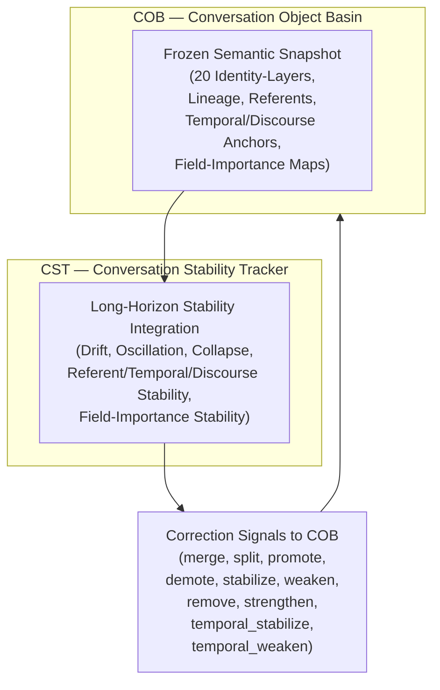

# **20.32.010 — CST Requirements (Conversation Stability Tracker)**

## **1. Overview**
CST is the long‑horizon stability integrator for COB’s 20 conversation‑objects. CST operates on read‑only COB snapshots and produces correction signals that modulate COB’s identity‑layer structure. CST does not modify COB directly and does not participate in Path‑A timing.

---

## **1.1 CST Architectural Placement (Mermaid Diagram)**

---

## **1.2 CST Architectural Description**

CST occupies a parallel position adjacent to COB and operates exclusively on the frozen semantic snapshot produced by COB after each update cycle. The snapshot contains the full long‑horizon conversational state, including identity‑layers, lineage, referent maps, temporal anchors, discourse anchors, and field‑importance structures. CST does not access TP, SSR(t), SSGn, or any semantic content produced by CE or TS.

CST performs long‑horizon stability integration over multiple turns, detecting drift, oscillation, collapse, and stability patterns across the 20 identity‑layers. CST produces correction signals that modulate COB’s internal structure. These signals are delivered through a dedicated CST→COB correction port. COB remains the authoritative owner of all conversation‑objects and applies CST’s correction signals during its next update cycle.

CST does not interact with CIL, CEx, CE, TS, TP, or IE. CST operates outside the Path‑A timing window and does not participate in real‑time meaning construction. Its role is strictly long‑term modulation of COB’s structural stability.

---

## **2. Inputs**
- Read‑only snapshot of all 20 identity‑layers.  
- Read‑only lineage snapshot.  
- Read‑only referent‑map snapshot.  
- Read‑only temporal‑anchor snapshot.  
- Read‑only discourse‑anchor snapshot.  
- Read‑only field‑importance snapshot.  
- COB update‑cycle metadata.

---

## **3. Outputs**
- Correction signals: merge, split, promote, demote, stabilize, weaken, remove, strengthen, temporal_stabilize, temporal_weaken.

---

## **4. High‑Level Requirements (HLRs)**

### **4.1 Drift Integration**
**HLR‑20.32.010‑001:** CST SHALL integrate referent drift over a minimum window of \( \ge 10 \) turns.  
**HLR‑20.32.010‑002:** CST SHALL integrate temporal‑anchor drift over a minimum window of \( \ge 10 \) turns.  
**HLR‑20.32.010‑003:** CST SHALL integrate discourse‑anchor drift over a minimum window of \( \ge 10 \) turns.  
**HLR‑20.32.010‑004:** CST SHALL integrate field‑importance drift over a minimum window of \( \ge 10 \) turns.  
**HLR‑20.32.010‑005:** CST SHALL integrate identity‑layer coherence drift over a minimum window of \( \ge 10 \) turns.

### **4.2 Oscillation Detection**
**HLR‑20.32.010‑006:** CST SHALL detect referent oscillation patterns across the integration window.  
**HLR‑20.32.010‑007:** CST SHALL detect temporal‑anchor oscillation patterns across the integration window.  
**HLR‑20.32.010‑008:** CST SHALL detect discourse‑anchor oscillation patterns across the integration window.  
**HLR‑20.32.010‑009:** CST SHALL detect identity‑layer oscillation patterns across the integration window.

### **4.3 Collapse Detection**
**HLR‑20.32.010‑010:** CST SHALL detect identity‑layer collapse defined as long‑term loss of structural coherence.  
**HLR‑20.32.010‑011:** CST SHALL detect referent collapse defined as long‑term disappearance of stable referent mapping.  
**HLR‑20.32.010‑012:** CST SHALL detect temporal‑anchor collapse defined as long‑term disappearance of stable temporal mapping.  
**HLR‑20.32.010‑013:** CST SHALL detect discourse‑anchor collapse defined as long‑term disappearance of stable discourse mapping.  
**HLR‑20.32.010‑014:** CST SHALL detect field‑importance collapse defined as long‑term disappearance of stable field‑importance ordering.

### **4.4 Merge/Split Determination**
**HLR‑20.32.010‑015:** CST SHALL issue a merge signal when two identity‑layers exhibit long‑term convergence across the integration window.  
**HLR‑20.32.010‑016:** CST SHALL issue a split signal when one identity‑layer exhibits long‑term multimodal divergence across the integration window.

### **4.5 Referent Stability Integration**
**HLR‑20.32.010‑017:** CST SHALL compute referent stability using a long‑horizon stability function \( S_r(t) \).  
**HLR‑20.32.010‑018:** CST SHALL issue stabilize_referent signals when \( S_r(t) \) exceeds a stability threshold.  
**HLR‑20.32.010‑019:** CST SHALL issue weaken_referent signals when \( S_r(t) \) falls below a stability threshold.

### **4.6 Temporal/Discourse Stability Integration**
**HLR‑20.32.010‑020:** CST SHALL compute temporal stability using a long‑horizon function \( S_t(t) \).  
**HLR‑20.32.010‑021:** CST SHALL compute discourse stability using a long‑horizon function \( S_d(t) \).  
**HLR‑20.32.010‑022:** CST SHALL issue temporal_stabilize signals when \( S_t(t) \) exceeds a stability threshold.  
**HLR‑20.32.010‑023:** CST SHALL issue temporal_weaken signals when \( S_t(t) \) falls below a stability threshold.  
**HLR‑20.32.010‑024:** CST SHALL issue discourse_stabilize signals when \( S_d(t) \) exceeds a stability threshold.  
**HLR‑20.32.010‑025:** CST SHALL issue discourse_weaken signals when \( S_d(t) \) falls below a stability threshold.

### **4.7 Field‑Importance Integration**
**HLR‑20.32.010‑026:** CST SHALL compute field‑importance stability using a long‑horizon function \( S_f(t) \).  
**HLR‑20.32.010‑027:** CST SHALL issue promote_field signals when \( S_f(t) \) indicates long‑term importance.  
**HLR‑20.32.010‑028:** CST SHALL issue demote_field signals when \( S_f(t) \) indicates long‑term irrelevance.

### **4.8 Correction‑Signal Protocol**
**HLR‑20.32.010‑029:** CST SHALL send correction signals only through the CST→COB correction port.  
**HLR‑20.32.010‑030:** CST SHALL not modify COB state directly.  
**HLR‑20.32.010‑031:** CST SHALL not produce TP, SSR(t), SSGn, or semantic content.  
**HLR‑20.32.010‑032:** CST SHALL not interact with CIL, CEx, CE, TS, TP, or IE.

### **4.9 Timing**
**HLR‑20.32.010‑033:** CST SHALL operate outside the Path‑A 40–100 ms window.  
**HLR‑20.32.010‑034:** CST SHALL complete its cycle before COB’s next update cycle.  
**HLR‑20.32.010‑035:** CST SHALL not block COB, CIL, CEx, CE, TS, TP, or IE.

### **4.10 Determinism**
**HLR‑20.32.010‑036:** CST SHALL produce identical correction signals for identical COB snapshots.  
**HLR‑20.32.010‑037:** CST SHALL not use randomness.  
**HLR‑20.32.010‑038:** CST SHALL not use semantic interpretation.

### **4.11 Safety**
**HLR‑20.32.010‑039:** CST SHALL never create or destroy conversation‑objects.  
**HLR‑20.32.010‑040:** CST SHALL never override COB’s authoritative decisions.  
**HLR‑20.32.010‑041:** CST SHALL never modify identity‑layers directly.

---

## **5. Normative Home**
20.32.010.

---
