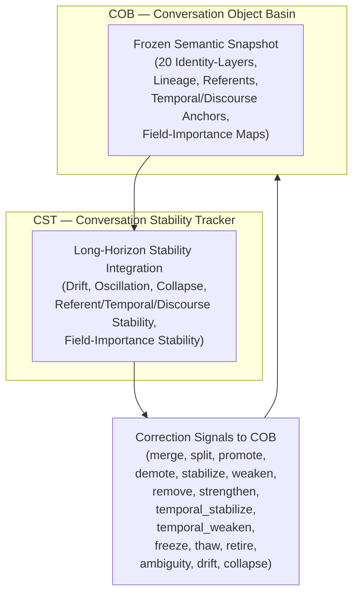

# **20.32.010 — CST Requirements (Conversation Stability Tracker)**

**Document ID:** 20.32.010_cst_requirements  
**Version:** 0.3  
**Date:** 2026-07-16  
**Status:** Draft — Requirements (CST)  

---

## **1. Overview (Corrected Purpose)**

CST is the long-horizon stability integrator for COB’s 20 conversation-objects. CST reads OuBA TP output and the frozen identity-layer snapshot produced by COB each turn.

CST is the guardian of long-horizon identity stability. It detects drift, oscillation, collapse, ambiguity, register instability, and continuity failures across multiple turns.

CST modifies COB’s identity-layer structure **exclusively through deterministic correction signals**.  
These signals include merge, split, retire, weaken, strengthen, freeze, thaw, collapse, ambiguity, drift, and register-adjustment operations. CST computes long‑horizon stability metrics and issues these signals when structural correction is required.

COB applies all CST signals **during its next update cycle**, ensuring that structural changes occur only at deterministic, replay‑safe boundaries.  
This makes CST the **sole module authorized to change COB’s identity-layer structure**, while preserving COB’s lifecycle invariants and architectural safety.

---

## **1.1 CST Architectural Placement (Mermaid Diagram)**

---

## **1.2 CST Architectural Description (Corrected)**

CST occupies a parallel position adjacent to COB and operates on two inputs:  
(1) the fresh-meaning TP output produced by OuBA each turn, and  
(2) the frozen identity-layer snapshot produced by COB after each update cycle.

OuBA provides the short-term semantic structures (referent clusters, register cues, field-importance cues, temporal and discourse anchors) that CST uses to detect fresh drift and ambiguity.  
COB provides the long-horizon identity-layer structures (lineage, referent maps, temporal anchors, discourse anchors, field-importance structures, decay state, strength, importance) that CST uses to detect long-term drift, oscillation, collapse, and continuity failures.

CST modifies COB’s identity-layer structure **exclusively through deterministic correction signals** delivered over the CST→COB correction port. These signals include merge, split, retire, weaken, strengthen, freeze, thaw, collapse, ambiguity, drift, and register-adjustment operations.

COB applies all CST signals **during its next update cycle**, ensuring that structural changes occur only at deterministic, replay‑safe boundaries. This makes CST the **sole module responsible for long‑horizon stability management and identity-layer structural modification**, while preserving COB’s lifecycle invariants and architectural safety.

CST does not access TP, SSR(t), SSRGn, or any semantic content produced by CE or TS.  
CST does not interact with CIL, CEx, CE, TS, TP, or IE.  
CST’s stability signals are reflected in the COB snapshot, which CIL reads and serializes into TP.process.stability_metrics and TP.metadata.stability_audit for replay visibility.

---

### **1.3 Clarification — Structural Drift Only (New)**

All references to “drift,” “stability,” “collapse,” “oscillation,” and “continuity” in this document refer **exclusively** to *structural continuity inside COB’s identity‑layer fields* (referent maps, temporal anchors, discourse anchors, field‑importance structures, lineage, decay state, strength, importance).

These terms do **not** refer to AI/ML concepts such as semantic drift, embedding drift, model drift, distributional drift, or policy instability.

CST SHALL operate strictly on structural fields and SHALL NOT perform any semantic stabilization or semantic interpretation.  
This boundary is normative and applies to all HLRs in 20.32.010.

---

## **2. Inputs**

- Read-only snapshot of all 20 identity-layers.  
- Read-only lineage snapshot.  
- Read-only referent-map snapshot.  
- Read-only temporal-anchor snapshot.  
- Read-only discourse-anchor snapshot.  
- Read-only field-importance snapshot.  
- COB update-cycle metadata.
- Previous CST signals and metric history (for deterministic threshold calibration).

---

## **3. Outputs**

- Correction signals: merge, split, promote, demote, stabilize, weaken, remove, strengthen, temporal_stabilize, temporal_weaken, freeze, thaw, retire, ambiguity, drift, identity_collapse, referent_collapse, lineage_collapse, continuity_collapse.

---

## **4. High-Level Requirements (HLRs)**

### **4.1 Drift Integration**

**HLR-20.32.010-001:** CST SHALL integrate referent drift over a minimum window of $\ge 10$ turns.  
**HLR-20.32.010-002:** CST SHALL integrate temporal-anchor drift over a minimum window of $\ge 10$ turns.  
**HLR-20.32.010-003:** CST SHALL integrate discourse-anchor drift over a minimum window of $\ge 10$ turns.  
**HLR-20.32.010-004:** CST SHALL integrate field-importance drift over a minimum window of $\ge 10$ turns.  
**HLR-20.32.010-005:** CST SHALL integrate identity-layer coherence drift over a minimum window of $\ge 10$ turns.

### **4.2 Oscillation Detection**

**HLR-20.32.010-006:** CST SHALL detect referent oscillation patterns across the integration window.  
**HLR-20.32.010-007:** CST SHALL detect temporal-anchor oscillation patterns across the integration window.  
**HLR-20.32.010-008:** CST SHALL detect discourse-anchor oscillation patterns across the integration window.  
**HLR-20.32.010-009:** CST SHALL detect identity-layer oscillation patterns across the integration window.

### **4.3 Collapse Detection**

**HLR-20.32.010-010:** CST SHALL detect identity-layer collapse defined as long-term loss of structural coherence.  
**HLR-20.32.010-011:** CST SHALL detect referent collapse defined as long-term disappearance of stable referent mapping.  
**HLR-20.32.010-012:** CST SHALL detect temporal-anchor collapse defined as long-term disappearance of stable temporal mapping.  
**HLR-20.32.010-013:** CST SHALL detect discourse-anchor collapse defined as long-term disappearance of stable discourse mapping.  
**HLR-20.32.010-014:** CST SHALL detect field-importance collapse defined as long-term disappearance of stable field-importance ordering.

### **4.4 Merge/Split Determination**

**HLR-20.32.010-015:** CST SHALL issue a merge signal when two identity-layers exhibit long-term convergence across the integration window.  
**HLR-20.32.010-016:** CST SHALL issue a split signal when one identity-layer exhibits long-term multimodal divergence across the integration window.

### **4.5 Referent Stability Integration**

**HLR-20.32.010-017:** CST SHALL compute referent stability using a long-horizon stability function $S_r(t)$.  
**HLR-20.32.010-018:** CST SHALL issue stabilize_referent signals when $S_r(t)$ exceeds a stability threshold.  
**HLR-20.32.010-019:** CST SHALL issue weaken_referent signals when $S_r(t)$ falls below a stability threshold.

### **4.6 Temporal/Discourse Stability Integration**

**HLR-20.32.010-020:** CST SHALL compute temporal stability using a long-horizon function $S_t(t)$.  
**HLR-20.32.010-021:** CST SHALL compute discourse stability using a long-horizon function $S_d(t)$.  
**HLR-20.32.010-022:** CST SHALL issue temporal_stabilize signals when $S_t(t)$ exceeds a stability threshold.  
**HLR-20.32.010-023:** CST SHALL issue temporal_weaken signals when $S_t(t)$ falls below a stability threshold.  
**HLR-20.32.010-024:** CST SHALL issue discourse_stabilize signals when $S_d(t)$ exceeds a stability threshold.  
**HLR-20.32.010-025:** CST SHALL issue discourse_weaken signals when $S_d(t)$ falls below a stability threshold.

### **4.7 Field-Importance Integration**

**HLR-20.32.010-026:** CST SHALL compute field-importance stability using a long-horizon function $S_f(t)$.  
**HLR-20.32.010-027:** CST SHALL issue promote_field signals when $S_f(t)$ indicates long-term importance.  
**HLR-20.32.010-028:** CST SHALL issue demote_field signals when $S_f(t)$ indicates long-term irrelevance.

### **4.8 Correction-Signal Protocol**

**HLR-20.32.010-029:** CST SHALL send correction signals only through the CST→COB correction port.  
**HLR-20.32.010-030:** NA 
**HLR-20.32.010-031:** CST SHALL not produce TP or semantic content.  
**HLR-20.32.010-032:** CST SHALL not interact with CEx, CE, TS, TP, or IE.
**HLR-20.32.010-093:** CST SHALL deposit stability information to the CIL for TP historical stabilty replay.

### **4.9 Timing**

**HLR-20.32.010-033:** CST SHALL operate outside the Path-A 40–100 ms window.  
**HLR-20.32.010-034:** CST SHALL complete its cycle before COB’s next update cycle.  
**HLR-20.32.010-035:** CST SHALL not block COB, CIL, CEx, CE, TS, TP, or IE.

### **4.10 Determinism**

**HLR-20.32.010-036:** CST SHALL produce identical correction signals for identical COB snapshots.  
**HLR-20.32.010-037:** CST SHALL not use randomness.  
**HLR-20.32.010-038:** CST SHALL not use semantic interpretation.

### **4.11 Safety**

**HLR-20.32.010-039:** CST SHALL never create or destroy conversation-objects.  
**HLR-20.32.010-040:** CST SHALL never override COB’s authoritative decisions.  
**HLR-20.32.010-041:** CST SHALL never modify identity-layers directly.

### **4.12 Stability Metrics (New)**

**HLR-20.32.010-064:** CST SHALL compute the following deterministic metrics each cycle: identity_drift, referent_drift, lineage_drift, referent_ambiguity, attribute_ambiguity, structural_ambiguity, identity_ambiguity, lineage_continuity, identity_continuity, identity_collapse_score, referent_collapse_score, lineage_collapse_score, continuity_collapse_score, strength_stability, importance_stability, and decay_progress.  

**HLR-20.32.010-065:** All stability metrics SHALL be pure functions of the read-only COB snapshot, previous CST signals, and deterministic metric history.  

**HLR-20.32.010-066:** CST SHALL never use stochastic sampling, external state, wall-clock time, or nondeterministic ordering in metric computation.

### **4.13 Thresholds and Calibration (New)**

**HLR-20.32.010-067:** CST SHALL maintain deterministic thresholds for drift, ambiguity, continuity, collapse, retirement, freeze, thaw, and relevance stability.  

**HLR-20.32.010-068:** Thresholds SHALL be monotonic, bounded, replay-safe, and independent of external state or timing.  

**HLR-20.32.010-069:** Threshold calibration SHALL be a pure deterministic function of previous threshold values and metric history.  

**HLR-20.32.010-070:** CST SHALL never allow thresholds to oscillate or cascade nondeterministically.

### **4.14 Full Signal Set and Ordering (New)**

**HLR-20.32.010-071:** CST SHALL emit the complete set of correction signals: split, merge, retire, weaken, strengthen, freeze, thaw, ambiguity, drift, identity_collapse, referent_collapse, lineage_collapse, and continuity_collapse.  

**HLR-20.32.010-072:** CST SHALL emit signals in the following deterministic order:  
1. collapse signals  
2. freeze / thaw signals  
3. structural signals (split / merge / retire)  
4. ambiguity / drift signals  
5. relevance signals (weaken / strengthen)  

**HLR-20.32.010-073:** All signals SHALL be logged with full justification and metric values for deterministic replay.

### **4.15 Freeze / Thaw and Collapse Recovery (New)**

**HLR-20.32.010-074:** CST SHALL issue freeze_signal when collapse_score exceeds freeze_threshold, ambiguity exceeds critical threshold, or lineage continuity is at risk.  

**HLR-20.32.010-075:** While COB is frozen, CST SHALL continue to compute metrics but SHALL queue structural signals until thaw.  

**HLR-20.32.010-076:** CST SHALL issue thaw_signal only after collapse is resolved and continuity is restored.  

**HLR-20.32.010-077:** Upon detecting collapse, CST SHALL instruct COB to enter recovery mode (freeze → identify collapse type → apply deterministic recovery → thaw).  

**HLR-20.32.010-078:** Collapse recovery SHALL never use stochastic heuristics or directly modify COB structures.

### **4.16 Deterministic Replay Guarantees (New)**

**HLR-20.32.010-079:** CST SHALL guarantee that identical sequences of COB snapshots produce identical metrics, thresholds, signals, and signal ordering.  

**HLR-20.32.010-080:** CST SHALL log all metric values, threshold evaluations, signals, freeze/thaw events, and collapse recovery steps in a complete, ordered, replay-safe form.  

**HLR-20.32.010-081:** Replay of CST logs SHALL reconstruct identical signals and produce identical COB state when applied by COB.

### **4.17 Safety and Interaction Constraints (New)**

**HLR-20.32.010-082:** CST SHALL never modify referent maps, lineage, timestamps, decay_state, or ordering directly.  

**HLR-20.32.010-083:** CST SHALL never create or delete referents or layers except via the retire_signal.  

**HLR-20.32.010-084:** CST SHALL limit correction frequency and magnitude to prevent oscillation (split → merge → split) and cascading corrections.  

**HLR-20.32.010-085:** CST SHALL never override COB lineage continuity, referent identity, or deterministic ordering.

**HLR-20.32.010-086:** CST SHALL integrate register drift over a minimum window of ≥ 10 turns.

**HLR-20.32.010-087:** CST SHALL detect register oscillation patterns across the integration window.

**HLR-20.32.010-088:** CST SHALL compute register stability using a long-horizon function.

**HLR-20.32.010-089:** CST SHALL issue strengthen_register and weaken_register signals based on the stability computation to support continuity.

**HLR-20.32.010-090:** CST SHALL detect register collapse defined as long-term disappearance of stable register mapping within the identity-layer structures.

**HLR-20.32.010-091:** CST SHALL extend the stability metric set to incorporate register-specific measures (register_drift, register_ambiguity, register_continuity, register_collapse_score) alongside the existing identity, referent, and lineage metrics.

**HLR-20.32.010-092:** CST SHALL include strengthen_register and weaken_register within the full enumerated correction signal set and respect the established deterministic signal ordering.

---

## **5.0 Split/Merge Structural Events (Informative)**  
This section provides an informative description of how CST interprets identity‑layer split and merge operations performed by COB, what structural information is provided, why it is required for stability computation, and which TP fields carry the information necessary for CST operation and historical replay.

---

### **5.1 Overview**  
COB MAY perform **structural identity‑layer transformations** during a turn, specifically:

- **MERGE** — two or more identity‑layer objects consolidate into a single object.  
- **SPLIT** — one identity‑layer object diverges into multiple child objects.

These operations are *structural*, not semantic. They alter the identity‑layer topology and therefore affect CST’s computation of:

- identity_drift  
- referent_drift  
- lineage_drift  
- collapse_score  
- oscillation_score  
- ambiguity_score  
- certainty_score  
- ordering_stability  

To prevent CST from misclassifying legitimate structural changes as instability, COB SHALL provide explicit structural continuity information through TP lineage markers and updated identity‑layer snapshots.

---

### **5.2 Information Provided to CST**  
After a split or merge, COB SHALL provide CST with:

#### **5.2.1 Updated Identity‑Layer Snapshot**  
CST receives the frozen identity‑layer snapshot for the turn, including:

- referent_map  
- anchors  
- lineage  
- ambiguity  
- stability_metrics  
- ordering_metrics  

These values reflect the post‑merge or post‑split state and are used for drift, collapse, oscillation, and ambiguity computations.

#### **5.2.2 Structural Event Markers (Lineage Log)**  
COB SHALL append lineage continuity markers to **TP.lineage_log[]**, the normative TP field for structural identity‑layer events.  
Each entry SHALL include:

- **event_type** = MERGE | SPLIT  
- **parent_ref** — IDs of source objects  
- **child_refs** — IDs of resulting objects  
- **referent_map_before**  
- **referent_map_after**  
- **ordering_before**  
- **ordering_after**  
- **lineage_seq** — monotonically increasing sequence number for deterministic replay

These markers allow CST to distinguish structural transformations from instability.

#### **5.2.3 Before/After Channel Continuity**  
COB SHALL provide sufficient before/after information in lineage_log entries for CST to compute:

- referent continuity  
- ordering continuity  
- lineage continuity  
- ambiguity continuity  
- stability continuity  

This prevents CST from interpreting merge as collapse or split as oscillation.

#### **5.2.4 Replay‑Safe Provenance**  
All lineage_log entries SHALL be deterministic and replay‑safe.  
CST SHALL use lineage_seq and structural markers to guarantee identical stability signals for identical COB snapshots during historical replay.

---

### **5.3 Why CST Needs This Information**  
CST operates strictly on **structural identity‑layer fields**.  
Without explicit split/merge markers:

- MERGE may appear as disappearance → false **collapse**  
- SPLIT may appear as duplication → false **oscillation**  
- referent‑map changes may appear as **ambiguity spikes**  
- ordering changes may appear as **drift**  
- lineage changes may appear as **lineage collapse**

Therefore, CST MUST receive structural continuity information to:

- suppress false collapse/oscillation signals  
- adjust ambiguity/certainty appropriately  
- maintain lineage continuity  
- compute drift relative to the correct parent object  
- maintain deterministic replay guarantees  

---

### **5.4 CST Interpretation Rules (Informative)**  
When CST encounters lineage_log entries:

#### **MERGE**  
CST SHALL interpret:

- disappearance of parent objects as legitimate consolidation  
- ordering changes as structural, not drift  
- referent‑map union as structural, not ambiguity spike  
- lineage continuity preserved through MERGE marker  

#### **SPLIT**  
CST SHALL interpret:

- appearance of child objects as legitimate divergence  
- ordering duplication as structural, not oscillation  
- referent‑map partition as structural, not drift  
- lineage continuity preserved through SPLIT marker  

---

### **5.5 TP Fields Used by CST**  
CST SHALL read the following TP fields after a split or merge:

- **TP.lineage_log[]** — structural event markers  
- **TP.cob_state_snapshot** — updated identity‑layer snapshot  
- **TP.metadata.turn_index** — replay alignment  
- **TP.metadata.object_count** — structural topology  
- **TP.ordering_summary** — ordering continuity  
- **TP.stability_summary** — drift/collapse/oscillation continuity  
- **TP.ambiguity_summary** — ambiguity continuity  

No additional TP fields SHALL be used for structural event interpretation.

---

### **5.6 Historical Replay**  
During replay, CST SHALL:

- reconstruct lineage continuity from TP.lineage_log[]  
- compare identity‑layer snapshots deterministically  
- produce identical stability signals for identical snapshots  
- treat MERGE/SPLIT markers as structural invariants  

This guarantees deterministic replay across all structural transformations.

---
