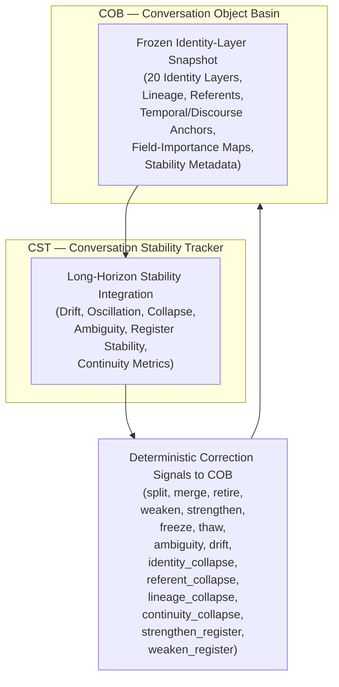

### 20.32.010 — CST Requirements (Conversation Stability Tracker)

**Document ID:** 20.32.010_cst_requirements  
**Version:** 0.4  
**Date:** 2026‑07‑20  
**Status:** Draft — Requirements (CST)  

---

### 1. Overview

CST is the long‑horizon stability integrator for COB’s 20 identity layers. CST reads OuBA TP output and the frozen identity‑layer snapshot produced by COB each turn.

CST is the guardian of long‑horizon identity stability. It detects drift, oscillation, collapse, ambiguity, register instability, and continuity failures across multiple turns.

CST modifies COB’s identity‑layer structure **exclusively through deterministic correction signals**.  
These signals include: **split, merge, retire, weaken, strengthen, freeze, thaw, ambiguity, drift, identity_collapse, referent_collapse, lineage_collapse, continuity_collapse, strengthen_register, weaken_register**.

COB applies all CST signals **during its next update cycle**, ensuring that structural changes occur only at deterministic, replay‑safe boundaries. CST is the sole module that decides when structural correction is required; COB is the sole module that executes those corrections while preserving lifecycle invariants and architectural safety.

---

### 1.1 CST architectural placement

---

### 1.2 CST architectural description

CST occupies a parallel position adjacent to COB and operates on two inputs:  
1. Fresh‑meaning TP output produced by OuBA each turn.  
2. The frozen identity‑layer snapshot produced by COB after each update cycle.

OuBA provides short‑term semantic structures (referent clusters, register cues, field‑importance cues, temporal and discourse anchors) that CST uses to detect fresh drift and ambiguity.  
COB provides long‑horizon identity‑layer structures (lineage, referent maps, temporal anchors, discourse anchors, field‑importance structures, decay state, strength, importance, register, ordering metrics) that CST uses to detect long‑term drift, oscillation, collapse, and continuity failures.

CST modifies COB’s identity‑layer structure **exclusively through deterministic correction signals** delivered over the CST→COB correction port. These signals are limited to operations that COB implements: split, merge, retire, weaken, strengthen, freeze, thaw, ambiguity, drift, identity_collapse, referent_collapse, lineage_collapse, continuity_collapse, strengthen_register, weaken_register.

COB applies all CST signals **during its next update cycle**, ensuring that structural changes occur only at deterministic, replay‑safe boundaries. CST is responsible for long‑horizon stability management and for deciding when structural modification is required; COB is responsible for executing those modifications.

CST does not access semantic_core, Path‑B, SSR(t), SSRGn, or any semantic content produced by CE or TS.  
CST does not interact directly with CIL, CEx, CE, TS, TP, or IE.  
CST’s stability metrics and signals are reflected in COB’s snapshot, which CIL can serialize into TP‑level stability metadata for historical replay.

---

### 1.3 Clarification — structural drift only

All references to “drift,” “stability,” “collapse,” “oscillation,” and “continuity” in this document refer **exclusively** to *structural continuity inside COB’s identity‑layer fields* (referent maps, temporal anchors, discourse anchors, field‑importance structures, lineage, decay state, strength, importance, register, ordering).

These terms do **not** refer to AI/ML concepts such as semantic drift, embedding drift, model drift, distributional drift, or policy instability.

**HLR‑20.32.010‑094**  
CST SHALL operate strictly on structural fields and SHALL NOT perform any semantic stabilization or semantic interpretation.

---

### 2. Inputs

- Read‑only snapshot of all 20 identity layers.  
- Read‑only lineage snapshot.  
- Read‑only referent‑map snapshot.  
- Read‑only temporal‑anchor snapshot.  
- Read‑only discourse‑anchor snapshot.  
- Read‑only field‑importance snapshot.  
- Read‑only register and ordering metadata.  
- COB update‑cycle metadata.  
- Previous CST signals and metric history (for deterministic threshold calibration).

---

### 3. Outputs

- Deterministic correction signals to COB:  
  **split, merge, retire, weaken, strengthen, freeze, thaw, ambiguity, drift, identity_collapse, referent_collapse, lineage_collapse, continuity_collapse, strengthen_register, weaken_register**.  
- Stability metrics and thresholds suitable for serialization by CIL into TP‑level stability metadata (e.g., TP.process.stability_metrics, TP.metadata.stability_audit).

---

### 4. High‑level requirements (HLRs)

#### 4.1 Drift integration

**HLR‑20.32.010‑001**  
CST SHALL integrate referent drift over a minimum window of $\ge 10$ turns.

**HLR‑20.32.010‑002**  
CST SHALL integrate temporal‑anchor drift over a minimum window of $\ge 10$ turns.

**HLR‑20.32.010‑003**  
CST SHALL integrate discourse‑anchor drift over a minimum window of $\ge 10$ turns.

**HLR‑20.32.010‑004**  
CST SHALL integrate field‑importance drift over a minimum window of $\ge 10$ turns.

**HLR‑20.32.010‑005**  
CST SHALL integrate identity‑layer coherence drift over a minimum window of $\ge 10$ turns.

---

#### 4.2 Oscillation detection

**HLR‑20.32.010‑006**  
CST SHALL detect referent oscillation patterns across the integration window.

**HLR‑20.32.010‑007**  
CST SHALL detect temporal‑anchor oscillation patterns across the integration window.

**HLR‑20.32.010‑008**  
CST SHALL detect discourse‑anchor oscillation patterns across the integration window.

**HLR‑20.32.010‑009**  
CST SHALL detect identity‑layer oscillation patterns across the integration window.

---

#### 4.3 Collapse detection

**HLR‑20.32.010‑010**  
CST SHALL detect identity‑layer collapse defined as long‑term loss of structural coherence.

**HLR‑20.32.010‑011**  
CST SHALL detect referent collapse defined as long‑term disappearance of stable referent mapping.

**HLR‑20.32.010‑012**  
CST SHALL detect temporal‑anchor collapse defined as long‑term disappearance of stable temporal mapping.

**HLR‑20.32.010‑013**  
CST SHALL detect discourse‑anchor collapse defined as long‑term disappearance of stable discourse mapping.

**HLR‑20.32.010‑014**  
CST SHALL detect field‑importance collapse defined as long‑term disappearance of stable field‑importance ordering.

---

#### 4.4 Merge/split determination

**HLR‑20.32.010‑015**  
CST SHALL issue a merge signal when two identity layers exhibit long‑term convergence across the integration window.

**HLR‑20.32.010‑016**  
CST SHALL issue a split signal when one identity layer exhibits long‑term multimodal divergence across the integration window.

---

#### 4.5 Referent stability integration

**HLR‑20.32.010‑017**  
CST SHALL compute referent stability using a long‑horizon stability function $S_r(t)$.

**HLR‑20.32.010‑018**  
CST SHALL use $S_r(t)$ to determine when to issue strengthen or weaken signals for the affected identity layers, based on referent stability thresholds.

**HLR‑20.32.010‑019**  
CST SHALL adjust ambiguity and drift signals for identity layers when $S_r(t)$ indicates unstable referent mapping below a stability threshold.

---

#### 4.6 Temporal/discourse stability integration

**HLR‑20.32.010‑020**  
CST SHALL compute temporal stability using a long‑horizon function $S_t(t)$.

**HLR‑20.32.010‑021**  
CST SHALL compute discourse stability using a long‑horizon function $S_d(t)$.

**HLR‑20.32.010‑022**  
CST SHALL use $S_t(t)$ to adjust drift, collapse, and split/merge decisions for identity layers when temporal stability exceeds or falls below deterministic thresholds.

**HLR‑20.32.010‑023**  
CST SHALL use $S_t(t)$ to adjust ambiguity signals when temporal stability indicates inconsistent anchoring.

**HLR‑20.32.010‑024**  
CST SHALL use $S_d(t)$ to adjust drift, collapse, and split/merge decisions for identity layers when discourse stability exceeds or falls below deterministic thresholds.

**HLR‑20.32.010‑025**  
CST SHALL use $S_d(t)$ to adjust ambiguity signals when discourse stability indicates inconsistent discourse anchoring.

---

#### 4.7 Field‑importance integration

**HLR‑20.32.010‑026**  
CST SHALL compute field‑importance stability using a long‑horizon function $S_f(t)$.

**HLR‑20.32.010‑027**  
CST SHALL use $S_f(t)$ to adjust weaken and strengthen signals for identity layers when long‑term field‑importance indicates sustained relevance or irrelevance.

**HLR‑20.32.010‑028**  
CST SHALL use $S_f(t)$ to adjust ambiguity and drift signals when field‑importance ordering becomes unstable or collapses.

---

#### 4.8 Correction‑signal protocol

**HLR‑20.32.010‑029**  
CST SHALL send correction signals only through the CST→COB correction port.

**HLR‑20.32.010‑030**  
Reserved.

**HLR‑20.32.010‑031**  
CST SHALL NOT produce TP or semantic content.

**HLR‑20.32.010‑032**  
CST SHALL NOT interact directly with CEx, CE, TS, TP, or IE.

**HLR‑20.32.010‑093**  
CST SHALL provide stability metrics and signal summaries to CIL in a form suitable for TP historical stability replay (e.g., TP.process.stability_metrics, TP.metadata.stability_audit).

---

#### 4.9 Timing

**HLR‑20.32.010‑033**  
CST SHALL operate outside the Path‑A 40–100 ms window.

**HLR‑20.32.010‑034**  
CST SHALL complete its cycle before COB’s next update cycle.

**HLR‑20.32.010‑035**  
CST SHALL NOT block COB, CIL, CEx, CE, TS, TP, or IE.

---

#### 4.10 Determinism

**HLR‑20.32.010‑036**  
CST SHALL produce identical correction signals for identical COB snapshots and OuBA inputs.

**HLR‑20.32.010‑037**  
CST SHALL NOT use randomness.

**HLR‑20.32.010‑038**  
CST SHALL NOT use semantic interpretation.

---

#### 4.11 Safety

**HLR‑20.32.010‑039**  
CST SHALL never create or destroy conversation‑objects directly.

**HLR‑20.32.010‑040**  
CST SHALL never override COB’s authoritative execution of lifecycle operations.

**HLR‑20.32.010‑041**  
CST SHALL never modify identity layers directly; all structural changes SHALL occur via COB’s application of CST signals.

---

#### 4.12 Stability metrics

**HLR‑20.32.010‑064**  
CST SHALL compute the following deterministic metrics each cycle: identity_drift, referent_drift, lineage_drift, referent_ambiguity, structural_ambiguity, identity_ambiguity, lineage_continuity, identity_continuity, identity_collapse_score, referent_collapse_score, lineage_collapse_score, continuity_collapse_score, strength_stability, importance_stability, decay_progress, register_drift, register_ambiguity, register_continuity, register_collapse_score.

**HLR‑20.32.010‑065**  
All stability metrics SHALL be pure functions of the read‑only COB snapshot, OuBA cues, previous CST signals, and deterministic metric history.

**HLR‑20.32.010‑066**  
CST SHALL never use stochastic sampling, external state, wall‑clock time, or nondeterministic ordering in metric computation.

---

#### 4.13 Thresholds and calibration

**HLR‑20.32.010‑067**  
CST SHALL maintain deterministic thresholds for drift, ambiguity, continuity, collapse, retirement, freeze, thaw, relevance stability, and register stability.

**HLR‑20.32.010‑068**  
Thresholds SHALL be monotonic, bounded, replay‑safe, and independent of external state or timing.

**HLR‑20.32.010‑069**  
Threshold calibration SHALL be a pure deterministic function of previous threshold values and metric history.

**HLR‑20.32.010‑070**  
CST SHALL never allow thresholds to oscillate or cascade nondeterministically.

---

#### 4.14 Full signal set and ordering

**HLR‑20.32.010‑071**  
CST SHALL emit only the following correction signals: split, merge, retire, weaken, strengthen, freeze, thaw, ambiguity, drift, identity_collapse, referent_collapse, lineage_collapse, continuity_collapse, strengthen_register, weaken_register.

**HLR‑20.32.010‑072**  
CST SHALL emit signals in the following deterministic order each cycle:  
1. collapse signals (identity_collapse, referent_collapse, lineage_collapse, continuity_collapse)  
2. freeze / thaw signals  
3. structural signals (split, merge, retire)  
4. ambiguity / drift signals  
5. relevance and register signals (weaken, strengthen, strengthen_register, weaken_register)

**HLR‑20.32.010‑073**  
All signals SHALL be logged with full justification and metric values for deterministic replay.

---

#### 4.15 Freeze/thaw and collapse recovery

**HLR‑20.32.010‑074**  
CST SHALL issue freeze signals when collapse_score exceeds freeze_threshold, ambiguity exceeds a critical threshold, or lineage continuity is at risk.

**HLR‑20.32.010‑075**  
While COB is frozen, CST SHALL continue to compute metrics but SHALL queue structural signals (split, merge, retire) until thaw.

**HLR‑20.32.010‑076**  
CST SHALL issue thaw signals only after collapse is resolved and continuity is restored according to deterministic criteria.

**HLR‑20.32.010‑077**  
Upon detecting collapse, CST SHALL instruct COB to enter recovery mode via signals (freeze → apply deterministic recovery via split/merge/retire/weaken/strengthen → thaw).

**HLR‑20.32.010‑078**  
Collapse recovery SHALL never use stochastic heuristics or directly modify COB structures; all changes SHALL occur via COB’s deterministic application of CST signals.

---

#### 4.16 Deterministic replay guarantees

**HLR‑20.32.010‑079**  
CST SHALL guarantee that identical sequences of COB snapshots and OuBA inputs produce identical metrics, thresholds, signals, and signal ordering.

**HLR‑20.32.010‑080**  
CST SHALL log all metric values, threshold evaluations, signals, freeze/thaw events, and collapse recovery steps in a complete, ordered, replay‑safe form.

**HLR‑20.32.010‑081**  
Replay of CST logs SHALL reconstruct identical signals and produce identical COB state when applied by COB.

---

#### 4.17 Safety and interaction constraints

**HLR‑20.32.010‑082**  
CST SHALL never modify referent maps, lineage, timestamps, decay_state, or ordering directly.

**HLR‑20.32.010‑083**  
CST SHALL never create or delete referents or layers except via retire signals applied by COB.

**HLR‑20.32.010‑084**  
CST SHALL limit correction frequency and magnitude to prevent oscillation (split → merge → split) and cascading corrections.

**HLR‑20.32.010‑085**  
CST SHALL never override COB’s lineage continuity, referent identity, or deterministic ordering.

**HLR‑20.32.010‑086**  
CST SHALL integrate register drift over a minimum window of $\ge 10$ turns.

**HLR‑20.32.010‑087**  
CST SHALL detect register oscillation patterns across the integration window.

**HLR‑20.32.010‑088**  
CST SHALL compute register stability using a long‑horizon function.

**HLR‑20.32.010‑089**  
CST SHALL issue strengthen_register and weaken_register signals based on register stability thresholds to support continuity.

**HLR‑20.32.010‑090**  
CST SHALL detect register collapse defined as long‑term disappearance of stable register mapping within identity‑layer structures.

**HLR‑20.32.010‑091**  
CST SHALL extend the stability metric set to incorporate register‑specific measures (register_drift, register_ambiguity, register_continuity, register_collapse_score) alongside identity, referent, and lineage metrics.

**HLR‑20.32.010‑092**  
CST SHALL include strengthen_register and weaken_register within the full enumerated correction signal set and respect the deterministic signal ordering defined in HLR‑20.32.010‑072.

---

### 5. Split/merge structural events (informative)

This section describes how CST interprets identity‑layer split and merge operations performed by COB, what structural information COB provides, why that information is required for stability computation, and which TP fields carry the information necessary for CST operation and historical replay. All normative requirements are defined in HLR‑20.32.010‑095 through HLR‑20.32.010‑102; this section is explanatory only.

---

#### 5.1 Overview

COB may perform structural identity‑layer transformations during a turn:

- **MERGE** — two or more identity‑layer objects consolidate into a single object.  
- **SPLIT** — one identity‑layer object diverges into multiple child objects.

These operations are structural, not semantic. They alter the identity‑layer topology and therefore affect CST’s computation of identity_drift, referent_drift, lineage_drift, collapse_score, oscillation_score, ambiguity_score, certainty_score, and ordering_stability.

To prevent CST from misclassifying legitimate structural changes as instability, COB provides explicit structural continuity information through TP lineage markers and updated identity‑layer snapshots.

---

#### 5.2 Information provided to CST

**HLR‑20.32.010‑095**  
After a split or merge, COB SHALL provide CST with an updated identity‑layer snapshot and corresponding structural continuity markers.

##### 5.2.1 Updated identity‑layer snapshot

CST receives the frozen identity‑layer snapshot for the turn, including:

- referent_map  
- anchors  
- lineage  
- ambiguity  
- stability_metrics  
- ordering_metrics  

These values reflect the post‑merge or post‑split state and are used for drift, collapse, oscillation, and ambiguity computations.

##### 5.2.2 Structural event markers (lineage log)

**HLR‑20.32.010‑096**  
COB SHALL append structural event entries to **TP.lineage_log[]**, the normative TP field for identity‑layer events. Each entry SHALL include:

- **event_type** = MERGE | SPLIT  
- **parent_ref** — IDs of source objects  
- **child_refs** — IDs of resulting objects  
- **referent_map_before**  
- **referent_map_after**  
- **ordering_before**  
- **ordering_after**  
- **lineage_seq** — monotonically increasing sequence number for deterministic replay

##### 5.2.3 Before/after channel continuity

**HLR‑20.32.010‑097**  
COB SHALL provide sufficient before/after information in lineage_log entries for CST to compute referent continuity, ordering continuity, lineage continuity, ambiguity continuity, and stability continuity.

##### 5.2.4 Replay‑safe provenance

**HLR‑20.32.010‑098**  
All lineage_log entries SHALL be deterministic and replay‑safe so that CST can guarantee identical stability signals for identical COB snapshots during historical replay.

---

#### 5.3 CST interpretation rules (informative)

When CST encounters lineage_log entries, it interprets MERGE and SPLIT markers as structural invariants rather than instability:

**HLR‑20.32.010‑099**  
CST SHALL interpret MERGE markers such that disappearance of parent objects is treated as legitimate consolidation, ordering changes as structural rather than drift, referent‑map union as structural rather than ambiguity spike, and lineage continuity as preserved through MERGE markers.

**HLR‑20.32.010‑100**  
CST SHALL interpret SPLIT markers such that appearance of child objects is treated as legitimate divergence, ordering duplication as structural rather than oscillation, referent‑map partition as structural rather than drift, and lineage continuity as preserved through SPLIT markers.

---

#### 5.4 TP fields used by CST

**HLR‑20.32.010‑101**  
CST SHALL read the following TP fields after a split or merge:

- **TP.lineage_log[]** — structural event markers  
- **TP.metadata.turn_index** — replay alignment  
- any TP‑level summaries that CIL derives from COB’s snapshot for ordering and stability continuity (e.g., TP.process.stability_metrics, TP.metadata.stability_audit)

No additional TP fields SHALL be used for structural event interpretation beyond those defined in the TP requirements.

---

#### 5.5 Historical replay

**HLR‑20.32.010‑102**  
During replay, CST SHALL reconstruct lineage continuity from TP.lineage_log[], compare identity‑layer snapshots deterministically, produce identical stability signals for identical snapshots, and treat MERGE/SPLIT markers as structural invariants. This guarantees deterministic replay across all structural transformations.

---
