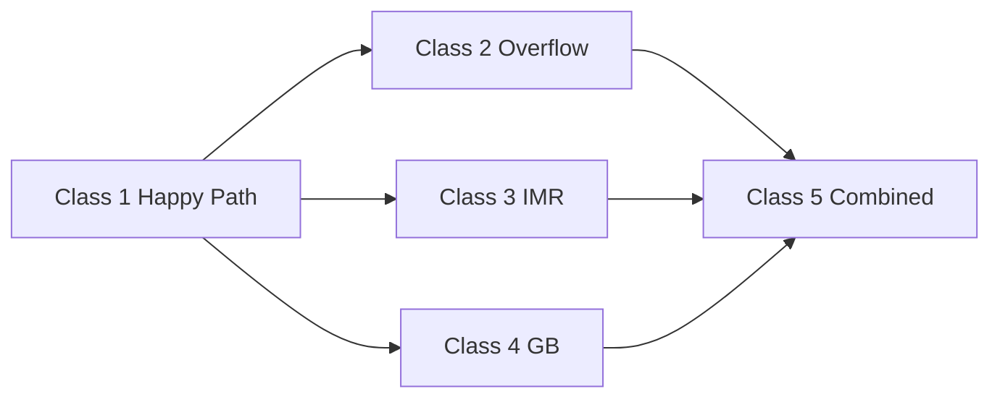

# 20.36 Canonical End-to-End Trace and Replay Test Classes

**Document ID:** 20.36  
**Version:** 0.3  
**Date:** 2026-06-06  
**Status:** CP-approved — dual-pipeline replay taxonomy (v0.2 refinements applied)

## Purpose

Defines (1) the normative **canonical trace fixture shape** for TS end-to-end conformance and (2) five **replay test classes** that operationalize HLR-20.012-011 (replay equivalence) across the hardened governance envelope.

This module SHALL NOT weaken invariants in [20.12_ts_invariants.md](20.12_ts_invariants.md). Run-derived evidence remains in 30-series; this document defines **fixture requirements and pass criteria only**.

**Goal:** PoC and verification harnesses have a deterministic, falsifiable replay contract before 40-series implementation proceeds.

## Parent Scope

- **Normative fixtures:** golden inputs, expected envelope snapshots, assertion checklists
- **Does not modify:** 20.10, 20.12, 20.20, 20.30 bootstrap documents
- **Governance modules under test:** [20.17_messy_input_handling.md](20.17_messy_input_handling.md), [20.45_imr_requirements.md](20.45_imr_requirements.md), [20.16_gb_responsibility_matrix.md](20.16_gb_responsibility_matrix.md), [20.80_gb_requirements.md](20.80_gb_requirements.md)

## Non-Goals

- Implementation harness code (40-series)
- Run logs or empirical verification capsules (30-series)
- Basin-specific algorithm correctness beyond trace shape

---

## 1. Normative Boundary

1. **HLR-20.036-001:** This document SHALL define canonical trace shape requirements and replay test-class contracts only.

2. **HLR-20.036-002:** Run-derived traces, logs, and implementation outputs SHALL be stored in 30-series verification documents.

3. **HLR-20.036-003:** Every replay test class SHALL be executable as: **run → capture trace → strip designated envelopes → diff → assert** with deterministic pass/fail outcomes.

---

## 2. Canonical Trace Shape (Dual-Pipeline)

### 2.1 Pipeline A stage order

4. **HLR-20.036-004:** A valid Pipeline A trace fixture SHALL preserve this deterministic stage order: `input → routing → splitting → ob_processing → tb_interpretation → delta_h_normalization → merging → truth_done_evaluation → mtp_update`.

### 2.2 Pipeline B stage order

5. **HLR-20.036-005:** A valid dual-pipeline trace fixture SHALL append Pipeline B stages after Pipeline A `mtp_update`: `srp_lookup → trig_rb → exec_plan_commit → oub_expression → imr_evaluation`.

6. **HLR-20.036-006:** Pipeline B stages SHALL NOT appear before Pipeline A `mtp_update` completes in the same cycle (HLR-20.012-005).

### 2.3 Required envelope fields

7. **HLR-20.036-007:** Every canonical fixture SHALL include `execution_signature`, `input_packet_id`, `mtp_snapshot_id`, `routing_epoch_id`, `policy_signature`, and `seed_scope` marker fields.

8. **HLR-20.036-008:** Every fixture SHALL partition state into four logical envelopes per 20.12: `semantic_core`, `exec_plan`, `exec_trace`, `supervisory` — with explicit writer authority markers per stage.

9. **HLR-20.036-009:** Every stage record SHALL include `stage_name`, `stage_seq`, `pipeline_id` (`A` | `B`), `deterministic_reason_codes`, and `safe_boundary_marker` fields.

10. **HLR-20.036-010:** Splitting and merging stage records SHALL include `lineage_delta` and ΔH% contribution/missing-mass fields.

11. **HLR-20.036-011:** OB/TB stage records SHALL include explicit evidence fields, interpretation fields, and suppression/visibility markers.

12. **HLR-20.036-012:** Truth/done stage records SHALL include truth_hypotheses update fields, `done_state`, and uncertainty accounting fields.

13. **HLR-20.036-013:** Overflow/degradation state, if present, SHALL include canonical overflow tags per 20.30 §8.3 and deterministic degradation reason codes.

14. **HLR-20.036-014:** `messy_input_record`, `imr_record`, `gb_cap_record`, and `gb_supervisory_output` blocks, when present, SHALL conform to minimum schemas in 20.17, 20.45, 20.16, and 20.80 respectively.

15. **HLR-20.036-015:** MCS markers, if counted in fixture context, SHALL be explicit, attributable, and non-inflated according to 20.31 semantics.

16. **HLR-20.036-046:** `messy_input_class[]` in fixtures and replay diffs SHALL use canonical lexicographic sort by class code: **`MI_AFFECT`, `MI_CONTRA`, `MI_INCOMP`, `MI_NOISE`, `MI_VAGUE`** per [20.17_messy_input_handling.md](20.17_messy_input_handling.md); harnesses SHALL reject fixtures with non-canonical ordering.

---

## 3. Replay Test Taxonomy

Five mandatory test classes gate dual-pipeline PoC conformance. Each class SHALL have at least one golden fixture in 40-series harnesses traced to this document.

| Class | ID | Primary invariant | Modules exercised |
|-------|-----|-------------------|-------------------|
| **1** | `REPLAY_CLASS_1` | HLR-20.012-011 baseline | 20.12, 20.30 |
| **2** | `REPLAY_CLASS_2` | Overflow + degradation determinism | 20.30 §8, 20.17 §5 |
| **3** | `REPLAY_CLASS_3` | Bounded IMR + strip equivalence | 20.45, 20.12-009/011 |
| **4** | `REPLAY_CLASS_4` | GB caps + supervisory limits | 20.16, 20.80 |
| **5** | `REPLAY_CLASS_5` | Combined governance stress | 20.17, 20.45, 20.16, 20.80 |

17. **HLR-20.036-016:** PoC acceptance SHALL require pass on all five replay test classes before Execution Manifold contracts are considered proven per HLR-20.010-114.

18. **HLR-20.036-017:** Each test class SHALL define: `fixture_id`, `preconditions`, `injection_steps`, `required_assertions`, and `strip_scope` (which envelopes to remove for replay diff).

19. **HLR-20.036-018:** Replay diff SHALL use canonical serialization ordering per 20.95 for all compared fields.

20. **HLR-20.036-047:** Multi-cycle fixtures (especially Class 5) SHALL segment traces by `conversation_id` and `cycle_id`; each segment SHALL carry its own `stage_seq` origin, envelope snapshots at segment boundaries, and a `strip_checkpoint` marking the latest cycle safe for pre-correction strip diff.

---

## 4. Class 1 — Happy Path (Dual-Pipeline Baseline)

**Purpose:** Verify full A→B cycle with no overflow, no IMR correction, no GB cap exceedance.

### Preconditions

- Clean input; no `overflow_flag`; `gb_supervisory_mode = NORMAL`
- No `messy_input_class[]` beyond empty or benign tags
- Single `routing_epoch_id` throughout

### Required assertions

19. **HLR-20.036-019:** Class 1 SHALL assert Pipeline A stages complete in §2.1 order with `semantic_core` fully populated before any Pipeline B stage executes.

20. **HLR-20.036-020:** Class 1 SHALL assert `exec_plan` contains valid `(opbeh_id, obg_id, xlater_id)` triple validated per HLR-20.012-008.

21. **HLR-20.036-021:** Class 1 **strip test:** removing `exec_plan` and `exec_trace` SHALL yield `semantic_core` byte-identical to Pipeline A-only replay for same `(input, prior_MTP, policy_signature, seed)` — HLR-20.012-011.

22. **HLR-20.036-022:** Class 1 SHALL assert seed affects only expression/realization fields in `exec_trace`; `semantic_core` diff across seed variants SHALL be empty.

### Golden fixture minimum

```yaml
fixture_id: REPLAY_C1_HAPPY_DUAL_PIPELINE
replay_class: REPLAY_CLASS_1
strip_scope: [exec_plan, exec_trace]
assertions:
  - semantic_core_replay_equivalent
  - pipeline_a_before_pipeline_b
  - valid_exec_triple
  - seed_boundary_holds
```

---

## 5. Class 2 — Overflow and Degradation

**Purpose:** Verify deterministic overflow tagging and messy-input preservation under truncation.

### Injection profile

- Trigger global bound exceedance (lane, evidence, ΔH%, or TCU per 20.30 §8.1)
- Include at least one `MI_CONTRA` or `MI_VAGUE` condition per 20.17

### Required assertions

23. **HLR-20.036-023:** Class 2 SHALL assert `overflow_flag = true` with canonical overflow schema fields populated (`overflow_type`, `overflow_source_basin`, `truncated_fields`, `ΔH%_normalization_applied`, `tcu_overrun_amount`).

24. **HLR-20.036-024:** Class 2 SHALL assert `messy_input_class[]`, `conflict_flag`, and `underspec_flag` are **not** silently dropped under overflow (HLR-20.017-031–034).

25. **HLR-20.036-025:** Class 2 SHALL assert identical effective overflow state produces identical degradation outcome on replay (20.30 §8.2 deterministic degradation invariant).

26. **HLR-20.036-026:** Class 2 **strip test:** `semantic_core` replay equivalence holds after strip; overflow tags in `semantic_core`/MTP remain present and unchanged by Pipeline B.

### Golden fixture minimum

```yaml
fixture_id: REPLAY_C2_OVERFLOW_MESSY_INPUT
replay_class: REPLAY_CLASS_2
strip_scope: [exec_plan, exec_trace]
injections:
  - overflow_type: LANE_TRUNCATION
  - messy_input_class: [MI_VAGUE]
assertions:
  - overflow_schema_complete
  - messy_tags_preserved
  - degradation_deterministic
  - semantic_core_replay_equivalent
```

---

## 6. Class 3 — IMR Bounded Feedback

**Purpose:** Verify IMR taxonomy, caps, and replay equivalence for Types A, B, and C.

### Injection profile

Three sub-scenarios (minimum one fixture each, or one combined fixture with isolated cycles):

| Sub | Trigger | Expected path |
|-----|---------|---------------|
| **3a** | Type A expression mismatch | Realization retry only; no Pipeline A |
| **3b** | Type B semantic mismatch | `CorrectionTrigger` + bounded partial A-cycle |
| **3c** | Type C safety mismatch | GB route before corrective action |

### Required assertions

27. **HLR-20.036-027:** Class 3a SHALL assert no Pipeline A stage executes post-IMR; `semantic_core` unchanged; new `exec_trace` entry only.

28. **HLR-20.036-028:** Class 3b SHALL assert `correction_context.target_field_ids[]` boundary respected; `semantic_core` updates occur only in a **subsequent** cycle with `correction_trigger_id` provenance.

29. **HLR-20.036-029:** Class 3b **strip test (pre-correction):** strip before approved Type B takes effect → `semantic_core` matches Pipeline A-only baseline.

30. **HLR-20.036-030:** Class 3c SHALL assert `gb_approval_required = true` and GB audit record precedes any supervisory action; IMR SHALL NOT write `semantic_core` directly.

31. **HLR-20.036-031:** Class 3 SHALL assert cap/cooldown/dedup produce `imr_cap_status` ∈ {`OK`, `CAP_EXCEEDED`, `COOLDOWN_ACTIVE`, `DEDUP_SUPPRESSED`} with visible audit per HLR-20.045-019/033.

### Golden fixture minimum

```yaml
fixture_id: REPLAY_C3_IMR_TYPE_B
replay_class: REPLAY_CLASS_3
strip_scope: [exec_plan, exec_trace]
injections:
  - imr_trigger_type: B
  - evaluator_signal_code: FACTUAL_ERROR
assertions:
  - imr_no_direct_semantic_write
  - correction_trigger_provenance
  - strip_pre_correction_equivalent
  - cap_status_audited
```

---

## 7. Class 4 — GB Caps and Supervisory Limits

**Purpose:** Verify 20.16 quantitative caps and 20.80 rate/priority/safe-mode policy under stress.

### Injection profile

- Exceed `CAP_GB_ACTIONS` and `CAP_GB_IMR_CYCLE` in one cycle
- Burst external `EXT_DAMPEN` commands past `RATE_GB_EXT_BURST`
- Trigger oscillation → `GB_MODE_DAMPENED` transition

### Required assertions

32. **HLR-20.036-032:** Class 4 SHALL assert cap exceedance produces deterministic `gb_cap_record` with `degrade_mode_applied` per 20.16 §5.

33. **HLR-20.036-033:** Class 4 SHALL assert rate-limited commands receive `gb_cmd_status = RATE_LIMITED` **without** side effects; rate limits and caps apply independently (HLR-20.080-044).

34. **HLR-20.036-034:** Class 4 SHALL assert P0/P1 actions execute before P6 when `CAP_GB_ACTIONS` exceeded; deferred queue ordering matches 20.16 §5.2.

35. **HLR-20.036-035:** Class 4 SHALL assert Safe-Mode entry does **not** alter `messy_input_class[]`, `conflict_flag`, or `underspec_flag` in `semantic_core`.

36. **HLR-20.036-036:** Class 4 SHALL assert GB never advances `routing_epoch_id` (HLR-20.016-045, HLR-20.080-061).

37. **HLR-20.036-037:** Class 4 **strip test:** `supervisory` records and `semantic_core` sufficient to replay GB cap accounting and mode transitions identically.

### Golden fixture minimum

```yaml
fixture_id: REPLAY_C4_GB_CAP_RATE
replay_class: REPLAY_CLASS_4
strip_scope: [exec_plan, exec_trace]
injections:
  - cap_exceeded: [CAP_GB_ACTIONS, CAP_GB_IMR_CYCLE]
  - external_burst: EXT_DAMPEN x5
assertions:
  - gb_cap_record_complete
  - rate_limited_no_side_effect
  - priority_order_p0_before_p6
  - safe_mode_no_messy_mutation
  - routing_epoch_unchanged
```

---

## 8. Class 5 — Combined Governance Stress

**Purpose:** End-to-end stress with messy input, overflow, IMR, and GB interacting in one conversation.

### Injection profile (minimum)

1. Contradictory input (`MI_CONTRA`) → parallel traces
2. Overflow during merge → lane truncation
3. Type B IMR after OuB expression
4. GB cap pressure + Dampen under oscillation
5. Deferred P6 action draining after headroom returns

### Required assertions

38. **HLR-20.036-038:** Class 5 SHALL assert no envelope write-authority violation across the full conversation (HLR-20.012-001).

39. **HLR-20.036-039:** Class 5 SHALL assert `conflict_flag` remains true through Pipeline B; OuB SHALL NOT smooth contradiction in `semantic_core` (HLR-20.017-037).

40. **HLR-20.036-040:** Class 5 SHALL assert full trace reproducible from `(input, prior_MTP, seed, routing_epoch_id, policy_signature)` per HLR-20.012-012.

41. **HLR-20.036-041:** Class 5 **strip test:** strip `exec_plan` + `exec_trace` → `semantic_core` replay equivalent for pre-Type-B-correction baseline; `supervisory` replays GB/IMR policy decisions.

42. **HLR-20.036-042:** Class 5 SHALL assert multi-cap precedence matches 20.16 §5.4 ordering under simultaneous TCU + IMR + actions pressure.

### Multi-cycle fixture segmentation

Class 5 fixtures SHALL span at least **3 cycles** with explicit segment boundaries:

| Segment | Cycle | Primary injection |
|---------|-------|-------------------|
| S1 | N | `MI_CONTRA` + merge overflow |
| S2 | N+1 | OuB expression + Type B IMR trigger |
| S3 | N+2..N+8 | GB cap pressure, Dampen, deferred P6 drain |

`strip_checkpoint` for Class 5 SHALL be set to **end of S2** (pre-Type-B-correction `semantic_core` commit) unless a sub-scenario explicitly tests post-correction replay.

### Golden fixture minimum

```yaml
fixture_id: REPLAY_C5_COMBINED_STRESS
replay_class: REPLAY_CLASS_5
conversation_id: conv-001
strip_scope: [exec_plan, exec_trace]
strip_checkpoint: { cycle_id: N+1, stage_seq: 14 }
segments:
  - segment_id: S1
    cycle_id: N
    injections: [MI_CONTRA, LANE_TRUNCATION]
  - segment_id: S2
    cycle_id: N+1
    injections: [imr_trigger_type_B]
  - segment_id: S3
    cycle_range: [N+2, N+8]
    injections: [gb_mode_path_NORMAL_DAMPENED, deferred_p6_drain]
injections:
  - messy_input_class: [MI_CONTRA, MI_VAGUE]   # canonical sort in fixture export
assertions:
  - envelope_write_authority_clean
  - no_hidden_smoothing
  - full_trace_reproducible
  - semantic_core_strip_equivalent
  - multi_cap_precedence_ordered
```

---

## 9. Global Replay Assertions (All Classes)

43. **HLR-20.036-043:** All classes SHALL fail if any stage writes outside its designated envelope authority.

44. **HLR-20.036-044:** All classes SHALL fail if `routing_epoch_id` differs between `exec_plan` and `exec_trace` within the same cycle without stale-epoch audit code.

45. **HLR-20.036-045:** All classes SHALL produce deterministic `replay_verdict` ∈ {`PASS`, `FAIL_ENVELOPE`, `FAIL_STRIP_DIFF`, `FAIL_DETERMINISM`, `FAIL_GOVERNANCE`} with fixed reason codes for harness export.

---

## Canonical Fixture Skeleton (Normative Template)

```yaml
trace_fixture:
  fixture_id: <canonical-id>
  replay_class: REPLAY_CLASS_1..5
  execution_signature: <signature-hash>
  policy_signature: <policy-hash>
  routing_epoch_id: <epoch-id>
  input:
    input_packet_id: <tp-id>
    seed_scope: response-only | none
  envelopes:
    semantic_core: { writer: pipeline_a, snapshot_ref: <ref> }
    exec_plan: { writer: pipeline_b, snapshot_ref: <ref> }
    exec_trace: { writer: pipeline_b, snapshot_ref: <ref> }
    supervisory: { writer: gb, snapshot_ref: <ref> }
  stages:
    # Pipeline A (stage_seq 1–9)
    - stage_seq: 1
      pipeline_id: A
      stage_name: input
      safe_boundary_marker: true
      deterministic_reason_codes: []
    - stage_seq: 2
      pipeline_id: A
      stage_name: routing
      safe_boundary_marker: true
      deterministic_reason_codes: []
    - stage_seq: 3
      pipeline_id: A
      stage_name: splitting
      lineage_delta: []
      delta_h: { contribution: {}, missing_mass: {} }
    - stage_seq: 4
      pipeline_id: A
      stage_name: ob_processing
      evidence_fields: {}
      suppression_markers: {}
    - stage_seq: 5
      pipeline_id: A
      stage_name: tb_interpretation
      interpretation_fields:
        stance: {}
        affect: {}
        intent: {}
        logic: {}
        social: {}
    - stage_seq: 6
      pipeline_id: A
      stage_name: delta_h_normalization
      delta_h_normalized: {}
    - stage_seq: 7
      pipeline_id: A
      stage_name: merging
      lineage_delta: []
      merge_conflicts: []
    - stage_seq: 8
      pipeline_id: A
      stage_name: truth_done_evaluation
      truth_hypotheses: {}
      done_state: {}
    - stage_seq: 9
      pipeline_id: A
      stage_name: mtp_update
      mtp_snapshot_id: <mtp-id>
    # Pipeline B (stage_seq 10–14)
    - stage_seq: 10
      pipeline_id: B
      stage_name: srp_lookup
      routing_epoch_id: <epoch-id>
    - stage_seq: 11
      pipeline_id: B
      stage_name: trig_rb
    - stage_seq: 12
      pipeline_id: B
      stage_name: exec_plan_commit
      opbeh_id: <id>
      obg_id: <id>
      xlater_id: <id>
    - stage_seq: 13
      pipeline_id: B
      stage_name: oub_expression
      oub_artifact_ref: <ref>
    - stage_seq: 14
      pipeline_id: B
      stage_name: imr_evaluation
      imr_record: {}
  governance:
    messy_input_record: {}      # optional; 20.17 schema
    gb_cap_record: {}           # optional; 20.16 schema
    gb_supervisory_output: {}   # optional; 20.80 schema
  overflow:
    overflow_flag: false
    overflow_type: null
    overflow_source_basin: null
    truncated_fields: []
    degradation_reason_codes: []
  mcs_markers: []
  replay:
    strip_scope: [exec_plan, exec_trace]
    strip_checkpoint: { cycle_id: <id>, stage_seq: <n> }   # required for multi-cycle fixtures
    expected_verdict: PASS
```

## Worked Example — Strip Diff (Class 1)

Harness compares **full dual-pipeline trace** vs **Pipeline A-only baseline** after strip.

| Step | Operation | Result |
|------|-----------|--------|
| 1 | Run dual-pipeline fixture `REPLAY_C1_HAPPY_DUAL_PIPELINE` | Capture `semantic_core`, `exec_plan`, `exec_trace`, `supervisory` |
| 2 | Run Pipeline A-only with same `(input, prior_MTP, policy_signature)` | Capture `semantic_core_A_only` |
| 3 | Apply `strip_scope: [exec_plan, exec_trace]` to dual-pipeline capture | `stripped.semantic_core` + `supervisory` remain |
| 4 | Canonical serialize both `semantic_core` blobs (20.95) | Byte-compare |
| 5 | Match | `replay_verdict = PASS` |
| 6 | Inject spurious `exec_plan` write to `semantic_core` | Diff non-empty → `replay_verdict = FAIL_ENVELOPE` |
| 7 | Change `messy_input_class` order to `[MI_VAGUE, MI_CONTRA]` | Harness reject → `FAIL_GOVERNANCE` (HLR-20.036-046) |

```text
# Pseudocode
stripped = trace.remove_envelopes([exec_plan, exec_trace])
assert canonical_serialize(stripped.semantic_core) ==
       canonical_serialize(baseline_a_only.semantic_core)
```

## Test Class Dependency Graph



## Verification Focus

- All five classes have golden fixtures in 40-series before PoC sign-off
- Strip diff harness implements HLR-20.012-011 exactly
- Class 5 catches cross-module regressions (smoothing, cap bypass, epoch drift)
- Multi-cycle fixtures segment correctly with `strip_checkpoint`
- `messy_input_class[]` canonical ordering enforced in fixture validation
- `replay_verdict` codes stable for CI gating
- 30-series stores run evidence; 20.36 remains fixture contract only

## Traceability Targets

- [20.12_ts_invariants.md](20.12_ts_invariants.md)
- [20.30_ts_functional_model.md](20.30_ts_functional_model.md)
- [20.17_messy_input_handling.md](20.17_messy_input_handling.md)
- [20.45_imr_requirements.md](20.45_imr_requirements.md)
- [20.16_gb_responsibility_matrix.md](20.16_gb_responsibility_matrix.md)
- [20.80_gb_requirements.md](20.80_gb_requirements.md)
- [20.31_semantic_specification.md](20.31_semantic_specification.md)
- [20.95_ts_numeric_policy.md](20.95_ts_numeric_policy.md)
- ../30_verification/30.40_evidence_trace_exemplars_non_normative.md
- ../40_thought_simulator_playground/ (PoC harness targets)