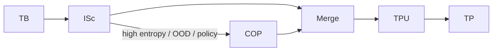

# **20.44 — TS Inference Scorer (ISc) — Scoring**  
**Status:** Draft v0.4 — Pending CP/Grok Review  
**Owner:** TS Architecture  
**Related:** 20.01, 20.10, 20.12, 20.20, 20.30, 20.32, 20.33, 20.34, 20.46, 20.95, 20.105

---

# **PART I — INFORMATIVE (NO HLRs)**  
These sections explain *what* ISc is and *why* it exists.  
No SHALL/SHALL NOT statements appear here.

---

# **1. Purpose (Informative)**  
The TS Inference Scorer (ISc) is a **Pipeline A primitive** responsible for **bounded, deterministic scoring** of TB‑generated candidate interpretations or state transitions.  
ISc does **not** generate meaning. It evaluates a **finite candidate set**, produces a **normalized distribution**, exposes **entropy, confidence, and rationale**, and may trigger **policy‑bound escalation** to COP.

ISc strengthens ambiguity detection, uncertainty propagation, and meaning stability while preserving TS invariants (20.10, 20.12) and safe‑boundary rules (20.30, 20.105).

---

# **2. Scope (Informative)**  
ISc operates **inside Pipeline A**, between:

- TB (Truth Basin) — candidate generation  
- Merge — formation of TP‑UPDATE requests  

ISc is a **TS‑internal primitive**, not a basin, not a coprocessor, not a realization component, and not a TP subsystem.

---

# **3. Architectural Positioning (Informative)**  

```
Pipeline A:
    InB → IIInB → RB → TB → ISc → Merge → TPU → TP
                         ↑
                         └───(optional escalation)──→ COP
```

ISc:

- receives a finite candidate set  
- computes a deterministic score distribution  
- emits bounded metadata  
- never mutates TP directly  
- never interacts with Pipeline B  
- never bypasses Merge or TPU  

---

# **4. Definitions (Informative)**  
**Candidate Set** — finite TB‑generated interpretations or transitions  
**ISc Distribution** — normalized probability distribution  
**Entropy/Confidence** — scalar uncertainty metrics  
**Rationale Codes** — interpretable feature‑level explanations  

---

# **PART II — NORMATIVE (ALL HLRs)**  
Every SHALL/SHALL NOT statement is formalized as an HLR.

---

# **5. Core Scoring Requirements (HLR‑20.44.01xx)**

### **HLR‑20.44.0101 — Finite Candidate Set Only**  
ISc SHALL operate exclusively on a finite candidate set produced by TB.  
ISc SHALL NOT generate new meanings or expand the candidate set.

### **HLR‑20.44.0102 — Deterministic Scoring**  
ISc SHALL produce identical outputs for identical inputs, state, and seed.

### **HLR‑20.44.0103 — Transparent, Auditable Features**  
ISc SHALL use only interpretable scoring features and SHALL log all features in rationale metadata.

### **HLR‑20.44.0104 — Normalized Distribution**  
ISc SHALL output a normalized probability distribution over the candidate set.

### **HLR‑20.44.0105 — Uncertainty Metrics**  
ISc SHALL compute entropy, confidence, and rationale codes.

### **HLR‑20.44.0106 — Escalation Triggering**  
ISc SHALL trigger COP escalation when policy thresholds are met.

### **HLR‑20.44.0107 — No Direct TP Mutation**  
ISc SHALL NOT write to TP. All outputs SHALL route through Merge → TPU → TP.

### **HLR‑20.44.0108 — Replay Safety**  
ISc SHALL satisfy replay invariants (20.12).

### **HLR‑20.44.0109 — TCU Bound**  
ISc SHALL operate within a fixed TCU budget defined in 20.90.

### **HLR‑20.44.0110 — Pipeline A Only**  
ISc SHALL NOT interact with Pipeline B or realization planning.

---

# **6. Input Requirements (HLR‑20.44.02xx)**

### **HLR‑20.44.0201 — Immutable Inputs**  
All ISc inputs SHALL be immutable during scoring.

### **HLR‑20.44.0202 — Canonical Candidate Ordering**  
Candidate ordering SHALL follow 20.95 and 20.105.

### **HLR‑20.44.0203 — Valid Feature Set**  
Features SHALL be interpretable, deterministic, and bounded.

---

# **7. Output Requirements (HLR‑20.44.03xx)**

### **HLR‑20.44.0301 — Structured Output Object**  
ISc SHALL output the full `isc_output{}` structure.

### **HLR‑20.44.0302 — Canonical Serialization**  
ISc outputs SHALL follow canonical serialization rules.

### **HLR‑20.44.0303 — 1‑TP‑Cycle Lag**  
ISc outputs SHALL become visible in TP(N+1).

---

# **8. Merge/TP Interaction (HLR‑20.44.04xx)**

### **HLR‑20.44.0401 — Merge‑Only Commit Path**  
ISc SHALL commit only via Merge → TPU → TP.

### **HLR‑20.44.0402 — Writer Authority Compliance**  
ISc SHALL write only to the `isc{}` block.

---

# **9. COP Escalation Requirements (HLR‑20.44.05xx)**

### **HLR‑20.44.0501 — Deterministic Escalation Preconditions**  
ISc SHALL escalate only when policy thresholds and GB caps permit.

### **HLR‑20.44.0502 — COP Proposal Schema Compliance**  
ISc SHALL construct proposals conforming to 20.34.

### **HLR‑20.44.0503 — No Direct COP Access**  
ISc SHALL NOT call the coprocessor directly.

### **HLR‑20.44.0504 — Returned Distribution Constraints**  
Returned distributions SHALL be deterministic, canonical, and over the same candidate set.

### **HLR‑20.44.0505 — Merge Validation of COP Output**  
Merge SHALL validate COP output before TP commit.

### **HLR‑20.44.0506 — COP Safe‑Boundary Compliance**  
Escalation SHALL occur only at GB‑approved safe boundaries.

### **HLR‑20.44.0507 — COP Replay Requirements**  
COP outputs SHALL satisfy replay invariants (20.12).

---

# **10. Forbidden Actions (HLR‑20.44.06xx)**

### **HLR‑20.44.0601 — No Meaning Generation**  
### **HLR‑20.44.0602 — No Candidate Expansion**  
### **HLR‑20.44.0603 — No Pipeline B Interaction**  
### **HLR‑20.44.0604 — No Intake Repair**  
### **HLR‑20.44.0605 — No TP Mutation**  
### **HLR‑20.44.0606 — No Bypass of TB, Merge, or TPU**  
### **HLR‑20.44.0607 — No Nondeterministic Methods**

---

# **11. Error Detection Requirements (HLR‑20.44.07xx)**  
*(New section you requested — fully normative)*

### **HLR‑20.44.0701 — Candidate‑Set Error Detection**  
ISc SHALL detect empty, non‑finite, malformed, or non‑canonical candidate sets.

### **HLR‑20.44.0702 — Feature Error Detection**  
ISc SHALL detect missing, nondeterministic, or out‑of‑range features.

### **HLR‑20.44.0703 — Distribution Error Detection**  
ISc SHALL detect normalization failures, invalid score values, and entropy/confidence computation errors.

### **HLR‑20.44.0704 — Policy Error Detection**  
ISc SHALL detect missing policy entries and GB cap violations.

### **HLR‑20.44.0705 — TCU Error Detection**  
ISc SHALL detect TCU budget exhaustion and apply deterministic degradation.

### **HLR‑20.44.0706 — COP Interaction Error Detection**  
ISc SHALL detect invalid COP proposals and invalid COP return distributions.

### **HLR‑20.44.0707 — Forbidden‑Action Violation Detection**  
ISc SHALL detect attempts to generate meaning, expand candidates, mutate TP, or bypass safe boundaries.

---

# **12. Error Handling Requirements (HLR‑20.44.08xx)**

### **HLR‑20.44.0801 — Deterministic Fallback Behavior**  
### **HLR‑20.44.0802 — Replay‑Safe Error Handling**  
### **HLR‑20.44.0803 — Error Object Emission**  
### **HLR‑20.44.0804 — No TS Halt on Error**  
### **HLR‑20.44.0805 — Audit Logging Requirements**

---

# **13. Canonical Ordering & Serialization (HLR‑20.44.09xx)**

### **HLR‑20.44.0901 — Canonical Ordering Compliance**  
### **HLR‑20.44.0902 — Deterministic Hashing**  
### **HLR‑20.44.0903 — Canonical Audit Serialization**

---

# **14. Verification Requirements (HLR‑20.44.10xx)**

### **HLR‑20.44.1001 — Replay Tests**  
### **HLR‑20.44.1002 — Canonical Ordering Tests**  
### **HLR‑20.44.1003 — COP Escalation Path Tests**  
### **HLR‑20.44.1004 — TCU Degradation Tests**  
### **HLR‑20.44.1005 — Forbidden‑Action Tests**

---

# **PART III — INFORMATIVE (NO HLRs)**

---

# **15. Mermaid Diagram (Informative)**



---

# **16. Rationale & Notes (Informative)**  
Explains why deterministic scoring, replay invariants, safe boundaries, and canonical ordering are required.

---

# **17. Examples (Informative)**  
Optional examples of scoring, escalation, fallback behavior.

---

# **18. Conformance (Informative)**  
A system conforms to 20.44 if and only if all HLR‑20.44.xxxx requirements are satisfied.

---

# **19. Change Log (Informative)**  
**v0.4** — Added full HLR numbering, normative/informative split, error detection requirements, conformance section.

---
