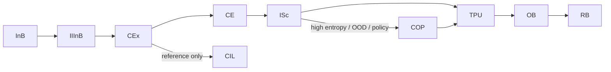

# **20.44 — TS Inference Scorer (ISc) — Scoring**  
**Status:** Draft v0.5 — Architecture‑Aligned (Pending CP/Grok Review)  
**Owner:** TS Architecture  
**Related:** 20.01, 20.10, 20.12, 20.20, 20.30, 20.32, 20.33, 20.34, 20.46, 20.95, 20.105, iiinb_isc_tpu_ib_tb_arch_discussion.md

---

# **PART I — INFORMATIVE (NO HLRs)**  

---

## **1. Purpose (Informative)**  

The TS Inference Scorer (ISc) is an **inference‑path primitive** responsible for **bounded, deterministic scoring** of a **finite candidate set of interpretations or state transitions** derived from the **ContextEnvelope (CE)** and intake envelope, not from TB.

ISc does **not** generate meaning. It evaluates a finite candidate set, produces a **normalized distribution**, exposes **entropy, confidence, and rationale**, and may trigger **policy‑bound escalation** to COP.

ISc strengthens ambiguity detection, uncertainty propagation, and meaning stability while preserving TS invariants (20.10, 20.12) and safe‑boundary rules (20.30, 20.105).

---

## **2. Scope (Informative)**  

ISc operates **inside the inference path**, between:

- **CE / intake envelope** (via CEx) — candidate construction and features  
- **Merge** — formation of TP‑UPDATE requests  

ISc is a **TS‑internal primitive**, not a basin, not a coprocessor, not a realization component, and not a TP subsystem.

ISc does **not**:

- read CIL directly  
- read or invoke IIInB  
- interact with IB, TB, GBIB, or GB  
- write to TP or CE  

---

## **3. Architectural Positioning (Informative)**  

### **Four‑Path Context**

ISc appears **only** in the **Inference Path**:

- Normal Path:  
  `InB → OB → RB → Path B → OuB`
- Clarification Path:  
  `InB → IIInB → Path B → OuB → User`
- Inference Path (ISc path):  
  `InB → IIInB → CEx → CE → ISc → TPU → {OB → RB}; {Path A basic}`
- Post‑TS Path:  
  `TP → IB → TB → GBIB → GB`

ISc is **not** part of the Normal Path, Clarification Path, or Post‑TS Path.
Merge is an operation within the TPU.

---

## **4. Definitions (Informative)**  

- **Candidate Set** — finite set of interpretations or state transitions derived from CE + intake envelope (via CEx / upstream inference wiring), **not** from TB.  
- **ISc Distribution** — normalized probability distribution over the candidate set.  
- **Entropy/Confidence** — Entropy ΔH% Confidence — scalar structural‑uncertainty metrics computed in accordance with HLR‑20.030‑015 (ΔH% structural‑entropy delta).  
- **Rationale Codes** — interpretable feature‑level explanations.

---

# **PART II — NORMATIVE (ALL HLRs)**  

---

## **5. Core Scoring Requirements**  

### **HLR‑20.44-001 (NA) — Finite Candidate Set Only (TB‑sourced)**  
ISc SHALL operate exclusively on a finite candidate set produced by TB.  
ISc SHALL NOT generate new meanings or expand the candidate set.  

> **Status:** **NA** — TB is no longer in the inference path; candidate sets are no longer TB‑generated.

### **HLR‑20.44-002 — Finite Candidate Set from CE / Intake**  
ISc SHALL operate exclusively on a finite candidate set derived from the **ContextEnvelope (CE)** and intake envelope as provided by upstream inference wiring (e.g., CEx), and SHALL NOT depend on TB for candidate generation.

### **HLR‑20.44-003 — No Meaning Generation / Expansion**  
ISc SHALL NOT generate new meanings or expand the candidate set; it SHALL only score and rank the provided candidates.

### **HLR‑20.44-004 — Deterministic Scoring**  
ISc SHALL produce identical outputs for identical inputs, state, and seed.

### **HLR‑20.44-005 — Transparent, Auditable Features**  
ISc SHALL use only interpretable scoring features and SHALL log all features in rationale metadata.

### **HLR‑20.44-006 — Normalized Distribution**  
ISc SHALL output a normalized probability distribution over the candidate set.

### **HLR‑20.44-007 — Uncertainty Metrics**  
ISc SHALL compute entropy, ΔH%, confidence, and rationale codes, and its ΔH% computation SHALL conform to the unified structural‑entropy delta definition in HLR‑20.030‑015.

### **HLR‑20.44-008 — Escalation Triggering**  
ISc SHALL trigger COP escalation when policy thresholds are met.

### **HLR‑20.44-009 — No Direct TP Mutation**  
ISc SHALL NOT write to TP. All outputs SHALL route through Merge → TPU → TP.

### **HLR‑20.44-010 — Replay Safety**  
ISc SHALL satisfy replay invariants (20.12).

### **HLR‑20.44-011 — TCU Bound**  
ISc SHALL operate within a fixed TCU budget defined in 20.90.

### **HLR‑20.44-012 — Inference Path Only**  
ISc SHALL operate only in the **Inference Path** and SHALL NOT interact with Pipeline B or realization planning.

### **HLR‑20.44‑058 — FFTM‑Based Semantic Scoring**  
ISc SHALL score candidates using the four Path‑A meaning fields defined by the Four‑Field Token Model (FFTM): **token_surface, token_base, token_expression, and token_intent**, as represented in **semantic_core** or an equivalent canonical meaning structure.

### **HLR‑20.44‑061 — Weighting Principles for FFTM Fields**  
ISc **SHALL** weight FFTM fields such that **meaning‑layer cues** (token_expression, token_intent) receive **greater aggregate influence** than purely surface‑form cues (token_surface), except where domain‑level empirical evidence demonstrates otherwise.  
Weights **SHALL** remain deterministic, documented, and version‑stable.

---

### **HLR‑20.44‑062 — Architecture‑Aligned Weight Tuning**  
ISc **MAY** adjust FFTM weights across versions **only** when justified by **architecture‑level evaluation** (e.g., aggregate Path A behavior, entropy patterns, constraint satisfaction), and **SHALL NOT** introduce test‑specific heuristics or special‑case logic tied to individual inputs.

---

### **HLR‑20.44‑063 — Replay‑Safe Weight Application**  
ISc **SHALL** apply FFTM weights deterministically using the canonical scoring equation:

$$
\text{score}(c) = w_s \cdot f_s(c) + w_b \cdot f_b(c) + w_e \cdot f_e(c) + w_i \cdot f_i(c)
$$

where:

- $f_s, f_b, f_e, f_i$ are the canonical FFTM feature functions  
- $w_s, w_b, w_e, w_i$ are version‑controlled deterministic weights  
- all values **SHALL** be bounded and interpretable per HLR‑20.44‑015

---

### **HLR‑20.44‑064 — Path‑A‑Aligned Evaluation, Not Overfitting**  
ISc **SHALL** use Path A simulations to evaluate scoring behavior, entropy, and candidate ranking, but **SHALL NOT** tune weights to pass specific Path A test items.  
Path A **SHALL** be treated as an **architecture‑level diagnostic**, not a target for overfitting.

---

### **HLR‑20.44‑065 — Semantic‑Core Integrity**  
ISc **SHALL NOT** modify semantic_core or FFTM fields when applying weights, and **SHALL** consume all meaning‑layer features in a read‑only manner, consistent with HLR‑20.44‑060.

---

## **6. Input Requirements**  

### **HLR‑20.44-013 — Immutable Inputs**  
All ISc inputs SHALL be immutable during scoring.

### **HLR‑20.44-014 — Canonical Candidate Ordering**  
Candidate ordering SHALL follow 20.95 and 20.105.

### **HLR‑20.44-015 — Valid Feature Set**  
Features SHALL be interpretable, deterministic, and bounded.
 
### **Updated HLR‑20.44‑016 — CE‑Bound Structural Context Only**  
ISc SHALL consume **structural context** only via CE‑derived and intake‑derived fields provided by upstream wiring and SHALL NOT read CIL directly; **semantic scoring features SHALL be derived from semantic_core / FFTM**, not from CE.

### **HLR‑20.44‑059 — Semantic‑Core / FFTM Feature Source**  
ISc scoring features SHALL include meaning‑layer features derived from **semantic_core** or an equivalent canonical representation of the four FFTM fields, and SHALL NOT rely solely on CE‑derived structural context.

---

## **7. Output Requirements**  

### **HLR‑20.44-017 — Structured Output Object**  
ISc SHALL output the full `isc_output{}` structure.

### **HLR‑20.44-018 — Canonical Serialization**  
ISc outputs SHALL follow canonical serialization rules.

### **HLR‑20.44-019 — 1‑TP‑Cycle Lag**  
ISc outputs SHALL become visible in TP(N+1).

---

## **8. Merge/TP Interaction**  

### **HLR‑20.44-020 — Merge‑Only Commit Path**  
ISc SHALL commit only via Merge → TPU → TP.

### **HLR‑20.44-021 — Writer Authority Compliance**  
ISc SHALL write only to the `isc{}` block.

### **HLR‑20.44-022 — No Direct TPU / TP Writes**  
ISc SHALL NOT write directly to TPU or TP and SHALL NOT modify CE.

---

## **9. COP Escalation Requirements**  

*(Unchanged in spirit; TB references were not present.)*

### **HLR‑20.44-023 — Deterministic Escalation Preconditions**  
ISc SHALL escalate only when policy thresholds and GB caps permit.

### **HLR‑20.44-024 — COP Proposal Schema Compliance**  
ISc SHALL construct proposals conforming to 20.34.

### **HLR‑20.44-025 — No Direct COP Access**  
ISc SHALL NOT call the coprocessor directly.

### **HLR‑20.44-026 — Returned Distribution Constraints**  
Returned distributions SHALL be deterministic, canonical, and over the same candidate set.

### **HLR‑20.44-027 — Merge Validation of COP Output**  
Merge SHALL validate COP output before TP commit.

### **HLR‑20.44-028 — COP Safe‑Boundary Compliance**  
Escalation SHALL occur only at GB‑approved safe boundaries.

### **HLR‑20.44-029 — COP Replay Requirements**  
COP outputs SHALL satisfy replay invariants (20.12).

---

## **10. Forbidden Actions**  

### **HLR‑20.44-030 — No Meaning Generation**  
ISc SHALL NOT generate new meanings.

### **HLR‑20.44-031 — No Candidate Expansion**  
ISc SHALL NOT expand the candidate set.

### **HLR‑20.44-032 — No Pipeline B Interaction**  
ISc SHALL NOT interact with Pipeline B or realization planning.

### **HLR‑20.44-033 — No Intake Repair**  
ISc SHALL NOT perform intake repair; IIInB owns repair.

### **HLR‑20.44-034 — No TP Mutation**  
ISc SHALL NOT mutate TP.

### **HLR‑20.44-035 (NA) — No Bypass of TB, Merge, or TPU**  
> **Status:** **NA** — TB is not in the inference path; TB is post‑TS only.

### **HLR‑20.44-036 — No Bypass of Merge or TPU; No TB/IB Interaction**  
ISc SHALL NOT bypass Merge or TPU and SHALL NOT interact with IB, TB, GBIB, or GB.

### **HLR‑20.44-037 — No Nondeterministic Methods**  
ISc SHALL NOT use nondeterministic methods that break replay invariants.

### **HLR‑20.44‑060 — No Semantic‑Core Mutation**  
ISc SHALL NOT modify semantic_core or any FFTM field; it SHALL consume meaning‑layer features in a read‑only manner.

---

## **11. Error Detection Requirements**  

*(All still valid; “candidate set” now implicitly CE‑derived.)*

### **HLR‑20.44-038 — Candidate‑Set Error Detection**  
ISc SHALL detect empty, non‑finite, malformed, or non‑canonical candidate sets.

### **HLR‑20.44-039 — Feature Error Detection**  
ISc SHALL detect missing, nondeterministic, or out‑of‑range features.

### **HLR‑20.44-040 — Distribution Error Detection**  
ISc SHALL detect normalization failures, invalid score values, and entropy/confidence computation errors.

### **HLR‑20.44-041 — Policy Error Detection**  
ISc SHALL detect missing policy entries and GB cap violations.

### **HLR‑20.44-042 — TCU Error Detection**  
ISc SHALL detect TCU budget exhaustion and apply deterministic degradation.

### **HLR‑20.44-043 — COP Interaction Error Detection**  
ISc SHALL detect invalid COP proposals and invalid COP return distributions.

### **HLR‑20.44-044 — Forbidden‑Action Violation Detection**  
ISc SHALL detect attempts to generate meaning, expand candidates, mutate TP, or bypass safe boundaries.

---

## **12. Error Handling Requirements**  

*(As in v0.4; content preserved.)*

### **HLR‑20.44-045 — Deterministic Fallback Behavior**  
### **HLR‑20.44-046 — Replay‑Safe Error Handling**  
### **HLR‑20.44-047 — Error Object Emission**  
### **HLR‑20.44-048 — No TS Halt on Error**  
### **HLR‑20.44-049 — Audit Logging Requirements**  

---

## **13. Canonical Ordering & Serialization**  

### **HLR‑20.44-050 — Canonical Ordering Compliance**  
### **HLR‑20.44-051 — Deterministic Hashing**  
### **HLR‑20.44-052 — Canonical Audit Serialization**  

---

## **14. Verification Requirements**  

### **HLR‑20.44-053 — Replay Tests**  
### **HLR‑20.44-054 — Canonical Ordering Tests**  
### **HLR‑20.44-055 — COP Escalation Path Tests**  
### **HLR‑20.44-056 — TCU Degradation Tests**  
### **HLR‑20.44-057 — Forbidden‑Action Tests**  

---

# **PART III — INFORMATIVE (NO HLRs)**  

---

## **15. Mermaid Diagram (Informative — Updated)**  



Notes:

- TB and IB do **not** appear; they belong to the **Post‑TS Path** (`TP → IB → TB → GBIB → GB`), not the inference path.
- CIL is not shown; it is a **reference layer** accessed only by CEx.

---

## **16. Rationale & Notes (Informative)**  

Explains why:

- ISc is placed only in the inference path  
- TB/IB are post‑TS only  
- CE/CEx isolate ISc from CIL  
- deterministic scoring and replay invariants are required  

---

## **17. Examples (Informative)**  

Examples of:

- CE‑derived candidate sets  
- scoring and escalation  
- fallback behavior under high entropy  

---

## **18. Conformance (Informative)**  

A system conforms to 20.44 if and only if all HLR‑20.44.0xxx requirements are satisfied, including:

- no TB/IB interaction in the inference path  
- CE‑bound candidate sets  
- Merge → TPU → TP commit path only  

---

## **19. Change Log (Informative)**  

- **v0.5** — Architecture‑aligned rewrite:  
  - Removed TB from inference path  
  - Updated candidate‑set source to CE/intake  
  - Added CE/CEx constraints  
  - Updated Mermaid diagram  
  - Marked TB‑dependent HLRs as NA and inserted new HLRs with extended numbering  
- **v0.4** — Prior draft with full HLR numbering, error detection, conformance section.

---

# **APPENDIX A — Recommended FFTM Weighting Profile (Informative)**  
**Status:** Informative — Non‑Normative  
**Version:** v0.5 (Architecture‑Aligned)  
**Scope:** Suggested default weighting profile for ISc scoring under HLR‑20.44‑061 through HLR‑20.44‑065.

---

## **A.1 Purpose (Informative)**  
This appendix provides a **version‑controlled recommended weighting profile** for the four FFTM fields used by ISc during candidate scoring.  
These values are **non‑normative** and may evolve across versions, provided all normative constraints in HLR‑20.44‑061 through HLR‑20.44‑065 are satisfied.

The profile reflects:

- meaning‑layer primacy  
- replay‑safe deterministic scoring  
- architecture‑level evaluation via Path A  
- avoidance of test‑specific heuristics  
- improved entropy behavior and candidate ranking stability  

---

## **A.2 Recommended Weighting Values (v0.5)**  

The following weighting profile is recommended for **ISc v0.5**:

```
w_surface     = 0.10
w_base        = 0.20
w_expression  = 0.40
w_intent      = 0.30
```

These values sum to **1.00**, though normalization MAY occur downstream in the scoring pipeline.

---

## **A.3 Scoring Equation (Informative)**  

ISc applies the FFTM weights using the canonical scoring equation:

$$  
\text{score}(c) = w_s \cdot f_s(c) + w_b \cdot f_b(c) + w_e \cdot f_e(c) + w_i \cdot f_i(c)  
$$  

Where:

- $f_s(c)$ — token_surface feature  
- $f_b(c)$ — token_base feature  
- $f_e(c)$ — token_expression feature  
- $f_i(c)$ — token_intent feature  
- $w_s, w_b, w_e, w_i$ — deterministic version‑controlled weights  

All feature values and weights MUST remain bounded, interpretable, and deterministic per HLR‑20.44‑015.

---

## **A.4 Rationale (Informative)**  

### **token_expression (0.40)**  
Carries discourse, causal, contrastive, and structural cues; strongest predictor of correct candidate ranking.

### **token_intent (0.30)**  
Captures IMR difficulty, constraint signals, and user‑intent alignment; decisive in ambiguous cases.

### **token_base (0.20)**  
Provides canonical meaning grounding; stabilizes scoring without dominating it.

### **token_surface (0.10)**  
High‑variance and noisy; downweighted to reduce false positives and improve entropy behavior.

---

## **A.5 Expected Effects (Informative)**  

Adopting this profile typically yields:

- improved candidate ranking stability  
- reduced “wrong winner with high confidence” cases  
- cleaner entropy deltas  
- better constraint detection  
- improved Path A behavior without test‑specific tuning  

---
