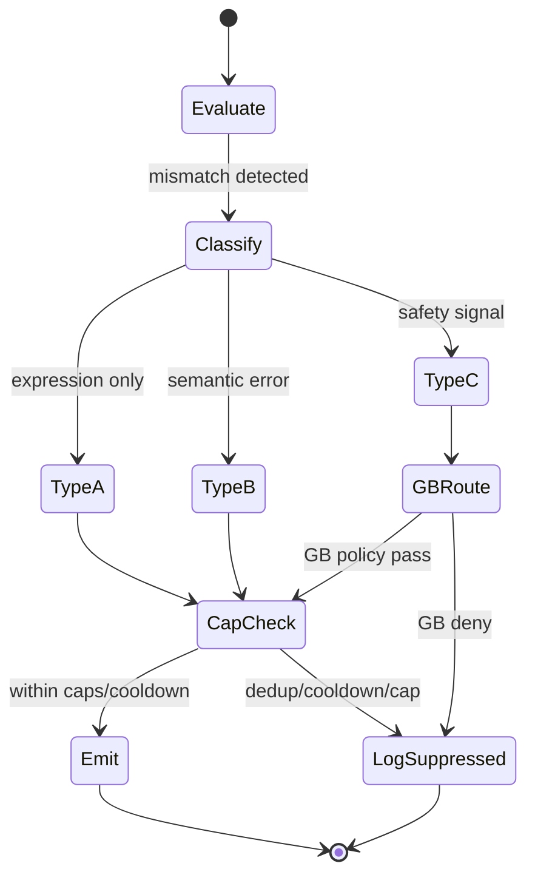

# 20.45 IMR Requirements

**Document ID:** 20.45  
**Version:** 0.2  
**Date:** 2026-06-06  
**Status:** Draft — dual-pipeline hardening (CP review refinements applied)

## Purpose

Defines deterministic **Interpretation Mismatch Routine (IMR)** behavior for Pipeline B feedback into Pipeline A. IMR is the first pre-PoC hardening module for the Execution Manifold. This module **satisfies and refines** HLR-20.012-009 and SHALL NOT weaken any invariant in [20.12_ts_invariants.md](20.12_ts_invariants.md).

## Parent Scope

- Pipeline B only (expression/feedback phase)
- Writes: `exec_trace` and append-only supervisory trigger queue entries
- Reads: `semantic_core` (read-only snapshot), `exec_plan`, OuB artifact refs, policy tables
- Does **not** modify: 20.10, 20.12, 20.20, or 20.30 bootstrap documents

## IMR Trigger Taxonomy (Mandatory)

Every IMR event SHALL be classified into exactly one trigger type:

| Type | Name | Definition |
|------|------|------------|
| **A** | Expression mismatch | User or evaluator indicates output is unclear, stylistically wrong, incomplete, or not in requested register — without asserting factual/logical error |
| **B** | Semantic mismatch | User or evaluator indicates factual, logical, or interpretive error relative to committed `semantic_core` or stated input |
| **C** | Safety mismatch | User or evaluator indicates harm, bias, ethics violation, or policy breach |

1. **HLR-20.045-001:** IMR SHALL classify every evaluated mismatch into Type A, Type B, or Type C using deterministic rules and fixed reason codes.
2. **HLR-20.045-002:** IMR classification SHALL be reproducible from `(oub_artifact_ref, exec_plan, semantic_snapshot_ref, evaluator_signal)` with no latent inference.
3. **HLR-20.045-003:** Mixed signals SHALL resolve by deterministic precedence: **C > B > A** (highest severity wins) with audit log of suppressed secondary classes.

## Authority Limits by Trigger Type

### Type A — Expression mismatch

4. **HLR-20.045-004:** Type A MAY schedule a new Pipeline B realization pass (OpBeh/OBG/XlateR or OuB selection change) using the **same** `semantic_snapshot_ref`.
5. **HLR-20.045-005:** Type A SHALL NOT schedule Pipeline A re-interpretation, Thought Router recompute, basin re-entry, or any mutation of `semantic_core`.
6. **HLR-20.045-006:** Type A SHALL NOT require GB approval for realization-only retry within per-conversation caps (§Cooldowns).

### Type B — Semantic mismatch

7. **HLR-20.045-007:** Type B MAY emit a `CorrectionTrigger` scheduling a **bounded** Pipeline A re-interpretation pass with explicit `correction_context` fields listing reconsidered TP/MTP field IDs.
8. **HLR-20.045-008:** Type B SHALL NOT write `semantic_core` directly; all semantic updates SHALL occur only through approved Pipeline A pathways.
9. **HLR-20.045-009:** Type B correction triggers SHALL include `prior_semantic_snapshot_ref`, `target_field_ids[]`, `correction_class`, and `routing_epoch_id`.
10. **HLR-20.045-010:** Type B re-interpretation SHALL be limited to Thought Router recompute and/or explicitly listed basin passes — never full unbounded cascade.
11. **HLR-20.045-029:** Type B correction passes SHALL execute in the **same deterministic order** as a normal Pipeline A cycle (per 20.30), restricted to the basin modules explicitly listed in `target_field_ids[]` / `correction_context`; partial A-cycles only — never an unlisted full Pipeline A pass.
12. **HLR-20.045-030:** `correction_context` SHALL use canonical field ordering, stable field identifiers across cycles (schema-versioned IDs, not positional indices), and a deterministic `target_field_hash` for cooldown deduplication.

### Type C — Safety mismatch

13. **HLR-20.045-011:** Type C SHALL route through GB and Relational Basin safety policy before any Pipeline A or Pipeline B corrective action takes effect.
14. **HLR-20.045-012:** Type C MAY request GB supervisory actions (Stop, Slow, Dampen, Safe-Mode, Halt-Expression) per 20.80; it SHALL NOT apply silent semantic rewrites.
15. **HLR-20.045-013:** Type C SHALL NOT schedule Pipeline A re-interpretation without GB approval when safety policy requires supervisory gate.
16. **HLR-20.045-031:** Type C SHALL obey the same per-conversation caps and cooldown rules as Type A/B unless GB explicitly overrides via documented supervisory command with fixed reason code.
17. **HLR-20.045-032:** IMR SHALL enforce a maximum of **2** Type C triggers per conversation (default = 2) before mandatory GB escalation and IMR scheduling halt for Type C.

### GB approval matrix

| Action | Type A | Type B | Type C |
|--------|--------|--------|--------|
| Realization-only retry | No | No | Policy-bound |
| Pipeline A bounded re-interpretation | **Forbidden** | Yes (within caps) | GB approval required |
| Safe-Mode / Halt | No | No | Yes (via GB) |
| GB notification | Optional | Required if caps exceeded | **Mandatory** |

18. **HLR-20.045-014:** IMR SHALL log `gb_approval_required`, `gb_approval_granted`, and `gb_reason_code` for every Type C trigger and for Type B triggers that exceed conversation caps.

## Cooldowns, Caps, and Bounded Influence

15. **HLR-20.045-015:** IMR SHALL enforce a maximum of **3** Type B-induced re-interpretation passes per conversation (configurable via policy table; default = 3).
16. **HLR-20.045-016:** IMR SHALL enforce a maximum of **5** Type A realization retries per conversation (default = 5).
17. **HLR-20.045-017:** IMR SHALL enforce a cooldown of **2 cycles** per trigger type before the same `(trigger_type, correction_class, target_field_hash)` may re-fire.
18. **HLR-20.045-018:** IMR SHALL deduplicate triggers: identical `(trigger_type, exec_plan_ref, oub_artifact_ref, evaluator_signal_code)` within the same cycle SHALL produce exactly one `CorrectionTrigger`.
19. **HLR-20.045-033:** Suppressed IMR triggers (deduplication, cooldown, or cap) SHALL still append an `imr_record` with `imr_cap_status` set to `DEDUP_SUPPRESSED`, `COOLDOWN_ACTIVE`, or `CAP_EXCEEDED` respectively; suppression SHALL be visible to MB and GB diagnostic paths.
20. **HLR-20.045-019:** IMR SHALL enforce `max_correction_depth_per_cycle = 1` — at most one active correction pathway (A retry, B re-interpretation, or C supervisory) per cycle.
21. **HLR-20.045-020:** IMR SHALL maintain `imr_depth_remaining` on each `CorrectionTrigger`; Pipeline A consumers SHALL decrement and reject at zero.

### Anti–semantic-backdoor rules

22. **HLR-20.045-021:** IMR SHALL NOT emit chained Type B triggers from Pipeline A outputs in the same cycle (no IMR → A → IMR loop within one cycle).
23. **HLR-20.045-022:** IMR cumulative Type B influence SHALL NOT alter `semantic_core` fields outside `target_field_ids[]` declared in the originating trigger.
24. **HLR-20.045-023:** If Type B caps are exhausted, IMR SHALL emit `IMR_CAP_EXCEEDED` and SHALL NOT schedule further re-interpretation; GB notification SHALL be mandatory.

## Failure Modes and Deterministic Behavior

24. **HLR-20.045-024:** When IMR limits are exceeded, IMR SHALL apply deterministic fallback: stop scheduling new corrections, append audit record, notify GB, and allow current cycle to complete without semantic mutation.
25. **HLR-20.045-025:** IMR evaluation errors SHALL leave prior `semantic_core` unchanged, SHALL NOT clear `exec_plan`, and SHALL write `imr_eval_status = ERROR` with fixed reason code to `exec_trace`.
26. **HLR-20.045-026:** Under overflow/degradation state (`overflow_flag = true` in TP/MTP), IMR SHALL NOT schedule Type B re-interpretation; Type A and Type C only, with `imr_degraded_mode = true` logged.

### Required audit fields (exec_trace)

Every IMR evaluation SHALL append a record containing:

```text
imr_record {
  imr_event_id,
  cycle_id,
  trigger_type,              // A | B | C
  evaluator_signal_code,
  semantic_snapshot_ref,
  exec_plan_ref,
  oub_artifact_ref,
  routing_epoch_id,
  correction_trigger_id?,  // if emitted
  target_field_ids[],      // Type B only
  gb_approval_required,
  gb_approval_granted?,
  gb_reason_code?,
  imr_depth_remaining,
  imr_cap_status,          // OK | CAP_EXCEEDED | COOLDOWN_ACTIVE | DEDUP_SUPPRESSED
  imr_degraded_mode,
  rationale_codes[]
}
```

27. **HLR-20.045-027:** All `imr_record` fields SHALL use canonical ordering for deterministic replay export.

## Cross-Pipeline Integrity Guarantees

28. **HLR-20.045-028:** IMR SHALL NOT write `semantic_core`, `exec_plan` (except read), or MTP meaning fields; IMR writes SHALL be confined to `exec_trace` and append-only supervisory trigger queue entries per HLR-20.012-001 and HLR-20.012-014.
29. **HLR-20.045-034:** IMR SHALL NOT modify `routing_epoch_id`, SHALL NOT cause SRP epoch advancement, and SHALL consume `routing_epoch_id` as read-only metadata on all triggers and audit records.

### Replay equivalence preservation

IMR behavior SHALL preserve HLR-20.012-011:

- Stripping `exec_plan` and `exec_trace` (including all `imr_record` and `CorrectionTrigger` artifacts) from a dual-pipeline trace SHALL yield `semantic_core` replay identical to Pipeline A-only replay **for the same inputs before any approved Type B correction takes effect**.
- Approved Type B corrections that mutate `semantic_core` in a **subsequent** cycle are Pipeline A writes, not IMR writes, and SHALL be logged with `correction_trigger_id` provenance.

## correction_context Schema (Type B)

```text
correction_context {
  prior_semantic_snapshot_ref,
  target_field_ids[],        // stable schema-versioned IDs; canonical sort order
  target_field_hash,         // deterministic hash of sorted target_field_ids
  correction_class,
  allowed_basin_passes[],    // subset of Pipeline A modules authorized for this pass
  routing_epoch_id           // read-only; IMR must not modify
}
```

## CorrectionTrigger Schema (normative minimum)

```text
CorrectionTrigger {
  correction_trigger_id,
  trigger_type,              // A | B | C
  severity,
  routing_epoch_id,          // read-only metadata
  semantic_snapshot_ref,
  exec_plan_ref,
  correction_context?,       // Type B only
  correction_class,
  target_field_ids[],        // Type B only; empty for A/C; canonical order
  max_depth_remaining,
  cooldown_until_cycle,
  gb_approval_required,
  cause_codes[],
  rationale_codes[]
}
```

## IMR State Flow



## Worked Example — Type B Correction

| Step | Actor | Action |
|------|-------|--------|
| 1 | User | "That's factually wrong" |
| 2 | IMR | Classify Type B; `target_field_ids = [mtp.propositions.p3]` |
| 3 | IMR | Emit `CorrectionTrigger` with `correction_context`; log `imr_record` |
| 4 | Pipeline A | Partial cycle: listed basin passes only, same order as 20.30 |
| 5 | Pipeline A | Updates `semantic_core`; logs `correction_trigger_id` provenance |
| 6 | Replay | Strip `exec_trace` pre-correction → matches Pipeline A-only baseline |

## Verification Focus

- Type A path never schedules Pipeline A modules (golden trace)
- Type B `target_field_ids` boundary respected under repeated triggers
- Cap/cooldown/dedup produce identical outcomes under replay
- Type C always produces GB audit trail before corrective action
- Overflow/degradation suppresses Type B deterministically
- Replay equivalence holds for Classes 1 and 3 per 20.12 (no overflow / IMR-only scenarios)

## Traceability Targets

- [20.12_ts_invariants.md](20.12_ts_invariants.md)
- [20.10_ts_architectural_principles.md](20.10_ts_architectural_principles.md) §1.16
- [20.20_ts_primitives.md](20.20_ts_primitives.md) HLR-20.020-020
- [20.30_ts_functional_model.md](20.30_ts_functional_model.md)
- [20.80_gb_requirements.md](20.80_gb_requirements.md)
- [20.110_oub_requirements.md](20.110_oub_requirements.md)
- ../40_thought_simulator_playground/ (PoC validation)