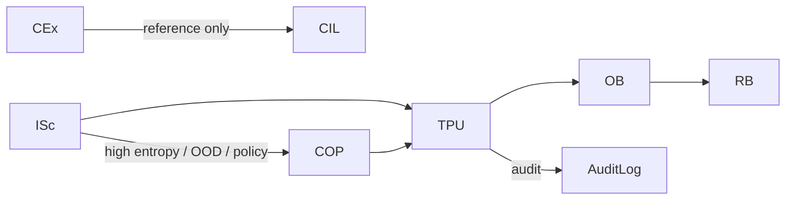

# **20.46_tpu_requirements.md**  
**TPU — TP‑UPDATE Subsystem Requirements**  
**Document ID:** 20.46  
**Version:** 0.5  
**Date:** 2026‑06‑12  
**Status:** Draft v0.5 — Architecture‑Aligned  
**Owner:** TS Architecture  
**Related:** 20.01, 20.10, 20.12, 20.20, 20.30, 20.32–20.34, 20.44, 20.90, 20.95, 20.105

---

# **1. Purpose**

The TP‑UPDATE subsystem (**TPU**) is the **sole deterministic gatekeeper** responsible for committing changes to the Thought Profile (TP). TPU enforces:

- writer authority (20.105)  
- safe‑boundary discipline (20.30)  
- canonical ordering (20.95)  
- atomicity  
- replay equivalence (20.12)  
- 1‑TP‑cycle lag semantics  

TPU receives structured `tp_update_request` objects from **Merge** and produces ISc → TPU → {OB → RB}, (Merge is performed inside TPU.).  
No subsystem other than TPU may mutate TP.

---

# **2. Scope**

TPU:

- validates update requests  
- enforces writer authority  
- enforces canonical ordering  
- enforces deterministic replay  
- enforces GB caps and TCU budgets  
- applies updates atomically  
- logs append‑only audit records  

TPU SHALL NOT generate meaning, interpret content, or modify semantics.

---

# **3. Architectural Positioning (Updated)**

TPU sits at the end of the **Inference Path**:

```
Inference Path:
    InB → IIInB → CEx → CE → ISc → TPU → {OB → RB}; {Path A basic}
```

Notes:

- **ISc** is the input‑side inference scorer (20.44).  
- **CEx/CE** provide bounded context for ISc.  
- **TPU** is the *only* safe writer to TP.  
- **TB/IB/GBIB/GB** are **post‑TS** and out of scope for this document.

---

# **4. Parent Scope**

TPU normatively decomposes obligations from:

- **20.105** — TP writer authority matrix  
- **20.12** — replay invariants  
- **20.30** — safe boundaries  
- **20.10** — deterministic governance  
- **20.44** — ISc → Merge → TPU update flow  
- **20.34** — COP propose‑only escalation model  

---

# **5. High‑Level Requirements (HLRs)**

### **HLR‑20.046‑001 — Sole Writer to TP**  
TPU SHALL be the only subsystem permitted to mutate TP instances.

### **HLR‑20.046‑002 — Deterministic Application**  
TPU SHALL apply updates deterministically and replay‑equivalently for identical inputs, TP(N), and execution signature.

### **HLR‑20.046‑003 — Writer Authority Enforcement**  
TPU SHALL strictly enforce the writer authority matrix defined in 20.105.

### **HLR‑20.046‑004 — Canonical Ordering**  
TPU SHALL enforce canonical ordering and serialization rules (20.95, 20.105 §10).

### **HLR‑20.046‑005 — Safe‑Boundary Commit**  
TPU SHALL commit updates only at GB‑approved deterministic safe boundaries.

### **HLR‑20.046‑006 — 1‑TP‑Cycle Lag**  
All upstream proposals SHALL be committed with a 1‑TP‑cycle lag, becoming visible only in TP(N+1).

### **HLR‑20.046‑007 — No Meaning Generation**  
TPU SHALL NOT generate meaning, perform interpretation, or modify semantic content.

### **HLR‑20.046‑008 — Atomicity**  
TPU SHALL apply updates atomically; partial or interleaved commits are forbidden.

### **HLR‑20.046‑009 — Audit Logging**  
TPU SHALL produce append‑only audit records for every update attempt.

### **HLR‑20.046‑010 — TCU & GB Caps**  
TPU SHALL enforce TCU budgets and GB caps. Violations SHALL trigger deterministic degradation and audit.

### **HLR‑20.046‑011 — Immutable Request**  
TPU SHALL treat `tp_update_request` as immutable; no field may be altered during validation or commit.

### **HLR‑20.046‑012 — Deterministic Fallback**  
On any validation failure, TPU SHALL produce deterministic fallback behavior (retain TP(N) + audit), with no partial mutation.

### **HLR‑20.046‑013 — COP Proposal Validation Only**  
TPU SHALL treat all COP‑refined outputs as proposals only and SHALL perform structural validation only.

### **HLR‑20.046‑014 — Merge Is Internal**  
TPU SHALL perform Merge as an internal deterministic process. Merge SHALL NOT appear as a pipeline primitive or stage

### **HLR‑20.046‑015 — No Interpretation of Reference‑Layer Content**  
TPU SHALL NOT interpret, transform, or semantically process any content originating from CIL, COB, or COP. TPU SHALL perform structural validation only.

---

# **6. Functional Boundaries (Updated)**

### **TPU owns:**  
- validation  
- writer authority enforcement  
- canonical ordering  
- atomic commit  
- audit logging  
- 1‑TP‑cycle lag semantics  

### **Merge owns:**  
- construction of well‑formed `tp_update_request` objects  

### **ISc / CIL / COB / COP own:**  
- proposal content generation within their writer authority  

### **Non‑Goals:**  
TPU does NOT perform:

- semantic interpretation  
- meaning generation  
- candidate expansion  
- intake repair  
- direct coprocessor calls  
- Pipeline B interaction  
- Path‑B semantic repair
- TPU does not interpret CIL/COB/COP content; see HLR‑20.046‑014.

---

# **7. Inputs (Updated)**

TPU receives a single structured, immutable request from Merge:

```
tp_update_request {
    isc { ... }          // from 20.44 (ISc-Scoring)
    cil { ... }          // from 20.33 (CIL reference)
    cob { ... }          // from 20.32 (COB reference)
    cop { ... }          // from 20.34 (COP propose-only)
    metadata {
        merge_version
        seed
        canonical_ordering_hash
        safe_boundary_marker?
    }
}
```

Notes:

- **TB is removed** — TB is post‑TS and out of scope.  
- **CEx/CE do not appear here** — they feed ISc, not TPU.

---

# **8. Outputs**

- **TP(N+1)** — updated Thought Profile  
- **tpu_audit_record{}** — append‑only audit entry  
- **tpu_error{}** — deterministic fallback object  

---

# **9. Writer Authority Enforcement (20.105)**

TPU SHALL enforce the following (excerpt; full matrix in 20.105):

| Source | Allowed Block(s) | Forbidden |
|--------|------------------|-----------|
| **ISc** | `isc{}` | All others |
| **CIL** | `cil{}` | All others |
| **COB** | `cob{}` | All others |
| **COP** | `cop{}` | All others |

Violations SHALL cause full request rejection and audit.

---

# **10. Update Application Process**

TPU SHALL execute the following deterministic sequence:

1. **Schema validation**  
2. **Writer authority check**  
3. **Canonical ordering validation**  
4. **Replay signature / safe‑boundary check**  
5. **GB cap verification**  
6. **Atomic application**  
7. **Audit record generation**  
8. **TP(N+1) emission**  

Any failure SHALL trigger deterministic fallback.

---

# **11. Canonical Ordering & Serialization**

TPU SHALL enforce canonical ordering rules:

- lexicographic ordering of keys  
- stable ordering of arrays  
- Q32.32 numeric formats  
- deterministic hashing  
- canonical serialization for audit logs  

---

# **12. Forbidden Actions**

TPU SHALL NOT:

- generate or interpret meaning  
- mutate `semantic_core`, conversation objects, or realization fields  
- bypass writer authority or safe boundaries  
- bypass Merge validation for COP outputs  
- perform intake repair  
- call coprocessors or interact with Pipeline B  
- reorder candidate sets  
- introduce nondeterminism  
- create or delete TP fields outside approved schema  
- perform partial commits  

---

# **13. Error Handling**

On failure, TPU SHALL emit:

```
tpu_error {
    code
    rationale
    fallback_behavior
    audit_record
}
```

Fallback SHALL be deterministic and SHALL NOT mutate TP.

---

# **14. Audit Logging**

Every update attempt SHALL produce an append‑only `tpu_audit_record{}` containing:

- request hash  
- TP(N) hash  
- TP(N+1) hash  
- writer authority validation results  
- safe‑boundary evidence  
- TCU usage  
- timestamp  

---

# **15. Verification Focus**

Verification SHALL include:

- writer authority violation rejection  
- 1‑TP‑cycle lag tests  
- replay equivalence tests  
- safe‑boundary / GB cap enforcement  
- canonical ordering conformance  
- atomicity under error conditions  
- ISc + COP escalation round‑trip validation  

---

# **16. Mermaid Diagram (Updated)**



---

# **17. Changelog**

| Version | Date       | Summary |
|---------|------------|---------|
| 0.5     | 2026‑06‑12 | Architecture‑aligned rewrite; removed TB from input pipeline; updated inference path; clarified ISc role; updated inputs; removed Path‑B semantics |
| 0.4     | 2026‑06‑10 | Final polish before architecture cleanup |
```

---
