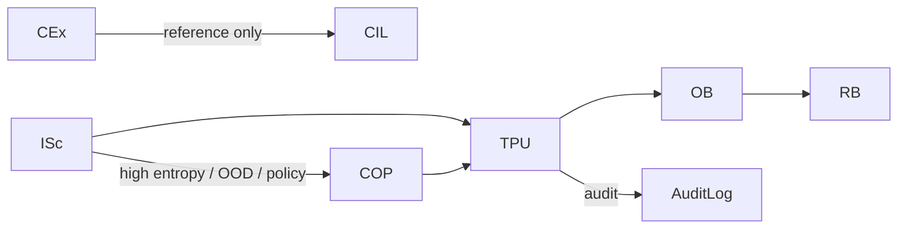

# **20.46 — TPU Requirements (Rewritten)**  
**TPU — TP‑UPDATE Subsystem Requirements**  
**Document ID:** 20.46  
**Version:** 1.0 (Structural Optimization Rewrite)  
**Date:** 2026‑07‑20  
**Status:** Draft — Architecture‑Aligned  
**Owner:** TS Architecture  
**Related:** 20.01, 20.10, 20.12, 20.20, 20.30, 20.32–20.34, 20.44, 20.90, 20.95, 20.105  

---

# **1. Purpose** *(Informative)*

The TP‑UPDATE subsystem (TPU) is the **sole deterministic gatekeeper** responsible for committing changes to the Thought Profile (TP).  
TPU enforces:

- writer authority (20.105)  
- safe‑boundary discipline (20.30)  
- canonical ordering (20.95)  
- atomicity  
- replay equivalence (20.12)  
- 1‑TP‑cycle lag semantics  

TPU receives structured `tp_update_request` objects from Merge and produces:

```
ISc → TPU → {OB → RB}
```

Merge is performed **inside** TPU.  
No subsystem other than TPU may mutate TP.

---

# **2. Scope** *(Informative)*

TPU:

- validates update requests  
- enforces writer authority  
- enforces canonical ordering  
- enforces deterministic replay  
- enforces GB caps and TCU budgets  
- applies updates atomically  
- logs append‑only audit records  

TPU does **not** generate meaning, interpret content, or modify semantics.

---

# **3. Architectural Position** *(Informative)*

TPU sits at the end of the Correction Group.  
After TPU, Path‑A proceeds through IMR and then the OB‑set structural interpretation group:

```
InB → IIInB → IE → ISc → CEx → CE → TPU → IMR
      → SOB → SROB → CnOB → SmOB → SSG
```

OB‑set constructs the stabilized structural geometry that enables routing and prepares TP for semantic interpretation by IdOB.

---

# **4. Parent Scope** *(Informative)*

TPU normatively decomposes obligations from:

- **20.105** — TP writer authority matrix  
- **20.12** — replay invariants  
- **20.30** — safe boundaries  
- **20.10** — deterministic governance  
- **20.44** — ISc → Merge → TPU update flow  
- **20.34** — COP propose‑only escalation model  

---

# **5. Normative Requirements (HLRs)**  
*(Reorganized, merged/split for clarity; all original information preserved)*

---

## **5.1 Core Writer & Commit Requirements**

### **HLR‑20.046‑001 — Sole Writer to TP**  
TPU SHALL be the only subsystem permitted to mutate TP.semantic, TP.process, and TP.metadata.

### **HLR‑20.046‑002 — Deterministic Application**  
TPU SHALL apply updates deterministically and replay‑equivalently for identical inputs, TP(N), and execution signature.

### **HLR‑20.046‑003 — Writer Authority Enforcement**  
TPU SHALL strictly enforce the writer authority matrix defined in 20.105.

### **HLR‑20.046‑004 — Canonical Ordering**  
TPU SHALL enforce canonical ordering and serialization rules.

### **HLR‑20.046‑005 — Safe‑Boundary Commit**  
TPU SHALL commit updates only at GB‑approved deterministic safe boundaries.

### **HLR‑20.046‑006 — 1‑TP‑Cycle Lag**  
All upstream proposals SHALL be committed with a 1‑TP‑cycle lag, becoming visible only in TP(N+1).

### **HLR‑20.046‑007 — No Meaning Generation**  
TPU SHALL NOT generate meaning, perform interpretation, or modify TP.semantic.

### **HLR‑20.046‑016 — Intake/Context Integrity**  
TPU SHALL NOT modify TP.intake, TP.context, or TP.process.identity_layer_prev.

---

## **5.2 Clarifying‑Field Commit Requirements**

### **HLR‑20.46‑017**  
TPU SHALL validate clarifying‑field metadata contained in `tp_update_request`, including fields, subfields, hierarchical levels, importance, and topology.

### **HLR‑20.46‑018**  
TPU SHALL enforce writer authority for clarifying‑field metadata exactly as defined in 20.105.

### **HLR‑20.46‑019**  
TPU SHALL commit clarifying‑field metadata atomically as a single deterministic unit.

### **HLR‑20.46‑020**  
TPU SHALL preserve clarifying‑field provenance, including producer identity, last‑update identity, and commit lineage.

### **HLR‑20.46‑021**  
TPU SHALL enforce canonical ordering for clarifying‑field metadata, including deterministic ordering of fields, subfields, hierarchical levels, and importance scores.

### **HLR‑20.46‑022**  
TPU SHALL maintain clarifying‑field continuity across TP(N) → TP(N+1).

### **HLR‑20.46‑023**  
TPU SHALL include clarifying‑field metadata in `tpu_audit_record{}` whenever clarifying fields or importance are updated, pruned, compressed, or dropped.

### **HLR‑20.46‑024**  
TPU SHALL apply clarifying‑field updates with 1‑TP‑cycle lag semantics.

### **HLR‑20.46‑025**  
TPU SHALL reject clarifying‑field updates that violate bounded limits (10 fields, 100 subfields, 4 levels) and SHALL produce deterministic fallback behavior and audit.

### **HLR‑20.46‑026**  
TPU SHALL guarantee deterministic replay of clarifying‑field metadata.

---

## **5.3 Atomicity & Audit Requirements**

### **HLR‑20.046‑008 — Atomicity**  
TPU SHALL apply updates atomically; partial or interleaved commits are forbidden.

### **HLR‑20.046‑009 — Audit Logging**  
TPU SHALL produce append‑only audit records for every update attempt.

### **HLR‑20.046‑010 — TCU & GB Caps**  
TPU SHALL enforce TCU budgets and GB caps; violations SHALL trigger deterministic degradation and audit.

### **HLR‑20.046‑011 — Immutable Request**  
TPU SHALL treat `tp_update_request` as immutable; no field may be altered during validation or commit.

### **HLR‑20.046‑012 — Deterministic Fallback**  
On validation failure, TPU SHALL produce deterministic fallback behavior (retain TP(N) + audit), with no partial mutation.

---

## **5.4 Merge & Proposal Requirements**

### **HLR‑20.046‑013 — COP Proposal Validation Only**  
TPU SHALL treat all COP‑refined outputs as proposals only and SHALL perform structural validation only.

### **HLR‑20.046‑014 — Merge Is Internal**  
TPU SHALL perform Merge as an internal deterministic process. Merge SHALL NOT appear as a pipeline primitive or stage.

### **HLR‑20.046‑015 — No Interpretation of Reference‑Layer Content**  
TPU SHALL NOT interpret, transform, or semantically process any content originating from CIL, COB, or COP.

---

# **6. Functional Boundaries** *(Informative)*

### **TPU owns:**  
- validation  
- writer authority enforcement  
- canonical ordering  
- atomic commit  
- audit logging  
- 1‑TP‑cycle lag semantics  
- ΔH% interpretation per 20.30  

### **Merge owns:**  
- construction of well‑formed `tp_update_request` objects  

### **ISc / CIL / COB / COP own:**  
- proposal content generation within their writer authority  

### **Non‑Goals:**  
TPU does not perform semantic interpretation, meaning generation, candidate expansion, intake repair, coprocessor calls, Pipeline‑B interaction, or Path‑B semantic repair.

---

# **7. Inputs** *(Informative)*

TPU receives a single structured, immutable request from Merge:

```json
tp_update_request {
  isc { ... }
  cil { ... }
  cob { ... }
  cop { ... }
  metadata {
    merge_version
    seed
    canonical_ordering_hash
    safe_boundary_marker?
  }
}
```

TB is removed; CEx/CE do not appear here.

---

# **8. Outputs** *(Informative)*

- **TP(N+1)** — updated Thought Profile  
- **tpu_audit_record{}** — append‑only audit entry  
- **tpu_error{}** — deterministic fallback object  

TPU writes updates only to:

- **TP.semantic**  
- **TP.process**  
- **TP.metadata**

---

# **9. Writer Authority Enforcement** *(Informative)*

| Source | Allowed Block(s) | Forbidden |
|--------|------------------|-----------|
| **ISc** | `isc{}` | All others |
| **CIL** | `cil{}` | All others |
| **COB** | `cob{}` | All others |
| **COP** | `cop{}` | All others |

Violations cause full request rejection and audit.

---

# **10. Update Application Process** *(Informative)*

TPU executes the following deterministic sequence:

1. schema validation  
2. writer authority check  
3. canonical ordering validation  
4. replay signature / safe‑boundary check  
5. GB cap verification  
6. atomic application  
7. audit record generation  
8. TP(N+1) emission  

Any failure triggers deterministic fallback.

---

# **11. Canonical Ordering & Serialization** *(Informative)*

TPU enforces:

- lexicographic key ordering  
- stable array ordering  
- Q32.32 numeric formats  
- deterministic hashing  
- canonical serialization for audit logs  

---

# **12. Forbidden Actions** *(Informative)*

TPU does **not**:

- generate or interpret meaning  
- mutate semantic_core or conversation objects  
- bypass writer authority  
- bypass safe boundaries  
- bypass Merge validation  
- perform intake repair  
- call coprocessors  
- reorder candidate sets  
- introduce nondeterminism  
- create/delete TP fields outside schema  
- perform partial commits  

---

# **13. Error Handling** *(Informative)*

On failure, TPU emits:

```json
tpu_error {
  code,
  rationale,
  fallback_behavior,
  audit_record
}
```

Fallback is deterministic and does not mutate TP.

---

# **14. Audit Logging** *(Informative)*

Every update attempt produces an append‑only `tpu_audit_record{}` containing:

- request hash  
- TP(N) hash  
- TP(N+1) hash  
- writer authority validation results  
- safe‑boundary evidence  
- TCU usage  
- timestamp  

---

# **15. Verification Focus** *(Informative)*

Verification includes:

- writer authority violation rejection  
- 1‑TP‑cycle lag tests  
- replay equivalence tests  
- safe‑boundary / GB cap enforcement  
- canonical ordering conformance  
- atomicity under error conditions  
- ISc + COP escalation round‑trip validation  

---

# **16. Mermaid Diagram** *(Informative)*



---

# **End of Document — 20.46 (Rewritten)**

---
