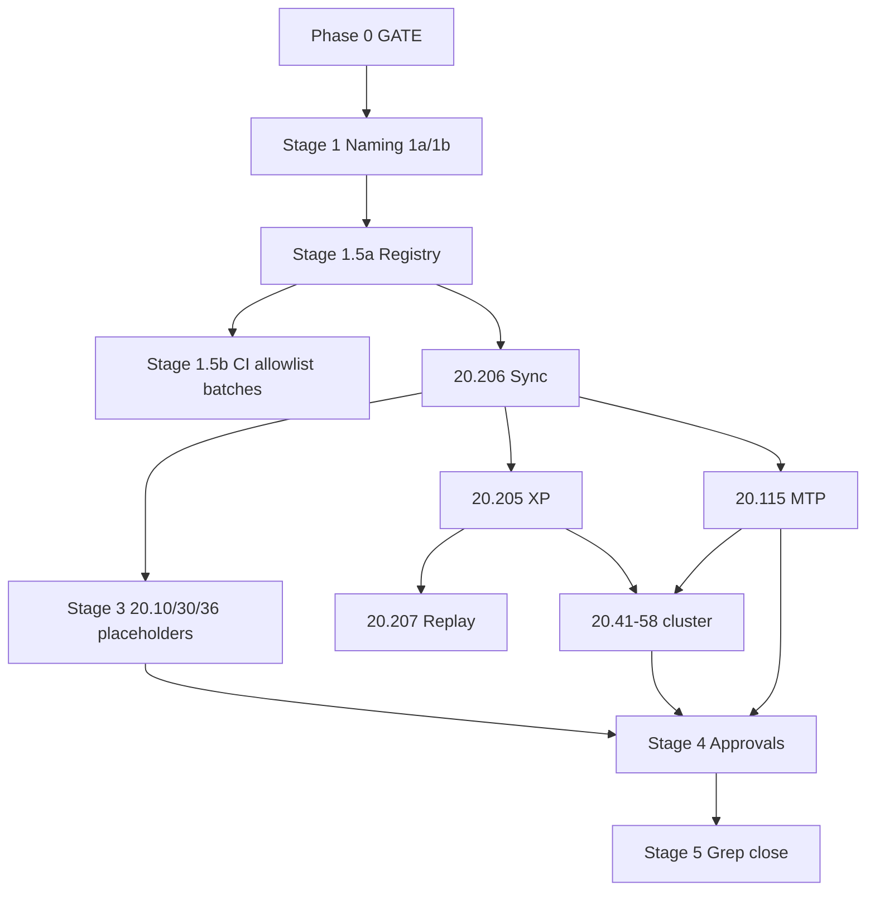

# 20.500 Refactoring for Dual TS Pipeline

**Document ID:** 20.500  
**Version:** 0.2  
**Date:** 2026-06-06  
**Status:** Active — Phase 0 complete; Stage 1a complete; **Stage 2 drafts complete** (awaiting Stage 4 approval)

## Purpose

This document is the **single coordination hub** for the multi-day refactor that formalizes the Thought Simulator **dual-pipeline architecture** across the 20-series and related artifacts.

**This document is NOT normative TS runtime requirements.** It does not override [20.12_ts_invariants.md](20.12_ts_invariants.md), bootstrap documents (20.10, 20.20, 20.30), or CP-approved module HLRs. It tracks **what to change, in what order, with what approval, and when**.

**Reviewers:** CuriousOne23, Copilot, Grok — consensus required where marked **GATE**.

**Bootstrap stability (additive clarifications only during this program):** [20.10](20.10_ts_architectural_principles.md), [20.12](20.12_ts_invariants.md), [20.20](20.20_ts_primitives.md), [20.30](20.30_ts_functional_model.md). HLR IDs in these documents SHALL NOT be renumbered without an explicit **GATE**.

**How to use this document:** Treat §2–§3 as the execution contract. Update status columns in §7 as work progresses. **Phase 0 signed 2026-06-06**; **Stage 1a complete 2026-06-06** (§5). Current GATE: **Stage 1.5a** (registry locked) → **§6 CI manifest** review, then Stage 2 rough drafts. Stage 2 may run in parallel with 1.5b allowlist batches once §6 is approved.

---

## 1. Architectural Summary (Reference)

### 1.1 Pipeline A — Meaning Construction

- **Topology:** Lane-parallel (split/merge, many TPs per cycle)
- **Flow:** InB → RB → OB → DCB → (if `tr_needs_update`) TR → TB → Merge → ΔH% → Truth/Done → **`mtp_update`**
- **Carriers:** **TP** (lane-local, minimal deterministic state carrier + history) → **MTP / `semantic_core`** (global authoritative meaning)
- **Replay:** Meaning replay reconstructs `semantic_core` deterministically

### 1.2 Pipeline B — Realization / Execution

- **Topology:** **Singular per cycle** — one pass per committed MTP / `semantic_core` (no lanes, no split/merge, no TP-B)
- **Flow:** SRP lookup (hot path) → TrigRB → exec planning → OpBeh/OBG/XlateR → OuB → IMR evaluation
- **Carrier:** **XP** (Execution Packet — one per MTP commit per cycle; logical aggregate of `exec_plan` + `exec_trace` + B audit)
- **Inputs:** Frozen committed `semantic_core` only (+ `routing_epoch_id`, `policy_signature`, seed for expression)
- **Outputs:** `exec_plan`, `exec_trace`, bounded supervisory triggers — **no `semantic_core` writes**
- **Replay:** B is **not in the meaning equivalence class** (HLR-20.012-011 strip); B envelopes are **derivable / regenerable** from committed meaning for full-trace fidelity (HLR-20.012-012) — B is realization evidence, not meaning authority

### 1.3 Boundary at MTP

| Side | Authority |
|------|-----------|
| **Before `mtp_update`** | Pipeline A only; lane TPs, Merge, Truth/Done |
| **After `mtp_update`** | Committed `semantic_core` frozen; Pipeline B may start |
| **Handoff** | Formalized in **20.206** (draft pending) |

### 1.4 Envelope Partition

| Artifact | Pipeline | Replay (meaning) | Replay (full trace) |
|----------|----------|------------------|---------------------|
| **TP** | A (lane-local) | Lane history / provenance | A fixtures |
| **MTP / `semantic_core`** | A (global) | **Authoritative** | Required |
| **XP** (`exec_plan` + `exec_trace` + B audit) | B (MTP-scoped) | Strippable | Regenerable |
| **`supervisory`** | GB / IMR triggers | Bounded triggers only | Append-only audit |

### 1.5 Namespace Discipline (Non-Negotiable)

Execution-layer symbols (**OpBeh, OBG, XlateR, TrigRB, SRP, IMR, XP**) SHALL NOT alias meaning-layer basin symbols (**OB, TR, RB, TB, DCB**) per HLR-20.012-015.

**Example:** basin **OB** (Object Basin) remains **OB** on Pipeline A; execution uses **OpBeh** (Operational Behavior) on Pipeline B — never **OB**.

---

## 2. Phase 0 Invariants (GATE — Signed 2026-06-06)

All three reviewers signed **2026-06-06**. **Stage 1** naming resolution is unblocked.

| # | Invariant | Status |
|---|-----------|--------|
| P0-1 | TP = lane-local, Pipeline A only; lane history for A provenance — **not** B input | ☑ Signed |
| P0-2 | MTP / `semantic_core` = global meaning authority after Merge / Truth-Done / `mtp_update` | ☑ Signed |
| P0-3 | Pipeline B = **one pass per MTP commit** per cycle; no lanes, split/merge, sequencing, or TP-B | ☑ Signed |
| P0-4 | B inputs = committed `semantic_core` only (no TP instances, no `lane_id`) | ☑ Signed |
| P0-5 | B outputs = `exec_plan` + `exec_trace` + bounded supervisory triggers; no `semantic_core` writes | ☑ Signed |
| P0-6 | **Meaning replay** = strip B → identical `semantic_core` (HLR-20.012-011) | ☑ Signed |
| P0-7 | **Seed** affects B expression/realization only — not `semantic_core` (HLR-20.012-010) | ☑ Signed |

**Phase 0 program decision (OQ-003):** [20.12](20.12_ts_invariants.md) = **no-touch** for body text during this refactor; naming collisions via §5 registry and Stage 4 per-doc edits only; annex only if a specific cross-ref gap blocks 20.206 (requires **GATE**). Recorded §7.3.

**Sign-off record:**

| Reviewer | Date | Notes |
|----------|------|-------|
| CuriousOne23 | 2026-06-06 | Sign P0; OQ-003 = no-touch |
| Copilot | 2026-06-06 | Co-signed §12 + §2 |
| Grok | 2026-06-06 | P0-1…P0-7 + OQ-003 no-touch aligned |

---

## 3. Staged Refactor Process

### Stage 0 — Phase 0 Invariants (GATE)

See §2. **No Stage 1+ work until all P0-1…P0-7 rows are signed.**

```text
Stage 0  → Phase 0 invariants (GATE) — §2
Stage 1  → Naming & namespace resolution (1a blocking / 1b deferred)
Stage 1.5a → Naming registry in this document
Stage 1.5b → Mechanical apply (CI/schemas/harness ALLOWLIST only; CI green per batch)
Stage 2  → New document rough drafts (unapproved)
Stage 3  → Selective existing-doc reposition (Pipeline A preserved)
Stage 4  → Iterative review & approval (per document)
Stage 5  → Consistency grep & close-out
```

### Stage 1 — Naming & Namespace Resolution

**Goal:** Stable terminology before normative B drafting.

**1a — Blocking (must resolve before Stage 2):** ✅ **Complete 2026-06-06** (§5)

- ~~XP (Execution Packet)~~ → **`XP`** agreed — logical wrapper over `exec_plan` + `exec_trace` + B audit; one per `commit_id`; not TP-B
- ~~MTP commit marker~~ → **`commit_id`** canonical (OQ-001); `mtp_snapshot_id` deprecated alias
- ~~Pipeline A / Pipeline B / `semantic_core`~~ → agreed (§5)
- ~~OpBeh / OBG / XlateR vs OB / TR / RB~~ → agreed; namespace non-aliasing per HLR-20.012-015
- ~~TrigRB vs TR / RB~~ → **TrigRB** = semantic trigger detector; ≠ TR (Thought Router) or RB (Relational Basin)
- ~~IMR Type B vs IMR~~ → **IMR** = primitive; **IMR Type B** = semantic-mismatch trigger class (`CorrectionTrigger` → next A cycle per 20.45)
- ~~`routing_epoch_id`~~ → execution layer only (agreed)

**1b — Deferred (may resolve during Stage 2/4):**

- Fine-grained trigger IDs, table column names, harness label details

**Tracked in:** §5 Naming Registry below.

---

### Stage 1.5a — Naming Registry (No Mass Edit)

Populate §5. **No repo-wide renames** until registry rows reach **agreed** status.

---

### Stage 1.5b — Global Naming Application (Allowlist Only)

**Owner:** Grok executes batches; **CuriousOne23 + Copilot** approve allowlist per batch.

**Scope (when on allowlist):**

- `.md` (non–CP-approved normative modules first: glossary, examples)
- `.json` (schemas, registries, fixtures)
- `.py` (harnesses, validators, scripts)
- **CI files** (see §6 CI Manifest)
- CI-referenced files and CI tables
- Routing table seeds, config examples, tests

**Rules:**

- No structural changes
- No semantic / meaning-construction changes
- No Pipeline B content insertions
- **Naming updates only**
- CP-approved normative modules (§8 re-review queue) — **excluded** until Stage 4 per-doc approval
- Bootstrap HLR IDs — **no renumbering** in mechanical pass
- Each batch: CI green, file list logged in §7.2

---

### Stage 2 — New Documents (Rough Drafts, Unapproved)

**Order is logical dependency, not strict sequencing** — drafts may be sketched in parallel when upstream dependencies are respected; all remain unapproved until Stage 4.

**Internal draft order:**

| Order | Document | Purpose | Status | Created | Depends on |
|-------|----------|---------|--------|---------|------------|
| 1 | [20.206](20.206_pipeline_a_b_synchronization_contract.md) | A↔B handoff, freeze, equivalence classes | `draft` | 2026-06-06 | P0 GATE, Stage 1a |
| 2 | [20.205](20.205_execution_packet_xp_requirements.md) | XP topology — one per MTP commit | `draft` | 2026-06-06 | 20.206 draft |
| 3 | [20.115](20.115_mtp_requirements.md) | MTP hardening — global integrator + B input | `draft` | 2026-06-06 | 20.206 draft |
| 4 | [20.207](20.207_execution_replay_specification.md) | B regeneration semantics | `draft` | 2026-06-06 | 20.205, 20.206 |
| 5 | [20.55](20.55_srp_requirements.md) | SRP cold/hot path, epoch tables | `draft` | 2026-06-06 | 20.206 |
| 6 | [20.56](20.56_routing_table_schema.md) | Epoch-coherent routing tables | `draft` | 2026-06-06 | 20.55 |
| 7 | [20.57](20.57_trig_rb_semantic_trigger_requirements.md) | TrigRB semantic triggers | `draft` | 2026-06-06 | 20.205, 20.115 |
| 8 | [20.41](20.41_opbeh_requirements.md) | OpBeh registry + planning | `draft` | 2026-06-06 | 20.56 |
| 9 | [20.42](20.42_obg_requirements.md) | OBG register/voice | `draft` | 2026-06-06 | 20.56 |
| 10 | [20.43](20.43_xlater_requirements.md) | XlateR mapping routine | `draft` | 2026-06-06 | 20.56 |
| 11 | [20.58](20.58_oub_execution_manifold_integration.md) | OuB ↔ execution manifold | `draft` | 2026-06-06 | 20.110, 20.205 |

**Note:** 20.110 OuB exists — Stage 2 may **harden** 20.110 vs duplicate in 20.58; record decision in §9.

---

### Stage 3 — Update Existing Documents (Pipeline A Preserved)

**Allowed for:**

| Document | Action | Status | Updated | Notes |
|----------|--------|--------|---------|-------|
| [20.10](20.10_ts_architectural_principles.md) | Reposition under Pipeline A; dual-pipeline placeholder sections (**additive**) | `not_started` | | No HLR renumber without GATE |
| [20.30](20.30_ts_functional_model.md) | Add MTP-scoped B topology subsection; A sections preserved | `not_started` | | Bootstrap — clarify only |
| [20.36](20.36_canonical_end_to_end_trace.md) | Assertion checklist in 20.500 §10; minimal inline TODOs | `not_started` | | |

**Deferred / minimal touch (Stage 4 re-review only):**

| Document | Current version | Stage 3 action |
|----------|-----------------|----------------|
| [20.105](20.105_tp_requirements.md) | v0.4 CP-approved | **No Stage 3 edits** — boundary cross-ref in Stage 4 if CP approves |
| [20.106](20.106_dcb_requirements.md) | v0.3 CP-approved | Re-review queue only |
| [20.140](20.140_truth_evaluation_requirements.md) | v0.3 CP-approved | Re-review queue only |
| [20.37](20.37_thought_router_tr_specification.md) | v0.3 CP-approved | Re-review queue only |
| [20.40](20.40_ob_requirements.md) | v0.3 CP-approved | Re-review queue only |
| [20.50](20.50_rb_requirements.md) | v0.3 CP-approved | Re-review queue only |
| [20.60](20.60_tb_requirements.md) | v0.3 CP-approved | Re-review queue only |

**Rules:**

- Do **not** delete or rewrite Pipeline A meaning semantics
- Do **not** insert Pipeline B normative content in Stage 3
- Placeholder comments only where listed above

---

### Stage 4 — Iterative Review & Approval (GATE per document)

**Workflow per document:**

1. Grok drafts or updates (or Stage 2 rough promoted to normative draft)
2. Copilot + CuriousOne23 review
3. Iterate until aligned
4. Mark **approved** in §7.1 with date and version target
5. If CP-approved module: record **second-pass** approval separately

**Consensus rule:**

| Document type | Approval |
|---------------|----------|
| Normative requirements (20.xxx) | All three |
| 20.500 coordination updates | All three |
| Stage 1.5b allowlist batches | CuriousOne23 + Copilot (Grok executes) |
| Stage 3 placeholders | CuriousOne23 + Copilot |

---

### Stage 5 — Consistency Grep & Close-Out

**Repo-wide checks before closing 20.500 program:**

- [ ] No `lane_id` / `tp_id` references in Pipeline B / XP / `exec_*` normative fixtures
- [ ] No "per TP" + Pipeline B coupling in requirements
- [ ] No TP-B or TP_B artifacts
- [ ] Namespace: OpBeh/OBG/XlateR not aliased to OB/TR/RB in new docs
- [ ] 20.200 traceability matrix updated
- [ ] [20.190_glossary.md](20.190_glossary.md) includes XP, MTP commit boundary, dual-pipeline terms
- [ ] CI manifests (§6) all green

**Close-out:** Set 20.500 status to `complete` with final date; archive open questions or spin follow-on tickets.

---

## 4. Document Inventory

### 4.1 Existing — Major Update or Harden

| ID | Document | Stage | Priority | Status | Target ver | Approved | Blocked by |
|----|----------|-------|----------|--------|------------|----------|------------|
| 20.10 | Architectural principles | 3→4 | P1 | `not_started` | TBD | | P0 |
| 20.30 | Functional model | 3→4 | P1 | `not_started` | TBD | | P0 |
| 20.115 | MTP requirements | 2→4 | **P0** | `draft` | v0.2 | | P0, 20.206 |
| 20.36 | Canonical trace / replay | 3→4 | P2 | `not_started` | v0.4+ | | 20.205, 20.206 |

### 4.2 Existing — Clarification / Cross-Ref / Re-Review

| ID | Document | Action | Status |
|----|----------|--------|--------|
| 20.12 | TS invariants | **No-touch** body text (OQ-003); §5 + Stage 4 cross-refs only; annex requires GATE if 20.206 blocked | `no_touch` |
| 20.20 | TS primitives | No-touch unless GATE; cross-ref only | `deferred` |
| 20.31 | Semantic specification | `mtp_update` freeze cross-ref | `not_started` |
| 20.120 | MTP schema | Align with 20.115 hardening; field names follow Stage 1a | `not_started` |
| 20.38 | Implementation guidelines | B read guards (no `tp_id`) | `not_started` |
| 20.39 | Core data structures | XP vs TpLaneView vs exec envelopes | `not_started` |
| 20.45 | IMR requirements | Type B → next A cycle | `not_started` |
| 20.105 | TP requirements | Light boundary note (Stage 4) | `deferred` |
| 20.106 | DCB | Re-review | `deferred` |
| 20.140 | Truth/Done | Re-review | `deferred` |
| 20.37–20.60 | Basin chain | Re-review | `deferred` |
| 20.110 | OuB | Stage 4 harden per 20.58 integration contract (OQ-004) | `deferred` |
| 20.190 | Glossary | XP, dual-pipeline terms | `not_started` |
| 20.200 | Traceability matrix | New doc IDs | `not_started` |

### 4.3 New — To Create

Listed in §3 Stage 2 table. File paths are conventional placeholders until created.

---

## 5. Naming Registry

**Legend:** `agreed` | `pending` | `deferred` | `collision`  
**Stage 1a status:** ✅ **Complete 2026-06-06** — all blocking rows `agreed`. Stage 1.5b may proceed per-row on allowlist; wire IDs remain Stage 1b.

### 5.1 Architecture & Meaning (Pipeline A)

| Canonical | Aliases (deprecated) | Scope | Layer | Status | Decided | Owner | Notes |
|-----------|----------------------|-------|-------|--------|---------|-------|-------|
| Pipeline A | Meaning construction, Phase 1 | Lane-parallel TP → MTP | Architecture | `agreed` | 2026-06-06 | 20.12, 20.30 | Writers: `semantic_core` only |
| TP | Thought Packet | Lane-local A carrier | Meaning | `agreed` | 2026-06-06 | Prior specs | 20.105 v0.4 |
| MTP | Master Thought Packet | Global meaning aggregate | Meaning | `agreed` | 2026-06-06 | Prior specs | Needs 20.115 hardening |
| `semantic_core` | | Committed meaning envelope | Meaning | `agreed` | 2026-06-06 | 20.12 | Authoritative after `mtp_update` |
| `mtp_update` | | Commit event at A/B boundary | Meaning | `agreed` | 2026-06-06 | 20.30 | Freezes meaning; emits `commit_id` |
| `commit_id` | `mtp_snapshot_id` | MTP commit marker at `mtp_update` | Meaning | `agreed` | 2026-06-06 | CuriousOne23 | OQ-001; legacy rename Stage 4 per-doc only |
| OB | Object Basin | | Meaning | `agreed` | 2026-06-06 | 20.20 | ≠ OpBeh |
| TR | Thought Router | | Meaning | `agreed` | 2026-06-06 | 20.37 | ≠ TrigRB |
| RB | Relational Basin | | Meaning | `agreed` | 2026-06-06 | 20.50 | ≠ TrigRB |
| TB | Truth Basin | | Meaning | `agreed` | 2026-06-06 | 20.20 | A-only interpretation |
| DCB | Directional Conversation Basin | | Meaning (meta-basin) | `agreed` | 2026-06-06 | 20.106 | Geometric; ≠ execution layer |

### 5.2 Execution / Realization (Pipeline B)

| Canonical | Aliases (deprecated) | Scope | Layer | Status | Decided | Owner | Notes |
|-----------|----------------------|-------|-------|--------|---------|-------|-------|
| Pipeline B | Execution Manifold, realization | One pass per `commit_id` | Architecture | `agreed` | 2026-06-06 | 20.12, 20.30 | No lanes; no TP input |
| XP | Execution Packet | One per `commit_id` per cycle | Execution | `agreed` | 2026-06-06 | Grok | OQ-002: logical wrapper over `exec_plan` + `exec_trace` + B audit; **not** TP-B; respects HLR-20.012-004 |
| `exec_plan` | | Planning envelope | Execution | `agreed` | 2026-06-06 | 20.12 | Holds `opbeh_id`, `obg_id`, `xlater_id`, `routing_epoch_id` |
| `exec_trace` | | Expression/feedback envelope | Execution | `agreed` | 2026-06-06 | 20.12 | Holds OuB refs, IMR records |
| OpBeh | Operational Behavior | Registry + planning primitive | Execution | `agreed` | 2026-06-06 | 20.20 | ≠ OB; wire: `opbeh_id` |
| OBG | Operational Behavior Group | Register/voice identity primitive | Execution | `agreed` | 2026-06-06 | 20.20 HLR-20.020-020 | ≠ OB; wire: `obg_id` |
| XlateR | Translation Routine | Expression mapping primitive | Execution | `agreed` | 2026-06-06 | 20.20 | ≠ TR; wire: `xlater_id` |
| TrigRB | Semantic trigger detector | Trigger detection (hot path) | Execution | `agreed` | 2026-06-06 | 20.20 | ≠ TR, ≠ RB; doc 20.57 |
| SRP | Semantic Routing Planner | Cold-path table compile | Execution | `agreed` | 2026-06-06 | 20.12 | Hot path = lookup only; doc 20.55 |
| IMR | Interpretation Mismatch Routine | Expression/feedback evaluator | Execution | `agreed` | 2026-06-06 | 20.45 | Types A/B/C; writes `exec_trace` + supervisory triggers only |
| IMR Type B | Semantic mismatch (class) | Subtype of IMR taxonomy | Execution | `agreed` | 2026-06-06 | 20.45 | Emits `CorrectionTrigger` → bounded next A cycle; **not** a separate primitive |
| IMR Type A | Expression mismatch (class) | Subtype of IMR taxonomy | Execution | `agreed` | 2026-06-06 | 20.45 | Realization retry only; no A writes |
| IMR Type C | Safety mismatch (class) | Subtype of IMR taxonomy | Execution | `agreed` | 2026-06-06 | 20.45 | GB-gated |
| OuB | Output Basin | Expression artifact producer | Expression | `agreed` | 2026-06-06 | 20.20 | Reads frozen `semantic_core`; B-phase expression |
| `routing_epoch_id` | | Published routing table epoch | Execution | `agreed` | 2026-06-06 | 20.12 | On `exec_plan`/`exec_trace`; **not** on TP |

### 5.3 Stage 1b — Deferred Wire IDs & Fine-Grained Labels

| Canonical | Aliases (deprecated) | Scope | Layer | Status | Decided | Owner | Notes |
|-----------|----------------------|-------|-------|--------|---------|-------|-------|
| `opbeh_id` | | OpBeh registry reference | Execution wire | `deferred` | | Stage 1b | Resolve in 20.41 / 20.56 fixtures |
| `obg_id` | | OBG registry reference | Execution wire | `deferred` | | Stage 1b | Resolve in 20.42 / 20.56 fixtures |
| `xlater_id` | | XlateR registry reference | Execution wire | `deferred` | | Stage 1b | Resolve in 20.43 / 20.56 fixtures |
| `exec_trigger_id` | | TrigRB firing reference | Execution wire | `deferred` | | Stage 1b | Resolve in 20.57 |
| `CorrectionTrigger` | | IMR Type B supervisory signal | Execution wire | `deferred` | | Stage 1b | 20.45 schema; A consumes next cycle |
| CIL | Conversation Input Layer | | Conversation | `deferred` | | Stage 1b | 20.33 — separate from CI; **GATE** if touched |

*Do not run Stage 1.5b on a row until `agreed`. Stage 1b rows resolve during Stage 2/4 drafting.*

---

## 6. CI Manifest (Stage 1.5b Allowlist Source)

**“CI” in this program means:**

1. **Continuous integration** — GitHub Actions workflows and validation scripts they invoke  
2. **CI-referenced artifacts** — files and tables those workflows read (fixtures, registries, schemas)  
3. **CIL** (Conversation Input Layer, 20.33) — separate naming row; include only when CIL touch is approved  

**CuriousOne23 + Copilot own manifest completeness before each 1.5b batch.**

### 6.1 CI Workflow Entrypoints (Known)

| Path | Purpose | In 1.5b allowlist? |
|------|---------|-------------------|
| [.github/workflows/thought-simulator-doc-dependency-check.yml](../../.github/workflows/thought-simulator-doc-dependency-check.yml) | Doc dependency check | ☐ TBD |
| [.github/workflows/validate_design_traceability.yml](../../.github/workflows/validate_design_traceability.yml) | Design traceability | ☐ TBD |
| [.github/workflows/pages.yml](../../.github/workflows/pages.yml) | Pages deploy | ☐ TBD |

### 6.2 CI-Referenced Scripts & Registries (Known)

| Path | Purpose | In 1.5b allowlist? |
|------|---------|-------------------|
| [thought_simulator/scripts/validate_glossary_alignment.py](../scripts/validate_glossary_alignment.py) | Glossary alignment | ☐ TBD |
| [thought_simulator/scripts/validate_requirements_glossary_alignment.py](../scripts/validate_requirements_glossary_alignment.py) | Requirements glossary | ☐ TBD |
| [thought_simulator/scripts/validate_requirements_glossary_scope.py](../scripts/validate_requirements_glossary_scope.py) | Glossary scope | ☐ TBD |
| [thought_simulator/scripts/validate_50_glossary_alignment.py](../scripts/validate_50_glossary_alignment.py) | 50-series glossary | ☐ TBD |
| [thought_simulator/20_requirements/glossary_term_registry.json](glossary_term_registry.json) | Term registry | ☐ TBD |
| [thought_simulator/30_verification/glossary_term_registry.json](../30_verification/glossary_term_registry.json) | Verification glossary | ☐ TBD |
| [thought_simulator/50_thought_simulator_design/glossary_term_registry.json](../50_thought_simulator_design/glossary_term_registry.json) | Design glossary | ☐ TBD |

### 6.3 CI Tables / Fixtures (To Be Completed)

| Path | Purpose | In 1.5b allowlist? |
|------|---------|-------------------|
| `thought_simulator/30_verification/` | Verification capsules | ☐ TBD |
| `thought_simulator/40_thought_simulator_playground/` | Harness fixtures | ☐ TBD |
| *routing table seeds* | TBD when 20.56 drafted | ☐ TBD |

*Extend this table before each Stage 1.5b batch. Log touched files in §7.2.*

---

## 7. Tracking Tables

### 7.1 Document Approval Log

| Document | Version | Stage | Status | Drafted | Approved | Approvers | Second-pass? |
|----------|---------|-------|--------|---------|----------|-----------|--------------|
| 20.500 | 0.2 | — | `approved` | 2026-06-06 | 2026-06-06 | CuriousOne23, Copilot, Grok | — |
| 20.206 | 0.1 | 2 | `draft` | 2026-06-06 | | | — |
| 20.205 | 0.1 | 2 | `draft` | 2026-06-06 | | | — |
| 20.115 | 0.2 | 2→4 | `draft` | 2026-06-06 | | | — |
| 20.207 | 0.1 | 2 | `draft` | 2026-06-06 | | | — |
| 20.55 | 0.1 | 2 | `draft` | 2026-06-06 | | | — |
| 20.56 | 0.1 | 2 | `draft` | 2026-06-06 | | | — |
| 20.57 | 0.1 | 2 | `draft` | 2026-06-06 | | | — |
| 20.41 | 0.1 | 2 | `draft` | 2026-06-06 | | | — |
| 20.42 | 0.1 | 2 | `draft` | 2026-06-06 | | | — |
| 20.43 | 0.1 | 2 | `draft` | 2026-06-06 | | | — |
| 20.58 | 0.1 | 2 | `draft` | 2026-06-06 | | | — |
| 20.10 | — | 3→4 | `not_started` | | | | — |
| 20.30 | — | 3→4 | `not_started` | | | | — |
| 20.36 | 0.3→ | 3→4 | `not_started` | | | | — |
| 20.105 | 0.4 | 4 | `deferred` | | 2026-06-06 | CP | Y — boundary only |

*Status values:* `not_started` | `draft` | `review` | `blocked` | `approved` | `deferred`

### 7.2 Stage 1.5b Batch Log

| Batch ID | Date | Allowlist summary | Files touched | CI green? | Approvers |
|----------|------|-------------------|---------------|-----------|-----------|
| | | | | | |

### 7.3 Open Questions

| ID | Question | Owner | Status | Resolution |
|----|----------|-------|--------|------------|
| OQ-001 | Canonical MTP commit marker: `mtp_snapshot_id` vs `commit_id`? | Stage 1a | `resolved` | **`commit_id`** canonical (CuriousOne23, 2026-06-06); `mtp_snapshot_id` deprecated alias |
| OQ-002 | XP = logical wrapper over `exec_plan`+`exec_trace` vs new envelope? | 20.205 | `resolved` | **Logical wrapper** (§5.2 XP row); not a fourth envelope writer; respects HLR-20.012-004 — 2026-06-06 |
| OQ-003 | 20.12 annex vs no-touch during refactor? | All three | `resolved` | **No-touch** for 20.12 body; §5 registry + Stage 4 per-doc for naming; annex only via GATE if 20.206 blocked — signed 2026-06-06 (all three) |
| OQ-004 | Harden 20.110 vs new 20.58 for OuB integration? | Stage 2 | `resolved` | **20.58** = B-integration contract; **20.110** harden Stage 4 (not duplicate) — 2026-06-06 |
| OQ-005 | 20.207 standalone vs 20.36 Class 6 only for PoC? | Stage 2 | `resolved` | **20.207 standalone** normative for E2; PoC minimum = Class 1 `b_regeneration_equivalent` sub-assertion; Class 6 optional Stage 4 — 2026-06-06 |

### 7.4 Blocked Items

| Item | Blocked by | Since | Notes |
|------|------------|-------|-------|
| Stage 2 normative B drafts | §6 CI manifest (optional parallel) | 2026-06-06 | Stage 1a complete; 20.206 may start |
| Stage 1.5b batches | §6 manifest + allowlist approval | 2026-06-06 | Registry locked; awaiting CuriousOne23 + Copilot §6 review |

---

## 8. Re-Review Queue (CP-Approved A Modules)

Second-pass **boundary check only** after 20.205/20.206 exist — not structural rewrite.

| Module | Version | Check |
|--------|---------|-------|
| 20.105 TP | v0.4 | B never consumes TP; B does not use TP audit |
| 20.106 DCB | v0.3 | Geometry only; no B coupling |
| 20.140 Truth/Done | v0.3 | Post-merge on `semantic_core`; not per-TP B |
| 20.37 TR | v0.3 | No `truth_hypotheses` read; TR not in B |
| 20.40 OB | v0.3 | A-only |
| 20.50 RB | v0.3 | No `done_state`/`truth_hypotheses` routing read |
| 20.60 TB | v0.3 | Inputs only to 20.140 on MTP |

---

## 9. Dependency Graph (High Level)



---

## 10. 20.36 Assertion Checklist (Stage 4 Target)

When updating [20.36](20.36_canonical_end_to_end_trace.md), add or verify:

- [ ] Pipeline B stage records are **MTP-scoped** (one B segment per cycle, not per lane)
- [ ] No `lane_id` in Pipeline B fixture envelopes
- [ ] No `tp_id` references in `exec_plan` / `exec_trace` golden fixtures
- [ ] Strip scope `[exec_plan, exec_trace]` → `semantic_core` byte-identical (existing Class 1)
- [ ] `b_regeneration_equivalent` on Class 1 fixture (20.207 HLR-017/020); Class 6 optional Stage 4

---

## 11. Risks Register

| ID | Risk | Likelihood | Impact | Mitigation |
|----|------|------------|--------|------------|
| R1 | Stage 1.5b breaks CI / semantic drift | Medium | High | Allowlist batches; CI green gate |
| R2 | Premature rename before XP/MTP fields stable | Medium | Medium | 1.5a registry; normative MD renames in Stage 4 |
| R3 | CP-approved module drift | Low | High | Re-review queue; freeze while in review |
| R4 | XP collapses 20.12 envelope split | Medium | High | 20.205 must state wrapper model |
| R5 | Per-TP B reintroduced in harnesses | Medium | High | §10 negative fixtures; Stage 5 grep |
| R6 | Bootstrap HLR renumber cascade | Low | Critical | Additive-only rule; explicit GATE |
| R7 | 20.500 mistaken as normative law | Medium | Medium | Header `status: coordination` |

---

## 12. Approval of This Document (20.500 v0.2)

| Reviewer | Role | Approve 20.500 structure? | Date | Comments |
|----------|------|---------------------------|------|----------|
| CuriousOne23 | Architecture owner | ☑ | 2026-06-06 | Sign P0; OQ-003 = no-touch; v0.2 approved |
| Copilot | Review | ☑ | 2026-06-06 | Structure + Phase 0 co-signed |
| Grok | Draft author | ☑ | 2026-06-06 | v0.2 bump applied; Stage 1 unblocked |

**Approved 2026-06-06.** Current GATE: **Stage 1.5a/1.5b** — §5 Stage 1a complete; §6 CI manifest review → Stage 2 (20.206) unblocked.

---

## 13. Per-Stage Checklists (Review Aid)

### Stage 0
- [x] All three signed §2 P0 table (P0-1…P0-7) — 2026-06-06
- [x] OQ-003 resolved: 20.12 no-touch recorded in §7.3
- [x] §7.4 unblocked for Stage 1

### Stage 1
- [x] All §3 Stage 1a blocking terms resolved (`agreed` in §5) — 2026-06-06
- [x] OQ-001 closed — **`commit_id`** canonical (2026-06-06, CuriousOne23)
- [x] OQ-002 closed — XP logical wrapper (2026-06-06)
- [x] Stage 1b wire IDs logged in §5.3 as `deferred`

### Stage 1.5a
- [x] §5 registry complete for Stage 1a scope — 2026-06-06
- [ ] §6 CI manifest reviewed by CuriousOne23 + Copilot

### Stage 1.5b
- [ ] Allowlist approved before each batch
- [ ] Batch logged in §7.2; CI green
- [ ] No CP-approved normative modules touched

### Stage 2
- [x] Drafts follow internal order (§3 table) — all rows `draft` 2026-06-06
- [x] All Stage 2 new docs marked `draft` / unapproved in §7.1
- [x] OQ-004, OQ-005 resolved; OQ-003 resolved in Phase 0

### Stage 3
- [ ] Only 20.10 / 20.30 / 20.36 touched (placeholders)
- [ ] No Pipeline B normative insertions
- [ ] No CP-approved module edits

### Stage 4
- [ ] Per-doc three-way approval in §7.1
- [ ] Second-pass queue (§8) completed for listed modules
- [ ] Normative renames applied per document, not bulk

### Stage 5
- [ ] §10 assertion checklist satisfied
- [ ] §3 Stage 5 grep items all checked
- [ ] 20.500 bumped to `complete`

---

## 14. Changelog

| Version | Date | Author | Summary |
|---------|------|--------|---------|
| 0.1 | 2026-06-06 | Grok | Initial coordination hub per three-way sync (CuriousOne23, Copilot, Grok) |
| 0.1 | 2026-06-06 | Grok | Copilot review clarifications: §1.5 example, §2/§4.2 20.12 GATE, §3 Stage 2 parallel note, §5 CIL scope |
| 0.1 | 2026-06-06 | Grok | OQ-003 resolved: no-touch for 20.12; awaiting CuriousOne23 + Copilot P0 sign for v0.2 |
| 0.2 | 2026-06-06 | All three | Phase 0 signed (P0-1…P0-7); OQ-003 no-touch; Stage 1 unblocked |
| 0.2 | 2026-06-06 | CuriousOne23 | OQ-001: `commit_id` canonical; `mtp_snapshot_id` deprecated alias |
| 0.2 | 2026-06-06 | Grok | Stage 1a complete: §5 expanded (5.1–5.3); OQ-002 resolved; Stage 2 unblocked |
| 0.2 | 2026-06-06 | Grok | 20.206 v0.1 rough draft started (Stage 2) |
| 0.2 | 2026-06-06 | Grok | 20.205 v0.1 rough draft started (Stage 2) |
| 0.2 | 2026-06-06 | Grok | 20.115 v0.2 rough draft hardened (Stage 2) |
| 0.2 | 2026-06-06 | Grok | 20.207 v0.1 rough draft started (Stage 2); OQ-005 resolved |
| 0.2 | 2026-06-06 | Grok | Execution manifold cluster drafted: 20.55–20.57, 20.41–20.43, 20.58; OQ-004 resolved |

---

## Traceability

- [20.12_ts_invariants.md](20.12_ts_invariants.md)
- [20.10_ts_architectural_principles.md](20.10_ts_architectural_principles.md)
- [20.30_ts_functional_model.md](20.30_ts_functional_model.md)
- [20.105_tp_requirements.md](20.105_tp_requirements.md)
- [20.115_mtp_requirements.md](20.115_mtp_requirements.md)
- [20.36_canonical_end_to_end_trace.md](20.36_canonical_end_to_end_trace.md)
- [Grok_review_in_20.md](Grok_review_in_20.md) (review archive)