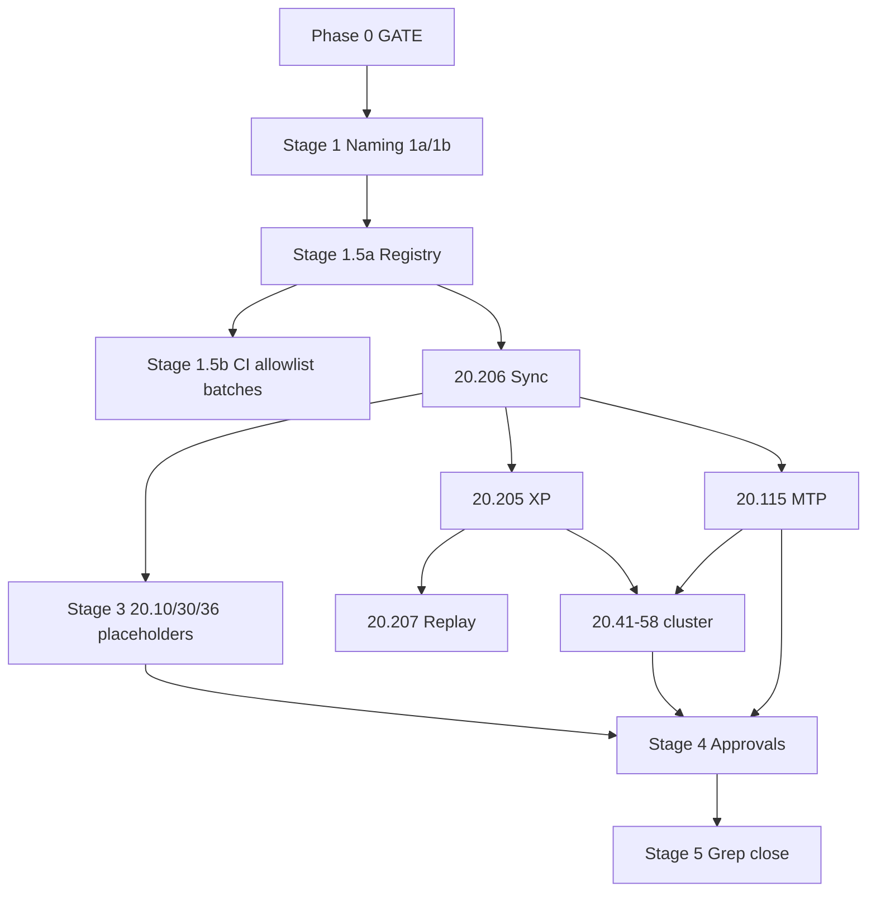

# 20.500 Refactoring for Dual TS Pipeline

**Document ID:** 20.500  
**Version:** 0.1  
**Date:** 2026-06-06  
**Status:** Draft — coordination hub (pending three-way review)

## Purpose

This document is the **single coordination hub** for the multi-day refactor that formalizes the Thought Simulator **dual-pipeline architecture** across the 20-series and related artifacts.

**This document is NOT normative TS runtime requirements.** It does not override [20.12_ts_invariants.md](20.12_ts_invariants.md), bootstrap documents (20.10, 20.20, 20.30), or CP-approved module HLRs. It tracks **what to change, in what order, with what approval, and when**.

**Reviewers:** CuriousOne23, Copilot, Grok — consensus required where marked **GATE**.

**Bootstrap stability (additive clarifications only during this program):** [20.10](20.10_ts_architectural_principles.md), [20.12](20.12_ts_invariants.md), [20.20](20.20_ts_primitives.md), [20.30](20.30_ts_functional_model.md). HLR IDs in these documents SHALL NOT be renumbered without an explicit **GATE**.

**How to use this document:** Treat §2–§3 as the execution contract. Update status columns in §7 as work progresses. Do not begin Stage 1 until Phase 0 (§2) is signed. Stage 2 rough drafts may be sketched in parallel with Stage 1.5a **only** if marked `draft` and not promoted to normative until Stage 4.

---

## 1. Architectural Summary (Reference)

### 1.1 Pipeline A — Meaning Construction

- **Topology:** Lane-parallel (split/merge, many TPs per cycle)
- **Flow:** InB → RB → OB → DCB → (if `tr_needs_update`) TR → TB → Merge → ΔH% → Truth/Done → **`mtp_update`**
- **Carriers:** **TP** (lane-local, minimal deterministic state carrier + history) → **MTP / `semantic_core`** (global authoritative meaning)
- **Replay:** Meaning replay reconstructs `semantic_core` deterministically

### 1.2 Pipeline B — Realization / Execution

- **Topology:** **Singular per cycle** — one pass per committed MTP / `semantic_core` (no lanes, no split/merge, no TP-B)
- **Flow:** SRP lookup (hot path) → TrigRB → exec planning → OpBeh/OBG/XlateR → OuB → IMR evaluation
- **Carrier:** **XP** (Execution Packet — one per MTP commit per cycle; logical aggregate of `exec_plan` + `exec_trace` + B audit)
- **Inputs:** Frozen committed `semantic_core` only (+ `routing_epoch_id`, `policy_signature`, seed for expression)
- **Outputs:** `exec_plan`, `exec_trace`, bounded supervisory triggers — **no `semantic_core` writes**
- **Replay:** B is **not in the meaning equivalence class** (HLR-20.012-011 strip); B envelopes are **derivable / regenerable** from committed meaning for full-trace fidelity (HLR-20.012-012) — B is realization evidence, not meaning authority

### 1.3 Boundary at MTP

| Side | Authority |
|------|-----------|
| **Before `mtp_update`** | Pipeline A only; lane TPs, Merge, Truth/Done |
| **After `mtp_update`** | Committed `semantic_core` frozen; Pipeline B may start |
| **Handoff** | Formalized in **20.206** (draft pending) |

### 1.4 Envelope Partition

| Artifact | Pipeline | Replay (meaning) | Replay (full trace) |
|----------|----------|------------------|---------------------|
| **TP** | A (lane-local) | Lane history / provenance | A fixtures |
| **MTP / `semantic_core`** | A (global) | **Authoritative** | Required |
| **XP** (`exec_plan` + `exec_trace` + B audit) | B (MTP-scoped) | Strippable | Regenerable |
| **`supervisory`** | GB / IMR triggers | Bounded triggers only | Append-only audit |

### 1.5 Namespace Discipline (Non-Negotiable)

Execution-layer symbols (**OpBeh, OBG, XlateR, TrigRB, SRP, IMR, XP**) SHALL NOT alias meaning-layer basin symbols (**OB, TR, RB, TB, DCB**) per HLR-20.012-015.

**Example:** basin **OB** (Object Basin) remains **OB** on Pipeline A; execution uses **OpBeh** (Operational Behavior) on Pipeline B — never **OB**.

---

## 2. Phase 0 Invariants (GATE — Pending Sign-Off)

All three reviewers must sign before **Stage 1** naming resolution begins.

| # | Invariant | Status |
|---|-----------|--------|
| P0-1 | TP = lane-local, Pipeline A only; lane history for A provenance — **not** B input | ☐ Pending |
| P0-2 | MTP / `semantic_core` = global meaning authority after Merge / Truth-Done / `mtp_update` | ☐ Pending |
| P0-3 | Pipeline B = **one pass per MTP commit** per cycle; no lanes, split/merge, sequencing, or TP-B | ☐ Pending |
| P0-4 | B inputs = committed `semantic_core` only (no TP instances, no `lane_id`) | ☐ Pending |
| P0-5 | B outputs = `exec_plan` + `exec_trace` + bounded supervisory triggers; no `semantic_core` writes | ☐ Pending |
| P0-6 | **Meaning replay** = strip B → identical `semantic_core` (HLR-20.012-011) | ☐ Pending |
| P0-7 | **Seed** affects B expression/realization only — not `semantic_core` (HLR-20.012-010) | ☐ Pending |

**Phase 0 also resolves (GATE — program decision, not runtime invariant):** Treatment of [20.12](20.12_ts_invariants.md) during this refactor — **annex/glossary cross-refs** vs **explicit no-touch** (OQ-003, §4.2). Record the decision in §7.3 before Stage 2 normative B drafting.

**Sign-off record:**

| Reviewer | Date | Notes |
|----------|------|-------|
| CuriousOne23 | | |
| Copilot | | |
| Grok | | |

---

## 3. Staged Refactor Process

### Stage 0 — Phase 0 Invariants (GATE)

See §2. **No Stage 1+ work until all P0-1…P0-7 rows are signed.**

```text
Stage 0  → Phase 0 invariants (GATE) — §2
Stage 1  → Naming & namespace resolution (1a blocking / 1b deferred)
Stage 1.5a → Naming registry in this document
Stage 1.5b → Mechanical apply (CI/schemas/harness ALLOWLIST only; CI green per batch)
Stage 2  → New document rough drafts (unapproved)
Stage 3  → Selective existing-doc reposition (Pipeline A preserved)
Stage 4  → Iterative review & approval (per document)
Stage 5  → Consistency grep & close-out
```

### Stage 1 — Naming & Namespace Resolution

**Goal:** Stable terminology before normative B drafting.

**1a — Blocking (must resolve before Stage 2):**

- XP (Execution Packet)
- MTP commit marker (`mtp_snapshot_id` vs `commit_id` — pick one canonical)
- Pipeline A / Pipeline B / `semantic_core`
- OpBeh / OBG / XlateR vs OB / TR / RB (no aliasing)
- TrigRB vs TR
- IMR Type B vs IMR (execution feedback)
- `routing_epoch_id` scope (execution layer only)

**1b — Deferred (may resolve during Stage 2/4):**

- Fine-grained trigger IDs, table column names, harness label details

**Tracked in:** §5 Naming Registry below.

---

### Stage 1.5a — Naming Registry (No Mass Edit)

Populate §5. **No repo-wide renames** until registry rows reach **agreed** status.

---

### Stage 1.5b — Global Naming Application (Allowlist Only)

**Owner:** Grok executes batches; **CuriousOne23 + Copilot** approve allowlist per batch.

**Scope (when on allowlist):**

- `.md` (non–CP-approved normative modules first: glossary, examples)
- `.json` (schemas, registries, fixtures)
- `.py` (harnesses, validators, scripts)
- **CI files** (see §6 CI Manifest)
- CI-referenced files and CI tables
- Routing table seeds, config examples, tests

**Rules:**

- No structural changes
- No semantic / meaning-construction changes
- No Pipeline B content insertions
- **Naming updates only**
- CP-approved normative modules (§8 re-review queue) — **excluded** until Stage 4 per-doc approval
- Bootstrap HLR IDs — **no renumbering** in mechanical pass
- Each batch: CI green, file list logged in §7.2

---

### Stage 2 — New Documents (Rough Drafts, Unapproved)

**Order is logical dependency, not strict sequencing** — drafts may be sketched in parallel when upstream dependencies are respected; all remain unapproved until Stage 4.

**Internal draft order:**

| Order | Document | Purpose | Status | Created | Depends on |
|-------|----------|---------|--------|---------|------------|
| 1 | [20.206](20.206_pipeline_a_b_synchronization_contract.md) | A↔B handoff, freeze, equivalence classes | `not_started` | | P0 GATE, Stage 1a |
| 2 | [20.205](20.205_execution_packet_xp_requirements.md) | XP topology — one per MTP commit | `not_started` | | 20.206 draft |
| 3 | [20.115](20.115_mtp_requirements.md) | MTP hardening — global integrator + B input | `not_started` | | 20.206 draft |
| 4 | [20.207](20.207_execution_replay_specification.md) | B regeneration semantics | `not_started` | | 20.205, 20.206 |
| 5 | 20.55 SRP Requirements | Cold/hot path, epoch tables | `not_started` | | 20.206 |
| 6 | 20.56 Routing Table Schema | Epoch-coherent routing tables | `not_started` | | 20.55 |
| 7 | 20.57 Semantic Trigger Requirements | TrigRB | `not_started` | | 20.205, 20.115 |
| 8 | 20.41 Operational Behavior Requirements | OpBeh | `not_started` | | 20.56 |
| 9 | 20.42 OBG Requirements | OBG | `not_started` | | 20.56 |
| 10 | 20.43 Translation Routine Requirements | XlateR | `not_started` | | 20.56 |
| 11 | 20.58 OuB ↔ Execution Manifold Integration | OuB integration | `not_started` | | 20.110, 20.205 |

**Note:** 20.110 OuB exists — Stage 2 may **harden** 20.110 vs duplicate in 20.58; record decision in §9.

---

### Stage 3 — Update Existing Documents (Pipeline A Preserved)

**Allowed for:**

| Document | Action | Status | Updated | Notes |
|----------|--------|--------|---------|-------|
| [20.10](20.10_ts_architectural_principles.md) | Reposition under Pipeline A; dual-pipeline placeholder sections (**additive**) | `not_started` | | No HLR renumber without GATE |
| [20.30](20.30_ts_functional_model.md) | Add MTP-scoped B topology subsection; A sections preserved | `not_started` | | Bootstrap — clarify only |
| [20.36](20.36_canonical_end_to_end_trace.md) | Assertion checklist in 20.500 §10; minimal inline TODOs | `not_started` | | |

**Deferred / minimal touch (Stage 4 re-review only):**

| Document | Current version | Stage 3 action |
|----------|-----------------|----------------|
| [20.105](20.105_tp_requirements.md) | v0.4 CP-approved | **No Stage 3 edits** — boundary cross-ref in Stage 4 if CP approves |
| [20.106](20.106_dcb_requirements.md) | v0.3 CP-approved | Re-review queue only |
| [20.140](20.140_truth_evaluation_requirements.md) | v0.3 CP-approved | Re-review queue only |
| [20.37](20.37_thought_router_tr_specification.md) | v0.3 CP-approved | Re-review queue only |
| [20.40](20.40_ob_requirements.md) | v0.3 CP-approved | Re-review queue only |
| [20.50](20.50_rb_requirements.md) | v0.3 CP-approved | Re-review queue only |
| [20.60](20.60_tb_requirements.md) | v0.3 CP-approved | Re-review queue only |

**Rules:**

- Do **not** delete or rewrite Pipeline A meaning semantics
- Do **not** insert Pipeline B normative content in Stage 3
- Placeholder comments only where listed above

---

### Stage 4 — Iterative Review & Approval (GATE per document)

**Workflow per document:**

1. Grok drafts or updates (or Stage 2 rough promoted to normative draft)
2. Copilot + CuriousOne23 review
3. Iterate until aligned
4. Mark **approved** in §7.1 with date and version target
5. If CP-approved module: record **second-pass** approval separately

**Consensus rule:**

| Document type | Approval |
|---------------|----------|
| Normative requirements (20.xxx) | All three |
| 20.500 coordination updates | All three |
| Stage 1.5b allowlist batches | CuriousOne23 + Copilot (Grok executes) |
| Stage 3 placeholders | CuriousOne23 + Copilot |

---

### Stage 5 — Consistency Grep & Close-Out

**Repo-wide checks before closing 20.500 program:**

- [ ] No `lane_id` / `tp_id` references in Pipeline B / XP / `exec_*` normative fixtures
- [ ] No "per TP" + Pipeline B coupling in requirements
- [ ] No TP-B or TP_B artifacts
- [ ] Namespace: OpBeh/OBG/XlateR not aliased to OB/TR/RB in new docs
- [ ] 20.200 traceability matrix updated
- [ ] [20.190_glossary.md](20.190_glossary.md) includes XP, MTP commit boundary, dual-pipeline terms
- [ ] CI manifests (§6) all green

**Close-out:** Set 20.500 status to `complete` with final date; archive open questions or spin follow-on tickets.

---

## 4. Document Inventory

### 4.1 Existing — Major Update or Harden

| ID | Document | Stage | Priority | Status | Target ver | Approved | Blocked by |
|----|----------|-------|----------|--------|------------|----------|------------|
| 20.10 | Architectural principles | 3→4 | P1 | `not_started` | TBD | | P0 |
| 20.30 | Functional model | 3→4 | P1 | `not_started` | TBD | | P0 |
| 20.115 | MTP requirements | 2→4 | **P0** | `not_started` | v0.2+ | | P0, 20.206 |
| 20.36 | Canonical trace / replay | 3→4 | P2 | `not_started` | v0.4+ | | 20.205, 20.206 |

### 4.2 Existing — Clarification / Cross-Ref / Re-Review

| ID | Document | Action | Status |
|----|----------|--------|--------|
| 20.12 | TS invariants | Annex/gloss or explicit no-touch — **GATE in Phase 0** (OQ-003); no edits until decided | `discussion` |
| 20.20 | TS primitives | No-touch unless GATE; cross-ref only | `deferred` |
| 20.31 | Semantic specification | `mtp_update` freeze cross-ref | `not_started` |
| 20.120 | MTP schema | Align with 20.115 hardening; field names follow Stage 1a | `not_started` |
| 20.38 | Implementation guidelines | B read guards (no `tp_id`) | `not_started` |
| 20.39 | Core data structures | XP vs TpLaneView vs exec envelopes | `not_started` |
| 20.45 | IMR requirements | Type B → next A cycle | `not_started` |
| 20.105 | TP requirements | Light boundary note (Stage 4) | `deferred` |
| 20.106 | DCB | Re-review | `deferred` |
| 20.140 | Truth/Done | Re-review | `deferred` |
| 20.37–20.60 | Basin chain | Re-review | `deferred` |
| 20.110 | OuB | Harden vs 20.58 | `discussion` |
| 20.190 | Glossary | XP, dual-pipeline terms | `not_started` |
| 20.200 | Traceability matrix | New doc IDs | `not_started` |

### 4.3 New — To Create

Listed in §3 Stage 2 table. File paths are conventional placeholders until created.

---

## 5. Naming Registry

**Legend:** `agreed` | `pending` | `deferred` | `collision`

| Canonical | Aliases (deprecated) | Scope | Layer | Status | Decided | Owner | Notes |
|-----------|----------------------|-------|-------|--------|---------|-------|-------|
| TP | Thought Packet | Lane-local A carrier | Meaning | `agreed` | 2026-06-06 | Prior specs | 20.105 v0.4 |
| MTP | Master Thought Packet | Global meaning aggregate | Meaning | `agreed` | 2026-06-06 | Prior specs | Needs 20.115 hardening |
| `semantic_core` | | Committed meaning envelope | Meaning | `agreed` | 2026-06-06 | 20.12 | |
| XP | Execution Packet | B carrier per MTP commit | Execution | `pending` | | Stage 1a | Not TP-B |
| OpBeh | Operational Behavior | | Execution | `pending` | | Stage 1a | ≠ OB |
| OBG | | | Execution | `pending` | | Stage 1a | |
| XlateR | Translation Routine | | Execution | `pending` | | Stage 1a | |
| TrigRB | Trigger RB | | Execution | `pending` | | Stage 1a | ≠ RB |
| SRP | Semantic Routing Planner | | Execution | `pending` | | Stage 1a | Cold path |
| IMR | Interpretation Mismatch Routine | | Execution | `pending` | | Stage 1a | Type B trigger |
| `routing_epoch_id` | | Execution tables only | Execution | `agreed` | 2026-06-06 | 20.12 | Not on TP |
| `mtp_snapshot_id` | commit_id? | MTP commit marker | Meaning | `collision` | | Stage 1a | Pick one canonical |
| OB | Object Basin | | Meaning | `agreed` | 2026-06-06 | 20.20 | |
| TR | Thought Router | | Meaning | `agreed` | 2026-06-06 | 20.37 | |
| RB | Relational Basin | | Meaning | `agreed` | 2026-06-06 | 20.50 | |
| CIL | Conversation Input Layer | | Conversation | `deferred` | | Stage 1b | 20.33 — separate from CI; **out of scope for Stage 1a**; any CIL rename requires explicit **GATE** |

*Add rows as Stage 1 progresses. Do not run Stage 1.5b until row is `agreed`.*

---

## 6. CI Manifest (Stage 1.5b Allowlist Source)

**“CI” in this program means:**

1. **Continuous integration** — GitHub Actions workflows and validation scripts they invoke  
2. **CI-referenced artifacts** — files and tables those workflows read (fixtures, registries, schemas)  
3. **CIL** (Conversation Input Layer, 20.33) — separate naming row; include only when CIL touch is approved  

**CuriousOne23 + Copilot own manifest completeness before each 1.5b batch.**

### 6.1 CI Workflow Entrypoints (Known)

| Path | Purpose | In 1.5b allowlist? |
|------|---------|-------------------|
| [.github/workflows/thought-simulator-doc-dependency-check.yml](../../.github/workflows/thought-simulator-doc-dependency-check.yml) | Doc dependency check | ☐ TBD |
| [.github/workflows/validate_design_traceability.yml](../../.github/workflows/validate_design_traceability.yml) | Design traceability | ☐ TBD |
| [.github/workflows/pages.yml](../../.github/workflows/pages.yml) | Pages deploy | ☐ TBD |

### 6.2 CI-Referenced Scripts & Registries (Known)

| Path | Purpose | In 1.5b allowlist? |
|------|---------|-------------------|
| [thought_simulator/scripts/validate_glossary_alignment.py](../scripts/validate_glossary_alignment.py) | Glossary alignment | ☐ TBD |
| [thought_simulator/scripts/validate_requirements_glossary_alignment.py](../scripts/validate_requirements_glossary_alignment.py) | Requirements glossary | ☐ TBD |
| [thought_simulator/scripts/validate_requirements_glossary_scope.py](../scripts/validate_requirements_glossary_scope.py) | Glossary scope | ☐ TBD |
| [thought_simulator/scripts/validate_50_glossary_alignment.py](../scripts/validate_50_glossary_alignment.py) | 50-series glossary | ☐ TBD |
| [thought_simulator/20_requirements/glossary_term_registry.json](glossary_term_registry.json) | Term registry | ☐ TBD |
| [thought_simulator/30_verification/glossary_term_registry.json](../30_verification/glossary_term_registry.json) | Verification glossary | ☐ TBD |
| [thought_simulator/50_thought_simulator_design/glossary_term_registry.json](../50_thought_simulator_design/glossary_term_registry.json) | Design glossary | ☐ TBD |

### 6.3 CI Tables / Fixtures (To Be Completed)

| Path | Purpose | In 1.5b allowlist? |
|------|---------|-------------------|
| `thought_simulator/30_verification/` | Verification capsules | ☐ TBD |
| `thought_simulator/40_thought_simulator_playground/` | Harness fixtures | ☐ TBD |
| *routing table seeds* | TBD when 20.56 drafted | ☐ TBD |

*Extend this table before each Stage 1.5b batch. Log touched files in §7.2.*

---

## 7. Tracking Tables

### 7.1 Document Approval Log

| Document | Version | Stage | Status | Drafted | Approved | Approvers | Second-pass? |
|----------|---------|-------|--------|---------|----------|-----------|--------------|
| 20.500 | 0.1 | — | `draft` | 2026-06-06 | | | — |
| 20.206 | — | 2 | `not_started` | | | | — |
| 20.205 | — | 2 | `not_started` | | | | — |
| 20.115 | 0.1→ | 2→4 | `not_started` | | | | — |
| 20.207 | — | 2 | `not_started` | | | | — |
| 20.10 | — | 3→4 | `not_started` | | | | — |
| 20.30 | — | 3→4 | `not_started` | | | | — |
| 20.36 | 0.3→ | 3→4 | `not_started` | | | | — |
| 20.105 | 0.4 | 4 | `deferred` | | 2026-06-06 | CP | Y — boundary only |

*Status values:* `not_started` | `draft` | `review` | `blocked` | `approved` | `deferred`

### 7.2 Stage 1.5b Batch Log

| Batch ID | Date | Allowlist summary | Files touched | CI green? | Approvers |
|----------|------|-------------------|---------------|-----------|-----------|
| | | | | | |

### 7.3 Open Questions

| ID | Question | Owner | Status | Resolution |
|----|----------|-------|--------|------------|
| OQ-001 | Canonical MTP commit marker: `mtp_snapshot_id` vs `commit_id`? | Stage 1a | `open` | |
| OQ-002 | XP = logical wrapper over `exec_plan`+`exec_trace` vs new envelope? | 20.205 | `open` | Must respect HLR-20.012-004 |
| OQ-003 | 20.12 annex vs no-touch during refactor? | All three | `open` | |
| OQ-004 | Harden 20.110 vs new 20.58 for OuB integration? | Stage 2 | `open` | |
| OQ-005 | 20.207 standalone vs 20.36 Class 6 only for PoC? | Stage 2 | `open` | |

### 7.4 Blocked Items

| Item | Blocked by | Since | Notes |
|------|------------|-------|-------|
| Stage 1+ | P0 sign-off | 2026-06-06 | Awaiting §2 |

---

## 8. Re-Review Queue (CP-Approved A Modules)

Second-pass **boundary check only** after 20.205/20.206 exist — not structural rewrite.

| Module | Version | Check |
|--------|---------|-------|
| 20.105 TP | v0.4 | B never consumes TP; B does not use TP audit |
| 20.106 DCB | v0.3 | Geometry only; no B coupling |
| 20.140 Truth/Done | v0.3 | Post-merge on `semantic_core`; not per-TP B |
| 20.37 TR | v0.3 | No `truth_hypotheses` read; TR not in B |
| 20.40 OB | v0.3 | A-only |
| 20.50 RB | v0.3 | No `done_state`/`truth_hypotheses` routing read |
| 20.60 TB | v0.3 | Inputs only to 20.140 on MTP |

---

## 9. Dependency Graph (High Level)



---

## 10. 20.36 Assertion Checklist (Stage 4 Target)

When updating [20.36](20.36_canonical_end_to_end_trace.md), add or verify:

- [ ] Pipeline B stage records are **MTP-scoped** (one B segment per cycle, not per lane)
- [ ] No `lane_id` in Pipeline B fixture envelopes
- [ ] No `tp_id` references in `exec_plan` / `exec_trace` golden fixtures
- [ ] Strip scope `[exec_plan, exec_trace]` → `semantic_core` byte-identical (existing Class 1)
- [ ] Optional: B regeneration equivalence sub-assertion (20.207 or Class 6)

---

## 11. Risks Register

| ID | Risk | Likelihood | Impact | Mitigation |
|----|------|------------|--------|------------|
| R1 | Stage 1.5b breaks CI / semantic drift | Medium | High | Allowlist batches; CI green gate |
| R2 | Premature rename before XP/MTP fields stable | Medium | Medium | 1.5a registry; normative MD renames in Stage 4 |
| R3 | CP-approved module drift | Low | High | Re-review queue; freeze while in review |
| R4 | XP collapses 20.12 envelope split | Medium | High | 20.205 must state wrapper model |
| R5 | Per-TP B reintroduced in harnesses | Medium | High | §10 negative fixtures; Stage 5 grep |
| R6 | Bootstrap HLR renumber cascade | Low | Critical | Additive-only rule; explicit GATE |
| R7 | 20.500 mistaken as normative law | Medium | Medium | Header `status: coordination` |

---

## 12. Approval of This Document (20.500 v0.1)

| Reviewer | Role | Approve 20.500 structure? | Date | Comments |
|----------|------|---------------------------|------|----------|
| CuriousOne23 | Architecture owner | ☐ | | |
| Copilot | Review | ☐ | | |
| Grok | Draft author | ☑ | 2026-06-06 | Structure approved; four Copilot clarifications applied |

**On approval:** Bump 20.500 to v0.2; set Phase 0 sign-off as first GATE action.

---

## 13. Per-Stage Checklists (Review Aid)

### Stage 0
- [ ] All three signed §2 P0 table (P0-1…P0-7)
- [ ] OQ-003 resolved: 20.12 annex vs no-touch recorded in §7.3
- [ ] §7.4 unblocked for Stage 1

### Stage 1
- [ ] All §3 Stage 1a blocking terms resolved (`agreed` in §5)
- [ ] OQ-001 closed (`mtp_snapshot_id` vs `commit_id`)
- [ ] Deferred terms logged in §5 as `deferred`

### Stage 1.5a
- [ ] §5 registry complete for Stage 1a scope
- [ ] §6 CI manifest reviewed by CuriousOne23 + Copilot

### Stage 1.5b
- [ ] Allowlist approved before each batch
- [ ] Batch logged in §7.2; CI green
- [ ] No CP-approved normative modules touched

### Stage 2
- [ ] Drafts follow internal order (§3 table)
- [ ] All drafts marked `draft` / unapproved in §7.1
- [ ] OQ-003, OQ-004, OQ-005 recorded if still open

### Stage 3
- [ ] Only 20.10 / 20.30 / 20.36 touched (placeholders)
- [ ] No Pipeline B normative insertions
- [ ] No CP-approved module edits

### Stage 4
- [ ] Per-doc three-way approval in §7.1
- [ ] Second-pass queue (§8) completed for listed modules
- [ ] Normative renames applied per document, not bulk

### Stage 5
- [ ] §10 assertion checklist satisfied
- [ ] §3 Stage 5 grep items all checked
- [ ] 20.500 bumped to `complete`

---

## 14. Changelog

| Version | Date | Author | Summary |
|---------|------|--------|---------|
| 0.1 | 2026-06-06 | Grok | Initial coordination hub per three-way sync (CuriousOne23, Copilot, Grok) |
| 0.1 | 2026-06-06 | Grok | Copilot review clarifications: §1.5 example, §2/§4.2 20.12 GATE, §3 Stage 2 parallel note, §5 CIL scope |

---

## Traceability

- [20.12_ts_invariants.md](20.12_ts_invariants.md)
- [20.10_ts_architectural_principles.md](20.10_ts_architectural_principles.md)
- [20.30_ts_functional_model.md](20.30_ts_functional_model.md)
- [20.105_tp_requirements.md](20.105_tp_requirements.md)
- [20.115_mtp_requirements.md](20.115_mtp_requirements.md)
- [20.36_canonical_end_to_end_trace.md](20.36_canonical_end_to_end_trace.md)
- [Grok_review_in_20.md](Grok_review_in_20.md) (review archive)