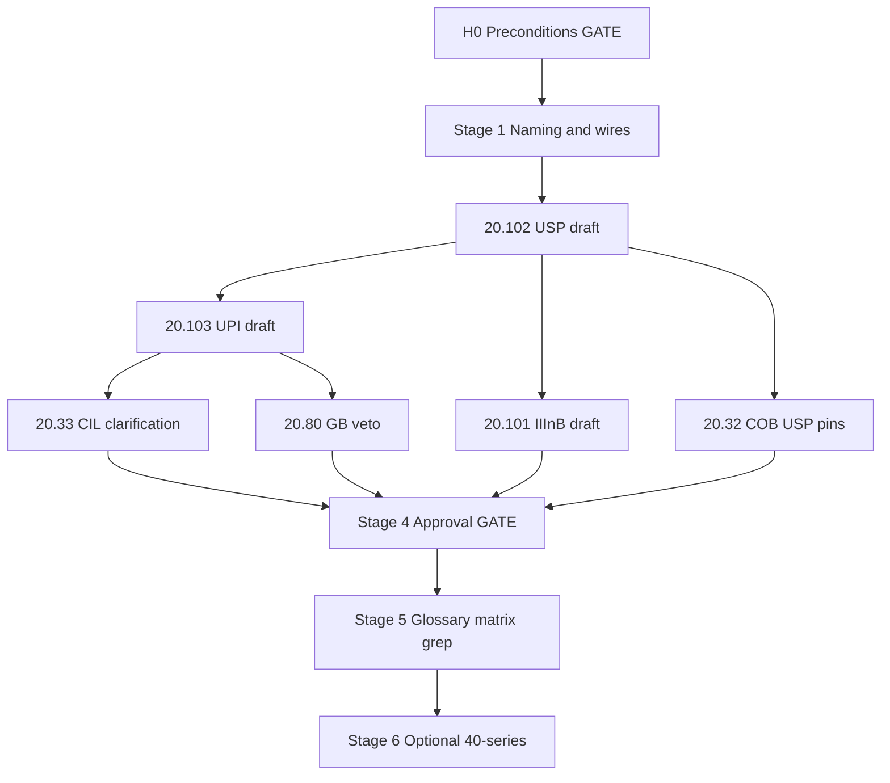

# 20.510 Refactoring for Input Correction (Track H)

**Document ID:** 20.510  
**Version:** 0.1  
**Date:** 2026-06-07  
**Status:** **Active** — program opened 2026-06-07; Stage 0 preconditions satisfied; Stage 1 unblocked pending GATE sign-off.

## Purpose

This document is the **single coordination hub** for **Track H** — the follow-on program that specifies **semantic input error correction** via **IIInB**, **USP**, and **UPI**.

**This document is NOT normative TS runtime requirements.** It does not override [20.12_ts_invariants.md](20.12_ts_invariants.md), bootstrap documents (20.10, 20.20, 20.30), CP-approved module HLRs, or the closed [20.100](20.100_inb_requirements.md) InB scope. It tracks **what to change, in what order, with what approval, and when**.

**Predecessor:** [20.500_refactoring_for_dual_TS_pipeline.md](20.500_refactoring_for_dual_TS_pipeline.md) §7.7 — dual-pipeline refactor **complete** 2026-06-07; Track H spun out here.

**Reviewers:** CuriousOne23, Copilot, Grok — consensus required where marked **GATE**.

**How to use this document:** Treat §2–§3 as the execution contract. Normative behavior lands in **20.101–20.103** and approved cross-ref updates — not in this file.

---

## 1. Architectural Summary (Reference)

### 1.1 Program scope

**One follow-on program, three roles — not a parallel meaning pipeline.**

| Role | Layer | Primary duty |
|------|--------|--------------|
| **IIInB** | Pre–Pipeline A semantic repair (after InB surface norm) | Apply explicit USP rules; escalate unknowns to clarification |
| **USP** | Conversation layer under COB | Versioned auditable shorthand rule store; read-only to IIInB |
| **UPI** | Conversation layer after clarification | Single writer of USP rule commits; GB-gated |

**Closure line (inherited from 20.500 §7.7):** InB corrects surface form deterministically; semantic input error correction is a separate, profiled pre–Pipeline A program (**IIInB + clarification + UPI/USP**), not an InB, IB, or IMR responsibility.

### 1.2 Placement in TS (authoritative mental model — CP v2 aligned)

```text
External → CIL (conversation) → InB (surface, Pipeline A input)
         → [optional IIInB reads USP; unknown → CIL clarification → UPI → USP]
         → Pipeline A: RB → OB → DCB → TR → TB → Merge → Truth/Done → mtp_update
         → Pipeline B: TrigRB → SRP → exec_plan → OuB → IMR
Conversation layer (durable): USP under COB; UPI on clarification events only
```

### 1.3 Authority limits (non-negotiable)

| Writer | MAY write | SHALL NOT write |
|--------|-----------|-----------------|
| **IIInB** | Intake-bound repair tags / resolved-segment refs | `semantic_core`, `TP.TR`, MTP semantics, USP |
| **USP** | Profile snapshots / rule versions (via UPI only) | TP intent fields, per-cycle meaning, `exec_plan` |
| **UPI** | USP rule entries (GB-gated) | Routing contracts, `semantic_core`, direct IIInB invocation |
| **IMR** | `exec_trace`, supervisory `CorrectionTrigger` | USP, UPI, IIInB outputs; clarification initiation |

### 1.4 Escalation paths (two wires, one program)

| Condition | Path |
|-----------|------|
| Unknown shorthand / no matching USP rule | CIL clarification → UPI → USP |
| `MI_INCOMP` / commitment blocked | IB-Creation-Request → GB → IB ([20.17](20.17_messy_input_handling.md)) |

### 1.5 Optional profile gate

When `profile_enabled = false` (execution-signature-bound): **skip IIInB entirely** — zero Track H cost on the hot path.

---

## 2. Phase 0 Preconditions (GATE)

**No Stage 1+ normative drafting until all rows signed.**

| # | Precondition | Status |
|---|--------------|--------|
| H0-1 | [20.500](20.500_refactoring_for_dual_TS_pipeline.md) dual-pipeline program **complete** | ☑ 2026-06-07 |
| H0-2 | [20.100](20.100_inb_requirements.md) InB scope **closed** — semantic repair out of InB | ☑ 2026-06-07 |
| H0-3 | [20.190](20.190_glossary.md) Primitive Intent Catalog defines IIInB/USP/UPI boundaries (draft Track H entry) | ☑ 2026-06-07 |
| H0-4 | CP v2 mental model aligned ([Grok_review_in_20.md](Grok_review_in_20.md)) — not a second OB/TR/routing stack | ☑ 2026-06-07 |
| H0-5 | IMR / Pipeline B separation accepted — Track H does not couple to B | ☑ 2026-06-07 |

**Sign-off record:**

| Reviewer | Date | Notes |
|----------|------|-------|
| CuriousOne23 | | |
| Copilot | | |
| Grok | 2026-06-07 | 20.510 v0.1 opened; H0-1…H0-5 satisfied by prior program closure |

---

## 3. Staged Refactor Process

```text
Stage 0  → Preconditions (GATE) — §2
Stage 1  → Naming, placement, wire-schema resolution
Stage 2  → New normative documents (20.101–20.103 rough drafts)
Stage 3  → Existing-document cross-ref updates (CIL, COB, GB, InB, TP, …)
Stage 4  → Iterative review & approval (per document — GATE)
Stage 5  → Glossary Phase 4, traceability, consistency grep & close-out
Stage 6  → Optional: 20.36 Class 7 fixtures, 40-series prototype (user-directed)
```

### Stage 1 — Naming, Placement, and Wire Schema Resolution

**Goal:** Stable terminology and intake ordering before normative HLR drafting.

**1a — Blocking (must resolve before Stage 2):**

| Item | Options | Status | Decision |
|------|---------|--------|----------|
| Intake ordering | `InB → IIInB → RB` vs `IIInB → InB → RB` | `pending` | **Recommended:** `InB → IIInB → RB` (surface norm first) |
| IIInB wire form | Named basin vs profiled `input_semantic_repair` stage | `pending` | Behavior fixed; naming bucket TBD |
| Clarification wire | `clarification_event` schema owner | `pending` | **20.33** CIL + **20.103** UPI interface |
| USP version pin | On `iiinb_repair_record` vs separate audit only | `pending` | Replay MUST pin `usp_version_ref` |
| Profile gate field | `profile_enabled` home | `pending` | **20.90** parameter table or **20.101** |

**1b — Deferred (may resolve during Stage 2/4):**

- Rule precedence tie-break fine points
- Max rules / max segments default values
- COB export manifest field names for USP snapshots

**Tracked in:** §5 Naming & Wire Registry.

---

### Stage 2 — New Documents (Rough Drafts, Unapproved)

**Internal draft order:**

| Order | Document | Purpose | Status | Depends on |
|-------|----------|---------|--------|------------|
| 1 | [20.102_usp_requirements.md](20.102_usp_requirements.md) | USP rule store, versioning, COB pins, read-only semantics | `not_started` | H0 GATE, Stage 1a |
| 2 | [20.103_upi_requirements.md](20.103_upi_requirements.md) | UPI clarification → rule commit, GB gate, audit | `not_started` | 20.102 draft, 20.33 interface |
| 3 | [20.101_iiinb_requirements.md](20.101_iiinb_requirements.md) | IIInB repair apply, escalation, caps, TCU, repair tags | `not_started` | 20.102 draft, 20.100 handoff |

**Note:** USP before IIInB because IIInB reads USP; UPI before IIInB normative finalize because escalation lands in UPI.

---

### Stage 3 — Update Existing Documents (Cross-Ref Only)

**Allowed touch set:**

| Document | Action | Status | Notes |
|----------|--------|--------|-------|
| [20.100](20.100_inb_requirements.md) | Handoff contract to IIInB; ordering line | `deferred` | InB closed — additive cross-ref only |
| [20.17](20.17_messy_input_handling.md) | IIInB escalation vs `MI_*` / IB path table | `deferred` | Pointer only |
| [20.33](20.33_cil_requirements.md) | Clarification FIFO + `clarification_event` → UPI | `not_started` | **P0 integration** |
| [20.32](20.32_cob_requirements.md) | USP snapshot versioning under COB | `not_started` | **P0 integration** |
| [20.80](20.80_gb_requirements.md) | GB veto on unsafe UPI rule commits | `not_started` | |
| [20.16](20.16_gb_responsibility_matrix.md) | Clarification / rule-commit caps (if added) | `deferred` | |
| [20.105](20.105_tp_requirements.md) | Intake-bound repair tag fields | `not_started` | IIInB-only TP writes |
| [20.30](20.30_ts_functional_model.md) | Optional `[IIInB]` stage line when profile on | `deferred` | Additive |
| [20.36](20.36_canonical_end_to_end_trace.md) | Class 7 Track H replay fixtures | `not_started` | Stage 6 or Stage 4 — team choice |
| [20.150](20.150_tcu_budgeting_requirements.md) | IIInB TCU budget row | `deferred` | |
| [20.70](20.70_mb_requirements.md) | MB visibility for Track H audit records | `deferred` | |
| [20.90](20.90_ts_parameter_table.md) | `profile_enabled`, cap defaults | `deferred` | |

**Rules:**

- Do **not** reopen InB semantic duties
- Do **not** insert Track H into Pipeline B or IMR authority
- Do **not** make USP a meaning-construction primitive (no `TP.TR` / OB / TB writes)

---

### Stage 4 — Iterative Review & Approval (GATE per document)

**Workflow per document:**

1. Grok drafts or updates
2. Copilot + CuriousOne23 review
3. Iterate until aligned
4. Mark **approved** in §7.1 with date and version target

**Consensus rule:**

| Document type | Approval |
|---------------|----------|
| Normative requirements (20.101–20.103) | All three |
| Stage 3 cross-ref updates (normative HLR adds) | All three |
| 20.510 coordination updates | All three |
| 20.38 / 20.39 guidance touch | CuriousOne23 + Copilot when coding starts |

---

### Stage 5 — Glossary, Traceability, Grep & Close-Out

**Same change set as final normative approvals (HLR-20.190-002, HLR-20.200-002):**

- [ ] [20.190_glossary.md](20.190_glossary.md) — Phase 4: split IIInB, USP, UPI catalog entries; fix InB→IIInB ordering
- [ ] [20.200_traceability_matrix.md](20.200_traceability_matrix.md) — rows for 20.101–20.103
- [ ] [glossary_term_registry.json](glossary_term_registry.json) — IIInB, USP, UPI, wire terms
- [ ] [20_requirements/README.md](README.md) — authoritative list (20.101–20.103 only after approval)

**Repo-wide grep checks before closing 20.510:**

- [ ] No IIInB/US P/UPI duties assigned to InB, IB, or IMR in normative docs
- [ ] No USP/UPI routing-contract or `exec_plan` language in Track H modules
- [ ] No `semantic_core` writes from IIInB/UPI/USP in normative HLRs
- [ ] CIL = Conversation Integration Layer (not “cognitive integrity”) in all Track H cross-refs
- [ ] `validate_20_traceability_matrix.py` green after matrix update

**Close-out:** Set 20.510 status to `complete`; archive open items in §7.6.

---

### Stage 6 — Implementation Bridge (Optional, User-Directed)

Not required to close 20.510. Start when explicitly approved:

| Artifact | Purpose | Owner |
|----------|---------|-------|
| [20.38](20.38_ts_implementation_guidelines.md) | IIInB optional stage, profile gate patterns | CuriousOne23 + Copilot |
| [20.39](20.39_ts_core_data_structures.md) | `UspSnapshot`, repair tag structs | CuriousOne23 + Copilot |
| `40.101_*` prototype module | Harness + verification capsule | User-directed |
| `30_verification/` capsule | Golden fixtures for Class 7 | User-directed |

---

## 4. Document Inventory

### 4.1 New — To Create (Track H normative)

| ID | Document | Stage | Priority | Status |
|----|----------|-------|----------|--------|
| 20.101 | IIInB requirements | 2→4 | **P0** | `not_started` |
| 20.102 | USP requirements | 2→4 | **P0** | `not_started` |
| 20.103 | UPI requirements | 2→4 | **P0** | `not_started` |

### 4.2 Existing — Cross-Ref / Integration

| ID | Document | Action | Priority | Status |
|----|----------|--------|----------|--------|
| 20.33 | CIL | Clarification → UPI wire | **P0** | `not_started` |
| 20.32 | COB | USP versioning | **P0** | `not_started` |
| 20.80 | GB | UPI commit veto | P1 | `not_started` |
| 20.100 | InB | IIInB handoff | P1 | `deferred` |
| 20.105 | TP | Repair tag fields | P1 | `not_started` |
| 20.36 | Replay fixtures | Class 7 | P2 | `not_started` |
| 20.190 | Glossary | Phase 4 split | P1 | `deferred` (Stage 5) |

### 4.3 Coordination — No Normative Override

| ID | Document | Role |
|----|----------|------|
| 20.500 | Dual-pipeline refactor | **Complete** — §7.7 superseded by this doc for Track H |
| 20.510 | This document | Active program tracker |

---

## 5. Naming & Wire Registry

**Legend:** `agreed` | `pending` | `deferred`

### 5.1 Program roles

| Canonical | Aliases (reject) | Scope | Status | Owner doc | Notes |
|-----------|------------------|-------|--------|-----------|-------|
| IIInB | Input Integrity Basin, InB-II, pre-semantic canonicalization | Pre–A semantic repair | `agreed` | 20.101 | ≠ InB surface norm |
| USP | User-Side Profile, intent structurer | COB-governed rule store | `agreed` | 20.102 | Read-only to IIInB |
| UPI | User plan integrator, job contract generator | Post-clarification USP writer | `agreed` | 20.103 | ≠ SRP / `exec_plan` |

### 5.2 Wire artifacts (Stage 1b → Stage 2)

| Symbol | Scope | Status | Owner doc |
|--------|-------|--------|-----------|
| `usp_rule` | USP entry | `pending` | 20.102 |
| `usp_version_ref` | Replay pin | `pending` | 20.102, 20.101 |
| `iiinb_repair_record` | Per-turn audit | `pending` | 20.101 |
| `clarification_event` | CIL → UPI | `pending` | 20.33, 20.103 |
| `upi_commit_record` | UPI → USP audit | `pending` | 20.103 |
| `profile_enabled` | Execution-signature gate | `pending` | 20.101 or 20.90 |

---

## 6. CI / Validator Manifest

**Track H validators (extend when Stage 2 drafts land):**

| Check | Tool / action | When |
|-------|---------------|------|
| Traceability matrix | `validate_20_traceability_matrix.py` | Stage 5 |
| Glossary alignment | glossary validator (if applicable) | Stage 5 |
| Track H boundary grep | Manual + scripted patterns (§3 Stage 5) | Stage 5 |

*No Stage 1.5b mechanical rename pass planned for Track H unless explicitly opened.*

---

## 7. Tracking Tables

### 7.1 Document Approval Log

| Document | Version | Stage | Status | Drafted | Approved | Approvers |
|----------|---------|-------|--------|---------|----------|-----------|
| 20.510 | 0.1 | — | `draft` | 2026-06-07 | | |
| 20.101 | — | 2 | `not_started` | | | |
| 20.102 | — | 2 | `not_started` | | | |
| 20.103 | — | 2 | `not_started` | | | |

*Status values:* `not_started` | `draft` | `review` | `blocked` | `approved` | `deferred`

### 7.2 Change Batch Log

| Batch ID | Date | Summary | Files touched | CI green? | Approvers |
|----------|------|---------|---------------|-----------|-----------|
| | | | | | |

### 7.3 Open Questions

| ID | Question | Owner | Status | Resolution |
|----|----------|-------|--------|------------|
| HQ-001 | Intake ordering: `InB → IIInB → RB` confirmed? | Stage 1a | `pending` | Recommended yes — sign in Stage 1 GATE |
| HQ-002 | IIInB: named basin vs `input_semantic_repair` stage? | 20.101 | `pending` | Behavior fixed; wire naming TBD |
| HQ-003 | Class 7 in 20.36: mandatory for 20.510 close vs Stage 6? | All three | `pending` | Team choice — recommend Stage 6 optional |
| HQ-004 | Max USP rules / max IIInB segments per turn defaults? | 20.101, 20.90 | `deferred` | Stage 2 draft |
| HQ-005 | GB cap on pending clarifications? | 20.16, 20.80 | `deferred` | Stage 3 |

### 7.4 Blocked Items

| Item | Blocked by | Since | Notes |
|------|------------|-------|-------|
| Stage 2 drafts | H0 GATE sign-off (CuriousOne23 + Copilot) | 2026-06-07 | Grok unblocked for skeleton; normative GATE pending |
| 20.103 UPI draft | 20.102 USP rule schema sketch | 2026-06-07 | |
| 20.101 IIInB draft | 20.102 + InB handoff (HQ-001) | 2026-06-07 | |

### 7.5 Resume Here

**Done:**

- 20.500 complete; InB closed ([20.100](20.100_inb_requirements.md) v0.2)
- [20.190](20.190_glossary.md) v0.2 Primitive Intent Catalog — Track H draft entry
- CP v2 mental model aligned ([Grok_review_in_20.md](Grok_review_in_20.md))
- 20.510 v0.1 coordination hub created

**Next (in order):**

| Step | Action | Owner |
|------|--------|-------|
| 1 | **H0 GATE** — CuriousOne23 + Copilot sign §2 | CuriousOne23, Copilot |
| 2 | **Stage 1** — resolve HQ-001, HQ-002; mark §5 rows `agreed` | All three |
| 3 | **Stage 2** — rough drafts: 20.102 → 20.103 → 20.101 | Grok draft; all three approve |
| 4 | **Stage 3** — 20.33, 20.32, 20.80, 20.105 integration | Grok + review |
| 5 | **Stage 5** — 20.190 Phase 4, 20.200, registry | Same change set as 20.101–103 approval |

### 7.6 Archived Open Items (post-program — placeholder)

*Populated at 20.510 close-out.*

---

## 8. Re-Review Queue (Boundary Checks)

Second-pass **boundary check only** when touching CP-approved modules — not structural rewrite.

| Module | Version | Check | Status |
|--------|---------|-------|--------|
| 20.100 InB | v0.2 | Handoff only; semantic repair still out of scope | `pending` |
| 20.17 messy-input | v0.4 | IIInB vs IB escalation table | `pending` |
| 20.45 IMR | v0.2 | No UPI invocation; indirect replay only | `pending` |
| 20.33 CIL | — | Clarification wire additive | `not_started` |
| 20.32 COB | — | USP versioning additive | `not_started` |

---

## 9. Dependency Graph



---

## 10. Risk Register

| ID | Risk | Likelihood | Impact | Mitigation |
|----|------|------------|--------|------------|
| R1 | IIInB reopens InB semantic scope | Medium | High | 20.100 Non-Goals; Stage 5 grep |
| R2 | USP becomes second meaning pipeline | Medium | High | 20.190 catalog; no TP.TR writes in HLRs |
| R3 | UPI duplicates SRP/`exec_plan` | Low | High | 20.190 "is not"; Stage 5 grep |
| R4 | IMR invokes clarification / UPI | Low | Medium | 20.45 boundary; §8 re-review |
| R5 | 20.510 mistaken as normative law | Medium | Medium | Header `status: coordination` |
| R6 | Unbounded USP rules → cost drift | Medium | Medium | Caps in 20.101/20.102; TCU in 20.150 |

---

## 11. Minimum Viable Close (MVC)

Track H may close 20.510 when **all** are true:

1. **20.101, 20.102, 20.103** approved (all three)
2. **20.33, 20.32, 20.80** integration HLRs approved (clarification + USP version + GB veto)
3. **20.105** intake repair tag fields approved
4. **20.190** Phase 4 glossary split + **20.200** rows + registry updated
5. Stage 5 grep checks PASS

**Not required for MVC:** 20.36 Class 7, 20.38/20.39, 40-series prototype (Stage 6).

---

## 12. Approval of This Document (20.510 v0.1)

| Reviewer | Role | Approve 20.510 structure? | Date | Comments |
|----------|------|---------------------------|------|----------|
| CuriousOne23 | Architecture owner | ☐ | | |
| Copilot | Review | ☐ | | |
| Grok | Draft author | ☑ | 2026-06-07 | v0.1 initial tracker |

---

## 13. Per-Stage Checklists

### Stage 0
- [x] H0-1…H0-5 preconditions documented — 2026-06-07
- [ ] All three signed §2 table

### Stage 1
- [ ] HQ-001 intake ordering resolved
- [ ] HQ-002 IIInB wire form decided
- [ ] §5.1 all rows `agreed`
- [ ] §5.2 minimum schemas assigned to owner docs

### Stage 2
- [ ] 20.102 USP rough draft
- [ ] 20.103 UPI rough draft
- [ ] 20.101 IIInB rough draft

### Stage 3
- [ ] 20.33 clarification wire
- [ ] 20.32 USP versioning
- [ ] 20.80 GB veto
- [ ] 20.105 repair tags

### Stage 4
- [ ] Per-doc three-way approval for 20.101–20.103
- [ ] Stage 3 integration docs approved

### Stage 5
- [ ] 20.190 Phase 4
- [ ] 20.200 matrix
- [ ] glossary_term_registry.json
- [ ] Stage 5 grep PASS
- [ ] 20.510 status → `complete`

### Stage 6 (optional)
- [ ] 20.36 Class 7
- [ ] 40-series prototype
- [ ] 30 verification capsule

---

## 14. Changelog

| Version | Date | Author | Summary |
|---------|------|--------|---------|
| 0.1 | 2026-06-07 | Grok | Initial Track H coordination hub; spun out from 20.500 §7.7; stages 0–6, inventory, registry, MVC |

---

## Traceability

- [20.500_refactoring_for_dual_TS_pipeline.md](20.500_refactoring_for_dual_TS_pipeline.md) §7.7 (predecessor)
- [20.100_inb_requirements.md](20.100_inb_requirements.md) (InB closure)
- [20.190_glossary.md](20.190_glossary.md) (intent catalog)
- [Grok_review_in_20.md](Grok_review_in_20.md) (CP v2 alignment archive)