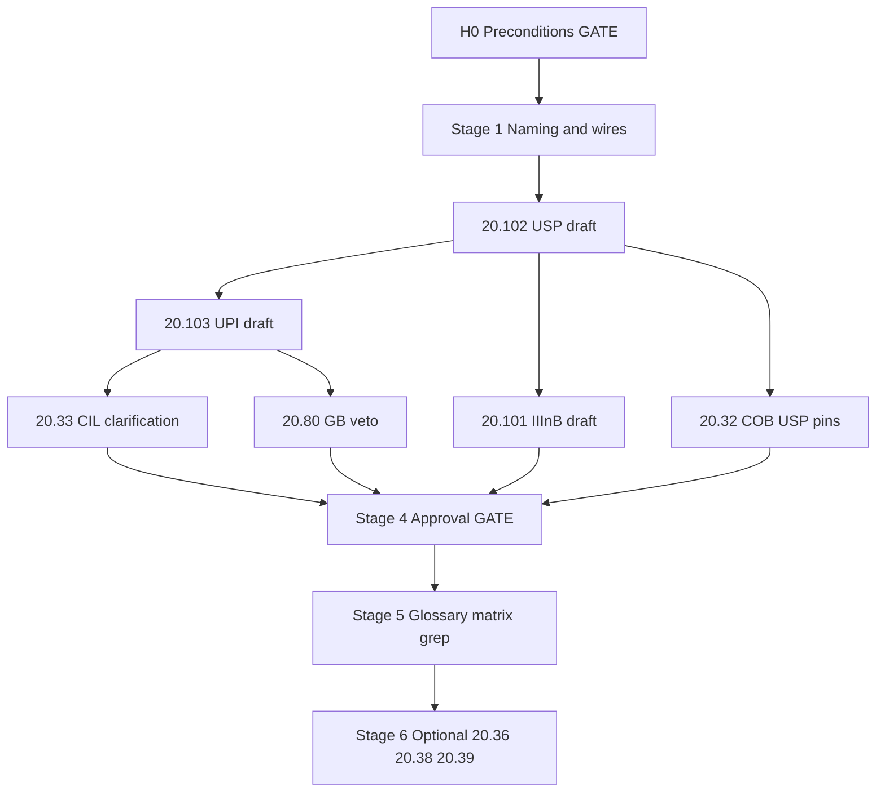

# 20.510 Refactoring for Input Correction (Track H)

**Document ID:** 20.510  
**Version:** 1.3
**Date:** 2026-06-07  
**Status:** **Complete** — MVC satisfied 2026-06-07; Stage 5 boundary grep PASS; Stage 6 doc bridge approved 2026-06-07.

## Purpose

This document is the **single coordination hub** for **Track H** — the follow-on program that specifies **semantic input error correction** via **IIInB**, **USP**, and **UPI**.

**This document is NOT normative TS runtime requirements.** It does not override [20.12_ts_invariants.md](20.12_ts_invariants.md), bootstrap documents (20.10, 20.20, 20.30), CP-approved module HLRs, or the closed [20.100](20.100_inb_requirements.md) InB scope. It tracks **what to change, in what order, with what approval, and when** — for **20-series documents only**.

**Program order:** Track H runs **after** [20.500](20.500_refactoring_for_dual_TS_pipeline.md) — **not before** and not in parallel with dual-pipeline MVC. H0 GATE (§2) requires 20.500 **complete** before any Track H Stage 1+ drafting.

**Predecessor (required):** [20.500_refactoring_for_dual_TS_pipeline.md](20.500_refactoring_for_dual_TS_pipeline.md) — dual-pipeline program **closed 2026-06-07**; Track H decision recorded in §7.7; execution contract opened here **after** that close-out.

**Reviewers:** CuriousOne23, Copilot, Grok — consensus required where marked **GATE**.

**How to use this document:** Treat §2–§3 as the execution contract. Normative behavior lands in **20.101–20.103** and approved cross-ref updates — not in this file.

## Scope boundary (20-series sign-off only)

| In scope | Out of scope |
|----------|--------------|
| 20-series drafts, approvals, grep, MVC | `30_verification/` sign-off |
| 20-series cross-refs and wire registry | `40_thought_simulator_playground/` sign-off |
| Coordination metadata in this file | `50_thought_simulator_design/` sign-off |
| Track H touch set in §3 Stage 3 only | 10-series promotion gates |

**Sign-off authority:** Approval gates (§7.1), inventory (§4), MVC (§11), and per-stage checklists (§13) apply **exclusively** to documents under `thought_simulator/20_requirements/` that are **in the Track H program touch set** (§3 Stages 2–6).

**Informational references:** Other documents and directories MAY be cited for **context, likely follow-on work, and handoff only**. Such citations are **not** sign-off items, blockers, checklist rows, or MVC criteria in this program.

**No authority outside Track H 20-series touch set:** 20.510 has **no provenance or authority** over any document or directory listed in §Likely downstream updates below — including other 20-series modules (e.g. [20.50](20.50_rb_requirements.md)) that were not in the approved Stage 3 touch set.

### Likely downstream updates (informational — no 20.510 authority)

These layers will **likely** need Track H–related updates as implementation proceeds. Owners gate their own approvals per layer guides. **20.510 does not track, approve, or block any of the following.**

| Layer / document | Directory or path | Likely update | Owner guide |
|------------------|-------------------|---------------|-------------|
| RB routing intake handoff | [20.50_rb_requirements.md](20.50_rb_requirements.md) | `InB → IIInB → RB` ordering; no repair logic in RB | 20-series module owner (not 20.510 Stage 3 touch set) |
| Verification evidence | `thought_simulator/30_verification/` | Class 7 run capsules; Track H conformance evidence | [30.00](../30_verification/30.00_verification_user_guide.md) |
| Verification process | [30.00_verification_user_guide.md](../30_verification/30.00_verification_user_guide.md) | Promotion standards for Track H harness evidence | 30-series guidance owner |
| Playground prototypes | `thought_simulator/40_thought_simulator_playground/` | IIInB harness, replay fixtures, struct prototypes | [40.160](../40_thought_simulator_playground/40.05_master_program_guide.md) |
| Design specifications | `thought_simulator/50_thought_simulator_design/` | Subsystem design after 40/30 evidence matures | [50.05](../50_thought_simulator_design/50.05_software_spec_construction_guide.md) |
| Design construction process | [50.05_software_spec_construction_guide.md](../50_thought_simulator_design/50.05_software_spec_construction_guide.md) | Pre-construction verification gates before 50.xx updates | 50-series guidance owner |

Traceability anchors remain in [20.200](20.200_traceability_matrix.md); matrix rows do **not** confer 20.510 sign-off authority over 30/40/50 work.

### Informational handoff — suggested [40.160](../40_thought_simulator_playground/40.05_master_program_guide.md) priorities

*Not 20.510 sign-off. Listed for implementers; 40.160 is responsible for scheduling, evidence, and playground conformance.*

| Suggested 40.xx focus | Purpose | Primary 20-series inputs |
|-----------------------|---------|--------------------------|
| `40.60_*` IIInB intake prototype | `profile_enabled` gate; `InB → input_semantic_repair → RB`; read-only USP apply | [20.101](20.101_iiinb_requirements.md), [20.38](20.38_ts_implementation_guidelines.md) §6 |
| Track H replay harness | Runnable `REPLAY_CLASS_7` fixtures C7-A..E; strip/diff per Class 7 assertions | [20.36](20.36_canonical_end_to_end_trace.md) §9 |
| Intake struct prototype | `UspSnapshot`, `TpLaneView` intake fields, `ConversationLayerState` separation | [20.39](20.39_ts_core_data_structures.md) §3.1–3.2 |
| Clarification → commit path | CIL FIFO → `clarification_event` → UPI → GB gate → USP version pin | [20.33](20.33_cil_requirements.md), [20.103](20.103_upi_requirements.md), [20.80](20.80_gb_requirements.md) §10 |
| Envelope write-guard tests | Fail-fast on IIInB writes to `semantic_core` / `TP.TR` | [20.38](20.38_ts_implementation_guidelines.md) §2, §8 |
| 30-series evidence promotion | Normalize run evidence into verification capsules when ready | [30.00](../30_verification/30.00_verification_user_guide.md) (informational) |

---

## 1. Architectural Summary (Reference)

### 1.1 Program scope

**One follow-on program, three roles — not a parallel meaning pipeline.**

| Role | Layer | Primary duty |
|------|--------|--------------|
| **IIInB** | Pre–Pipeline A semantic repair (after InB surface norm) | Apply explicit USP rules; escalate unknowns to clarification |
| **USP** | Conversation layer under COB | Versioned auditable shorthand rule store; read-only to IIInB |
| **UPI** | Conversation layer after clarification | Single writer of USP rule commits; GB-gated |

**Closure line (inherited from 20.500 §7.7):** InB corrects surface form deterministically; semantic input error correction is a separate, profiled pre–Pipeline A program (**IIInB + clarification + UPI/USP**), not an InB, IB, or IMR responsibility.

### 1.2 Placement in TS (authoritative mental model — CP v2 aligned)

```text
External → CIL (conversation) → InB (surface, Pipeline A input)
         → [optional IIInB reads USP; unknown → CIL clarification → UPI → USP]
         → Pipeline A: RB → OB → DCB → TR → TB → Merge → Truth/Done → mtp_update
         → Pipeline B: TrigRB → SRP → exec_plan → OuB → IMR
Conversation layer (durable): USP under COB; UPI on clarification events only
```

### 1.3 Authority limits (non-negotiable)

| Writer | MAY write | SHALL NOT write |
|--------|-----------|-----------------|
| **IIInB** | Intake-bound repair tags / resolved-segment refs | `semantic_core`, `TP.TR`, MTP semantics, USP |
| **USP** | Profile snapshots / rule versions (via UPI only) | TP intent fields, per-cycle meaning, `exec_plan` |
| **UPI** | USP rule entries (GB-gated) | Routing contracts, `semantic_core`, direct IIInB invocation |
| **IMR** | `exec_trace`, supervisory `CorrectionTrigger` | USP, UPI, IIInB outputs; clarification initiation |

### 1.4 Escalation paths (two wires, one program)

| Condition | Path |
|-----------|------|
| Unknown shorthand / no matching USP rule | CIL clarification → UPI → USP |
| `MI_INCOMP` / commitment blocked | IB-Creation-Request → GB → IB ([20.17](20.17_messy_input_handling.md)) |

### 1.5 Optional profile gate

When `profile_enabled = false` (execution-signature-bound): **skip IIInB entirely** — zero Track H cost on the hot path.

---

## 2. Phase 0 Preconditions (GATE)

**No Stage 1+ normative drafting until all rows signed.**

| # | Precondition | Status |
|---|--------------|--------|
| H0-1 | [20.500](20.500_refactoring_for_dual_TS_pipeline.md) dual-pipeline program **complete before Track H opens** (not concurrent) | ☑ 2026-06-07 |
| H0-2 | [20.100](20.100_inb_requirements.md) InB scope **closed** — semantic repair out of InB | ☑ 2026-06-07 |
| H0-3 | [20.190](20.190_glossary.md) Primitive Intent Catalog defines IIInB/USP/UPI boundaries (draft Track H entry) | ☑ 2026-06-07 |
| H0-4 | CP v2 mental model aligned ([Grok_review_in_20.md](Grok_review_in_20.md)) — not a second OB/TR/routing stack | ☑ 2026-06-07 |
| H0-5 | IMR / Pipeline B separation accepted — Track H does not couple to B | ☑ 2026-06-07 |

**Sign-off record:**

| Reviewer | Date | Notes |
|----------|------|-------|
| CuriousOne23 | 2026-06-07 | H0 GATE signed — Stage 1 unblocked |
| Copilot | 2026-06-07 | H0 GATE co-signed |
| Grok | 2026-06-07 | 20.510 v0.1 opened; H0-1…H0-5 satisfied by prior program closure |

**H0 GATE:** ☑ **Complete 2026-06-07** — all three reviewers signed; Stage 1 naming and wire resolution may proceed.

---

## 3. Staged Refactor Process

```text
Stage 0  → Preconditions (GATE) — §2
Stage 1  → Naming, placement, wire-schema resolution
Stage 2  → New normative documents (20.101–20.103 rough drafts)
Stage 3  → Existing-document cross-ref updates (CIL, COB, GB, InB, TP, …)
Stage 4  → Iterative review & approval (per document — GATE)
Stage 5  → Glossary Phase 4, traceability, consistency grep & close-out
Stage 6  → Optional 20-series only: 20.36 Class 7, 20.38, 20.39 (approved 2026-06-07)
```

### Stage 1 — Naming, Placement, and Wire Schema Resolution

**Goal:** Stable terminology and intake ordering before normative HLR drafting.

**1a — Blocking (must resolve before Stage 2):**

| Item | Options | Status | Decision |
|------|---------|--------|----------|
| Intake ordering | `InB → IIInB → RB` vs `IIInB → InB → RB` | `agreed` | **`InB → IIInB → RB`** — HQ-001 approved 2026-06-07 (CuriousOne23, Copilot) |
| IIInB wire form | Named basin vs profiled `input_semantic_repair` stage | `agreed` | **IIInB** canonical name; wire = profiled pre–A stage **`input_semantic_repair`** — not in RB→OB→TR chain (HQ-002 approved 2026-06-07) |
| Clarification wire | `clarification_event` schema owner | `pending` | **20.33** CIL + **20.103** UPI interface |
| USP version pin | On `iiinb_repair_record` vs separate audit only | `pending` | Replay MUST pin `usp_version_ref` |
| Profile gate field | `profile_enabled` home | `pending` | **20.90** parameter table or **20.101** |

**1b — Deferred (may resolve during Stage 2/4):**

- Rule precedence tie-break fine points
- Max rules / max segments default values
- COB export manifest field names for USP snapshots

**Tracked in:** §5 Naming & Wire Registry.

---

### Stage 2 — New Documents (Rough Drafts, Unapproved)

**Internal draft order:**

| Order | Document | Purpose | Status | Depends on |
|-------|----------|---------|--------|------------|
| 1 | [20.102_usp_requirements.md](20.102_usp_requirements.md) | USP rule store, versioning, COB pins, read-only semantics | `draft` | H0 GATE, Stage 1a |
| 2 | [20.103_upi_requirements.md](20.103_upi_requirements.md) | UPI clarification → rule commit, GB gate, audit | `draft` | 20.102 draft, 20.33 interface |
| 3 | [20.101_iiinb_requirements.md](20.101_iiinb_requirements.md) | IIInB repair apply, escalation, caps, TCU, repair tags | `draft` | 20.102 draft, 20.100 handoff |

**Note:** USP before IIInB because IIInB reads USP; UPI before IIInB normative finalize because escalation lands in UPI.

---

### Stage 3 — Update Existing Documents (Cross-Ref Only)

**Allowed touch set:**

| Document | Action | Status | Notes |
|----------|--------|--------|-------|
| [20.100](20.100_inb_requirements.md) | Handoff contract to IIInB; ordering line | `deferred` | InB closed — additive cross-ref only |
| [20.17](20.17_messy_input_handling.md) | IIInB escalation vs `MI_*` / IB path table | `deferred` | Pointer only |
| [20.33](20.33_cil_requirements.md) | Clarification FIFO + `clarification_event` → UPI | `approved` | **P0 integration** — 2026-06-07 |
| [20.32](20.32_cob_requirements.md) | USP snapshot versioning under COB | `approved` | **P0 integration** — 2026-06-07 |
| [20.80](20.80_gb_requirements.md) | GB veto on unsafe UPI rule commits | `approved` | v0.4 — 2026-06-07 |
| [20.16](20.16_gb_responsibility_matrix.md) | Clarification / rule-commit caps (if added) | `deferred` | |
| [20.105](20.105_tp_requirements.md) | Intake-bound repair tag fields | `approved` | v0.5 — 2026-06-07 |
| [20.30](20.30_ts_functional_model.md) | Optional `[IIInB]` stage line when profile on | `deferred` | Additive |
| [20.36](20.36_canonical_end_to_end_trace.md) | Class 7 Track H replay fixtures | `approved` v0.6 | Stage 6 approved 2026-06-07 |
| [20.150](20.150_tcu_budgeting_requirements.md) | IIInB TCU budget row | `deferred` | |
| [20.70](20.70_mb_requirements.md) | MB visibility for Track H audit records | `deferred` | |
| [20.90](20.90_ts_parameter_table.md) | `profile_enabled`, cap defaults | `deferred` | |

**Rules:**

- Do **not** reopen InB semantic duties
- Do **not** insert Track H into Pipeline B or IMR authority
- Do **not** make USP a meaning-construction primitive (no `TP.TR` / OB / TB writes)

---

### Stage 4 — Iterative Review & Approval (GATE per document)

**Workflow per document:**

1. Grok drafts or updates
2. Copilot + CuriousOne23 review
3. Iterate until aligned
4. Mark **approved** in §7.1 with date and version target

**Consensus rule:**

| Document type | Approval |
|---------------|----------|
| Normative requirements (20.101–20.103) | All three |
| Stage 3 cross-ref updates (normative HLR adds) | All three |
| 20.510 coordination updates | All three |
| 20.38 / 20.39 guidance touch | CuriousOne23 + Copilot when coding starts |

---

### Stage 5 — Glossary, Traceability, Grep & Close-Out

**Same change set as final normative approvals (HLR-20.190-002, HLR-20.200-002):**

- [x] [20.190_glossary.md](20.190_glossary.md) — Phase 4: split IIInB, USP, UPI catalog entries; fix InB→IIInB ordering — v0.3 2026-06-07
- [x] [20.200_traceability_matrix.md](20.200_traceability_matrix.md) — rows for 20.101–20.103 + Stage 3 scope — 2026-06-07
- [x] [glossary_term_registry.json](glossary_term_registry.json) — IIInB, USP, UPI, wire terms — 2026-06-07
- [x] [20_requirements/README.md](README.md) — authoritative list + 20.510 complete — 2026-06-07

**Repo-wide grep checks before closing 20.510:**

- [x] No IIInB/USP/UPI duties assigned to InB, IB, or IMR in normative docs — PASS 2026-06-07
- [x] No USP/UPI routing-contract or `exec_plan` language in Track H modules (only SHALL NOT) — PASS 2026-06-07
- [x] No `semantic_core` writes from IIInB/UPI/USP in normative HLRs (only SHALL NOT) — PASS 2026-06-07
- [x] CIL = Conversation Integration Layer (not “cognitive integrity”) in all Track H cross-refs — PASS 2026-06-07
- [x] `validate_20_traceability_matrix.py` green after matrix update — PASS 2026-06-07

**Close-out:** Set 20.510 status to `complete`; archive open items in §7.6.

---

### Stage 6 — 20-Series Implementation Bridge (Optional)

Not required to close 20.510. **20-series sign-off only:**

| Document | Purpose | Status |
|----------|---------|--------|
| [20.36](20.36_canonical_end_to_end_trace.md) | Class 7 Track H replay fixture contract | `approved` v0.6 |
| [20.38](20.38_ts_implementation_guidelines.md) | IIInB optional stage, profile gate patterns | `approved` v0.5 |
| [20.39](20.39_ts_core_data_structures.md) | `UspSnapshot`, repair tag structs | `approved` v0.5 |

**Downstream work (informational — not 20.510 sign-off):** See §Scope boundary — suggested priorities live in [40.160](../40_thought_simulator_playground/40.05_master_program_guide.md).

---

## 4. Document Inventory

### 4.1 New — To Create (Track H normative)

| ID | Document | Stage | Priority | Status |
|----|----------|-------|----------|--------|
| 20.101 | IIInB requirements | 2→4 | **P0** | `approved` |
| 20.102 | USP requirements | 2→4 | **P0** | `approved` |
| 20.103 | UPI requirements | 2→4 | **P0** | `approved` |

### 4.2 Existing — Cross-Ref / Integration

| ID | Document | Action | Priority | Status |
|----|----------|--------|----------|--------|
| 20.33 | CIL | Clarification → UPI wire | **P0** | `approved` |
| 20.32 | COB | USP versioning | **P0** | `approved` |
| 20.80 | GB | UPI commit veto | P1 | `approved` |
| 20.100 | InB | IIInB handoff | P1 | `deferred` |
| 20.105 | TP | Repair tag fields | P1 | `approved` |
| 20.36 | Replay fixtures | Class 7 | P2 | `approved` v0.6 |
| 20.190 | Glossary | Phase 4 split | P1 | `approved` (v0.3 2026-06-07) |

### 4.3 Coordination — No Normative Override

| ID | Document | Role |
|----|----------|------|
| 20.500 | Dual-pipeline refactor | **Complete** 2026-06-07 — **ran first**; §7.7 closure decision only; Track H execution moved here after 20.500 close |
| 20.510 | This document | **Complete** 2026-06-07 — **successor program after 20.500** |

---

## 5. Naming & Wire Registry

**Legend:** `agreed` | `pending` | `deferred`

### 5.1 Program roles

| Canonical | Aliases (reject) | Scope | Status | Owner doc | Notes |
|-----------|------------------|-------|--------|-----------|-------|
| IIInB | Input Integrity Basin, InB-II, pre-semantic canonicalization | Pre–A `input_semantic_repair` stage after InB | `agreed` | 20.101 | `InB → IIInB → RB`; ≠ Pipeline A basin; ≠ InB |
| `input_semantic_repair` | IIInB stage alias | Profiled pre–A repair slice | `agreed` | 20.101 | Stage wire name; primitive display name remains IIInB |
| USP | User-Side Profile, intent structurer | COB-governed rule store | `agreed` | 20.102 | Read-only to IIInB |
| UPI | User plan integrator, job contract generator | Post-clarification USP writer | `agreed` | 20.103 | ≠ SRP / `exec_plan` |

### 5.2 Wire artifacts (Stage 1b → Stage 2)

| Symbol | Scope | Status | Owner doc |
|--------|-------|--------|-----------|
| `usp_rule` | USP entry | `agreed` | 20.102 §Wire Schemas |
| `usp_version_ref` | Replay pin | `agreed` | 20.102, 20.101 |
| `usp_version_record` | Version audit | `agreed` | 20.102 |
| `iiinb_repair_record` | Per-turn audit | `agreed` | 20.101 |
| `input_repair_tag` | TP intake-bound | `agreed` | 20.101, 20.105 |
| `iiinb_escalation_ref` | CIL handoff | `agreed` | 20.101, 20.33 |
| `clarification_event` | CIL → UPI | `agreed` | 20.33, 20.103 |
| `upi_commit_record` | UPI → USP audit | `agreed` | 20.103 |
| `profile_enabled` | Execution-signature gate | `agreed` | 20.101 HLR-20.101-001 |

---

## 6. CI / Validator Manifest

**Track H validators (extend when Stage 2 drafts land):**

| Check | Tool / action | When |
|-------|---------------|------|
| Traceability matrix | `validate_20_traceability_matrix.py` | Stage 5 |
| Glossary alignment | glossary validator (if applicable) | Stage 5 |
| Track H boundary grep | Manual + scripted patterns (§3 Stage 5) | Stage 5 |

*No Stage 1.5b mechanical rename pass planned for Track H unless explicitly opened.*

---

## 7. Tracking Tables

### 7.1 Document Approval Log

| Document | Version | Stage | Status | Drafted | Approved | Approvers |
|----------|---------|-------|--------|---------|----------|-----------|
| 20.510 | 0.3 | 1 | `draft` | 2026-06-07 | 2026-06-07 | CuriousOne23, Copilot, Grok (H0 + Stage 1a) |
| 20.101 | 0.1 | 4 | `approved` | 2026-06-07 | 2026-06-07 | CuriousOne23, Copilot, Grok |
| 20.102 | 0.1 | 4 | `approved` | 2026-06-07 | 2026-06-07 | CuriousOne23, Copilot, Grok |
| 20.103 | 0.1 | 4 | `approved` | 2026-06-07 | 2026-06-07 | CuriousOne23, Copilot, Grok |
| 20.190 | 0.3 | 5 | `approved` | 2026-06-07 | 2026-06-07 | CuriousOne23, Copilot, Grok |
| 20.32 | — | 3 | `approved` | 2026-06-07 | 2026-06-07 | CuriousOne23, Copilot, Grok |
| 20.33 | — | 3 | `approved` | 2026-06-07 | 2026-06-07 | CuriousOne23, Copilot, Grok |
| 20.80 | 0.4 | 3 | `approved` | 2026-06-07 | 2026-06-07 | CuriousOne23, Copilot, Grok |
| 20.105 | 0.5 | 3 | `approved` | 2026-06-07 | 2026-06-07 | CuriousOne23, Copilot, Grok |
| 20.36 | 0.6 | 6 | `approved` | 2026-06-07 | 2026-06-07 | User |
| 20.38 | 0.5 | 6 | `approved` | 2026-06-07 | 2026-06-07 | User |
| 20.39 | 0.5 | 6 | `approved` | 2026-06-07 | 2026-06-07 | User |

*Status values:* `not_started` | `draft` | `review` | `blocked` | `approved` | `deferred`

### 7.2 Change Batch Log

| Batch ID | Date | Summary | Files touched | CI green? | Approvers |
|----------|------|---------|---------------|-----------|-----------|
| H-1 | 2026-06-07 | Stage 4 approval + glossary Phase 4 | 20.101–20.103, 20.190 v0.3, 20.200, registry, README | ☑ | CuriousOne23, Copilot, Grok |
| H-2 | 2026-06-07 | Stage 3 integration approval | 20.32, 20.33, 20.80 v0.4, 20.105 v0.5; cross-refs 20.101–20.103, 20.190 | ☑ | CuriousOne23, Copilot, Grok |
| H-3 | 2026-06-07 | Stage 5 grep close-out | 20.200 Stage 3 scope rows, README; boundary grep PASS; 20.510 → complete | ☑ | Grok |
| H-4 | 2026-06-07 | Stage 6 implementation bridge | 20.36 v0.6 Class 7; 20.38 v0.5; 20.39 v0.5; 20.190 wire terms; 20.200 scope | ☑ | Grok |
| H-5 | 2026-06-07 | Stage 6 approval | 20.36 v0.6, 20.38 v0.5, 20.39 v0.5 approved; 20.200 scope | ☑ | User |

### 7.3 Open Questions

| ID | Question | Owner | Status | Resolution |
|----|----------|-------|--------|------------|
| HQ-001 | Intake ordering: `InB → IIInB → RB` confirmed? | Stage 1a | `resolved` | **`InB → IIInB → RB`** — approved 2026-06-07 (CuriousOne23, Copilot) |
| HQ-002 | IIInB: named basin vs `input_semantic_repair` stage? | 20.101 | `resolved` | **IIInB** name + **`input_semantic_repair`** stage wire; not in RB→OB→TR chain — approved 2026-06-07 |
| HQ-003 | Class 7 in 20.36: mandatory for 20.510 close vs Stage 6? | All three | `resolved` | **Optional for MVC**; 20.36 v0.6 approved 2026-06-07; runnable harness sign-off is [40.160](../40_thought_simulator_playground/40.05_master_program_guide.md) responsibility |
| HQ-004 | Max USP rules / max IIInB segments per turn defaults? | 20.101, 20.90 | `resolved` | **256** active USP rules; **32** segments / **16** applies per turn (20.101/20.102) — approved v0.1 |
| HQ-005 | GB cap on pending clarifications? | 20.16, 20.80 | `resolved` | **8** pending UPI commits per conversation (20.103 HLR-20.103-016) — approved v0.1 |

### 7.4 Blocked Items

| Item | Blocked by | Since | Notes |
|------|------------|-------|-------|
| ~~Stage 2 drafts~~ | — | 2026-06-07 | ☑ **Complete** — 20.101, 20.102, 20.103 v0.1 |
| ~~Stage 4 serial review~~ | — | 2026-06-07 | ☑ **Complete** — all three approved 2026-06-07 |
| ~~Stage 3 integration~~ | — | 2026-06-07 | ☑ **Complete** — 20.32, 20.33, 20.80, 20.105 approved 2026-06-07 |

### 7.5 Resume Here

**Done:**

- 20.500 complete; InB closed ([20.100](20.100_inb_requirements.md) v0.2)
- [20.190](20.190_glossary.md) v0.2 Primitive Intent Catalog — Track H draft entry
- CP v2 mental model aligned ([Grok_review_in_20.md](Grok_review_in_20.md))
- 20.510 v0.1 coordination hub created
- **H0 GATE signed** (2026-06-07; CuriousOne23, Copilot, Grok)
- **HQ-001 / HQ-002 approved** (2026-06-07; CuriousOne23, Copilot) — `InB → IIInB → RB`; IIInB + `input_semantic_repair` stage wire
- **Stage 2 rough drafts** — 20.102, 20.103, 20.101 v0.1 (2026-06-07)
- **Stage 4 approved** — 20.101, 20.102, 20.103 v0.1 (2026-06-07; CuriousOne23, Copilot, Grok)
- **20.190 v0.3** — Phase 4 glossary split (same change set)
- **Stage 3 approved** — 20.32, 20.33, 20.80 v0.4, 20.105 v0.5 (2026-06-07; CuriousOne23, Copilot, Grok)
- **Stage 5 complete** — boundary grep PASS; `validate_20_traceability_matrix.py` green (2026-06-07)
- **Program closed** — MVC satisfied (2026-06-07)

**Next (optional follow-on only):**

| Step | Action | Owner |
|------|--------|-------|
| ~~1–6~~ | Stages 0–5 | ☑ **Complete 2026-06-07** |
| ~~7~~ | **Stage 6 20-series docs** — 20.36/20.38/20.39 approved 2026-06-07 | ☑ Complete |
| 8 | Deferred 20-series cross-refs — see §7.6 | As needed |
| — | **40-series / 30-series** — see [40.160](../40_thought_simulator_playground/40.05_master_program_guide.md) (out of 20.510 scope) | 40.160 owner |

### 7.6 Archived Open Items (post-program)

Deferred items — not required for MVC; revisit only if coding or verification needs them:

| Item | Document | Notes |
|------|----------|-------|
| InB→IIInB handoff cross-ref | [20.100](20.100_inb_requirements.md) | Additive pointer only; InB closed |
| IIInB vs `MI_*` / IB escalation table | [20.17](20.17_messy_input_handling.md) | Pointer only |
| `[IIInB]` stage line when profile on | [20.30](20.30_ts_functional_model.md) | Additive topology label |
| ~~Class 7 Track H replay fixtures~~ | [20.36](20.36_canonical_end_to_end_trace.md) | ☑ **Approved v0.6** — 2026-06-07 |
| IIInB TCU budget row | [20.150](20.150_tcu_budgeting_requirements.md) | Referenced by 20.101 HLR-020 |
| MB visibility for Track H audit | [20.70](20.70_mb_requirements.md) | Observability follow-on |
| `profile_enabled`, cap defaults | [20.90](20.90_ts_parameter_table.md) | Parameter table sync |
| Clarification caps in 20.16 | [20.16](20.16_gb_responsibility_matrix.md) | HQ-005 default in 20.103 HLR-016 |
| IMR boundary re-review | [20.45](20.45_imr_requirements.md) | Stage 5 grep PASS — no UPI/IIInB coupling found |
| 20.100 InB re-review | [20.100](20.100_inb_requirements.md) | Stage 5 grep PASS — semantic repair out of scope |

---

## 8. Re-Review Queue (Boundary Checks)

Second-pass **boundary check only** when touching CP-approved modules — not structural rewrite.

| Module | Version | Check | Status |
|--------|---------|-------|--------|
| 20.100 InB | v0.2 | Handoff only; semantic repair still out of scope | `grep_pass` |
| 20.17 messy-input | v0.4 | IIInB vs IB escalation table | `deferred` |
| 20.45 IMR | v0.2 | No UPI invocation; indirect replay only | `grep_pass` |
| 20.33 CIL | — | Clarification wire additive | `approved` |
| 20.32 COB | — | USP versioning additive | `approved` |
| 20.80 GB | v0.4 | UPI commit veto additive | `approved` |
| 20.105 TP | v0.5 | Intake repair fields additive | `approved` |

---

## 9. Dependency Graph



---

## 10. Risk Register

| ID | Risk | Likelihood | Impact | Mitigation |
|----|------|------------|--------|------------|
| R1 | IIInB reopens InB semantic scope | Medium | High | 20.100 Non-Goals; Stage 5 grep |
| R2 | USP becomes second meaning pipeline | Medium | High | 20.190 catalog; no TP.TR writes in HLRs |
| R3 | UPI duplicates SRP/`exec_plan` | Low | High | 20.190 "is not"; Stage 5 grep |
| R4 | IMR invokes clarification / UPI | Low | Medium | 20.45 boundary; §8 re-review |
| R5 | 20.510 mistaken as normative law | Medium | Medium | Header `status: coordination`; §Scope boundary — 20-series only |
| R6 | Unbounded USP rules → cost drift | Medium | Medium | Caps in 20.101/20.102; TCU in 20.150 |

---

## 11. Minimum Viable Close (MVC)

Track H may close 20.510 when **all** are true:

1. **20.101, 20.102, 20.103** approved (all three)
2. **20.33, 20.32, 20.80** integration HLRs approved (clarification + USP version + GB veto)
3. **20.105** intake repair tag fields approved
4. **20.190** Phase 4 glossary split + **20.200** rows + registry updated
5. Stage 5 grep checks PASS

**Not required for MVC:** Stage 6 optional 20-series docs (20.36 Class 7, 20.38, 20.39). **30-series and 40-series work is never in MVC scope** — see §Scope boundary.

---

## 12. Approval of This Document (20.510 v0.1)

| Reviewer | Role | Approve 20.510 structure? | Date | Comments |
|----------|------|---------------------------|------|----------|
| CuriousOne23 | Architecture owner | ☑ | 2026-06-07 | H0 GATE signed |
| Copilot | Review | ☑ | 2026-06-07 | H0 GATE co-signed |
| Grok | Draft author | ☑ | 2026-06-07 | v0.1 initial tracker |

---

## 13. Per-Stage Checklists

### Stage 0
- [x] H0-1…H0-5 preconditions documented — 2026-06-07
- [x] All three signed §2 table — 2026-06-07 (CuriousOne23, Copilot, Grok)

### Stage 1
- [x] HQ-001 intake ordering resolved — `InB → IIInB → RB` (2026-06-07)
- [x] HQ-002 IIInB wire form decided — IIInB + `input_semantic_repair` stage (2026-06-07)
- [x] §5.1 program roles `agreed` — 2026-06-07
- [x] §5.2 wire artifacts `agreed` in 20.101–20.103 — 2026-06-07

### Stage 2
- [x] 20.102 USP rough draft — v0.1 2026-06-07
- [x] 20.103 UPI rough draft — v0.1 2026-06-07
- [x] 20.101 IIInB rough draft — v0.1 2026-06-07

### Stage 3
- [x] 20.33 clarification wire — 2026-06-07
- [x] 20.32 USP versioning — 2026-06-07
- [x] 20.80 GB veto — 2026-06-07
- [x] 20.105 repair tags — 2026-06-07

### Stage 4
- [x] Per-doc three-way approval for 20.101–20.103 — 2026-06-07
- [x] Stage 3 integration docs approved — 2026-06-07

### Stage 5
- [x] 20.190 Phase 4 — v0.3 2026-06-07
- [x] 20.200 matrix rows — Stage 3 scope update 2026-06-07
- [x] glossary_term_registry.json — Track H terms
- [x] Stage 5 grep PASS — 2026-06-07
- [x] 20.510 status → `complete` — 2026-06-07

### Stage 6 (optional — 20-series only)
- [x] 20.36 Class 7 — **approved** v0.6 — 2026-06-07
- [x] 20.38 Track H intake-path guidance — **approved** v0.5 — 2026-06-07
- [x] 20.39 `UspSnapshot` + intake wire structs — **approved** v0.5 — 2026-06-07

*40-series and 30-series items are not tracked here — see §Scope boundary and [40.160](../40_thought_simulator_playground/40.05_master_program_guide.md).*

---

## 14. Changelog

| Version | Date | Author | Summary |
|---------|------|--------|---------|
| 0.1 | 2026-06-07 | Grok | Initial Track H coordination hub; spun out from 20.500 §7.7; stages 0–6, inventory, registry, MVC |
| 0.2 | 2026-06-07 | CuriousOne23, Copilot, Grok | H0 GATE signed — Stage 0 complete; Stage 1 unblocked |
| 0.3 | 2026-06-07 | CuriousOne23, Copilot, Grok | HQ-001 `InB → IIInB → RB`; HQ-002 IIInB + `input_semantic_repair` stage wire; Stage 2 unblocked |
| 0.3 | 2026-06-07 | Grok | 20.102 USP v0.1 rough draft — Stage 2 step 1 |
| 0.4 | 2026-06-07 | Grok | Stage 2 complete — 20.103 UPI v0.1, 20.101 IIInB v0.1; serial Stage 4 review next |
| 0.5 | 2026-06-07 | CuriousOne23, Copilot, Grok | Stage 4 complete — 20.101–20.103 approved; 20.190 v0.3 Phase 4; Stage 3 next |
| 0.6 | 2026-06-07 | CuriousOne23, Copilot, Grok | Stage 3 complete — 20.32, 20.33, 20.80 v0.4, 20.105 v0.5 approved; MVC items 2–3 satisfied; Stage 5 next |
| 0.7 | 2026-06-07 | Grok | Stage 5 complete — boundary grep PASS; traceability validator green; MVC closed; §7.6 archived |
| 0.8 | 2026-06-07 | Grok | Stage 6 doc bridge — 20.36/20.38/20.39 Track H drafts; HQ-003 resolved; batch H-4 |
| 0.9 | 2026-06-07 | User | Stage 6 approval — 20.36 v0.6, 20.38 v0.5, 20.39 v0.5; batch H-5 |
| 1.0 | 2026-06-07 | User | Scope hygiene — 20-series sign-off only; §Scope boundary; 40.160 informational handoff; remove 30/40 from checklists |
| 1.1 | 2026-06-07 | User | §Likely downstream updates — 20.50, 30/, 30.00, 50/, 50.05 informational; explicit no-authority over non-touch-set 20-series |
| 1.2 | 2026-06-07 | User | Program order — Track H **after** 20.500 complete, not before; §4.3 sequencing clarify |
| 1.3 | 2026-06-07 | User | §15 Historical Archive — 20-series refactor arc and composition learning note |

---

## 15. Historical Archive — 20-Series Refactor Arc

*Archival context for Track H (refactor **4**). Describes the broader 20-series evolution that preceded this program. Not normative runtime law — preserves architectural history so later composition learnings are not mistaken for drift.*

### 15.1 Four refactors (cumulative story)

Each refactor **narrowed the authoritative core** and **pushed specialization to the periphery** — not four unrelated reorganizations.

| # | Refactor | What moved | What it fixed | Primary program / anchor |
|---|----------|------------|---------------|--------------------------|
| **1** | **Manifold not integral to TS** | Realization (OuB, expression, `exec_plan` / `exec_trace`) peeled off core meaning | TS = meaning construction; manifold = derivable / regenerable evidence; strip-replayable B | Early 20-series; [20.12](20.12_ts_invariants.md) envelope partition |
| **2** | **Specialized primitives** | Monolithic intake / profile concepts split into InB, IB, basins, CIL, COB, IMR, GB, … | Writer authority; “is not” boundaries; [20.190](20.190_glossary.md) Primitive Intent Catalog | Module requirements 20.40–20.103; glossary tiers |
| **3** | **Dual pipelines** | Pipeline A (lane-parallel meaning) vs Pipeline B (singular per `commit_id`); freeze at `mtp_update` | HLR-20.012-011 operationalized; B cannot rewrite `semantic_core` | [20.500](20.500_refactoring_for_dual_TS_pipeline.md) (**complete** 2026-06-07) |
| **4** | **Input error correction (Track H)** | Semantic repair out of InB → IIInB + clarification + UPI/USP | Surface norm vs shorthand repair vs IB inquiry vs IMR post-output — four distinct wires | **This document** / 20.101–20.103 (**complete** 2026-06-07) |

**Track H (refactor 4) did not reopen 1–3.** It used them: `profile_enabled` gate, no `semantic_core` writes, no Pipeline B coupling, InB scope remains closed ([20.100](20.100_inb_requirements.md) v0.2).

### 15.2 How the refactors stack

```text
Refactor 1:  meaning core  ||  execution manifold (optional strip)
Refactor 2:  many named primitives with single duties
Refactor 3:  A constructs meaning  →  B realizes from frozen snapshot
Refactor 4:  optional pre-A repair lane (profile-gated); conversation-layer rules
```


### 15.3 Composition as learning (post–Track H)

**Composition is emergent** — primitive boundaries can be correct while the full orchestration graph is still discovered in 40-series integration. The playground modularity check (2026-06-07) showed **structure survived** two closed programs; integration debt clustered in predictable glue (Pipeline B cluster, unified replay harness, Track H intake path) — **worth noting, not conclusive** for runtime correctness.

Likely **composition seams** (wiring refactors, not primitive explosions):

| Seam | Nature | Likely 20-series touch (future) |
|------|--------|----------------------------------|
| Scheduler / tick model ↔ 20.36 stage order | Orchestration vs functional stages | [20.30](20.30_ts_functional_model.md); possible light integration note |
| IIInB vs `MI_*` vs IB escalation | Routing table | [20.17](20.17_messy_input_handling.md) pointer (deferred) |
| Conversation layer ↔ `commit_id` turn timing | COB pins vs per-cycle commit | [20.32](20.32_cob_requirements.md), [20.115](20.115_mtp_requirements.md), [20.103](20.103_upi_requirements.md) |
| TCU across optional IIInB + A + B | Global resource ledger | [20.150](20.150_tcu_budgeting_requirements.md) (IIInB row deferred) |

**Expectation:** One or more **bounded 20-series refactor passes** as 40 evidence matures — primarily orchestration, escalation routing, and turn timing — while bootstrap invariants (20.10, 20.12 envelopes, dual-pipeline handoff) remain stable. Closed programs (20.500, 20.510) record **what was decided when**; they do not forbid evidence-driven clarification.

**Directory map for readers:** [20.01_architecture_map.md](20.01_architecture_map.md) (runtime-pipeline blocks B0–B8). **Playground owner:** [40.160](../40_thought_simulator_playground/40.05_master_program_guide.md) (informational — no 20.510 sign-off).

---

## Traceability

- [20.500_refactoring_for_dual_TS_pipeline.md](20.500_refactoring_for_dual_TS_pipeline.md) §7.7 (predecessor — **closed before** this program; Track H successor)
- [20.100_inb_requirements.md](20.100_inb_requirements.md) (InB closure)
- [20.190_glossary.md](20.190_glossary.md) (intent catalog)
- [Grok_review_in_20.md](Grok_review_in_20.md) (CP v2 alignment archive)
- [40.05 Master Program Guide](../40_thought_simulator_playground/40.05_master_program_guide.md) (playground owner — informational)
- [30.00 Verification User Guide](../30_verification/30.00_verification_user_guide.md) (verification layer — informational)
- [50.05 Software Spec Construction Guide](../50_thought_simulator_design/50.05_software_spec_construction_guide.md) (design layer — informational)
- [20.50 RB Requirements](20.50_rb_requirements.md) (likely intake handoff cross-ref — informational; not 20.510 touch set)
- [20.01_architecture_map.md](20.01_architecture_map.md) (runtime-pipeline concept blocks — §15.3)