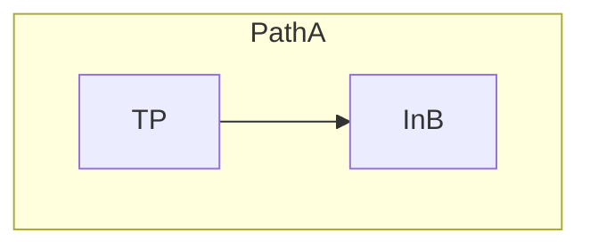
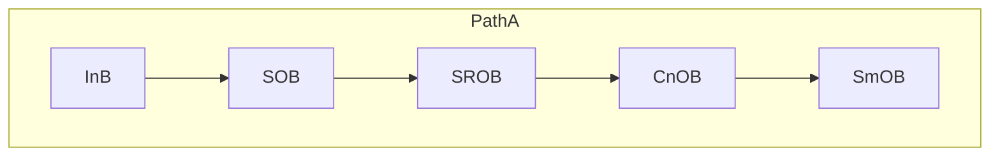
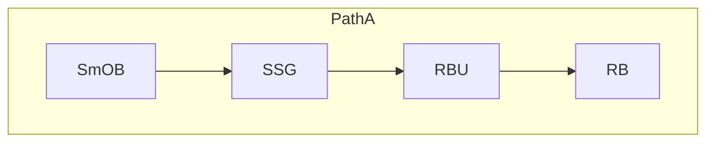
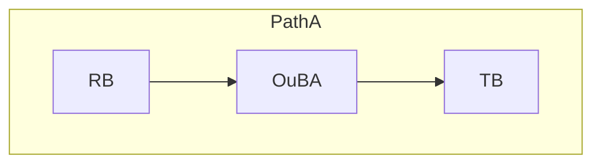
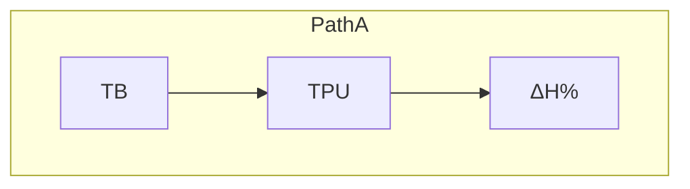
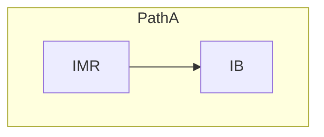
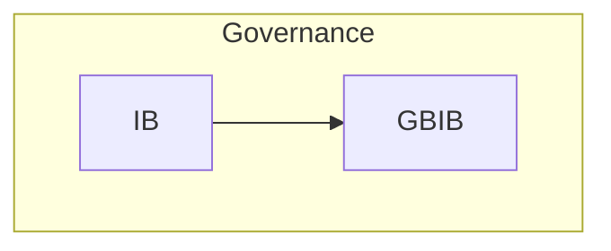
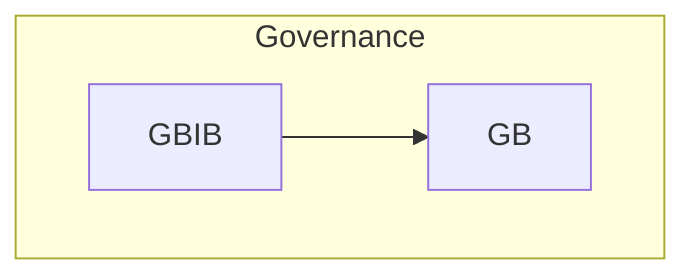
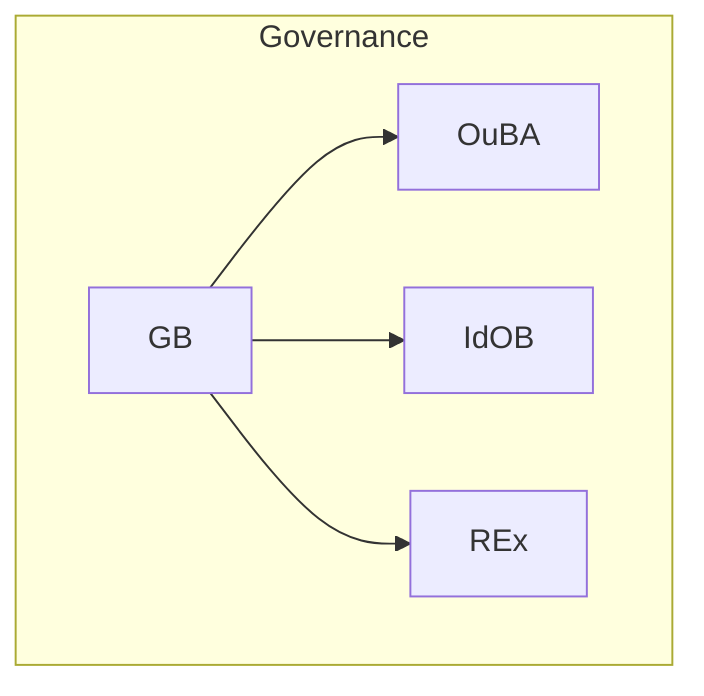

# **20.705 — TS Flow Diagrams (Primitives, Processes, Reference Objects)**

## **1. Purpose**
This document provides the authoritative flow diagrams for primitives, processes, and reference objects across Path A and Path B.  
All diagrams follow the conventions defined in **Section 0: Diagramming Conventions** and use compact horizontal notation.

This file serves as a **reference‑only visualization layer** for the 20‑series requirements.  
It does not define new behavior; it organizes and presents the flows in a stable, standalone format.

---

# **2. Path A Primitive Flows**

Path A consists of two operational modes:

- **Clean Path A** — no correction required  
- **Corrected Path A** — correction loop engaged  

Both flows are shown below.

### **2.1 Clean Path A**
```
InB → SOB → SROB → CnOB → SmOB → SSG → RBU → CTP → RB → RTU → IdOB → TR → OuBA
```

### **2.2 Corrected Path A**
```
InB → IIInB → IE → ISc → CEx → CE → TPU → IMR → SOB → SROB → CnOB → SmOB → SSG → RBU → CTP → RB → RTU → IdOB → TR → OuBA
```

---

# **3. Path A Flow Groups**  
Path A is decomposed into functional groups.  
Each group includes:

- a **mini‑flow**  
- a **description of the group’s purpose**  
- a **breakdown of primitives**  
- a **justification for ordering**

All content below is preserved exactly from the original file, reorganized for clarity.

---

## **3.1 Intake & Pre‑Correction Group**

### **Mini‑Flow**
```
InB → IIInB → IE
```

### **Purpose**
Creates a bounded, normalized, replayable intake object and applies initial bounded repairs before any correction scoring or expansion.

### **Primitive Breakdown**
- **InB** — Raw intake boundary; captures user input and initializes TP fields.  
- **IIInB** — Bounded intake repair; fixes structural defects and malformed tokens.  
- **IE** — Intake Envelope; produces the normalized, structured intake object.

### **Why This Group Sits Here**
- Correction cannot begin until intake is normalized.  
- IE must precede scoring/expansion.  
- Ensures Path A always begins from a deterministic substrate.

---

## **3.2 Correction Group (Active Only in Correction Mode)**

### **Mini‑Flow**
```
ISc → CEx → CE → TPU → IMR
```

### **Purpose**
Evaluates, expands, selects, commits, and validates corrections before semantic interpretation.

### **Primitive Breakdown**
- **ISc** — Scores correction candidates.  
- **CEx** — Expands correction hypotheses.  
- **CE** — Selects the winning correction.  
- **TPU** — Commits the corrected TP.  
- **IMR** — Mismatch Review; determines whether another cycle is required.

### **Why This Group Sits Here**
- Correction must complete before semantic interpretation.  
- OB‑set primitives require a stable TP.  
- IMR is the final gate before semantic processing.

---

## **3.3 Structural Interpretation Group (OB‑Set)**

### **Mini‑Flow**
```
SOB → SROB → CnOB → SmOB → SSG
```

### **Purpose**
Builds the field‑structural vector — the structured, stabilized field geometry used by IdOB for identity‑conditioned semantic mapping.

### **Primitive Breakdown**
- **SOB** — Establishes initial structural segmentation.  
- **SROB** — Assigns structural roles.  
- **CnOB** — Applies structural and relational constraints.  
- **SmOB** — Harmonizes inconsistencies and smooths the field geometry.  
- **SSG** — Freezes the structural vector.

### **Why This Group Sits Here**
- IdOB requires a stabilized structural substrate.  
- Routing must occur after stabilization.  
- Correction must occur before OB‑set.  
- OB‑set is the structural foundation of Path A.

---

## **3.4 Routing Preparation Group**

### **Mini‑Flow**
```
RBU → CTP → RB → RTU
```

### **Purpose**
Prepares and executes routing decisions, then commits routing metadata.

### **Primitive Breakdown**
- **RBU** — Enriches TP with routing metadata.  
- **CTP** — Consolidates OB‑set outputs.  
- **RB** — Performs routing arbitration.  
- **RTU** — Commits routing metadata.

### **Why This Group Sits Here**
- Routing must follow structural stabilization.  
- IdOB requires routing metadata.  
- RTU is the final routing commit.

---

## **3.5 Semantic Interpretation & Truth‑Relation Group**

### **Mini‑Flow**
```
IdOB → TR → OuBA
```

### **Purpose**
Performs semantic interpretation, maps truth‑relations, and finalizes Path A.

### **Primitive Breakdown**
- **IdOB** — Identity‑conditioned semantic interpretation.  
- **TR** — Truth‑relation mapping.  
- **OuBA** — Finalizes the TP snapshot for A→B transfer.

### **Why This Group Sits Here**
- Semantic interpretation must follow routing.  
- TR must follow semantic commitment.  
- OuBA is the final A‑side commit before IB and Path B.

---

# **4. Path B Primitive Flow**

The canonical Path B primitive sequence is:

```
TPTB → TPSF → CoHI → LI → REx → RPlan → RPU → OuBB
```

---

# **5. HC‑Flow (Historical Conversation Flow)**

## **5.1 Purpose**  
HC‑Flow provides the Thought Supervisor (TS) with long‑term conversational perspective by processing the committed historical TP stream. Its purpose is to supply TS with multi‑turn conversational reference so that TS can interpret the current turn in the context of prior TP states and previously committed conversational structure. HC‑Flow operates as a slow‑reader subsystem and does not participate in real‑time turn execution.

HC‑Flow consumes the historical TP sequence written by **OuBB** and transforms it through **MTP**, **COB**, and **CIL** into structured conversation‑level inference. This inference is delivered to Path B through **CoHI** for use during realization.

---

## **5.2 Internal Flow**  
HC‑Flow consists of the following primitives, defined in the glossary:

```
MTP → COB → CIL → CoHI
```

- **MTP — Master Thought Packet**  
  Consumes the committed historical TP stream and provides multi‑turn memory structure.

- **COB — Conversation Object Basin**  
  Constructs structured conversation‑level objects from MTP output.

- **CIL — Conversation Integration Layer**  
  Produces long‑horizon conversational inference from COB output.

- **CoHI — Conversation History Integrator**  
  Integrates conversation‑level inference into Path B.

---

## **5.3 Ingress Chain (Path B → HC‑Flow)**  
HC‑Flow receives its input exclusively from Path B through the committed TP snapshots produced by **OuBB**.

The ingress chain is:

```
REx → RPlan → RPU → ReB → OuBB → MTP
```

- **REx — Realization Extractor**  
  Extracts realization substrate for Path B.

- **RPlan — Realization Plan Construction**  
  Constructs realization plans.

- **RPU — Realization Processing Unit**  
  Produces realization units.

- **ReB — Realization Basin**  
  Validates realization units.

- **OuBB — Output Basin (Path B commit)**  
  Commits the final realization snapshot.

- **MTP — Master Thought Packet**  
  Consumes the committed TP stream as the entry point to HC‑Flow.

This is the **only** legal ingress path into HC‑Flow.

---

## **5.4 Egress Chain (HC‑Flow → Path B)**  
HC‑Flow outputs long‑horizon conversational inference into Path B through **CoHI**.

The egress chain is:

```
CoHI → LI → REx
```

- **CoHI — Conversation History Integrator**  
  Integrates conversation‑level inference into Path B.

- **LI — Local Inference**  
  Performs local inference using CoHI‑supplied continuity fields.

- **REx — Realization Extractor**  
  Consumes continuity‑conditioned inference for realization extraction.

This is the **only** legal egress path from HC‑Flow into Path B.

---

## **5.5 Summary Diagram**

```
          (Ingress: Path B → HC‑Flow)
REx → RPlan → RPU → ReB → OuBB → MTP → COB → CIL → CoHI
                                                        ↓
                                                   LI → REx
                                           (Egress: HC‑Flow → Path B)
```

---

## **5.6 Architectural Notes**
- HC‑Flow connects **only** to Path B.  
- Path A contributes indirectly only through OuBA → OuBB → MTP, but does not connect to HC‑Flow.  
- CoHI is the **exclusive** Path B intake for HC‑Flow outputs.  
- HC‑Flow operates in slow‑reader mode and does not participate in real‑time meaning construction or realization.  
- CIL is the **sole** HC‑Flow primitive that produces outputs consumed by Path B.

---

# **6. IB‑Flow (Inquiry Basin Flow)**

## **6.1 Purpose**  
IB‑Flow evaluates committed meaning produced by Path A. Its purpose is to provide governance‑side inquiry, truth evaluation, and supervisory review over the semantic_core snapshot committed by **OuBA**. IB‑Flow does not participate in meaning construction and does not modify Path A state. Instead, it evaluates whether the committed meaning satisfies inquiry, truth, and governance criteria, and determines whether the object should be promoted into Path A as an **IdOB** or routed into Path B for realization‑side influence.

IB‑Flow operates entirely on committed meaning and never on in‑flight Path A structures.

---

## **6.2 Ingress (Path A → IB‑Flow)**  
IB‑Flow receives its input exclusively from the Path A commit point:

```
OuBA → IB
```

- **OuBA — Output Basin (Path A commit)**  
  Produces the committed semantic_core snapshot for the turn.  
  This is the *only* legal ingress into IB‑Flow.

- **IB — Inquiry Basin**  
  Receives the committed meaning and initiates inquiry‑side evaluation.

No other Path A primitive may feed IB.  
IB never receives in‑flight or partially constructed meaning.

---

## **6.3 Internal Flow**  
IB‑Flow consists of the following primitives, defined in the glossary:

```
IB → TB → GBIB → GB
```

- **IB — Inquiry Basin**  
  Performs inquiry‑side evaluation of the committed semantic_core snapshot.

- **TB — Truth Basin**  
  Evaluates truth‑relation structure and produces truth‑evaluation summaries.

- **GBIB — Governing Basin Inquiry Bridge**  
  Integrates inquiry and truth evaluations and prepares governance‑side context.

- **GB — Governing Basin**  
  Performs final governance evaluation, determines promotion eligibility, logs governance events, and emits outputs to Path A or Path B.

---

## **6.4 Promotion Path (IB‑Flow → Path A)**  
IB‑Flow does not write into Path A except through **GB‑authorized promotion**.

If GB determines that the evaluated object satisfies **OB** and **IdOB** requirements, GB may promote the object into Path A as an **IdOB**.

The promotion path is:

```
GB → IdOB (Path A)
```

Promotion is a governance‑side event and must be logged by GB before the IdOB enters Path A.

### **GB Promotion Logging Requirements**  
GB must log the following attributes into the TP:

- **when** — timestamp and TP index of the promotion  
- **where** — source basin (IB‑Flow) and destination basin (IdOB in Path A)  
- **why** — promotion reason code and criteria satisfied  
- **attributes** — IB identity, TB truth‑evaluation summary, GBIB supervisory context, and resulting IdOB fields

No other primitive may promote objects into Path A.

---

## **6.5 Egress (IB‑Flow → Path B)**  
If GB determines that the evaluated object should influence realization rather than meaning construction, GB emits governance‑side inference into Path B through **REx**.

The egress chain is:

```
GB → REx
```

- **GB — Governing Basin**  
  Produces governance‑side inference for realization.

- **REx — Realization Extractor**  
  Consumes governance inference for use in Path B realization planning.

This is the *only* legal egress from IB‑Flow into Path B.

---

## **6.6 Summary Diagram**

```
          (Ingress: Path A → IB‑Flow)
OuBA → IB → TB → GBIB → GB
                           ↘
                            ↘ (Egress: IB‑Flow → Path B)
                             REx

                           ↘
                            ↘ (Promotion: IB‑Flow → Path A)
                             IdOB
```

---

## **6.7 Architectural Notes**
- IB‑Flow operates only on committed meaning from OuBA.  
- IB‑Flow never modifies Path A and never receives in‑flight Path A structures.  
- Promotion into Path A requires GB authorization and TP logging.  
- GB is the sole authority for promotion and governance‑side evaluation.  
- IB‑Flow outputs either:  
  - **IdOB** into Path A (promotion), or  
  - **governance inference** into Path B (via REx).  
- IB‑Flow has no direct connection to HC‑Flow.  
- IB‑Flow is structurally parallel to HC‑Flow but operates on different substrates (committed meaning vs. committed TP).

---

# **7. Additional Primitive Flows**

### **7.1 PF-01 — TP → InB (Input Normalization Flow)**
**Type:** Primitive Flow  
**Primary Context:** Path A – Intake  
**When It Appears:** Start of every new turn.  
**Relation to Path A / Path B:** Feeds raw input into **Path A**; Path B later realizes the committed meaning produced downstream.  
**Why It Exists:** Enforces deterministic front-door normalization.  
**What It Accomplishes:** Produces canonical, replay-safe intake.  
**Related Glossary Blocks:** 20.100 (InB), 20.17, 20.105  
**Mini-Flow Diagram:**

**How to Apply This Flowchart:** Use as the mandatory first step in any Path A simulation or implementation. Validate InB output before repair or interpretation.  
**Notes:** Single primitive boundary.

### **7.2 PF-02 — InB → SOB (Structural Interpretation Flow)**
**Type:** Primitive Flow  
**Primary Context:** Path A – Intake to Interpretation  
**When It Appears:** After InB (and optional IIInB).  
**Relation to Path A / Path B:** Begins the core **Path A** structural pipeline; final meaning is later realized in Path B.  
**Why It Exists:** Starts layered structural residue extraction.  
**What It Accomplishes:** Moves normalized data into the OB primitive chain.  
**Related Glossary Blocks:** 20.100, 20.40  
**Mini-Flow Diagram:**

**How to Apply This Flowchart:** Route InB output directly to SOB. Trace structural residue through the full chain.  
**Notes:** Canonical entry to OB primitives.

### **7.3 PF-03 — SmOB → RB (Routing Preparation Flow)**
**Type:** Primitive Flow  
**Primary Context:** Path A – Interpretation to Routing  
**When It Appears:** After SmOB stabilization.  
**Relation to Path A / Path B:** Completes routing metadata in **Path A**; enables consistent Path B realization.  
**Why It Exists:** Prepares geometry-ready signature for lane arbitration.  
**What It Accomplishes:** Produces routing decisions.  
**Related Glossary Blocks:** 20.40.040, 20.47, 20.51, 20.55  
**Mini-Flow Diagram:**

**How to Apply This Flowchart:** Execute SSG and RBU before RB. Test lane selection.  
**Notes:** Expanded for supporting primitives.

### **7.4 PF-04 — RB → TB (Truth Handoff Flow)**
**Type:** Primitive Flow  
**Primary Context:** Path A → Governance  
**When It Appears:** After RB and OuBA commit.  
**Relation to Path A / Path B:** Completes **Path A** meaning construction; hands frozen snapshot to governance. Path B reads derived TPTB.  
**Why It Exists:** Maintains strict A/B separation.  
**What It Accomplishes:** Delivers semantic_core for truth evaluation.  
**Related Glossary Blocks:** 20.40.060, 20.60, 20.64  
**Mini-Flow Diagram:**

**How to Apply This Flowchart:** Use after routing. Verify commit boundary.  
**Notes:** None.

### **7.5 PF-05 — TB → ΔH% (Entropy Attribution Flow)**
**Type:** Primitive Flow  
**Primary Context:** Path A – Uncertainty Tracking  
**When It Appears:** During/after TB evaluation.  
**Relation to Path A / Path B:** Updates **Path A** uncertainty state; influences continuation or handoff to Path B.  
**Why It Exists:** Supports monotonic entropy reduction.  
**What It Accomplishes:** Accumulates structural uncertainty.  
**Related Glossary Blocks:** 20.30, 20.140, 20.44  
**Mini-Flow Diagram:**

**How to Apply This Flowchart:** Track ΔH% in simulations for monotonic checks.  
**Notes:** Updated via TPU.

### **7.6 PF-06 — IMR → IB (Inquiry Trigger Flow)**
**Type:** Primitive Flow  
**Primary Context:** Supervisory Trigger  
**When It Appears:** High uncertainty at Truth/Done.  
**Relation to Path A / Path B:** Triggers governance from **Path A** output; may affect Path B realization.  
**Why It Exists:** Prevents unsafe or incomplete commits.  
**What It Accomplishes:** Converts uncertainty into controlled inquiry.  
**Related Glossary Blocks:** 20.17, 20.30, 20.140, 20.90  
**Mini-Flow Diagram:**

**How to Apply This Flowchart:** Activate only on high-uncertainty conditions.  
**Notes:** IMR is the decision primitive.

### **7.7 PF-07 — IB → GBIB (Governance Bridge Flow)**
**Type:** Primitive Flow  
**Primary Context:** Governance  
**When It Appears:** After IB evaluation.  
**Relation to Path A / Path B:** Bridges **Path A** inquiry into governance for final Path B influence.  
**Why It Exists:** Provides deterministic filtering.  
**What It Accomplishes:** Prepares context for GB.  
**Related Glossary Blocks:** 20.80, 20.90  
**Mini-Flow Diagram:**

**How to Apply This Flowchart:** Implement before GB.  
**Notes:** None.

### **7.8 PF-08 — GBIB → GB (Supervisory Escalation Flow)**
**Type:** Primitive Flow  
**Primary Context:** Governance  
**When It Appears:** After GBIB integration.  
**Relation to Path A / Path B:** Feeds final governance decision affecting both paths.  
**Why It Exists:** Ensures single governance authority.  
**What It Accomplishes:** Delivers integrated directives to GB.  
**Related Glossary Blocks:** 20.80  
**Mini-Flow Diagram:**

**How to Apply This Flowchart:** Core escalation step in governance chain.  
**Notes:** None.

### **7.9 PF-09 — GB → OuBA / IdOB / REx (Governance Output Flow)**
**Type:** Primitive Flow  
**Primary Context:** Governance Output  
**When It Appears:** End of governance chain.  
**Relation to Path A / Path B:** Can promote into **Path A** or emit inference to **Path B**.  
**Why It Exists:** Closes supervisory loop with A/B separation.  
**What It Accomplishes:** Finalizes meaning or realization influence.  
**Related Glossary Blocks:** 20.80, 20.40.060, 20.110  
**Mini-Flow Diagram:**

**How to Apply This Flowchart:** Implement and test all three branches with full logging.  
**Notes:** Multi-output governance flow.

---

