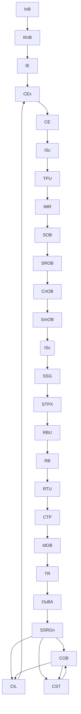

# **20.710.010_patha_operational_flow.md**  
### **Path A Operational Flow — Unified TP Stream, FFTM, OB‑Set, Routing, Semantic Interpretation, TR, OuBA, SSRGn, COB/CST/CIL**

---

## **1. Purpose**
This document is the operational reference for Path A simulations. It is intentionally concise. It provides the grounding necessary for consistent simulation behavior across sessions. Detailed requirements remain in the 20.x normative documents. Updating tis document will occur only when simulation reveals operational insights that affect flow, ordering, or integration. The **operational flow of Path A** — the deterministic meaning‑construction pipeline of Thought Simulator (TS), is defined below.  

It describes:

- the **Field‑First Transform Model (FFTM)**  
- the **Clean** and **Corrected** Path A flows  
- the **OB‑Set structural group**  
- the **Routing Preparation group**  
- the **Semantic Interpretation & Truth‑Relation group**  
- the **OuBA → SSRGn → COB/CST/CIL** conversation‑layer integration  
- the **unified TP stream** (meaning + process + metadata)  
- the **A→B boundary contract**  

This is a **reference document**, not a normative requirement file.  
Normative requirements remain in 20.105, 20.12, 20.109, 20.32, 20.33, 20.54, and related primitive specifications.

---

## **2. Architectural Position**
Path A is the **meaning engine** of TS.  
Its job is to:

- normalize intake  
- stabilize field geometry  
- perform routing  
- commit semantic identity  
- map truth‑relations  
- produce the authoritative **SSR‑A** (via OuBA → SSRGn)  
- update COB/CST/CIL for continuity  

Path A operates entirely on the **unified TP stream**, which carries:

- meaning  
- process metadata  
- structural geometry  
- routing metadata  
- correction metadata  
- ΔH% entropy trajectory  
- replay metadata  

TP is the **single working packet** of Path A.

---

## **3. Four‑Field Token Model (FFTM)**  
FFTM is the modern operational model of Path A:

1. **Field normalization**  
   InB → IIInB → IE  
2. **Field correction (if needed)**  
   CEx → CE → ISc → TPU → IMR  
3. **Field geometry construction**  
   SOB → SROB → CnOB → SmOB → ISc → SSG  
4. **Field routing**  
   RBU → RB → RTU → CTP  
5. **Semantic identity commitment**  
   IdOB  
6. **Truth‑relation mapping**  
   TR  
7. **Snapshot finalization**  
   OuBA → SSRGn  
8. **Conversation‑layer integration**  
   SSRGn → COB/CST/CIL → CEx (next turn)

FFTM ensures that **field geometry precedes routing**, and **routing precedes semantic commitment**.

---

## **4. Clean Path A Flow**
This flow is used when no correction loop is required.

```
InB
→ CEx
→ CE
→ {IMR}
→ SOB
→ SROB
→ CnOB
→ SmOB
→ ISc
→ SSG
→ STPX
→ RBU
→ DCB
→ TR
→ CTP
→ {IMR}
→ ISc
→ RTU
→ {IMR}
→ RB
→ IdOB
→ RBU
→ {IMR}
→ DCB
→ TR
→ …
OR
→ TR
→ CTP
→ {IMR}
→ ISc
→ RTU
→ {IMR}
→ RB
→ OuBA
```

### **Key properties**
- No TPU loop  
- No IIInB/IE re‑entry  
- OB‑Set stabilizes geometry once  
- Routing commits once  
- Semantic identity commits once  
- OuBA produces SSRGn  
- SSRGn updates COB/CST/CIL  

---

## **5. Corrected Path A Flow**
Used when intake requires correction.

```
InB
→ IIInB
→ IE
→ CEx
→ CE
→ ISc
→ TPU
→ {IMR}
→ SOB
→ SROB
→ CnOB
→ SmOB
→ ISc
→ SSG
→ STPX
→ RBU
→ {IMR}
→ DCB
→ TR
→ CTP
→ {IMR}
→ ISc
→ RTU
→ {IMR}
→ RB
→ IdOB
→ RBU
→ {IMR}
→ DCB
→ TR
→ CTP
→ {IMR}
→ ISc
→ RTU
→ {IMR}
→ RB
→ IdOB
→ RBU
→ {IMR}
→ …
OR
→ DCB
→ TR
→ CTP
→ {IMR}
→ ISc
→ RTU
→ {IMR}
→ RB
→ OuBA
```

### **Key properties**
- IIInB normalizes intake  
- IE produces deterministic envelope  
- TPU commits corrected TP  
- IMR provides reference data for correction and routing  
- OB‑Set stabilizes geometry after correction  
- Routing commits after corrected geometry  
- Semantic identity commits after corrected routing  
- OuBA → SSRGn finalizes corrected meaning  

---

## **6. OB‑Set Structural Group**
OB‑Set constructs the **field‑structural vector** used by routing and semantic identity.

### **Mini‑Flow**
```
SOB → SROB → CnOB → SmOB → ISc → SSG
```

### **Purpose**
- segment structure  
- assign structural roles  
- apply constraints  
- smooth inconsistencies  
- freeze structural geometry  

### **Why OB‑Set sits here**
- correction must finish first  
- routing requires stabilized geometry  
- IdOB requires structural substrate  

---

## **7. Routing Preparation Group**
Routing prepares and commits routing metadata.

### **Mini‑Flow**
```
RBU → RB → RTU → CTP
```

### **Purpose**
- enrich TP with routing metadata  
- perform routing arbitration  
- commit routing metadata  
- consolidate OB‑Set outputs  

### **Why routing sits here**
- routing must follow structural stabilization  
- IdOB requires routing metadata  
- RTU is the final routing commit  

---

## **8. Semantic Interpretation & Truth‑Relation Group**
This group performs semantic identity commitment and truth‑relation mapping.

### **Mini‑Flow**
```
IdOB → TR → OuBA
```

### **Purpose**
- commit semantic identity  
- map truth‑relations  
- finalize Path A snapshot  

### **Why this sits here**
- semantic interpretation must follow routing  
- TR must follow semantic commitment  
- OuBA is the final A‑side commit  

---

## **9. OuBA → SSRGn**
OuBA produces the **SSR‑A** snapshot.  
SSR‑A is then transformed into **SSRGn**, the unified A→B boundary artifact.

### **SSR Contents**
- semantic graph  
- routing metadata  
- structural geometry  
- identity anchors  
- entropy trajectory  
- truth‑relation mapping  
- continuity fields  

SSRGn is the **sole input** to Path B.

---

## **10. Conversation‑Layer Integration**
After SSRGn is produced:

```
OuBA → SSRGn → COB, CIL, CST
```

### **Flows**
- **SSRGn → COB**  
  COB updates identity‑layers, referent maps, lineage.

- **SSRGn → CIL**  
  CIL updates long‑horizon identity context.

- **SSRGn → CST**  
  CST evaluates drift, oscillation, collapse.

- **COB → CIL**  
  CIL consumes identity‑layer context.

- **COB → CST**  
  CST reads identity‑layers.

- **CST → COB**  
  CST issues stabilization signals.

- **CIL → CEx**  
  CEx uses identity selection and certainty flags.

This closes the loop for the next turn.

---

## **11. Unified TP Stream**
Path A operates on a **single TP packet** containing:

- meaning  
- process metadata  
- structural geometry  
- routing metadata  
- correction metadata  
- ΔH% entropy trajectory  
- replay metadata  

TP is:

- deterministic  
- bounded  
- replayable  
- the sole working packet of Path A  
- the projection of semantic_core  

TP is **not** a second meaning store (20.105).

---

## **12. Mermaid Diagram — Full Operational Flow**



---

## **13. Simulation Entry Points**
Simulation begins at:

- **InB** (raw intake)  
or  
- **IIInB** (correction mode)

Simulation ends at:

- **OuBA → SSRGn**  
or  
- **COB/CST/CIL** (conversation‑layer integration)

---

## **14. Relationship to Other Documents**
This document references:

- **20.105** — TP requirements  
- **20.12** — invariants  
- **20.109** — IE primitive  
- **20.32 / 20.33 / 20.32.010** — COB/CIL/CST  
- **20.54** — SSRGn  
- **20.705** — A→B boundary  
- **ts_path_a_semantic_engine.md** — conceptual meaning engine  

This document does **not** redefine primitives or requirements.

---

## **15. Status**
**Reference — Complete**  
This document is the authoritative operational description of Path A.

---
