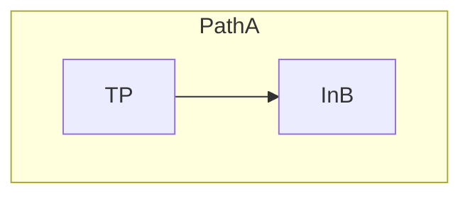
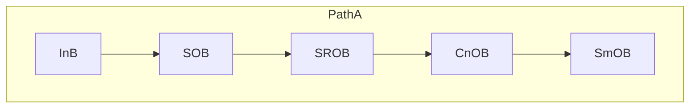
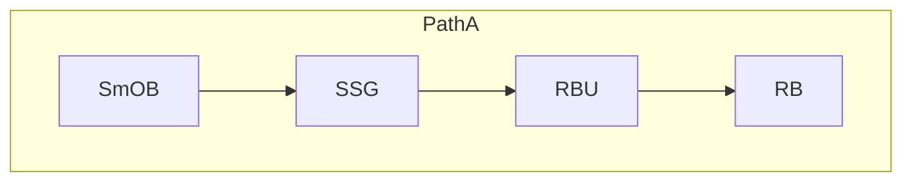
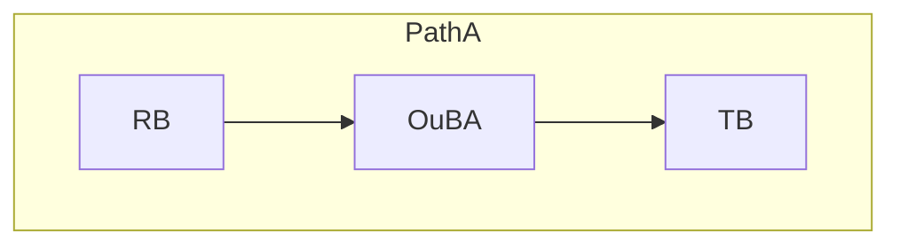
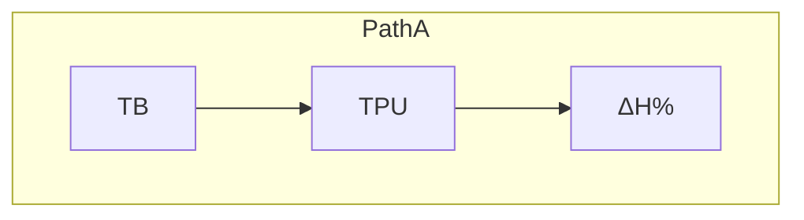
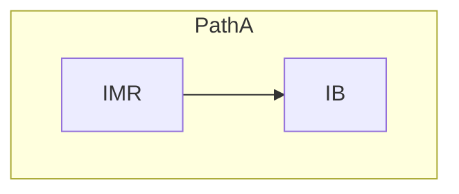
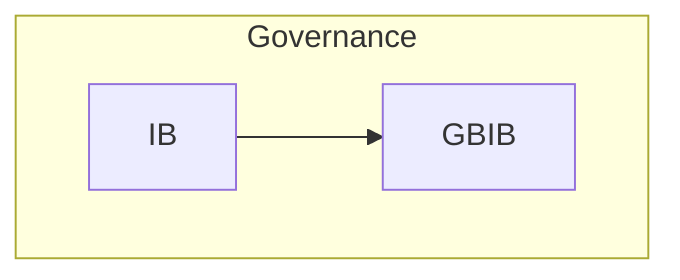
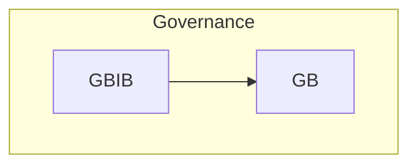
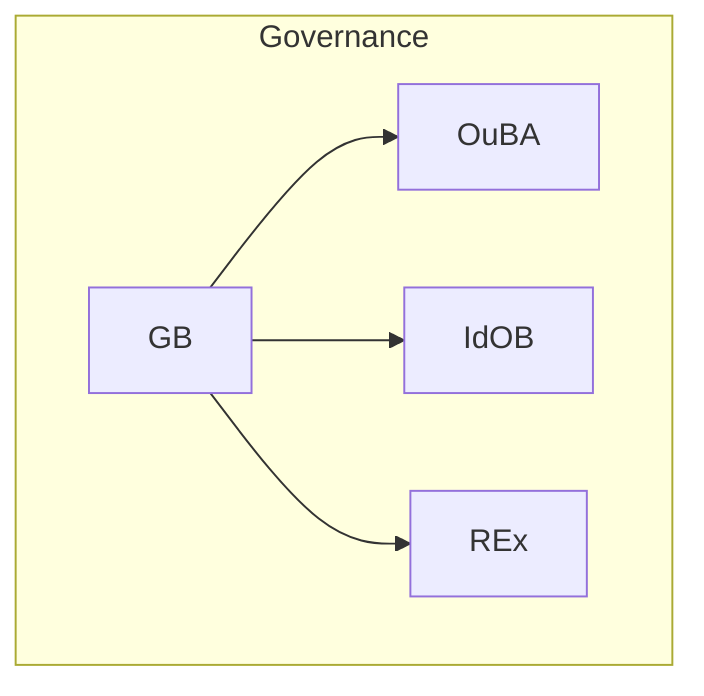

**File:** `20.710_primitive_flows.md`

# 20.710 — Primitive Flows

**Title:** TS Primitive Flows Catalog  
**Document ID:** 20.710  
**Version:** 1.0  
**Date:** 2026-06-26  
**Status:** Active  
**Normative Reference:** 20.705_patha_pathb_flow.md (diagram grammar, lane conventions, node shapes)  
**Scope:** This document contains only Primitive Flows (PF-01 to PF-09). All flows use canonical primitives, Mermaid syntax, and follow the style defined in 20.705_patha_pathb_flow.md.

---

## Purpose

This catalog provides precise, executable visualizations of all Primitive Flows in the Thought Simulator (TS). Each flow:

- Uses **only canonical primitives**
- Shows clear **Path A / Governance / Path B** relationships
- Includes full context for development, simulation, and review
- Maintains strict architectural invariants (A/B separation, single-writer rule, determinism)

These flows are authoritative for implementation and verification.

---

## 1. Primitive Flows

### **1.1 PF-01 — TP → InB (Input Normalization Flow)**
**Type:** Primitive Flow  
**Primary Context:** Path A – Intake  
**When It Appears:** Start of every new turn.  
**Relation to Path A / Path B:** Feeds raw input into **Path A**; Path B later realizes the committed meaning produced downstream.  
**Why It Exists:** Enforces deterministic front-door normalization.  
**What It Accomplishes:** Produces canonical, replay-safe intake.  
**Related Glossary Blocks:** 20.100 (InB), 20.17, 20.105  
**Mini-Flow Diagram:**

**How to Apply This Flowchart:** Use as the mandatory first step in any Path A simulation or implementation. Validate InB output before repair or interpretation.  
**Notes:** Single primitive boundary.

### **1.2 PF-02 — InB → SOB (Structural Interpretation Flow)**
**Type:** Primitive Flow  
**Primary Context:** Path A – Intake to Interpretation  
**When It Appears:** After InB (and optional IIInB).  
**Relation to Path A / Path B:** Begins the core **Path A** structural pipeline; final meaning is later realized in Path B.  
**Why It Exists:** Starts layered structural residue extraction.  
**What It Accomplishes:** Moves normalized data into the OB primitive chain.  
**Related Glossary Blocks:** 20.100, 20.40  
**Mini-Flow Diagram:**

**How to Apply This Flowchart:** Route InB output directly to SOB. Trace structural residue through the full chain.  
**Notes:** Canonical entry to OB primitives.

### **1.3 PF-03 — SmOB → RB (Routing Preparation Flow)**
**Type:** Primitive Flow  
**Primary Context:** Path A – Interpretation to Routing  
**When It Appears:** After SmOB stabilization.  
**Relation to Path A / Path B:** Completes routing metadata in **Path A**; enables consistent Path B realization.  
**Why It Exists:** Prepares geometry-ready signature for lane arbitration.  
**What It Accomplishes:** Produces routing decisions.  
**Related Glossary Blocks:** 20.40.040, 20.47, 20.51, 20.55  
**Mini-Flow Diagram:**

**How to Apply This Flowchart:** Execute SSG and RBU before RB. Test lane selection.  
**Notes:** Expanded for supporting primitives.

### **1.4 PF-04 — RB → TB (Truth Handoff Flow)**
**Type:** Primitive Flow  
**Primary Context:** Path A → Governance  
**When It Appears:** After RB and OuBA commit.  
**Relation to Path A / Path B:** Completes **Path A** meaning construction; hands frozen snapshot to governance. Path B reads derived TPTB.  
**Why It Exists:** Maintains strict A/B separation.  
**What It Accomplishes:** Delivers semantic_core for truth evaluation.  
**Related Glossary Blocks:** 20.40.060, 20.60, 20.64  
**Mini-Flow Diagram:**

**How to Apply This Flowchart:** Use after routing. Verify commit boundary.  
**Notes:** None.

### **1.5 PF-05 — TB → ΔH% (Entropy Attribution Flow)**
**Type:** Primitive Flow  
**Primary Context:** Path A – Uncertainty Tracking  
**When It Appears:** During/after TB evaluation.  
**Relation to Path A / Path B:** Updates **Path A** uncertainty state; influences continuation or handoff to Path B.  
**Why It Exists:** Supports monotonic entropy reduction.  
**What It Accomplishes:** Accumulates structural uncertainty.  
**Related Glossary Blocks:** 20.30, 20.140, 20.44  
**Mini-Flow Diagram:**

**How to Apply This Flowchart:** Track ΔH% in simulations for monotonic checks.  
**Notes:** Updated via TPU.

### **1.6 PF-06 — IMR → IB (Inquiry Trigger Flow)**
**Type:** Primitive Flow  
**Primary Context:** Supervisory Trigger  
**When It Appears:** High uncertainty at Truth/Done.  
**Relation to Path A / Path B:** Triggers governance from **Path A** output; may affect Path B realization.  
**Why It Exists:** Prevents unsafe or incomplete commits.  
**What It Accomplishes:** Converts uncertainty into controlled inquiry.  
**Related Glossary Blocks:** 20.17, 20.30, 20.140, 20.90  
**Mini-Flow Diagram:**

**How to Apply This Flowchart:** Activate only on high-uncertainty conditions.  
**Notes:** IMR is the decision primitive.

### **1.7 PF-07 — IB → GBIB (Governance Bridge Flow)**
**Type:** Primitive Flow  
**Primary Context:** Governance  
**When It Appears:** After IB evaluation.  
**Relation to Path A / Path B:** Bridges **Path A** inquiry into governance for final Path B influence.  
**Why It Exists:** Provides deterministic filtering.  
**What It Accomplishes:** Prepares context for GB.  
**Related Glossary Blocks:** 20.80, 20.90  
**Mini-Flow Diagram:**

**How to Apply This Flowchart:** Implement before GB.  
**Notes:** None.

### **1.8 PF-08 — GBIB → GB (Supervisory Escalation Flow)**
**Type:** Primitive Flow  
**Primary Context:** Governance  
**When It Appears:** After GBIB integration.  
**Relation to Path A / Path B:** Feeds final governance decision affecting both paths.  
**Why It Exists:** Ensures single governance authority.  
**What It Accomplishes:** Delivers integrated directives to GB.  
**Related Glossary Blocks:** 20.80  
**Mini-Flow Diagram:**

**How to Apply This Flowchart:** Core escalation step in governance chain.  
**Notes:** None.

### **1.9 PF-09 — GB → OuBA / IdOB / REx (Governance Output Flow)**
**Type:** Primitive Flow  
**Primary Context:** Governance Output  
**When It Appears:** End of governance chain.  
**Relation to Path A / Path B:** Can promote into **Path A** or emit inference to **Path B**.  
**Why It Exists:** Closes supervisory loop with A/B separation.  
**What It Accomplishes:** Finalizes meaning or realization influence.  
**Related Glossary Blocks:** 20.80, 20.40.060, 20.110  
**Mini-Flow Diagram:**

**How to Apply This Flowchart:** Implement and test all three branches with full logging.  
**Notes:** Multi-output governance flow.

---

**End of 20.710_primitive_flows.md**

---
