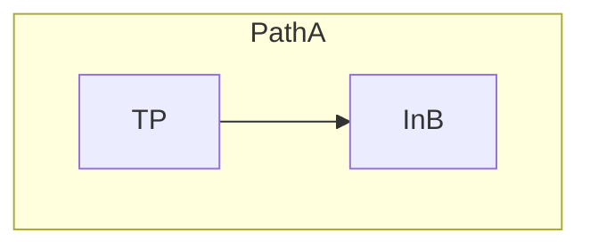
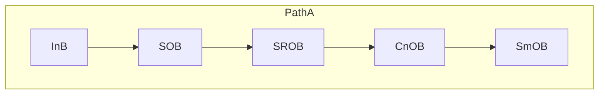
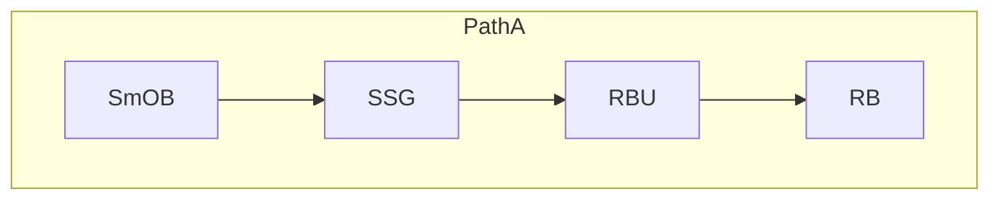
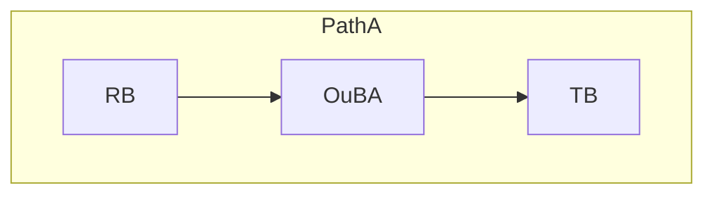
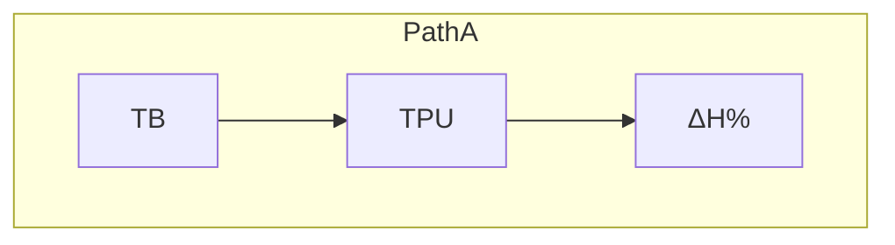
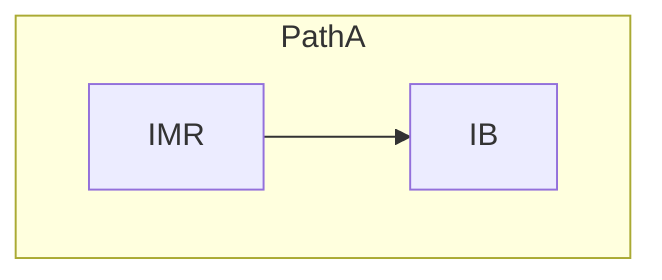
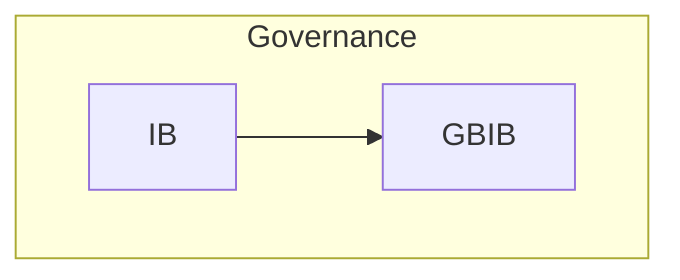
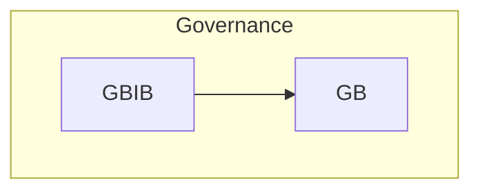
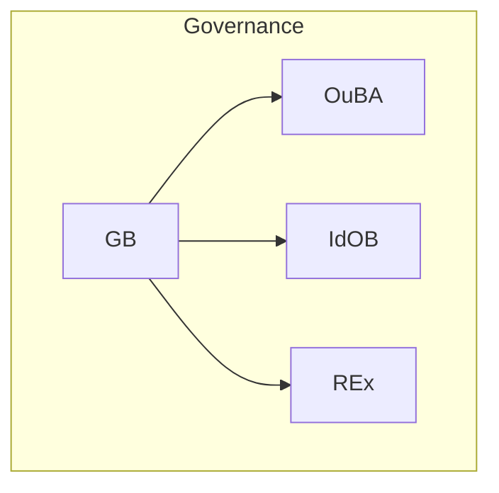

**File:** `20.715_process_flows.md`

# 20.715 — Process Flows

**Title:** TS Process Flows Catalog  
**Document ID:** 20.715  
**Version:** 1.0  
**Date:** 2026-06-26  
**Status:** Active  
**Normative Reference:** 20.705_patha_pathb_flow.md (diagram grammar, lane conventions, node shapes)  
**Scope:** This document contains only Process Flows (PRF-01 to PRF-09). All flows use canonical primitives, Mermaid syntax, and follow the style defined in 20.705_patha_pathb_flow.md and 20.710_primitive_flows.md.

---

## Purpose

This catalog provides precise, executable visualizations of all Process Flows in the Thought Simulator (TS). Each flow:

- Uses **only canonical primitives**
- Shows clear **Path A / Governance / Path B** relationships
- Includes full context for development, simulation, and review
- Maintains strict architectural invariants (A/B separation, single-writer rule, determinism)

These flows are authoritative for implementation and verification.

---

## 1. Process Flows

### **1.1 PRF-01 — TP → InB (Normalization Process Flow)**
**Type:** Process Flow  
**Primary Context:** Path A – Intake  
**When It Appears:** Start of every new turn.  
**Relation to Path A / Path B:** Brings raw input into **Path A** normalization; sets up all downstream Path A meaning construction (Path B reads the final result).  
**Why It Exists:** Provides a named, auditable normalization process while keeping primitive boundaries strict.  
**What It Accomplishes:** Structural cleanup and canonicalization of raw TP input.  
**Related Glossary Blocks:** 20.100 (InB), 20.17, 20.105  
**Mini-Flow Diagram:**

**How to Apply This Flowchart:** Implement normalization logic inside the InB primitive. Use as the first step in all Path A simulations.  
**Notes:** Process wrapper around the TP → InB primitive flow.

### **1.2 PRF-02 — InB → SOB (Semantic Collapse Process Flow)**
**Type:** Process Flow  
**Primary Context:** Path A – Interpretation  
**When It Appears:** After InB normalization (and optional IIInB).  
**Relation to Path A / Path B:** Advances **Path A** structural interpretation; final meaning is later realized in Path B.  
**Why It Exists:** Collapses normalized intake into structures suitable for OB primitives.  
**What It Accomplishes:** Prepares propositions and referents for SOB.  
**Related Glossary Blocks:** 20.100, 20.40  
**Mini-Flow Diagram:**

**How to Apply This Flowchart:** Place semantic collapse logic before or inside SOB. Trace output into the full OB chain.  
**Notes:** Leads into canonical OB primitives.

### **1.3 PRF-03 — SmOB → RB (Lane Arbitration Process Flow)**
**Type:** Process Flow  
**Primary Context:** Path A – Routing Preparation  
**When It Appears:** After SmOB stabilization.  
**Relation to Path A / Path B:** Completes routing metadata in **Path A**; enables consistent realization in Path B.  
**Why It Exists:** Named process for signature generation and lane selection.  
**What It Accomplishes:** Produces routing decisions from structural residue.  
**Related Glossary Blocks:** 20.47, 20.51, 20.55  
**Mini-Flow Diagram:**

**How to Apply This Flowchart:** Implement arbitration inside or before RB. Test lane selection determinism.  
**Notes:** Expanded for supporting primitives.

### **1.4 PRF-04 — RB → TB (Truth Evaluation Process Flow)**
**Type:** Process Flow  
**Primary Context:** Path A → Governance  
**When It Appears:** After RB and OuBA commit.  
**Relation to Path A / Path B:** Hands committed **Path A** meaning to truth evaluation; results influence Path B via TPTB.  
**Why It Exists:** Named process wrapping truth assessment on frozen snapshots.  
**What It Accomplishes:** Produces truth_state for governance.  
**Related Glossary Blocks:** 20.60, 20.40.060  
**Mini-Flow Diagram:**

**How to Apply This Flowchart:** Use after routing in Path A. Verify commit boundary.  
**Notes:** Matches PF-04 primitive flow.

### **1.5 PRF-05 — TB → ΔH% (Entropy Computation Process Flow)**
**Type:** Process Flow  
**Primary Context:** Path A – Uncertainty  
**When It Appears:** During/after TB.  
**Relation to Path A / Path B:** Updates **Path A** state; affects continuation or handoff to Path B.  
**Why It Exists:** Named process for uncertainty attribution.  
**What It Accomplishes:** Accumulates ΔH% from truth hypotheses.  
**Related Glossary Blocks:** 20.30, 20.140  
**Mini-Flow Diagram:**

**How to Apply This Flowchart:** Track cumulative ΔH% after TB for monotonic reduction verification.  
**Notes:** None.

### **1.6 PRF-06 — IMR → IB (Inquiry Detection Process Flow)**
**Type:** Process Flow  
**Primary Context:** Supervisory Trigger  
**When It Appears:** High uncertainty at Truth/Done.  
**Relation to Path A / Path B:** Triggers governance from **Path A** output; may affect Path B realization.  
**Why It Exists:** Named detection process for inquiry escalation.  
**What It Accomplishes:** Converts uncertainty into IB request.  
**Related Glossary Blocks:** 20.17, 20.30, 20.90  
**Mini-Flow Diagram:**

**How to Apply This Flowchart:** Activate only on high-ΔH% conditions.  
**Notes:** Uses IMR as the decision primitive.

### **1.7 PRF-07 — IB → GBIB (Inquiry Governance Process Flow)**
**Type:** Process Flow  
**Primary Context:** Governance  
**When It Appears:** After IB evaluation.  
**Relation to Path A / Path B:** Bridges committed **Path A** inquiry into governance for Path B influence.  
**Why It Exists:** Named filtering process.  
**What It Accomplishes:** Prepares context for GB.  
**Related Glossary Blocks:** 20.80, 20.90  
**Mini-Flow Diagram:**

**How to Apply This Flowchart:** Implement filtering before GB.  
**Notes:** None.

### **1.8 PRF-08 — GBIB → GB (Supervisory Merge Process Flow)**
**Type:** Process Flow  
**Primary Context:** Governance  
**When It Appears:** After GBIB integration.  
**Relation to Path A / Path B:** Feeds into final governance decision affecting both paths.  
**Why It Exists:** Named merge process for governance.  
**What It Accomplishes:** Integrates signals for GB.  
**Related Glossary Blocks:** 20.80  
**Mini-Flow Diagram:**

**How to Apply This Flowchart:** Core escalation step.  
**Notes:** None.

### **1.9 PRF-09 — GB → OuBA (Supervisory Enforcement Process Flow)**
**Type:** Process Flow  
**Primary Context:** Governance Output  
**When It Appears:** End of DF chain.  
**Relation to Path A / Path B:** Enforces governance on **Path A** output or Path B realization.  
**Why It Exists:** Named enforcement process for final outcomes.  
**What It Accomplishes:** Applies GB decisions to finalize or promote.  
**Related Glossary Blocks:** 20.80, 20.40.060  
**Mini-Flow Diagram:**

**How to Apply This Flowchart:** Implement all three branches with logging.  
**Notes:** Multi-output process.

---

**End of 20.715_process_flows.md**

---
