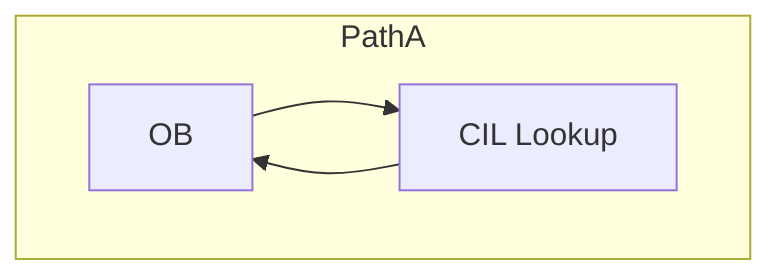
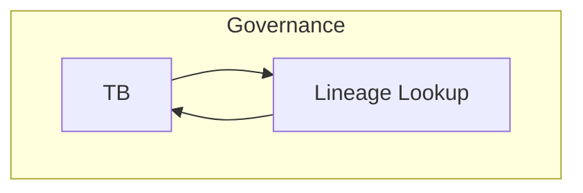
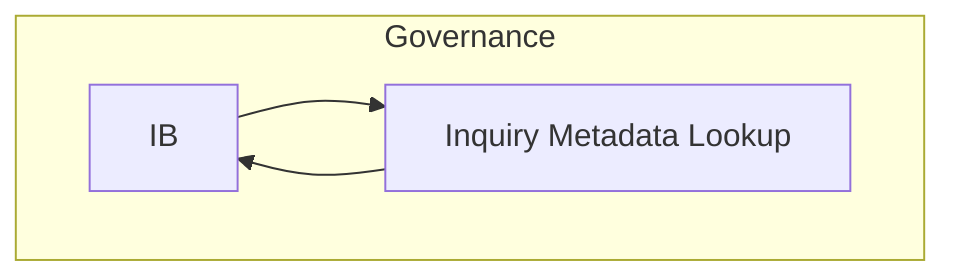
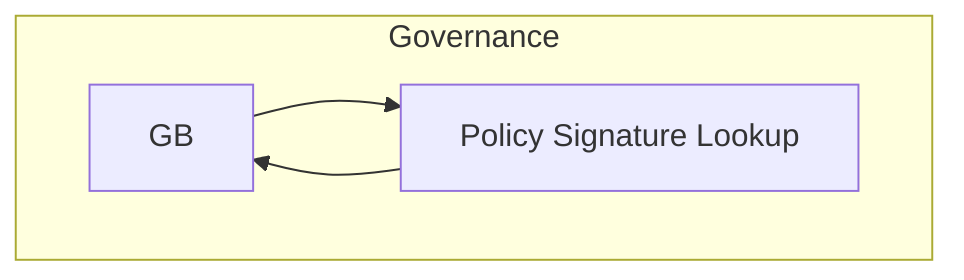

# 20.720 — Reference Flows

**Title:** TS Reference-Object Flows Catalog  
**Document ID:** 20.720  
**Version:** 1.0  
**Date:** 2026-06-26  
**Status:** Active  
**Normative Reference:** 20.705_patha_pathb_flow.md (diagram grammar, lane conventions, node shapes)  
**Scope:** This document contains only Reference Flows (ROF-01 to ROF-04). All flows use canonical primitives, Mermaid syntax, and follow the style defined in 20.705_patha_pathb_flow.md, 20.710_primitive_flows.md, and 20.715_process_flows.md.

---

## Purpose

This catalog provides precise, executable visualizations of all Reference-Object Flows in the Thought Simulator (TS). Each flow:

- Uses **only canonical primitives**
- Shows clear **Path A / Governance / Path B** relationships
- Includes full context for development, simulation, and review
- Maintains strict architectural invariants (A/B separation, single-writer rule, determinism, read-only nature of reference objects)

These flows are authoritative for implementation and verification.

---

## 1. Reference Flows

### **1.1 ROF-01 — OB → CIL Lookup → OB (Referent Resolution Flow)**
**Type:** Reference Flow  
**Primary Context:** Path A – Interpretation  
**When It Appears:** During OB processing when referent resolution is needed.  
**Relation to Path A / Path B:** Supports meaning construction in **Path A**; resolved referents become part of committed meaning read by Path B.  
**Why It Exists:** Allows read-only access to conversation history without breaking determinism.  
**What It Accomplishes:** Enriches OB output with resolved referents from CIL.  
**Related Glossary Blocks:** 20.33 (CIL), 20.700.030  
**Mini-Flow Diagram:**

**How to Apply This Flowchart:** Implement as a read-only side call inside OB primitives. Never allow write-back.  
**Notes:** Self-loop on OB primitive (reference use).

### **1.2 ROF-02 — TB → Lineage Lookup → TB (Truth Lineage Flow)**
**Type:** Reference Flow  
**Primary Context:** Governance – Truth Evaluation  
**When It Appears:** During TB evaluation.  
**Relation to Path A / Path B:** Enhances truth assessment on committed **Path A** meaning; influences final Path B realization via governance outcomes.  
**Why It Exists:** Provides deterministic access to historical lineage without global state leakage.  
**What It Accomplishes:** Supplies lineage metadata to TB for referential consistency checks.  
**Related Glossary Blocks:** 20.60 (TB), 20.115 (MTP), 20.700.030  
**Mini-Flow Diagram:**

**How to Apply This Flowchart:** Use as a read-only lookup inside TB. Verify no modification of lineage data.  
**Notes:** Self-loop on TB primitive.

### **1.3 ROF-03 — IB → Inquiry Metadata Lookup → IB (Inquiry History Flow)**
**Type:** Reference Flow  
**Primary Context:** Governance – Inquiry  
**When It Appears:** During IB evaluation.  
**Relation to Path A / Path B:** Supports inquiry analysis on committed **Path A** meaning; informs governance decisions that affect Path B.  
**Why It Exists:** Enables read-only access to inquiry history for consistent evaluation.  
**What It Accomplishes:** Provides IB with prior inquiry metadata.  
**Related Glossary Blocks:** 20.90 (IB), 20.700.030  
**Mini-Flow Diagram:**

**How to Apply This Flowchart:** Implement as read-only lookup inside IB.  
**Notes:** Self-loop on IB primitive.

### **1.4 ROF-04 — GB → Policy Signature Lookup → GB (Policy Lookup Flow)**
**Type:** Reference Flow  
**Primary Context:** Governance – Final Decision  
**When It Appears:** During GB evaluation.  
**Relation to Path A / Path B:** Informs final governance outcomes on committed **Path A** meaning; directly affects Path B realization or Path A promotion.  
**Why It Exists:** Provides deterministic, versioned access to governance policy without side effects.  
**What It Accomplishes:** Supplies GB with current policy signatures for decision making.  
**Related Glossary Blocks:** 20.80 (GB), 20.700.030  
**Mini-Flow Diagram:**

**How to Apply This Flowchart:** Use as read-only lookup inside GB. Ensure policy version is logged.  
**Notes:** Self-loop on GB primitive.

---

**End of 20.720_reference_flows.md**

---

This file is complete and follows the exact style of the previous two files.

Would you like me to produce **20.725_governance_flows.md** next?
