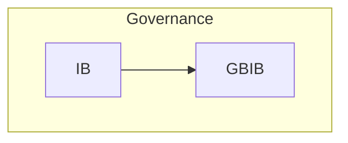
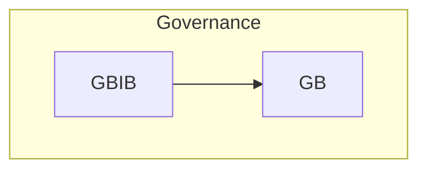
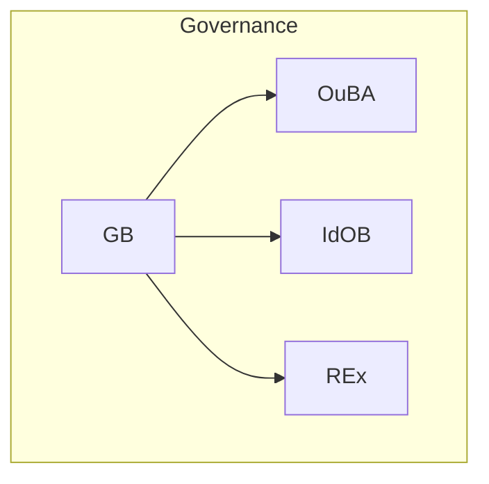

# 20.725 — Governance Flows

**Title:** TS Governance Flows Catalog  
**Document ID:** 20.725  
**Version:** 1.0  
**Date:** 2026-06-26  
**Status:** Active  
**Normative Reference:** 20.705_patha_pathb_flow.md (diagram grammar, lane conventions, node shapes)  
**Scope:** This document contains only Governance Flows (GVF-01 to GVF-03). All flows use canonical primitives, Mermaid syntax, and follow the style defined in 20.705_patha_pathb_flow.md and the preceding flow catalog files.

---

## Purpose

This catalog provides precise, executable visualizations of all Governance Flows in the Thought Simulator (TS). Each flow:

- Uses **only canonical primitives**
- Shows clear **Path A / Governance / Path B** relationships
- Includes full context for development, simulation, and review
- Maintains strict architectural invariants (A/B separation, single-writer rule, determinism, governance authority)

These flows are authoritative for implementation and verification.

---

## 1. Governance Flows

### **1.1 GVF-01 — IB → GBIB (Inquiry Governance Flow)**
**Type:** Governance Flow  
**Primary Context:** Governance – Inquiry Bridge  
**When It Appears:** After IB has performed inquiry-side evaluation on the committed snapshot.  
**Relation to Path A / Path B:** Bridges committed **Path A** meaning/inquiry into governance; shapes final Path B realization or Path A promotion.  
**Why It Exists:** Applies governance rules, USP constraints, and filtering before final GB evaluation.  
**What It Accomplishes:** Integrates inquiry and truth signals into a filtered context for GB.  
**Related Glossary Blocks:** 20.80 (GBIB), 20.90 (IB)  
**Mini-Flow Diagram:**

**How to Apply This Flowchart:** Implement as the deterministic bridge after IB. Verify no unfiltered inquiry reaches GB.  
**Notes:** None.

### **1.2 GVF-02 — GBIB → GB (Governance Integration Flow)**
**Type:** Governance Flow  
**Primary Context:** Governance – Supervisory Escalation  
**When It Appears:** After GBIB has integrated inquiry and truth signals.  
**Relation to Path A / Path B:** Feeds filtered governance context from committed **Path A** meaning into final GB decision making, which influences both Path A promotion and Path B realization.  
**Why It Exists:** Provides deterministic integration and filtering before final governance authority (GB).  
**What It Accomplishes:** Merges inquiry, truth, and policy signals into a complete context for GB.  
**Related Glossary Blocks:** 20.80 (GB), 20.90 (IB)  
**Mini-Flow Diagram:**

**How to Apply This Flowchart:** Implement as the canonical escalation step after GBIB. Verify GB remains the sole authority.  
**Notes:** None.

### **1.3 GVF-03 — GB → OuBA / IdOB / REx (Governance Enforcement Flow)**
**Type:** Governance Flow  
**Primary Context:** Governance – Final Output  
**When It Appears:** End of the governance chain (after GB evaluation).  
**Relation to Path A / Path B:** Enforces governance decisions on **Path A** (via OuBA/IdOB) or **Path B** (via REx).  
**Why It Exists:** Applies final supervisory limits, promotion, or realization influence.  
**What It Accomplishes:** Produces enforceable governance outcomes that close the supervisory loop.  
**Related Glossary Blocks:** 20.80 (GB), 20.40.060 (OuBA), 20.110  
**Mini-Flow Diagram:**

**How to Apply This Flowchart:** Implement and test all three branches with full logging of governance decisions.  
**Notes:** Multi-output governance flow (final enforcement point).

---

**End of 20.725_governance_flows.md**

---
