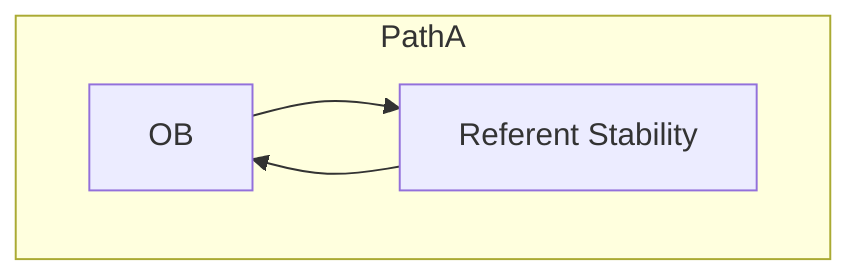
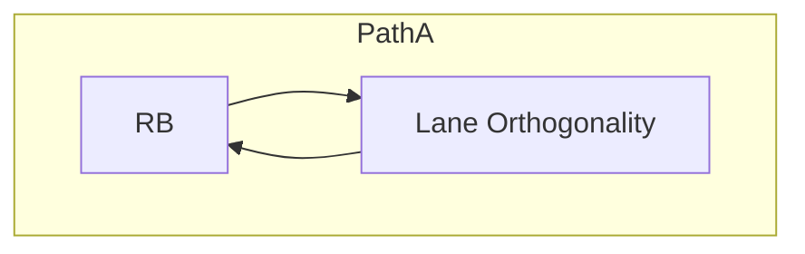
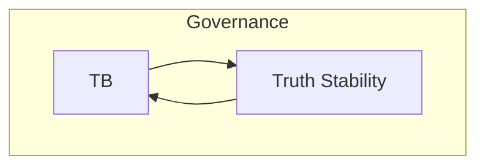
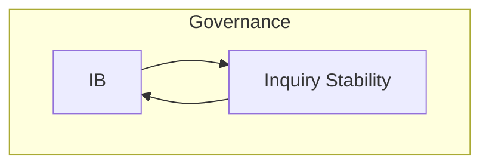

# 20.730 — TS-Concept Flows

**Title:** TS-Concept Flows Catalog  
**Document ID:** 20.730  
**Version:** 1.0  
**Date:** 2026-06-26  
**Status:** Active  
**Normative Reference:** 20.705_patha_pathb_flow.md (diagram grammar, lane conventions, node shapes)  
**Scope:** This document contains only TS-Concept Flows (TSCF-01 to TSCF-04). All flows use canonical primitives, Mermaid syntax, and follow the style defined in 20.705_patha_pathb_flow.md and the preceding flow catalog files.

---

## Purpose

This catalog provides precise, executable visualizations of all TS-Concept Flows in the Thought Simulator (TS). Each flow:

- Uses **only canonical primitives**
- Shows clear **Path A / Governance / Path B** relationships
- Includes full context for development, simulation, and review
- Maintains strict architectural invariants (A/B separation, single-writer rule, determinism, concept enforcement)

These flows are authoritative for implementation and verification.

---

## 1. TS-Concept Flows

### **1.1 TSCF-01 — OB → Referent Stability → OB (Referent Stability Flow)**
**Type:** TS-Concept Flow  
**Primary Context:** Path A – Interpretation  
**When It Appears:** During OB processing when referent consistency must be enforced.  
**Relation to Path A / Path B:** Enforces stability within **Path A** meaning construction; stable referents become part of committed meaning read by Path B.  
**Why It Exists:** Maintains referential coherence and identity stability across turns.  
**What It Accomplishes:** Applies referent stability constraints during OB evaluation.  
**Related Glossary Blocks:** 20.40 (OB primitives), 20.700.050  
**Mini-Flow Diagram:**

**How to Apply This Flowchart:** Implement as a constraint check inside relevant OB primitives. Verify no unstable referents propagate.  
**Notes:** Self-loop on OB primitive (concept enforcement).

### **1.2 TSCF-02 — RB → Lane Orthogonality → RB (Lane Orthogonality Flow)**
**Type:** TS-Concept Flow  
**Primary Context:** Path A – Routing  
**When It Appears:** During RB lane selection and arbitration.  
**Relation to Path A / Path B:** Enforces orthogonality in **Path A** routing decisions; ensures clean separation for Path B realization.  
**Why It Exists:** Prevents lane interference and maintains routing determinism.  
**What It Accomplishes:** Applies orthogonality constraints during routing.  
**Related Glossary Blocks:** 20.55 (RB), 20.700.050  
**Mini-Flow Diagram:**

**How to Apply This Flowchart:** Enforce as a validation step inside RB. Test for non-overlapping lanes.  
**Notes:** Self-loop on RB primitive.

### **1.3 TSCF-03 — TB → Truth Stability → TB (Truth Stability Flow)**
**Type:** TS-Concept Flow  
**Primary Context:** Governance – Truth Evaluation  
**When It Appears:** During TB evaluation of committed meaning.  
**Relation to Path A / Path B:** Reinforces truth stability on **Path A** committed snapshots; affects governance outcomes for Path B.  
**Why It Exists:** Ensures stable truth hypotheses and prevents oscillation.  
**What It Accomplishes:** Applies truth-stability constraints during evaluation.  
**Related Glossary Blocks:** 20.60 (TB), 20.700.050  
**Mini-Flow Diagram:**

**How to Apply This Flowchart:** Implement as a stability check inside TB. Log any stability violations.  
**Notes:** Self-loop on TB primitive.

### **1.4 TSCF-04 — IB → Inquiry Stability → IB (Inquiry Stability Flow)**
**Type:** TS-Concept Flow  
**Primary Context:** Governance – Inquiry  
**When It Appears:** During IB evaluation.  
**Relation to Path A / Path B:** Enforces stability on inquiry derived from **Path A**; supports consistent governance decisions affecting Path B.  
**Why It Exists:** Prevents unstable or oscillating inquiry states.  
**What It Accomplishes:** Applies inquiry-stability constraints.  
**Related Glossary Blocks:** 20.90 (IB), 20.700.050  
**Mini-Flow Diagram:**

**How to Apply This Flowchart:** Use as a constraint inside IB. Verify stable inquiry progression.  
**Notes:** Self-loop on IB primitive.

---

**End of 20.730_ts_concept_flows.md**

---
