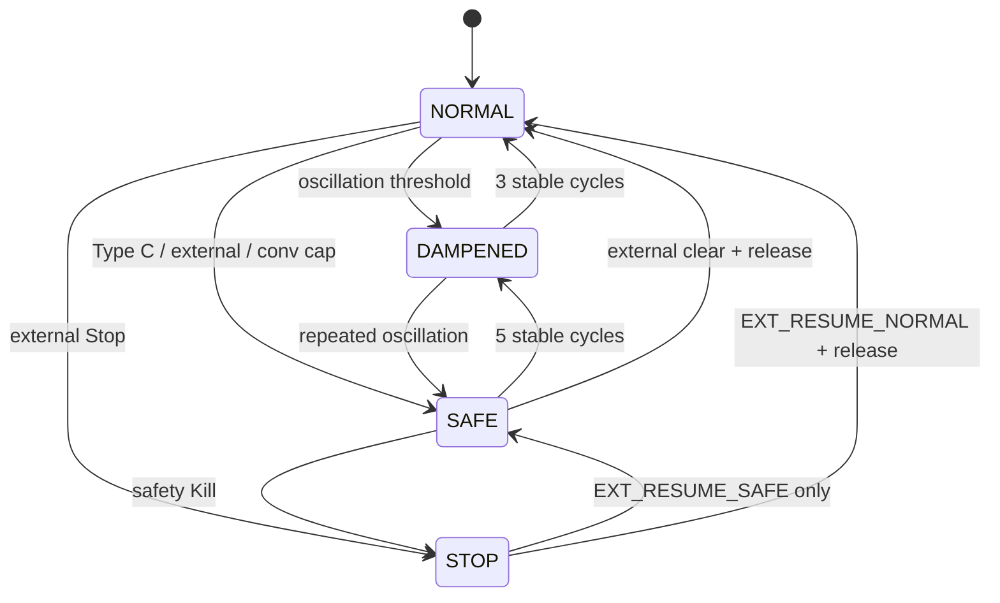

# 20.80 GB Supervisory Limits

**Document ID:** 20.80  
**Version:** 0.4  
**Date:** 2026-06-07  
**Status:** Approved v0.4 — Track H Stage 3 UPI rule-commit governance (2026-06-07; CuriousOne23, Copilot, Grok)

## Purpose

Defines deterministic **supervisory-limit policy** for the Governing Basin (GB) on top of quantitative caps in [20.16_gb_responsibility_matrix.md](20.16_gb_responsibility_matrix.md). Specifies rate limits, priority models, safe-mode transitions, escalation/dampening semantics, and external supervisory interface constraints.

This module **satisfies** HLR-20.030-228 and SHALL NOT weaken invariants in [20.12_ts_invariants.md](20.12_ts_invariants.md).

**Goal:** GB supervisory behavior is predictable, rate-bounded, and incapable of cross-pipeline semantic drift.

## Parent Scope

- **GB supervisory envelope only** — global flow control without meaning construction
- **Caps reference:** numeric ceilings in 20.16; this document defines *how* GB schedules, prioritizes, and transitions under those ceilings
- **Does not modify:** 20.10, 20.12, 20.20, 20.30 bootstrap documents
- **IMR integration:** Type C and cap-exceeded IMR paths per [20.45_imr_requirements.md](20.45_imr_requirements.md)

## Non-Goals

- GB internal tier implementation (see 50.36 design)
- Basin-specific supervisory algorithms
- Probabilistic or latent supervisory inference

---

## 1. Core Supervisory Behavior

GB provides bounded supervisory flow-control and global policy evaluation without mutating TP/MTP meaning-construction state.

1. **HLR-20.080-001:** GB SHALL apply global contextual constraints deterministically.
2. **HLR-20.080-002:** GB SHALL operate over bounded, explicit supervisory inputs only and SHALL NOT rely on hidden or latent state.
3. **HLR-20.080-003:** GB SHALL read only TP lane-local semantic state and MPs (monitoring packets / TS health telemetry) for supervisory evaluation.
4. **HLR-20.080-004:** GB SHALL NOT read OB, RB, TB, IB, InB, or OuB internal state or MTP internal state directly.
5. **HLR-20.080-005:** GB SHALL remain non-intrusive to core cognition and SHALL NOT directly mutate `semantic_core`, `exec_plan`, or `exec_trace`.
6. **HLR-20.080-006:** GB SHALL detect long-range drift and oscillation conditions deterministically across cycles.
7. **HLR-20.080-007:** GB SHALL evaluate cross-cycle coherence using deterministic supervisory metrics.
8. **HLR-20.080-008:** GB MAY suppress or encourage branching under explicit deterministic policy rules.
9. **HLR-20.080-009:** TS service requests that affect global behavior (including deeper inquiry, extended reasoning, and mode changes) SHALL route through GB for stability/drift evaluation.
10. **HLR-20.080-010:** GB SHALL classify service requests by deterministic global-impact categories before applying supervisory actions.

---

## 2. Rate Limits

Rate limits complement 20.16 per-cycle/per-conversation caps with **temporal** and **interface** bounds.

### 2.1 Default rate-limit table

| Limit ID | Field | Default | Scope |
|----------|-------|---------|-------|
| `RATE_GB_EVAL` | `min_cycles_between_gb_evaluations` | **1** | Minimum cycles between full GB evaluation passes |
| `RATE_GB_EXT_CMD` | `max_external_commands_per_minute` | **12** | External supervisory commands accepted |
| `RATE_GB_EXT_BURST` | `max_external_commands_burst` | **3** | External commands per 10-second window |
| `RATE_GB_IMR_NOTIFY` | `max_imr_notifications_per_cycle` | **4** | IMR → GB notification events (decisions capped separately in 20.16) |
| `RATE_GB_ESCALATE` | `max_escalations_per_conversation` | **3** | Escalate actions per conversation |
| `RATE_GB_SAFE_ENTRY` | `max_safe_mode_entries_per_conversation` | **2** | Safe-Mode entries per conversation |
| `RATE_GB_HUMAN` | `max_human_oversight_requests_per_conversation` | **4** | Human-approval requests |

39. **HLR-20.080-039:** GB SHALL enforce `min_cycles_between_gb_evaluations` (default = 1); at most one full evaluation pass per cycle unless `P0_SAFETY_STOP` external interrupt forces immediate evaluation.

40. **HLR-20.080-040:** GB SHALL enforce `max_external_commands_per_minute` (default = 12) and `max_external_commands_burst` (default = 3 per 10s); excess commands SHALL receive `gb_cmd_status = RATE_LIMITED` without side effects.

41. **HLR-20.080-041:** GB SHALL enforce `max_imr_notifications_per_cycle` (default = 4); notifications beyond the rate limit SHALL be logged with `gb_rate_status = IMR_NOTIFY_RATE_EXCEEDED` and SHALL NOT consume `CAP_GB_IMR_CYCLE` decision budget.

42. **HLR-20.080-042:** GB SHALL enforce `max_escalations_per_conversation` (default = 3) and `max_safe_mode_entries_per_conversation` (default = 2); further Escalate/Safe-Mode requests SHALL downgrade to Dampen or deny with fixed reason code.

43. **HLR-20.080-043:** Rate-limit counters SHALL reset per scope (cycle, conversation, sliding window) deterministically; sliding windows SHALL use fixed tick granularity from `policy_signature`.

44. **HLR-20.080-044:** Rate-limit exceedance SHALL NOT bypass 20.16 cap enforcement; both layers SHALL apply independently.

---

## 3. Priority Model

### 3.1 Supervisory priority classes

| Priority | Class | Examples | Preempts |
|----------|-------|----------|----------|
| **P0** | `P0_SAFETY_STOP` | External Stop, Type C Halt-Expression, Kill on safety | All |
| **P1** | `P1_SAFETY_DENY` | IB deny (safety), Suspend-Inquiry (safety), RB policy block | P2–P6 |
| **P2** | `P2_DRIFT_RESPONSE` | Dampen, Slow, oscillation-triggered Reduce-Depth | P3–P6 |
| **P3** | `P3_IB_ROUTINE` | IB approve/deny (non-safety), pending buffer drain | P4–P6 |
| **P4** | `P4_XBASIN` | Cross-basin transition authorization | P5–P6 |
| **P5** | `P5_ARBITRATION` | Parallel-trace arbitration, `GB_ARBITRATED` | P6 |
| **P6** | `P6_POPULATION` | Crop, Prune, merge/split, promotion review | — |

45. **HLR-20.080-045:** Every GB supervisory action SHALL carry exactly one `supervisory_priority` from the table above.

46. **HLR-20.080-046:** When 20.16 `CAP_GB_ACTIONS` is exceeded, GB SHALL execute actions in priority order P0→P6; lower-priority actions SHALL defer per 20.16 §5.2.

47. **HLR-20.080-047:** P0 actions MAY preempt in-cycle evaluation ordering but SHALL still respect `max_supervisory_actions_per_cycle`; if cap prevents P0 execution, GB SHALL emit `GB_CAP_SAFETY_DEFERRED` and escalate to external supervisory interface alarm.

48. **HLR-20.080-048:** IMR Type C triggers SHALL default to `P0_SAFETY_STOP` or `P1_SAFETY_DENY` per safety policy table; Type B cap-exceeded notifications SHALL use `P3_IB_ROUTINE`.

### 3.2 Deferred-action processing and anti-starvation

When higher-priority conditions clear and cap headroom returns, GB SHALL drain the 20.16 `deferred_supervisory_queue` in priority order (P0→P6) then FIFO within priority. Lower-priority deferred actions SHALL NOT starve indefinitely.

61. **HLR-20.080-062:** GB SHALL process deferred lower-priority actions once higher-priority pressure clears and per-cycle cap headroom is available; starvation beyond `max_defer_cycles` (20.16 §5.3, default = 8) SHALL apply `DEFER_STARVATION_ALARM` or `DEFER_STARVATION_DENY` deterministically.

---

## 4. Safe-Mode Transitions

GB maintains a deterministic supervisory mode state machine. Modes affect **flow only** — never `semantic_core`.

### 4.1 Supervisory modes

| Mode | Meaning |
|------|---------|
| `GB_MODE_NORMAL` | Default bounded operation |
| `GB_MODE_DAMPENED` | Branching/escalation reduced; inquiry depth capped |
| `GB_MODE_SAFE` | Conservative execution; non-essential IB/coordination denied |
| `GB_MODE_STOP` | Halt cycle progression at next safe boundary |

### 4.2 Transition table

| From | To | Trigger | Guard |
|------|-----|---------|-------|
| `NORMAL` | `DAMPENED` | ΔH% oscillation threshold (2 checks in cap) | `CAP_GB_OSC_CHECK` not exceeded |
| `NORMAL` | `SAFE` | Type C IMR + GB approve; external Safe-Mode; `GB_CONV_CAP_REACHED` | `RATE_GB_SAFE_ENTRY` not exceeded |
| `NORMAL` | `STOP` | External Stop (P0); critical safety policy | — |
| `DAMPENED` | `NORMAL` | **3** consecutive stable cycles (oscillation below threshold) | deterministic stability counter |
| `DAMPENED` | `SAFE` | Repeated oscillation within conversation | `RATE_GB_SAFE_ENTRY` |
| `SAFE` | `DAMPENED` | **5** consecutive stable cycles in Safe-Mode | stability counter |
| `SAFE` | `NORMAL` | External clear; human oversight release; stability counter satisfied | logged approval |
| `SAFE` | `STOP` | External Stop; safety Kill | — |
| `STOP` | `SAFE` | External Resume-to-Safe only | never auto |
| `STOP` | `NORMAL` | External Resume + human release when policy requires | never auto from STOP |

49. **HLR-20.080-049:** GB SHALL implement the mode transition table above; illegal transitions SHALL reject with `gb_mode_status = TRANSITION_DENIED` and fixed reason code.

50. **HLR-20.080-050:** Safe-Mode entry SHALL set `gb_supervisory_mode = SAFE`, apply `Reduce-Depth` and `Suspend-Inquiry` for non-safety IB expansion, and SHALL NOT alter messy-input tags or force contradiction resolution.

51. **HLR-20.080-051:** Mode transitions SHALL append `gb_mode_record` with `prior_mode`, `new_mode`, `transition_trigger`, `stability_counter`, and `gb_reason_code`.

52. **HLR-20.080-052:** In `GB_MODE_STOP`, TS SHALL complete current safe-boundary work unit only; no new IB approvals, arbitration, or cross-basin coordination until mode change.

---

## 5. Escalation and Dampening Semantics

### 5.1 Escalate

**Escalate** increases supervisory intensity without meaning mutation.

53. **HLR-20.080-053:** Escalate SHALL: (a) raise minimum priority floor to `P2_DRIFT_RESPONSE` for remainder of cycle; (b) increment `escalation_depth` (max = 3 per conversation); (c) apply `Reduce-Depth` if `escalation_depth >= 2`.

54. **HLR-20.080-054:** Escalate SHALL NOT: mutate `semantic_core`; force single-winner contradiction merge; schedule Pipeline A re-interpretation (IMR Type B remains IMR-owned).

55. **HLR-20.080-055:** When `RATE_GB_ESCALATE` or `escalation_depth` maximum is reached, Escalate requests SHALL downgrade to Dampen with `gb_action_substituted = ESCALATE_TO_DAMPEN`.

### 5.2 Dampen

**Dampen** reduces branching and oscillation amplitude.

56. **HLR-20.080-056:** Dampen SHALL: (a) set `branching_suppression_factor` to policy default (0.5); (b) apply ΔH% damping markers per MPs; (c) defer `P5_ARBITRATION` and `P6_POPULATION` actions to next cycle.

57. **HLR-20.080-057:** Dampen SHALL NOT: clear `conflict_flag` or `underspec_flag`; complete fragmentary meaning; modify `exec_plan` triples.

58. **HLR-20.080-058:** Repeated Dampen within **3** cycles without stability improvement SHALL trigger automatic Safe-Mode entry if `RATE_GB_SAFE_ENTRY` permits; otherwise log `GB_DAMPEN_EXHAUSTED`.

### 5.3 Related flow-control actions

11. **HLR-20.080-011:** GB MAY issue bounded deterministic supervisory flow-control actions: Stop, Slow, Dampen, Escalate, Safe-Mode, Reduce-Depth, Suspend-Inquiry, Crop, Prune, Reshape, Kill.

12. **HLR-20.080-012:** GB supervisory actions SHALL affect system flow and SHALL NOT mutate TP/MTP meaning-construction state.

---

## 6. Supervisory Actions and IB Governance

33. **HLR-20.080-033:** GB SHALL supervise pending inquiry buffer governance by deterministically approving or denying IB-Creation-Requests and ensuring denied entries are discarded under policy.
34. **HLR-20.080-034:** GB SHALL enforce inquiry routing boundary rules such that OuB SHALL NOT route directly to IB and inquiry exchange SHALL remain constrained to approved OB↔IB paths.
35. **HLR-20.080-035:** GB SHALL supervise IB evolution continuously and MAY issue bounded inquiry controls including Crop, Prune, Dampen, Slow, Suspend, Reshape, and Kill.
36. **HLR-20.080-036:** GB SHALL supervise IB population stability and MAY issue IB-merge or IB-split supervisory commands when convergence/divergence criteria are met.
37. **HLR-20.080-037:** GB SHALL govern IB promotion to OB and OB decomposition decisions using deterministic criteria, and MAY require explicit human approval before promotion or retirement actions.
38. **HLR-20.080-038:** GB and TS SHALL record append-only, time-indexed supervisory logs for split, merge, IB creation/evolution/promotion, OB decomposition, and supervisory control actions with when, why, and how context.

---

## 7. External Supervisory Interface

Higher-level safety controllers MAY issue commands through a bounded external interface.

### 7.1 Allowed command set

| Command | Priority | Rate counted | Meaning mutation |
|---------|----------|--------------|------------------|
| `EXT_STOP` | P0 | burst + minute | No |
| `EXT_SAFE_MODE` | P0 | safe entry rate | No |
| `EXT_RESUME_SAFE` | P1 | minute | No |
| `EXT_RESUME_NORMAL` | P1 | minute | No |
| `EXT_DAMPEN` | P2 | minute | No |
| `EXT_SLOW` | P2 | minute | No |
| `EXT_REDUCE_DEPTH` | P2 | minute | No |
| `EXT_QUERY_STATUS` | — | not counted | No |

59. **HLR-20.080-059:** GB SHALL accept only commands in the allowed set above; unknown commands SHALL reject with `gb_cmd_status = UNKNOWN_COMMAND`.

60. **HLR-20.080-060:** External commands SHALL carry `ext_cmd_id`, `auth_level`, `idempotency_key`, and `policy_signature`; duplicate `idempotency_key` within conversation SHALL produce identical outcome without double application.

13. **HLR-20.080-013:** GB SHALL expose a deterministic external supervisory command interface for higher-level safety/supervisory controllers.
14. **HLR-20.080-014:** GB SHALL translate external supervisory commands into bounded TS-level supervisory actions consistent with the global stability envelope.
15. **HLR-20.080-015:** GB command acceptance, authorization, and policy gating outcomes SHALL be deterministic and auditable.

### 7.2 Interface constraints

16. **HLR-20.080-016:** TS↔GB and external↔GB interfaces SHALL be bounded, deterministic, measurable, and constrainable by directionality, mechanism, timing, and rate/priority limits.
17. **HLR-20.080-017:** GB SHALL support explicit directionality modes (one-way or two-way) per interface under policy control.
18. **HLR-20.080-018:** GB SHALL support explicit mechanism modes (interrupt, polling, synchronous, asynchronous) under deterministic policy selection.
19. **HLR-20.080-019:** GB SHALL enforce deterministic timing constraints defining when supervisory actions may fire.
20. **HLR-20.080-020:** GB SHALL enforce deterministic rate and priority limits for supervisory commands and responses per §2 and §3.

**Forbidden on external interface:**

- Injecting propositional content, stance, or goals into `semantic_core`
- Direct IB instantiation bypassing approve/deny cap
- Clearing IMR or messy-input audit records
- Modifying `routing_epoch_id` or SRP tables
- Forcing Pipeline B realization triples

---

## 8. TCU, Async Model, and Overflow

21. **HLR-20.080-021:** GB SHALL operate within an explicit small TS cycle share (nominally 3–5% per 20.30 §8.4) and SHALL report per-cycle usage.
22. **HLR-20.080-022:** GB SHALL define and enforce bounded TCU envelopes (min/typ/max) for supervisory processing; defaults align with `CAP_GB_TCU_SHARE` in 20.16.
23. **HLR-20.080-023:** If GB exceeds its configured budget, GB SHALL apply deterministic fallback/degradation (`GB_DEGRADE_TCU_FALLBACK` per 20.16).
24. **HLR-20.080-024:** GB fallback/degradation outcomes SHALL be user-visible and SHALL include deterministic rationale in supervisory telemetry.
32. **HLR-20.080-032:** GB supervisory evaluation SHALL remain asynchronous relative to TS execution; GB decision latency SHALL NOT require TS blocking outside deterministic safe-boundary application points.

30. **HLR-20.080-030:** GB overflow/degradation telemetry SHALL conform to the canonical overflow field schema in 20.30 §8.3.

---

## 9. Dual-Pipeline Integrity

GB supervisory limits SHALL preserve meaning/realization separation.

25. **HLR-20.080-025:** GB context updates and supervisory decisions SHALL be replayable, auditable, and attributable to explicit inputs and policy state.
26. **HLR-20.080-026:** GB SHALL emit a deterministic output object containing supervisory action, action rationale, request class, confidence/priority fields, applied bounds, and execution diagnostics.

**Cross-pipeline rules:**

- GB SHALL NOT use OuB artifact content to approve/deny IB or arbitrate meaning
- GB SHALL NOT schedule OpBeh/OBG/XlateR changes (Pipeline B planning)
- GB SHALL consume IMR triggers read-only; approval outcomes write `supervisory` only
- Safe-Mode and Stop SHALL NOT strip `exec_trace` IMR records
- Arbitration SHALL NOT collapse parallel traces without explicit `GB_ARBITRATED` audit per 20.17

62. **HLR-20.080-061:** GB SHALL NOT advance, modify, or publish `routing_epoch_id` or trigger SRP epoch changes (HLR-20.012-006, HLR-20.012-013); normative cap authority is HLR-20.016-045 in [20.16_gb_responsibility_matrix.md](20.16_gb_responsibility_matrix.md).

---

## 10. Track H — UPI Rule-Commit Governance

GB supervises [20.103](20.103_upi_requirements.md) UPI shorthand-rule commits without constructing rule payloads or mutating USP content directly ([20.510](20.510_refactoring_for_input_correction_track_h.md) Stage 3).

63. **HLR-20.080-063:** GB SHALL evaluate UPI rule-commit proposals for safety before any `usp_rule` may transition to `ACTIVE` when policy requires GB gate (default = required per [20.103](20.103_upi_requirements.md) HLR-20.103-009).

64. **HLR-20.080-064:** On GB veto of a UPI rule commit, GB SHALL NOT permit `ACTIVE` USP rule promotion; veto outcomes SHALL record `gb_reason_code` and `gb_approval_granted = false` per [20.103](20.103_upi_requirements.md) HLR-20.103-010 and [20.102](20.102_usp_requirements.md) HLR-20.102-014.

65. **HLR-20.080-065:** GB approval of UPI rule commits SHALL record `gb_approval_granted = true`, `gb_reason_code`, and `gb_approval_ref` without mutating `semantic_core`, TP meaning fields, `exec_plan`, or USP rule content directly.

66. **HLR-20.080-066:** GB UPI governance SHALL affect flow and audit only; GB SHALL NOT construct `pattern`/`expansion` rule payloads, initiate clarification, or bypass UPI commit pathways.

67. **HLR-20.080-067:** GB SHALL enforce pending UPI commit cap visibility aligned with [20.103](20.103_upi_requirements.md) HLR-20.103-016 (default = 8 pending commits per conversation) using deterministic queue-or-reject policy outcomes with fixed reason codes.

### UPI commit governance output (minimum)

```text
gb_upi_commit_evaluation {
  upi_commit_id,
  clarification_event_id,
  gb_approval_required,
  gb_approval_granted,       // true | false
  gb_reason_code,
  gb_approval_ref?,
  commit_status,             // APPROVED | VETOED | CAP_EXCEEDED | RATE_LIMITED
  policy_signature
}
```

**Forbidden:** GB SHALL NOT write `usp_rule` entries, clear IIInB repair tags, or schedule Pipeline B realization changes as part of UPI governance.

---

## 11. Replay Guarantees

27. **HLR-20.080-027:** GB SHALL expose deterministic test interfaces with explicit inputs, expected outputs, invariants, and failure modes.
28. **HLR-20.080-028:** GB SHALL expose test hooks sufficient for unit, integration, system, and property-based verification of supervisory behavior.
29. **HLR-20.080-029:** GB behavior SHALL be platform-independent and SHALL NOT depend on hardware-, OS-, or runtime-specific nondeterministic effects.

**Replay contract:**

- Identical `(policy_signature, MPs, supervisory_inputs, gb_supervisory_mode, cap_counters)` SHALL yield identical action selection, mode transitions, and rate-limit outcomes
- Stripping `exec_plan` and `exec_trace` SHALL preserve `supervisory` records sufficient to replay GB policy decisions (HLR-20.012-011)
- Full traces remain reproducible per HLR-20.012-012 including `gb_mode_record` and `gb_cap_record` canonical ordering

31. **HLR-20.080-031:** GB documentation artifacts (mode definitions, interface contracts, command semantics, and supervisory invariants) SHALL remain complete and version-aligned with 20.30 §§8.4–8.6.

---

## GB Supervisory Output Schema (minimum)

```text
gb_supervisory_output {
  cycle_id,
  conversation_id,
  gb_supervisory_mode,       // NORMAL | DAMPENED | SAFE | STOP
  supervisory_action,
  supervisory_priority,      // P0..P6
  request_class,
  gb_reason_code,
  applied_caps[],            // cap_id + headroom snapshot
  rate_limit_status?,        // OK | RATE_LIMITED
  escalation_depth,
  branching_suppression_factor?,
  action_rationale_codes[],
  policy_signature
}
```

## GB Mode State Diagram



## Worked Example — Escalation to Safe-Mode

| Step | Condition | GB action |
|------|-----------|-----------|
| 1 | ΔH% oscillation detected | Dampen (`P2`); mode → `DAMPENED` |
| 2 | Oscillation repeats within 3 cycles | Escalate; `escalation_depth = 1` |
| 3 | Third Dampen without stability | Safe-Mode if `RATE_GB_SAFE_ENTRY` OK |
| 4 | IMR Type C safety signal | `P0` priority; may preempt deferred queue |
| 5 | `CAP_GB_ACTIONS` reached | P0 executes; P6 Crop deferred to next cycle |
| 6 | Replay | Mode path + priority ordering reproduced |

## Worked Example — Rate Limit + Cap Interaction

External controller sends **5** `EXT_DAMPEN` commands within 10 seconds while IMR posts **6** Type B cap-exceeded notifications in one cycle. Rate limits filter first; caps govern accepted work.

| Step | Event | Layer | Outcome |
|------|-------|-------|---------|
| 1 | 5× `EXT_DAMPEN` in 10s | Rate (`RATE_GB_EXT_BURST=3`) | First 3 accepted; 4th–5th → `gb_cmd_status = RATE_LIMITED` (no side effects) |
| 2 | 3 accepted Dampen commands | Cap (`CAP_GB_ACTIONS=8`) | Each counts as one supervisory action (3 used) |
| 3 | 6× IMR Type B notifications | Rate (`RATE_GB_IMR_NOTIFY=4`) | First 4 logged; 5th–6th → `IMR_NOTIFY_RATE_EXCEEDED` (no decision budget consumed) |
| 4 | 4 IMR notifications evaluated | Cap (`CAP_GB_IMR_CYCLE=2`) | 2 decisions issued; 2 → `GB_DEGRADE_DENY_IMR` |
| 5 | Cycle ends at 7 actions | Cap headroom | 1 action slot remains; deferred P6 from prior cycle not yet processed |
| 6 | Cycle N+1, pressure clears | Policy §3.2 | Deferred P6 Crop drains FIFO if within `CAP_GB_ACTIONS` |
| 7 | Replay | — | Identical rate-limit rejects, cap denials, and defer drain ordering |

## Verification Focus

- Rate limits and 20.16 caps apply independently
- Deferred queue drains when headroom returns; starvation at `max_defer_cycles`
- GB never advances `routing_epoch_id`
- Safe-Mode never mutates `semantic_core` or messy-input tags
- External command idempotency under retry
- Escalate downgrade at conversation escalation max
- P0 safety defer alarm when cap blocks safety action
- Dual-pipeline replay: strip B envelopes → supervisory + semantic replay intact
- UPI commit GB veto produces no `ACTIVE` `usp_rule`; approval records `gb_approval_ref` without TP/`semantic_core` mutation

## Traceability Targets

- [20.12_ts_invariants.md](20.12_ts_invariants.md)
- [20.16_gb_responsibility_matrix.md](20.16_gb_responsibility_matrix.md)
- [20.10_ts_architectural_principles.md](20.10_ts_architectural_principles.md) §1.9
- [20.30_ts_functional_model.md](20.30_ts_functional_model.md) §§8.3–8.6
- [20.45_imr_requirements.md](20.45_imr_requirements.md)
- [20.17_messy_input_handling.md](20.17_messy_input_handling.md)
- ../50_thought_simulator_design/50.36_gb_design_spec.md
- ../40_thought_simulator_playground/40.36_gb_prototypes/ (PoC validation)
- [20.102_usp_requirements.md](20.102_usp_requirements.md)
- [20.103_upi_requirements.md](20.103_upi_requirements.md)
- [20.510_refactoring_for_input_correction_track_h.md](20.510_refactoring_for_input_correction_track_h.md)