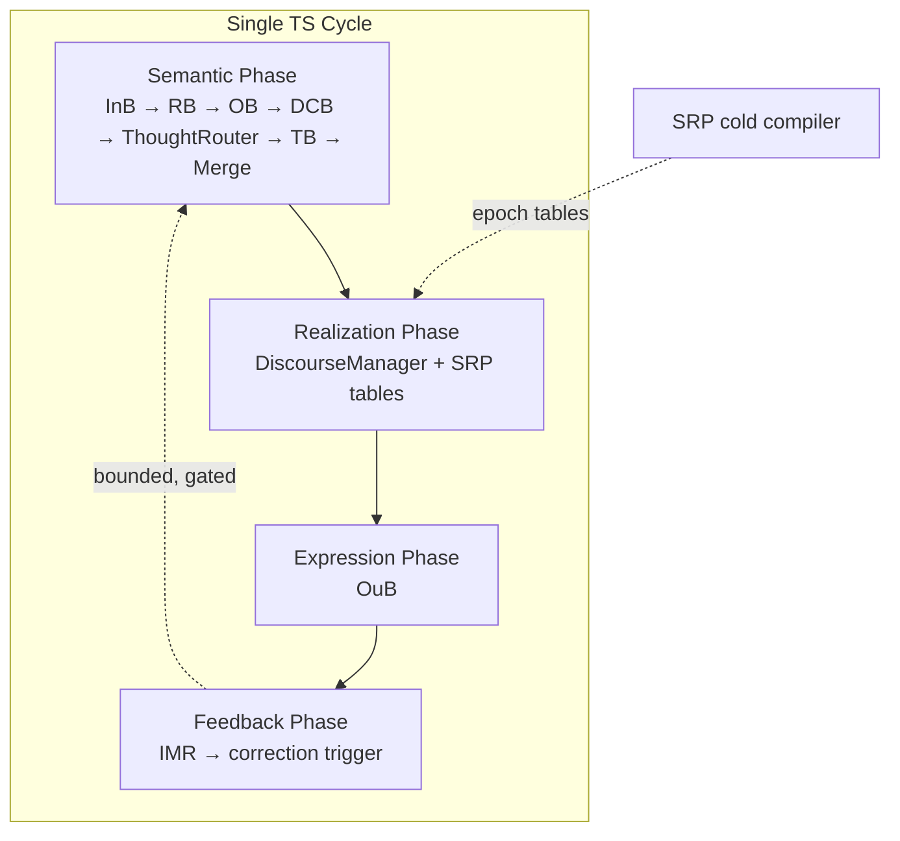

# Analysis: Full Refactor Path — Unified Architecture Landscape

This is a landscape analysis, not a direction change. You are right to pursue dual-pipeline PoC first. Below is what a later unified design would actually entail, what your starting sketch gets right, what TS principles force you to correct, and how to think about timing and long-term form.

---

## Evaluating Your Starting Sketch

Your hypothetical unified architecture is **directionally plausible** but needs three important corrections before it maps onto TS.

### Correction 1: "Non-serial" cannot mean "unordered"

TS already requires fixed phase ordering (HLR-20.010-004, HLR-20.010-066). A unified pipeline is not a free interleaving of meaning and realization. It is **one orchestrated cycle with enforced internal phases**:

```text
Semantic phase → Realization phase → Expression phase → Mediated feedback phase
```

Unified means **one runtime and one state object**, not that realization may race ahead of or rewrite semantic construction.

### Correction 2: OpBeh/OBG/XlateR are not "latent dimensions"

20.30 explicitly rejects latent-space entanglement. In a TS unified design, these remain **typed, explicit control fields** — registry IDs, table keys, epoch-bound tuples — not learned latent heads. The learning story (§3.4) applies only if you fork toward a non-deterministic ML system; that would be a different architecture, not a TS refactor.

### Correction 3: IMR cannot dissolve into "discourse events" without losing auditability

Feedback can be **represented** as a discourse event type, but IMR's **mediation function** must survive: bounded triggers, no silent MTP mutation, explicit cause codes. Unification merges the module graph; it does not remove the need for a distinguishable feedback authority.

---

## What a Full Refactor Would Actually Look Like

A credible unified TS architecture is best understood as **one pipeline, multiple hard phases, layered state** — not two pipelines merged into one blob.

### Architectural shape (post-PoC refactor target)



### 1. Single representational substrate — layered, not flat

One `TP` / `MTP`, but **logically partitioned envelopes**:

| Envelope | Owner writes | Examples |
|----------|--------------|----------|
| `semantic_core` | Pipeline 1 only | stance, goals, propositions, ΔH%, `TP.TR` |
| `exec_plan` | Realization phase only | `opbeh_id`, `obg_id`, `xlater_id`, `routing_epoch_id` |
| `exec_trace` | OuB + IMR | `exec_trigger_id`, mismatch codes, render artifact refs |
| `supervisory` | GB at safe boundaries | policy markers, blocked-relation logs |

Unification is **schema consolidation**, not field merging. Meaning and expression stay logically distinct inside one object.

### 2. SRP stays cold — "core planner" is a hot reader

Your §2.1 is half right. In a unified design:

- **SRP** remains an offline/incremental compiler: MTP structure + policy → routing tables + epoch.
- **Hot "planner"** (unified DiscourseManager) does **joint selection** at runtime: reads semantic state (read-only) + SRP tables → resolves `(OpBeh, OBG, XlateR)`.

"Joint planning" means **one decision record** referencing both semantic context and realization tuple — not SRP running per turn or doing inference on the hot path.

```text
PlanningDecision {
  semantic_context_ref,   // read-only snapshot ID
  opbeh_id, obg_id, xlater_id,
  routing_epoch_id,
  rationale_codes[]       // explicit, inspectable
}
```

### 3. TrigRB absorbed into Unified Discourse Manager (UDM)

TrigRB's function merges into a single module that owns:

- **When to act** — trigger detection (former TrigRB)
- **What act** — OpBeh selection
- **What voice** — OBG selection (or validation of externally supplied `obg_id`)
- **What mapping** — XlateR selection

UDM is the refactor integration point. It replaces separate TrigRB + address resolver with one authority — but still **table-driven**, still **deterministic**, still **logging every decision**.

### 4. Thought Router (20.37) extended, not replaced

The deepest refactor option: extend `TP.TR` with realization facets:

```text
TP.TR = {
  // existing semantic routing fields (stance, intent, routing_semantics, ...)
  realization_hints: { preferred_obg_id?, opbeh_family?, xlater_class? }
}
```

Then UDM **materializes** those hints into concrete registry IDs via SRP tables. This gives you "one routing story" without collapsing semantic routing and realization routing into one opaque decision.

### 5. IMR as feedback phase, not a side pipeline

In unified form:

```text
OuB emits → IMR evaluates → emits CorrectionTrigger (typed event)
→ scheduler queues partial semantic re-entry (ThoughtRouter / targeted basin pass)
→ never writes semantic_core directly
```

IMR becomes a **phase** in the same cycle graph, not a separate subsystem. The mediation rules from dual-pipeline PoC carry over unchanged.

### 6. "Unified interaction mode" — one struct, four facets

Your §3.3 is strong. Refactor target:

```text
InteractionMode {
  semantic_mode,    // from MTP / COB / CIL
  obg_id,
  opbeh_id,
  xlater_id,
  routing_epoch_id
}
```

`semantic_mode` and `obg_id` correlate but are not identical: semantic mode is epistemic/task context; OBG is register/voice. Unified design makes their relationship explicit in one struct rather than spread across pipelines.

---

## Your Expected Benefits — Validated and Qualified

| Claimed benefit | Valid? | Qualification |
|-----------------|--------|---------------|
| One coherent state | **Yes** | Only if layered envelopes enforced; flat merge would break determinism |
| One routing story | **Yes** | Via `PlanningDecision` + extended `TP.TR`; not one opaque routing function |
| Cleaner mode concept | **Yes** | `InteractionMode` is the right unification primitive |
| Natural learning story | **Partial** | True for ML hybrids; **not native TS**. TS optimizes via registry evolution + SRP recompile + verification, not end-to-end gradient through meaning |
| Conceptual simplicity | **Deceptive** | Fewer boxes, harder invariants. Readers see one diagram; implementers need phase/envelope rules |

Unified architecture trades **structural simplicity** for **invariant complexity**. Dual pipeline trades **structural duplication** for **inspectability**. That is the core trade.

---

## Invariants That Must Survive (Unified Design)

Your §4 list is correct. I would make it normative and expanded:

1. **Write authority partition** — semantic_core writers ≠ exec_plan writers ≠ OuB variability boundary.
2. **Phase immutability** — realization phase cannot mutate semantic fields committed in the same cycle's semantic phase (read-only snapshot or copy-on-write view).
3. **Explicit routing artifacts** — every `(OpBeh, OBG, XlateR)` resolution produces a logged `PlanningDecision`; no implicit defaults.
4. **SRP off hot path** — table compile never blocks per-turn execution.
5. **Epoch coherence** — all exec fields carry `routing_epoch_id`; stale epoch = reject or fallback with audit code.
6. **IMR bounded feedback** — max depth, cooldown, dedup; no unbounded P1 re-entry (HLR-20.010-012).
7. **Seed boundary** — OuB/seed variability cannot influence semantic phase (HLR-20.010-003).
8. **Namespace discipline** — `OpBeh`/`XlateR`/`TrigRB` never aliased to basin `OB`/`TR`/`RB`.
9. **Replay fidelity** — unified trace must decompose into equivalent dual-pipeline trace for verification.

If any of these fail, you have entanglement — not unification.

---

## 5.1 Feasibility

**Yes, feasible after dual-pipeline PoC validates the contracts** — not before.

PoC de-risks the hard parts:

- SRP table schema and epoch semantics
- `(OpBeh, OBG, XlateR)` validity matrix
- IMR trigger taxonomy and stability bounds
- Metadata-only write discipline

Refactor then becomes:

| Work type | Nature |
|-----------|--------|
| Orchestrator merge | Engineering |
| `TP` schema layering | Engineering |
| UDM module | Integration |
| 20-series doc consolidation | Documentation |
| 30-series replay equivalence proofs | Verification |

**Not feasible as a first step** — you would be unifying unproven contracts into a harder-to-debug monolith.

---

## 5.2 Correctness — Preserved Invariants

Minimum correctness contract for unified design:

```text
∀ cycle C:
  1. semantic_core(C) = f(inputs, semantic_core(C-1), approved_feedback_triggers)
  2. exec_plan(C) = g(read_only(semantic_core(C)), SRP_tables(epoch))
  3. expression(C) = h(read_only(semantic_core(C)), exec_plan(C), seed)
  4. IMR(C) → trigger set T where each t ∈ T is bounded and auditable
  5. semantic_core(C+1) unchanged by steps 2–3
```

**Correctness test:** replay unified trace; strip exec_plan/exec_trace; semantic replay must match Pipeline 1-only replay. This is the refactor acceptance criterion.

---

## 5.3 Risks and Failure Modes

| Risk | Failure mode | Mitigation |
|------|--------------|------------|
| **Planner monolith** | UDM becomes GB-style god module (HLR-20.010-099) | Split read/plan/write; table-driven only; TCU cap |
| **Silent semantic drift** | Realization phase writes stance/goals "for convenience" | Envelope write guards; schema validation at safe boundaries |
| **Implicit feedback** | Mode changes without IMR trigger audit | All feedback via typed `CorrectionTrigger` |
| **Epoch races** | Mixed-era routing in one cycle | Epoch pin at cycle start |
| **Verification collapse** | Cannot isolate P1 vs P2 bugs | Mandatory trace phase tags; replay equivalence suite |
| **OuB seed leak** | Variability influences semantic routing | Hard boundary check in unified orchestrator |
| **Namespace regression** | `OB`/`TR`/`RB` confusion returns in unified docs | Frozen glossary; qualified symbols permanent |
| **False simplicity** | Team skips phase rules because "it's one pipeline" | 20.10 phase invariants become more important, not less |

The largest risk is not performance — it is **authority blur**: one state object invites one writer too many.

---

## 5.4 Architectural Shape — My Version

Given TS principles and validated new capability, a full refactor looks like this:

### Unified TS Cycle (normative)

```text
Cycle N:
  [1] SEMANTIC_PHASE     — today's Pipeline 1 (unchanged authority)
  [2] REALIZATION_PLAN   — UDM: TrigRB + table lookup → exec_plan
  [3] EXPRESSION_PHASE   — OuB: MTP + exec_plan + seed → surface
  [4] FEEDBACK_MEDIATION — IMR: mismatch → CorrectionTrigger queue
  [5] SCHEDULE_GATE      — apply triggers to Cycle N+1 semantic entry (bounded)
```

### Module map (refactored)

| Today (dual PoC) | Unified refactor |
|------------------|------------------|
| Pipeline 1 | Semantic phase (same modules) |
| SRP | Cold compiler (unchanged role) |
| TrigRB | UDM.trigger_detector |
| OpBeh/OBG/XlateR resolver | UDM.plan_resolver |
| Pipeline 2 orchestrator | Cycle scheduler phases 2–4 |
| IMR | Feedback mediation phase |
| Separate exec metadata store | `TP.exec_plan` + `TP.exec_trace` envelopes |

### What does **not** merge

- SRP cold compilation
- Basin OB / Relational RB / Thought Router semantic contracts
- GB supervisory isolation
- OuB seed boundary
- ΔH% meaning construction logic

Unification is **orchestration and state packaging**, not primitive collapse.

---

## 5.5 Timing — When Is Unified Appropriate?

| Stage | Appropriate action |
|-------|-------------------|
| **Now → PoC complete** | Dual pipeline only |
| **PoC pass** | Draft unified target sketch (20.10 §1.17); no code merge yet |
| **30-series verification of dual contracts** | Prove replay, epoch, IMR bounds, metadata-only writes |
| **Equivalence proof** | Show unified phase model produces identical semantic replay to dual |
| **Refactor implementation** | Only after equivalence criteria defined |
| **Production** | Unified deployment optional; logical separation may remain in traces forever |

**Unified refactor is appropriate when you have trace evidence, not when PoC "feels done."**

Suggested gate: **≥3 scripted scenario classes** (stable meaning, flexible expression, bounded IMR correction) with deterministic replay logs and zero semantic-field writes from realization phase.

---

## 5.6 Guidance — Future Evolution vs Long-Term Form

**Plan for unified architecture as a possible evolution, not a committed destiny.**

My recommendation:

| Layer | Long-term form |
|-------|----------------|
| **Logical architecture** | Keep meaning vs realization separation **permanent** — even if physically unified |
| **Deployment** | Unified single orchestrator is fine post-validation |
| **Documentation** | May converge to one cycle diagram with phased envelopes |
| **Verification** | Dual-pipeline decomposition remains the audit lens indefinitely |
| **Learning/training** | Not a driver for unification in TS; registry + SRP evolution is |

Dual pipeline is not "training wheels" only. For a deterministic, auditable system, **explicit separation is a feature**. Physical unification buys orchestration convenience and reader simplicity; it does not buy correctness. Many production systems keep logically separated concerns in one process (compiler phases, transaction stages) — that is the mature TS form.

**Do not refactor for conceptual simplicity alone.** Refactor only if:

1. Dual orchestration cost is measurably painful, and
2. Replay equivalence is proven, and
3. Team consistently maintains phase/envelope discipline.

If those conditions are not met, dual pipeline remains the long-term stable **logical** architecture even with a unified **runtime**.

---

## Summary

| Question | Answer |
|----------|--------|
| **Feasibility** | Yes, post-PoC; refactor is integration engineering, not concept discovery |
| **Correctness** | Layered state + phased writes + replay equivalence to P1-only |
| **Risks** | Authority blur, planner monolith, verification collapse, false simplicity |
| **Actual shape** | One cycle, four phases, UDM absorbs TrigRB, SRP stays cold, IMR stays mediated |
| **Timing** | After PoC + 30-series contract verification + equivalence criteria |
| **Long-term** | Plan unified evolution optionally; keep logical separation permanently |

Your dual-pipeline PoC is not a detour from unified architecture — it is the **contract discovery phase** unified refactor depends on. The refactor, if it happens, packages proven boundaries into one orchestrator; it does not eliminate them.

---

If useful next, I can draft a **Unified Target Architecture** one-pager (phase diagram + envelope schema + refactor gate checklist) suitable for `40.1xx` or a non-normative `20.10` appendix — still without changing your PoC direction.