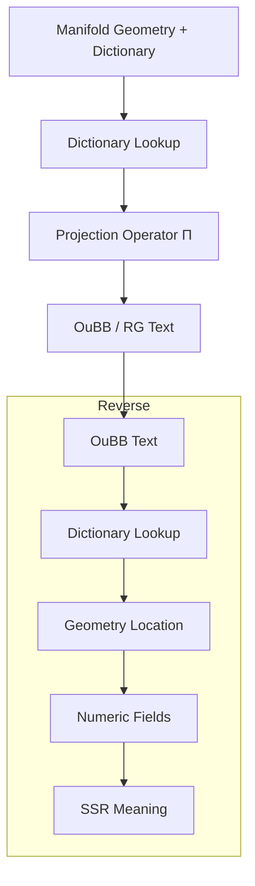
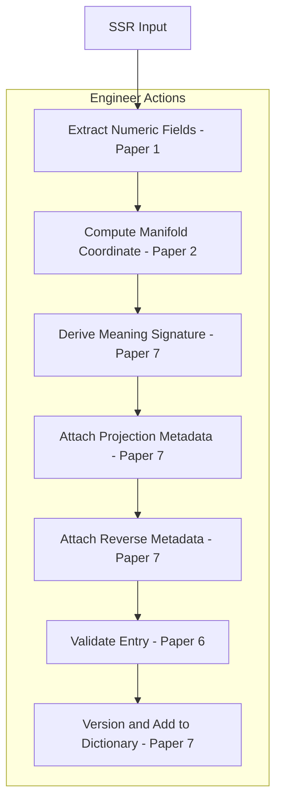

# Dictionary and Projection Specification: The Semantic Rosetta Stone of TS

**Version**: 0.2  
**Date**: 2026-07-05  
**Companion to**: prework_manifold_and_back.md, ssr_numericalization_guide.md, and manifold_geometry_spec.md  
**Repository**: CuriousOne23/WhenMathPrays  
**Part of the 7-paper pre-work suite**:

- [1. SSR to Manifold Transfer Guide](./ssr_to_manifold_transfer_guide.md)  
- [2. Manifold Geometry & Shapes Specification](./manifold_geometry_shapes_spec.md)  
- [3. Shapes Meanings — SSR, OuBB, and Mapping](./shapes_meanings_ssr_oubb_mapping.md)  
- [4. Working Inside the Manifold — Routing & Projection](./manifold_routing_projection.md)  
- [5. Manifold to OuBB / RG Projection & Reverse](./manifold_to_oubb_projection_reverse.md)  
- [6. Pre-work Checklist, Tuning & Validation](./prework_checklist_tuning_validation.md)
- **[7. Dictionary Projection Specification](dictionary_projection_spec.md)** (this document)  

**Top level overview**  
[prework_manifold_and_back.md](prework_manifold_and_back.md)  

**Canonical Glossary**: This document serves as the **canonical glossary** for the suite (or link to a dedicated glossary file once finalized). All terminology used across Papers 1–6 is defined here or cross-referenced.

## 1. Introduction

The dictionary is the semantic Rosetta Stone of the Thought Simulator (TS). It unifies SSR meaning, numeric fields, manifold geometry, and textual output (OuBB/RG). 

This paper covers the final layer: how manifold geometry is mapped to deterministic textual meaning via the dictionary and projection operator $\Pi$. It also details reverse interpretation and debugging of meaning drift. It does not cover SSR numericalization [ssr_numericalization_guide.md](ssr_numericalization_guide.md)  or [manifold_geomerty_spec.md](manifold_geomerty_spec.md).

### 1.1 Forward Projection & Reverse Interpretation Flow (Runtime Behavior)

## 2. What the Dictionary Is

The dictionary is a multi-layer mapping structure that associates each dictionary numeric coordinate with rich semantic metadata across all TS layers. It enables traceability, deterministic projection, and reverse interpretation.

## 3. Dictionary Structure

Each dictionary entry for a dictionary numeric coordinate (e.g., $(s_i, r_j)),\ s_i$ is manifold surface index and $r_j$ is region index, contains:

- SSR-origin fields and relations
- Numeric field vector
- Geometric location (surface, region, basin context)
- Textual meaning signature
- Correlation structure
- Projection behavior metadata
- Reverse interpretation metadata

The dictionary is frozen as part of every manifold snapshot.

### **4. Creating the Dictionary**

#### **4.1 Pre‑Work Pipeline**

During pre-work:

- Coordinates are assigned based on geometric clustering.
- SSR-origin meaning, numeric vectors, and geometric context are recorded in the dictionary structure.
- Textual meaning signatures are extracted from representative OuBB examples.  
    - To build the dictionary, look at actual OuBB text examples, then extract the textual qualities that define how meaning is expressed (see Textual Output Dimensions in the glossary below).
- Correlations and projection metadata are computed and stored.  
    - For correlation, see *correlation structure* in the glossary below.
    - For projection metadata, see in the glossary below.
- The entire dictionary is versioned with the manifold.

#### **4.2 Notes on Correlation Structure and Projection Metadata**

These notes explain the two components computed during pre‑work that determine how numeric fields influence geometry and how geometry influences textual expression.

Correlation structure and projection metadata are computed during pre‑work by analyzing how SSR‑derived numeric fields jointly influence manifold geometry and textual expression. 

Correlation structure captures the deterministic relationships between identity, relational, structural, and ambiguity fields and how these combinations shape basin behavior, curvature, and semantic gradients. 

Projection metadata records how these geometric influences map into textual output dimensions (lexical emphasis, tone, syntactic structure, relational phrasing, modality, shading, narrative role). 

Both correlation structure and projection metadata are stored inside each dictionary entry so Π and Π⁻¹ can rely on stable, interpretable links between numeric fields, geometry, and expression.

## 5. Textual Meaning Signatures

Textual meaning signatures capture:
- Lexical emphasis and phrasing
- Syntactic structure
- Relational phrasing
- Tone and modality
- Narrative role
- Contextual cues
- Semantic shading

These signatures guide the projection operator to produce coherent OuBB/RG text.

## 6. Projection Operator Π

The deterministic projection operator $\Pi$ maps manifold geometry (via dictionary coordinates) to OuBB/RG text:

$$
\text{OuBB} = \Pi(\text{coordinate}, \text{context})
$$

It uses meaning signatures, correlation data, and projection mapping tables. Interpolation and stability constraints ensure smooth, deterministic outputs. Ambiguity and relational strength are handled via dictionary metadata.

## 7. Reverse Interpretation

The full reverse pipeline is:
- OuBB text → dictionary lookup (via meaning signatures)
- Dictionary coordinate → manifold geometry
- Geometry → numeric fields
- Numeric fields → SSR meaning

This enables full traceability from output back to input semantics.

## 8. Debugging Projection Meaning

Structured workflow for debugging meaning drift:
- Compare expected vs. actual textual output
- Trace active coordinates and meaning signatures
- Check for basin misalignment, projection table errors, or signature drift
- Validate against ground-truth SSR examples

## 9. Tuning Projection

Engineers tune by adjusting:
- Mapping tables
- Meaning signatures
- Correlation weights
- Interpolation and stability rules
- Conditional routing logic

Tuning directly affects textual coherence, tone, and relational fidelity.

## 10. Dictionary Construction Workflow (Pre-Work/Construction)

## 11. Validation Procedures

Validate dictionary correctness, projection fidelity, reverse interpretation accuracy, meaning stability, discriminability, and traceability.

## 12. Validation Checklist

### Layer Linking & Structural Integrity
- [ ] Dictionary entry links SSR → numeric → manifold → meaning signature → projection metadata → text
- [ ] Coordinate (sᵢ, rⱼ) is stable across runs and matches expected geometric behavior
- [ ] Numeric field vector is normalized and consistent with SSR definitions

### Meaning Signature Validation
- [ ] Lexical emphasis, syntactic structure, relational phrasing, tone, modality, and shading are stable across runs
- [ ] Meaning signature accurately reflects the semantic intent of the coordinate
- [ ] No signature drift across runs or tuning cycles

### Projection Fidelity
- [ ] Projection Π produces deterministic, semantically faithful text
- [ ] Projection table rules match meaning signature and coordinate behavior
- [ ] No unintended phrasing, tone, or structural artifacts

### Reverse Interpretation Fidelity
- [ ] Π⁻¹ reconstructs original SSR meaning with high fidelity
- [ ] Reverse interpretation correctly resolves ambiguity fields
- [ ] No coordinate misalignment or basin misalignment detected

### Discriminability & Drift
- [ ] Entry is discriminable from neighboring coordinates (no semantic collapse)
- [ ] No unintended drift across runs
- [ ] Correlation structure remains consistent with manifold geometry

### Versioning & Documentation
- [ ] Entry is versioned with change history
- [ ] Tuning notes and validation results are recorded

## 13. Examples

### Example 1 — Coordinate → Text Projection
**Coordinate:** (s₁, r₃)  
**Meaning Signature:**  
- lexical emphasis: “strong preference”  
- syntactic structure: declarative  
- relational phrasing: “is associated with”  
- tone: neutral  
- modality: high certainty  

**Projection Table Rule:**  
If (s₁, r₃) and modality=high → use “clearly” in phrasing.

**Output (Π):**  
“Entity A is clearly associated with Entity B.”

---

### Example 2 — Reverse Interpretation (Π⁻¹)
**Text:**  
“Entity A is clearly associated with Entity B.”

**Recovered:**  
- SSR identity fields: A, B  
- relational field: association(strong)  
- modality: high  
- tone: neutral  
- coordinate: (s₁, r₃)  
- meaning signature: matches stored signature  

Reverse interpretation confirms fidelity.

---

### Example 3 — Meaning Drift Debugging
**Symptom:**  
Projection output changed from  
“Entity A is clearly associated with Entity B.”  
to  
“Entity A might be associated with Entity B.”

**Diagnosis:**  
- modality signature drifted from “high” to “uncertain”  
- coordinate (s₁, r₃) unchanged → drift is in meaning signature  
- projection table applied correct rule for new signature  

**Fix:**  
Restore modality signature to “high certainty.”

---

### Example 4 — Tuning Correction
**Issue:**  
Output text is overly formal:  
“Entity A demonstrates a significant relational alignment with Entity B.”

**Cause:**  
- syntactic structure signature set to “academic”  
- tone signature set to “formal”  

**Correction:**  
Change syntactic structure → “plain declarative”  
Change tone → “neutral”

**New Output:**  
“Entity A is clearly associated with Entity B.”

## 14. Conclusion

The dictionary is the unifying semantic Rosetta Stone of TS. It connects symbolic, numeric, geometric, and textual meaning into a single traceable structure. Together with the projection operator $\Pi$, it enables deterministic, debuggable, and engineerable meaning flow in both forward and reverse directions.

## Glossary (Paper 7 — Dictionary & Projection Specification)

### Core Dictionary & Projection Concepts
**dictionary (Rosetta Stone)**  
Multi-layer mapping unifying SSR, numeric fields, manifold geometry, and textual meaning. Enables deterministic projection and full reverse traceability.

**dictionary coordinate**  
Stable identifier locating a point in the manifold. Used for projection, reverse interpretation, and debugging.

**meaning signature**  
Structured representation of textual qualities (lexical emphasis, syntactic structure, relational phrasing, tone, modality, shading, narrative role) stored in the dictionary.

**textual meaning signature**  
The subset of meaning signatures specifically used by Π to generate OuBB/RG text.

**projection operator Π**  
Deterministic function mapping manifold coordinates + meaning signatures + shape meaning into OuBB/RG text.

**projection table**  
Mapping rules used by Π to convert coordinates and context into text. Controls phrasing, tone, and structural realization.

**reverse interpretation**  
Full pipeline from text → dictionary → manifold → numeric → SSR. Used for debugging, validation, and drift detection.

**meaning reconstruction**  
Reverse process of recovering intended SSR meaning from generated text using dictionary metadata.

---

### Textual Output Dimensions (Used by Π)
**lexical emphasis**  
Word choice and highlighting in textual output.

**syntactic structure**  
Grammatical organization in generated text.

**relational phrasing**  
How relationships are expressed in text.

**tone**  
Emotional or attitudinal coloring of text.

**modality**  
Expression of certainty, possibility, or necessity.

**narrative role**  
Function of a statement in broader context (e.g., conclusion, explanation).

**semantic shading**  
Subtle coloring of meaning (e.g., positive/negative valence).

---

### Cross-Layer Stability, Drift & Traceability
**traceability**  
Ability to follow meaning forward (SSR → text) and backward (text → SSR).

**fidelity**  
How faithfully meaning is preserved across layers.

**meaning drift**  
Unintended change in semantic interpretation across runs or steps.

**signature drift**  
Change in textual meaning signatures over time or runs.

**coordinate misalignment**  
Mismatch between expected and actual dictionary coordinate behavior.

**basin misalignment**  
When projection or routing behavior does not match expected basin influence.

**correlation structure**  
Defined, *non‑statistical* relationships between SSR‑derived numeric fields and their joint influence on manifold geometry and projection behavior. A correlation structure specifies:

- **Field influence:** which numeric fields (identity, relational, structural, ambiguity) contribute most to basin shape, ridge formation, and curvature.
- **Combined effects:** how specific combinations of fields (e.g., high identity + high relational, high ambiguity + low structural) change constraint‑energy, basin width, and transition behavior.
- **Projection impact:** how these field relationships modulate textual output dimensions (lexical emphasis, tone, relational phrasing, modality, shading, narrative role) for a given coordinate.
- **Stability expectations:** the expected geometric and textual behavior for a coordinate given its field relationships, used to detect drift, misalignment, or unexpected routing.

Correlation structure is computed during pre‑work and stored in each dictionary entry as part of projection metadata, so Π and Π⁻¹ can rely on stable, interpretable links between numeric fields, geometry, and expression.

**semantic gradients**  
Smooth, monotonic changes in numeric-field values that reflect increasing or
decreasing semantic similarity across the manifold. Semantic gradients define
how meaning shifts as coordinates move within or between basins, and they ensure
predictable projection behavior by providing stable transitions in geometric
context. They are used to detect drift (when gradients become irregular or
non‑monotonic), maintain coordinate alignment, and guarantee that Π and Π⁻¹
produce consistent meaning-to-text and text-to-meaning mappings across runs.

**projection metadata**  
Rules and parameters stored in each dictionary entry that determine how Π converts
a coordinate’s geometric context and textual meaning signature into deterministic
OuBB/RG text. Projection metadata specifies phrasing tendencies, tone behavior,
syntactic structure preferences, relational phrasing patterns, modality levels,
narrative role expectations, and shading influences. It ensures that projection
is stable, reproducible, and aligned with the coordinate’s intended semantic
behavior.

### SSR → Numeric Fields (Stored in Dictionary Entries)
**numeric field vector**  
Vector of normalized values extracted from SSR.

**identity fields**  
Fields capturing core entity or concept presence.

**relational fields**  
Fields capturing strength and type of associations.

**ambiguity fields**  
Fields representing uncertainty or multiple interpretations.

**structural fields**  
Fields representing hierarchical or compositional relationships.

**normalization**  
Scaling raw values to a consistent numeric domain.

---

### Manifold Concepts (Because Dictionary Entries Store Coordinates)
**manifold**  
Explicit geometric latent space built from numeric fields.

**constraint surface**  
The manifold itself; shaped by SSR dynamics and interpretability requirements.

**constraint-energy**  
Metaphor for attraction/repulsion strength at a location. Valleys = coherence; peaks = conflict.

**geometric clustering**  
Deterministic grouping of numeric-field vectors into coherent geometric regions (basins, ridges, transitions) during manifold construction. These clustered regions form the semantic topology from which meaning signatures are extracted and provide the coordinate neighborhoods used by Π and Π⁻¹.

**geometric context**  
The local geometric situation around a dictionary coordinate, including its cluster membership, basin/ridge/saddle structure, curvature, and neighboring coordinates. Geometric context defines the semantic neighborhood used by Π and Π⁻¹ for projection and reverse interpretation.

**aligned SSR fields**  
Semantic coherence between fields → valleys (attraction).

**anti-aligned SSR fields**  
Semantic conflict between fields → peaks (repulsion).

