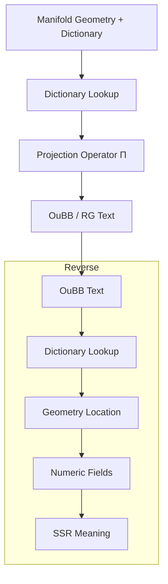
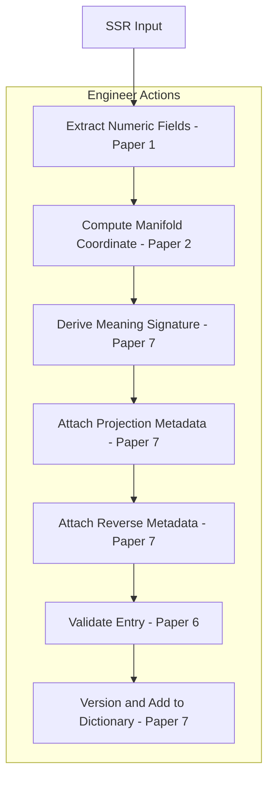

# Dictionary and Projection Specification: The Semantic Rosetta Stone of TS

**Version**: 0.2  
**Date**: 2026-07-05  
**Companion to**: prework_manifold_and_back.md, ssr_numericalization_guide.md, and manifold_geometry_spec.md  
**Repository**: CuriousOne23/WhenMathPrays  
**Part of the 7-paper pre-work suite**:

- [1. SSR to Manifold Transfer Guide](./ssr_to_manifold_transfer_guide.md)  
- [2. Manifold Geometry & Shapes Specification](./manifold_geometry_shapes_spec.md)  
- [3. Shapes Meanings — SSR, OuBB, and Mapping](./shapes_meanings_ssr_oubb_mapping.md)  
- [4. Working Inside the Manifold — Routing & Projection](./manifold_routing_projection.md)  
- [5. Manifold to OuBB / RG Projection & Reverse](./manifold_to_oubb_projection_reverse.md)  
- [6. Pre-work Checklist, Tuning & Validation](./prework_checklist_tuning_validation.md)
- **[7. Dictionary Projection Specification](dictionary_projection_spec.md)** (this document)  

**Top level overview**  
[prework_manifold_and_back.md](prework_manifold_and_back.md)  

**Canonical Glossary**: This document serves as the **canonical glossary** for the suite (or link to a dedicated glossary file once finalized). All terminology used across Papers 1–6 is defined here or cross-referenced.

## 1. Introduction

The dictionary is the semantic Rosetta Stone of the Thought Simulator (TS). It unifies SSR meaning, numeric fields, manifold geometry, and textual output (OuBB/RG). 

This paper covers the final layer: how manifold geometry is mapped to deterministic textual meaning via the dictionary and projection operator $\Pi$. It also details reverse interpretation and debugging of meaning drift. It does not cover SSR numericalization [ssr_numericalization_guide.md](ssr_numericalization_guide.md)  or [manifold_geomerty_spec.md](manifold_geomerty_spec.md).

### 1.1 Forward Projection & Reverse Interpretation Flow (Runtime Behavior)

## 2. What the Dictionary Is

The dictionary is a multi-layer mapping structure that associates each dictionary numeric coordinate with rich semantic metadata across all TS layers. It enables traceability, deterministic projection, and reverse interpretation.

## 3. Dictionary Structure

Each dictionary entry for a dictionary numeric coordinate (e.g., $(s_i, r_j)),\ s_i$ is manifold surface index and $r_j$ is region index, contains:

- SSR-origin fields and relations
- Numeric field vector
- Geometric location (surface, region, basin context)
- Textual meaning signature
- Correlation structure
- Projection behavior metadata
- Reverse interpretation metadata

The dictionary is frozen as part of every manifold snapshot.

### **4. Creating the Dictionary**

#### **4.1 Pre‑Work Pipeline**

During pre-work:

- Coordinates are assigned based on geometric clustering.
- SSR-origin meaning, numeric vectors, and geometric context are recorded in the dictionary structure.
- Textual meaning signatures are extracted from representative OuBB examples, see [oubb_examples.md](../../oubb/oubb_examples.md). 
    - To build the dictionary, look at actual OuBB text examples, then extract the textual qualities that define how meaning is expressed (see Textual Output Dimensions in the glossary below).
- Correlations and projection metadata are computed and stored.  
    - For correlation, see *correlation structure* in the glossary below.
    - For projection metadata, see in the glossary below.
- The entire dictionary is versioned with the manifold.

#### **4.2 Notes on Correlation Structure and Projection Metadata**

These notes explain the two components computed during pre‑work that determine how numeric fields influence geometry and how geometry influences textual expression.

Correlation structure and projection metadata are computed during pre‑work by analyzing how SSR‑derived numeric fields jointly influence manifold geometry and textual expression. 

Correlation structure captures the deterministic relationships between identity, relational, structural, and ambiguity fields and how these combinations shape basin behavior, curvature, and semantic gradients. 

Projection metadata records how these geometric influences map into textual output dimensions (lexical emphasis, tone, syntactic structure, relational phrasing, modality, shading, narrative role). 

Both correlation structure and projection metadata are stored inside each dictionary entry so Π and Π⁻¹ can rely on stable, interpretable links between numeric fields, geometry, and expression.

# **4.3 Semantic Gradient Validation**

Semantic gradients must remain smooth, monotonic, and geometrically consistent across the manifold. During pre‑work, each coordinate’s numeric field vector is checked to ensure that semantic similarity corresponds to predictable geometric proximity.

**Gradient monotonicity**  
Adjacent coordinates $c_i$ and $c_j$ must satisfy:

$$
\Delta \text{semantic}(c_i, c_j) \propto \Delta \text{numeric}(c_i, c_j)
$$

where proportionality is defined by basin curvature and field weighting.

**Basin‑consistent transitions**  
Movement within a basin must produce smooth changes in textual meaning signatures and projection behavior. Abrupt changes indicate drift or misalignment.

**Cross‑basin checks**  
Transitions across basin boundaries must reflect expected semantic shifts (e.g., contrastive phrasing, modality changes):

$$
c \in B_k \rightarrow c' \in B_{k+1}
$$

Expected changes include tone adjustments, relational phrasing shifts, or narrative role transitions.

**Stability across versions**  
Gradients are compared across manifold versions $M_v$ and $M_{v+1}$ to ensure updates do not introduce discontinuities.

Semantic gradient validation ensures that meaning moves smoothly across the manifold and that projection $\Pi$ behaves predictably for all coordinates.

---

# **4.4 Coordinate Stability Checks**

Each dictionary coordinate must exhibit stable geometric and textual behavior across runs. Stability checks ensure that coordinates remain aligned with their intended meaning, basin context, and projection metadata.

**Geometric stability**  
Coordinate $c$ must remain in its expected basin or region across manifold versions unless explicitly re‑clustered:

$$
c(M_v) \approx c(M_{v+1})
$$

**Projection stability**  
Projection $\Pi(c)$ must produce text consistent with the coordinate’s meaning signature and representative OuBB examples. Deviations indicate projection drift or metadata misalignment.

**Reverse interpretation stability**  
Reverse interpretation must satisfy:

$$
\Pi^{-1}(\Pi(c)) \approx c
$$

within tolerance. If $\Pi^{-1}$ maps projected text to a different coordinate, the dictionary entry requires review.

**Signature stability**  
Textual meaning signatures $\sigma_c$ must remain consistent across runs. Signature drift signals changes in phrasing, tone, or relational structure that require investigation.

Coordinate stability checks ensure that dictionary entries behave consistently and remain aligned with SSR-origin meaning and geometric context.

---

# **4.5 Projection Drift Tests**

Projection drift occurs when $\Pi$ begins producing text that diverges from expected phrasing, tone, or structure for a coordinate. Drift tests ensure projection remains deterministic and aligned with dictionary metadata.

**Example alignment**  
Projection output must remain close to representative OuBB examples $t_c$:

$$
\Pi(c) \approx t_c
$$

within defined tolerance.

**Metadata alignment**  
Projection output must reflect the coordinate’s projection metadata:

- lexical emphasis  
- syntactic structure  
- relational phrasing  
- tone  
- modality  
- narrative role  
- shading  

**Gradient‑consistent phrasing**  
Projection must change smoothly along semantic gradients. Abrupt shifts indicate drift.

**Cross‑run consistency**  
Projection must remain stable across runs:

$$
\Pi_{run1}(c) \approx \Pi_{run2}(c)
$$

unless metadata or manifold geometry changed.

**Reverse interpretation check**  
Drift is confirmed if:

$$
\Pi^{-1}(\Pi(c)) \not\approx c
$$

indicating that projection output no longer maps back to the correct coordinate.

Projection drift tests ensure that $\Pi$ remains stable, predictable, and invertible across runs and manifold versions.

# **5. Textual Meaning Signatures**

A **textual meaning signature** is the stored, multi‑dimensional representation of how a dictionary coordinate expresses meaning in text. It is derived from representative OuBB examples and decomposed along the Textual Output Dimensions. The signature provides the primary constraint for projection and reverse interpretation, ensuring deterministic phrasing, tone, relational structure, and shading.

Textual meaning signatures capture:

- **Lexical emphasis and phrasing**  
- **Syntactic structure**  
- **Relational phrasing**  
- **Tone and modality**  
- **Narrative role**  
- **Contextual cues**  
- **Semantic shading**  
    [Current page](citation-section://1146966522/18)

These dimensions form a structured vector:

$$
\sigma_c = 
\\{
\text{lexical},\ 
\text{syntactic},\ 
\text{relational},\ 
\text{tone},\ 
\text{modality},\ 
\text{narrative},\ 
\text{context},\ 
\text{shading}
\\}
$$

where each component is extracted from curated OuBB examples associated with coordinate $c$.

---

### **5.1 Extraction**

For each dictionary coordinate $c$:

1. Representative OuBB examples $t_c$ are selected.  
2. Each example is decomposed along the Textual Output Dimensions.  
3. The resulting components are normalized and combined into the signature $\sigma_c$.  
4. The signature is stored inside the dictionary entry for $c$.

Formally:

$$
t_c \longrightarrow \sigma_c
$$

Extraction ensures that the signature reflects **canonical**, **stable**, and **semantically aligned** textual behavior.

---

### **5.2 Role in Projection**

During projection, the operator $\Pi$ uses the textual meaning signature as the primary constraint on output behavior:

$$
\text{OuBB} = \Pi(c,\, \sigma_c,\, \text{geom}(c),\, \text{metadata}(c))
$$

The signature determines:

- phrasing tendencies  
- tone and modality  
- relational expression  
- syntactic structure  
- shading and nuance  

Projection metadata and correlation structure refine these tendencies, but the signature provides the **semantic anchor** for deterministic text generation.

---

### **5.3 Role in Reverse Interpretation**

Reverse interpretation uses the signature to map text back to the correct coordinate:

$$
\Pi^{-1}(t) \longrightarrow c
$$

The signature ensures:

- discriminability between coordinates  
- stability across runs  
- resistance to meaning drift  
- correct reconstruction of SSR-origin meaning  

If $\Pi^{-1}(t)$ fails to recover $c$, signature drift or coordinate misalignment is suspected.

---

### **5.4 Stability Requirements**

A textual meaning signature must remain stable across:

- manifold versions  
- projection runs  
- tuning cycles  
- dictionary updates  

Stability is validated through:

- semantic gradient checks (Section 4.3)  
- coordinate stability checks (Section 4.4)  
- projection drift tests (Section 4.5)

A signature is considered stable when:

$$
\Pi(c) \approx t_c
\quad\text{and}\quad
\Pi^{-1}(t_c) \approx c
$$

within defined tolerances.

---

### **5.5 Summary**

Textual meaning signatures:

- encode how meaning *should* be expressed  
- anchor projection and reverse interpretation  
- ensure deterministic, debuggable textual behavior  
- unify semantic, geometric, and numeric layers  
- provide the core expressive metadata for each dictionary coordinate

They are the **textual half** of the Semantic Rosetta Stone.

# **6. Projection Operator Π**

The projection operator Π is the deterministic function that converts manifold geometry and dictionary metadata into coherent OuBB/RG text. Π ensures that textual output is stable, reproducible, and traceable back to SSR-origin meaning. Projection is governed by dictionary coordinates, geometric context, textual meaning signatures, correlation structure, and projection metadata. 

## **6.1 Inputs to Π**

Projection begins with a dictionary coordinate:

$$
c = (s_i, r_j)
$$

where $s_i$ is the surface index and $r_j$ is the region index.  
  [Current page](citation-section://1146966522/12)

For each coordinate, Π consumes:

- **Geometric context:** basin, curvature, attractor strength, transition boundaries.  
- **Textual meaning signature** $\sigma_c$ (Section 5).  
- **Correlation structure:** deterministic relationships between numeric fields and geometric influence.  
- **Projection metadata:** phrasing tendencies, tone behavior, syntactic structure preferences, relational phrasing patterns, modality levels, narrative role expectations, shading influences.  
- **Projection tables:** mapping rules for converting coordinate + metadata into text.  
  [Current page](citation-section://1146966522/19)

Formally:

$$
\text{OuBB} = \Pi(c,\, \text{geom}(c),\, \sigma_c,\, \text{corr}(c),\, \text{meta}(c))
$$

## **6.2 Core Projection Process**

Π proceeds through four deterministic stages:

### **1. Geometric Interpretation**
Π interprets the coordinate’s geometric context:

- basin depth → stability of phrasing  
- basin attraction → strength of relational emphasis  
- curvature → tone modulation  
- transitions → syntactic shifts or modality changes  
  [Current page](citation-section://1146966522/34)

This produces a **geometric influence vector**:

$$
g_c = \text{geom}(c)
$$

### **2. Signature Alignment**
Π aligns the geometric influence vector with the textual meaning signature:

$$
a_c = f(\sigma_c, g_c)
$$

This determines:

- lexical emphasis  
- syntactic structure  
- relational phrasing  
- tone and modality  
- narrative role  
- shading  
  [Current page](citation-section://1146966522/51)

### **3. Metadata Conditioning**
Projection metadata refines the aligned signature:

$$
m_c = h(a_c,\, \text{meta}(c))
$$

Metadata ensures:

- stable phrasing  
- consistent tone  
- basin‑appropriate relational structure  
- deterministic modality  
- correct narrative role  
  [Current page](citation-section://1146966522/59)

### **4. Text Realization**
Finally, Π uses projection tables to convert $m_c$ into OuBB/RG text:

$$
\text{OuBB} = T(m_c)
$$

Projection tables define:

- connective selection  
- block/line formatting  
- sequencing  
- relational expression  
- tone and modality realization  
  [Current page](citation-section://1146966522/60)

## **6.3 Interpolation and Stability Constraints**

Projection must remain smooth across nearby coordinates. Π enforces:

### **Geometric interpolation**
Coordinates in the same basin must produce smoothly varying text:

$$
\Pi(c_i) \approx \Pi(c_j)
\quad\text{for}\quad c_i \sim c_j
$$

### **Signature continuity**
Textual meaning signatures must interpolate cleanly across semantic gradients:

$$
\sigma_{c_i} \rightarrow \sigma_{c_j}
$$

### **Spline smoothing**
Cubic spline interpolation is used to eliminate discontinuities in phrasing or tone.  
  [Current page](citation-section://1146966522/67)

### **Deterministic routing**
Fixed‑time‑step movement ensures reproducible projection behavior.  
  [Current page](citation-section://1146966522/45)

## **6.4 Handling Ambiguity and Relational Strength**

Ambiguity fields and relational fields directly influence projection:

- **Ambiguity fields** adjust modality and shading.  
  High ambiguity → softer modality, hedged phrasing.  
  Low ambiguity → assertive modality, crisp phrasing.  
  [Current page](citation-section://1146966522/32)

- **Relational fields** determine relational phrasing strength.  
  Strong relational fields → explicit relational statements.  
  Weak relational fields → implicit or backgrounded relations.  
  [Current page](citation-section://1146966522/61)

Π integrates these fields through correlation structure and projection metadata.

## **6.5 Determinism and Reproducibility**

Projection must be fully deterministic:

$$
\Pi_{\text{run1}}(c) = \Pi_{\text{run2}}(c)
$$

unless:

- the manifold version changes,  
- the dictionary entry changes, or  
- projection metadata is updated.

Determinism is validated through:

- coordinate stability checks (Section 4.4)  
- projection drift tests (Section 4.5)  
- reverse interpretation consistency  
  [Current page](citation-section://1146966522/26)

## **6.6 Projection and Reverse Interpretation Coupling**

Projection and reverse interpretation form a closed loop:

$$
c \xrightarrow{\Pi} t \xrightarrow{\Pi^{-1}} c
$$

Reverse interpretation must recover the original coordinate:

$$
\Pi^{-1}(\Pi(c)) \approx c
$$

This ensures:

- traceability  
- drift detection  
- debugging of projection errors  
  [Current page](citation-section://1146966522/22)

## **6.7 Summary**

The projection operator Π:

- consumes dictionary coordinates, geometric context, signatures, correlation structure, and metadata  
- produces deterministic, stable OuBB/RG text  
- enforces continuity across basins and gradients  
- handles ambiguity and relational strength through metadata  
- supports full reverse interpretation  
- is the final stage of the Semantic Rosetta Stone pipeline  

Π is the **text‑realization engine** of TS.

# **7. Reverse Interpretation Operator Π⁻¹**

Reverse interpretation is the deterministic process of mapping OuBB/RG text back to its originating dictionary coordinate, manifold geometry, numeric fields, and SSR meaning. Π⁻¹ ensures full traceability across layers, supports debugging of meaning drift, and validates projection fidelity. It is the inverse of the projection operator Π (Section 6), forming a closed semantic loop.

The original Section 7 describes the pipeline briefly   [Current page](citation-section://1146966522/22).  
This rewrite expands it into a complete specification.

---

## **7.1 Inputs to Π⁻¹**

Reverse interpretation begins with an OuBB/RG text instance:

$$
t = \text{OuBB/RG output}
$$

Π⁻¹ consumes:

- **Textual features** extracted from $t$  
- **Textual meaning signature space** (Section 5)  
- **Projection metadata**  
- **Correlation structure**  
- **Dictionary coordinate index**  
- **Manifold geometry snapshot**  
- **SSR field reconstruction rules**

Formally:

$$
c = \Pi^{-1}(t)
$$

where $c$ is the recovered dictionary coordinate.

---

## **7.2 Reverse Interpretation Pipeline**

Reverse interpretation proceeds through five deterministic stages:

### **1. Text Feature Extraction**

Π⁻¹ extracts structured features from the text:

- lexical emphasis  
- syntactic structure  
- relational phrasing  
- tone and modality  
- narrative role  
- contextual cues  
- semantic shading  

This produces a **text feature vector**:

$$
\phi(t)
$$

### **2. Signature Matching**

Π⁻¹ compares $\phi(t)$ against all textual meaning signatures $\sigma_c$ in the dictionary:

$$
c^\* = \arg\min_{c} \, d(\phi(t), \sigma_c)
$$

where $d$ is a discriminability‑preserving distance metric.

This step identifies the coordinate whose signature best matches the observed text.

### **3. Metadata Consistency Check**

Projection metadata for $c^\*$ is used to verify that the text’s phrasing, tone, and relational structure are consistent with expected behavior:

$$
\text{consistent}(t, \text{meta}(c^\*))
$$

If inconsistent, Π⁻¹ flags:

- signature drift  
- projection drift  
- coordinate misalignment  
- basin misalignment  

### **4. Geometric Reconstruction**

Once the coordinate is identified, Π⁻¹ retrieves its geometric context:

$$
\text{geom}(c^\*) = ( \text{surface}, \text{region}, \text{basin}, \text{curvature} )
$$

Geometric reconstruction ensures that the recovered meaning aligns with manifold structure.

### **5. Numeric Field Recovery and SSR Meaning Reconstruction**

Finally, Π⁻¹ recovers the numeric field vector and reconstructs SSR meaning:

$$
\text{SSR}(t) = \text{SSR}(\text{numeric}(c^\*))
$$

This completes the reverse pipeline:

$$
t \rightarrow c^\* \rightarrow \text{geom}(c^\*) \rightarrow \text{numeric}(c^\*) \rightarrow \text{SSR meaning}
$$

---

## **7.3 Determinism and Stability Requirements**

Reverse interpretation must satisfy:

### **Forward–Reverse Consistency**

$$
\Pi^{-1}(\Pi(c)) \approx c
$$

### **Cross‑run Stability**

$$
\Pi^{-1}_{\text{run1}}(t) \approx \Pi^{-1}_{\text{run2}}(t)
$$

### **Signature Stability**

If $\Pi^{-1}(t)$ begins mapping to a different coordinate, this signals:

- signature drift  
- projection drift  
- correlation structure changes  
- basin misalignment  

### **Discriminability**

Coordinates must remain separable:

$$
d(\sigma_{c_i}, \sigma_{c_j}) > \epsilon
\quad\text{for distinct meanings}
$$

---

## **7.4 Role in Debugging and Validation**

Reverse interpretation is central to debugging meaning drift (Section 8 at   [Current page](citation-section://1146966522/23)):

- **Detect drift:**  
  If $\Pi^{-1}(t)$ returns a coordinate different from the one used in projection, drift has occurred.

- **Validate projection:**  
  Reverse interpretation confirms that Π produced text aligned with dictionary metadata.

- **Traceability:**  
  Engineers can trace any output back to its SSR origin.

- **Coordinate health:**  
  Misalignment indicates issues in:  
  - signature extraction  
  - projection metadata  
  - correlation structure  
  - geometric clustering  
  - basin definitions  

---

## **7.5 Summary**

The reverse interpretation operator Π⁻¹:

- maps text back to dictionary coordinates  
- reconstructs geometric and numeric meaning  
- validates projection fidelity  
- detects drift and misalignment  
- ensures full traceability across TS layers  

Together, Π and Π⁻¹ form the **bidirectional semantic engine** of the Thought Simulator.

# **8. Debugging Projection Meaning**

Debugging projection meaning is the process of verifying that the projection operator $\Pi$ and reverse interpretation operator $\Pi^{-1}$ preserve SSR-origin meaning across all layers of the Thought Simulator. This section defines the procedures, checks, and diagnostics used to detect drift, misalignment, instability, and metadata inconsistencies. Debugging ensures full traceability from SSR → numeric → geometry → text and back.

## **8.1 Purpose of Debugging**

Debugging projection meaning ensures:

- **Meaning fidelity:**  
  $\Pi(c)$ must express the intended SSR meaning stored in the dictionary entry for $c$.

- **Invertibility:**  
  $\Pi^{-1}(\Pi(c)) \approx c$ must hold within tolerance.

- **Stability:**  
  Projection must remain consistent across runs, tuning cycles, and manifold versions.

- **Traceability:**  
  Engineers must be able to follow any output back to its SSR origin.

- **Drift detection:**  
  Changes in signatures, metadata, or geometry must be identified early.

Debugging is a cross-layer requirement and is essential for engineering confidence.

## **8.2 Forward–Reverse Consistency Check**

The primary debugging test is the forward–reverse consistency loop:

$$
c \xrightarrow{\Pi} t \xrightarrow{\Pi^{-1}} c'
$$

Debugging verifies:

$$
c' \approx c
$$

If $c' \neq c$ beyond tolerance, one or more of the following has occurred:

- signature drift  
- projection drift  
- correlation structure changes  
- metadata misalignment  
- geometric instability  
- basin misalignment  

This test is the foundation of projection debugging.

## **8.3 Signature Drift Detection**

Signature drift occurs when textual meaning signatures $\sigma_c$ change unexpectedly across runs or versions.

Debugging checks:

- **Cross-run signature stability:**  
  $\sigma_{c,\text{run1}} \approx \sigma_{c,\text{run2}}$

- **Cross-version stability:**  
  $\sigma_{c,M_v} \approx \sigma_{c,M_{v+1}}$

- **Example alignment:**  
  $\Pi(c)$ must remain close to representative OuBB examples $t_c$.

If drift is detected, engineers inspect:

- representative examples  
- signature extraction  
- projection metadata  
- correlation structure  
- geometric clustering  

Signature drift is one of the earliest indicators of system instability.

## **8.4 Projection Drift Detection**

Projection drift occurs when $\Pi(c)$ begins producing text that diverges from expected phrasing, tone, or relational structure.

Debugging checks:

- **Example alignment:**
- 
$$
  \Pi(c) \approx t_c
$$

- **Metadata alignment:**  
  Output must reflect projection metadata (tone, modality, relational phrasing, shading).

- **Gradient consistency:**  
  Projection must vary smoothly along semantic gradients.

- **Cross-run consistency:**
- 
$$
  \Pi_{\text{run1}}(c) \approx \Pi_{\text{run2}}(c)
$$

If drift is detected, engineers examine:

- projection tables  
- metadata conditioning  
- geometric influence vector  
- spline smoothing behavior  

Projection drift is often caused by metadata changes or geometric instability.

## **8.5 Coordinate Misalignment Detection**

Coordinate misalignment occurs when projection or reverse interpretation begins mapping text to the wrong coordinate.

Debugging checks:

- **Reverse interpretation mismatch:**
  
$$
  \Pi^{-1}(\Pi(c)) \not\approx c
$$

- **Signature discriminability:**
  
$$
  d(\sigma_{c_i}, \sigma_{c_j}) > \epsilon
$$  

  must hold for distinct meanings.

- **Basin consistency:**  
  Coordinates must remain in expected basins across versions.

Misalignment indicates deeper issues in:

- geometric clustering  
- basin definitions  
- correlation structure  
- signature extraction  

## **8.6 Metadata Consistency Checks**

Projection metadata must remain aligned with:

- geometric context  
- textual meaning signatures  
- representative examples  
- correlation structure  

Debugging verifies:

- tone behavior  
- syntactic structure preferences  
- relational phrasing patterns  
- modality levels  
- narrative role expectations  
- shading influences  

Metadata inconsistencies often cause subtle drift before major failures appear.

## **8.7 Geometric Stability Checks**

Debugging verifies that geometric context remains stable:

$$
c(M_v) \approx c(M_{v+1})
$$

Checks include:

- basin stability  
- curvature stability  
- attractor strength  
- transition boundaries  

Geometric instability propagates upward into projection and reverse interpretation.

## **8.8 Full Debugging Loop**

A complete debugging cycle evaluates:

1. **Projection:**  
   $c \rightarrow \Pi(c)$  
2. **Reverse interpretation:**  
   $\Pi(c) \rightarrow \Pi^{-1}(\Pi(c))$  
3. **Signature stability:**  
   $\sigma_c$ across runs/versions  
4. **Metadata consistency:**  
   tone, modality, relational structure  
5. **Geometric stability:**  
   basin, curvature, transitions  
6. **Example alignment:**  
   $\Pi(c)$ vs. $t_c$  
7. **Gradient consistency:**  
   smoothness across semantic gradients  

This loop ensures full cross-layer fidelity.

## **8.9 Summary**

Debugging projection meaning:

- validates projection and reverse interpretation  
- detects drift and misalignment  
- ensures stability across runs and versions  
- maintains traceability from text back to SSR  
- protects the integrity of dictionary entries  
- ensures the manifold behaves as intended  

It is the **cross-layer diagnostic engine** of the Thought Simulator.

# **9. Tuning Projection**

Tuning projection is the controlled process of adjusting dictionary metadata, projection tables, correlation weights, interpolation rules, and geometric parameters to ensure that the projection operator $\Pi$ produces stable, coherent, and semantically faithful OuBB/RG text. Tuning is performed when validation or debugging (Sections 8 and 11) reveal drift, misalignment, instability, or inconsistencies across layers.

Tuning is a **cross‑layer engineering activity**: changes in one layer propagate through the dictionary, manifold geometry, projection, and reverse interpretation. This section defines how tuning is performed, constrained, and validated.

## **9.1 Purpose of Tuning**

Tuning is required when any of the following occur:

- **Projection drift:**  
  $\Pi(c)$ diverges from representative OuBB examples $t_c$.

- **Signature drift:**  
  Textual meaning signatures $\sigma_c$ change unexpectedly across runs or versions.

- **Reverse interpretation failure:**  
  $\Pi^{-1}(\Pi(c)) \not\approx c$.

- **Metadata inconsistency:**  
  Tone, modality, relational phrasing, or shading become misaligned.

- **Geometric instability:**  
  Basin boundaries, curvature, or coordinate placement shift unexpectedly.

- **Interpolation discontinuities:**  
  Gradients lose smoothness across nearby coordinates.

Tuning restores:

- semantic fidelity  
- textual coherence  
- gradient smoothness  
- coordinate stability  
- deterministic behavior  

## **9.2 Components Eligible for Tuning**

The following components may be tuned (as originally listed in Section 9):

### **1. Projection Tables**
Rules that convert metadata‑conditioned signatures into text:

- connective selection  
- syntactic templates  
- relational phrasing patterns  
- modality and tone realization  
- block/line formatting  
- sequencing rules  

### **2. Textual Meaning Signatures**
Adjustments to:

- lexical emphasis  
- syntactic structure  
- relational phrasing  
- tone and modality  
- narrative role  
- shading  

Signatures must remain aligned with representative OuBB examples.

### **3. Correlation Weights**
Weights determining how numeric fields influence geometry and textual behavior:

$$
\text{corr}(c) = w \cdot \text{numeric}(c)
$$

Changes affect basin behavior, curvature, and semantic gradients.

### **4. Interpolation and Stability Rules**
Spline smoothing, gradient continuity, and basin transition rules:

- $C^0$, $C^1$, or $C^2$ continuity  
- cubic spline interpolation  
- fixed‑time‑step movement  

### **5. Conditional Routing Logic**
Rules determining how projection behaves near basin boundaries or transitions.

### **6. Geometric Parameters**
Adjustments to:

- basin boundaries  
- curvature  
- attractor strength  
- region transitions  

## **9.3 Tuning Workflow**

Tuning follows a structured workflow:

### **Step 1 — Identify the Issue**
Using debugging tools (Section 8), determine whether the problem is:

- projection drift  
- signature drift  
- coordinate misalignment  
- basin misalignment  
- metadata inconsistency  
- geometric instability  

### **Step 2 — Localize the Layer**
Determine whether the issue originates in:

- SSR → numeric  
- numeric → geometry  
- geometry → dictionary  
- dictionary → projection  
- projection → reverse interpretation  

### **Step 3 — Apply Controlled Adjustments**
Adjust only the components necessary to correct the issue:

- update projection metadata  
- refine signatures  
- adjust correlation weights  
- modify projection tables  
- refine interpolation rules  
- adjust geometric parameters  

### **Step 4 — Validate**
Run the full forward–reverse loop:

$$
c \xrightarrow{\Pi} t \xrightarrow{\Pi^{-1}} c'
$$

Validation requires:

$$
c' \approx c
$$

### **Step 5 — Regression Testing**
Test across:

- multiple coordinates  
- multiple basins  
- multiple manifold versions  
- multiple runs  

Regression ensures tuning does not introduce new drift.

## **9.4 Tuning Constraints**

Tuning must obey strict constraints:

### **Determinism**
Projection must remain deterministic:

$$
\Pi_{\text{run1}}(c) = \Pi_{\text{run2}}(c)
$$

### **Traceability**
All tuning changes must preserve:

- dictionary → geometry → text traceability  
- text → geometry → numeric → SSR traceability  

### **Gradient Smoothness**
Semantic gradients must remain monotonic and smooth.

### **Metadata Coherence**
Projection metadata must remain internally consistent:

- tone ↔ modality  
- relational phrasing ↔ syntactic structure  
- shading ↔ narrative role  

### **Coordinate Stability**
Coordinates must remain in expected basins unless explicitly re‑clustered.

### **Signature Alignment**
Signatures must remain aligned with representative OuBB examples.

## **9.5 Examples of Tuning Scenarios**

### **Scenario 1 — Tone Drift**
If $\Pi(c)$ becomes overly assertive:

- reduce modality weight  
- adjust tone metadata  
- refine signature shading  

### **Scenario 2 — Basin Misalignment**
If projection behaves as if $c$ belongs to a different basin:

- adjust correlation weights  
- refine geometric clustering  
- update basin boundaries  

### **Scenario 3 — Relational Overexpression**
If relational phrasing becomes too strong:

- reduce relational metadata  
- adjust signature relational component  
- refine projection table relational templates  

### **Scenario 4 — Reverse Interpretation Failure**
If $\Pi^{-1}(\Pi(c))$ returns $c' \neq c$:

- inspect signature discriminability  
- refine projection metadata  
- adjust correlation structure  
- validate geometric stability  

## **9.6 Summary**

Tuning projection:

- corrects drift and misalignment  
- refines metadata and signatures  
- stabilizes geometric and textual behavior  
- ensures deterministic, coherent output  
- maintains full forward–reverse traceability  

It is the **engineering control loop** that keeps the Semantic Rosetta Stone aligned across all layers.

## 10. Dictionary Construction Workflow (Pre-Work/Construction)

# **11. Validation Procedures**

Validation procedures ensure that dictionary construction, projection, reverse interpretation, tuning, and geometric behavior remain stable, deterministic, and traceable across manifold versions. Validation is performed after each major update (dictionary rebuild, metadata tuning, manifold re‑clustering, signature extraction) and serves as the final correctness gate before projection is considered reliable.

Validation spans **all layers**:

- SSR → numeric  
- numeric → geometry  
- geometry → dictionary  
- dictionary → projection  
- projection → reverse interpretation  
- reverse interpretation → SSR  

This section defines the required validation steps, criteria, and acceptance thresholds.

## **11.1 Forward–Reverse Validation**

The core validation loop ensures that projection and reverse interpretation remain mutually consistent:

$$
c \xrightarrow{\Pi} t \xrightarrow{\Pi^{-1}} c'
$$

Validation requires:

$$
c' \approx c
$$

within defined tolerance.

Failures indicate:

- signature drift  
- projection drift  
- metadata inconsistency  
- correlation structure changes  
- geometric instability  
- basin misalignment  

This test is mandatory for every coordinate in the dictionary.

## **11.2 Signature Stability Validation**

Textual meaning signatures must remain stable across:

- runs  
- tuning cycles  
- manifold versions  

Validation checks:

### **Cross‑run stability**

$$
\sigma_{c,\text{run1}} \approx \sigma_{c,\text{run2}}
$$

### **Cross‑version stability**

$$
\sigma_{c,M_v} \approx \sigma_{c,M_{v+1}}
$$

### **Example alignment**

Projection must remain close to representative OuBB examples:

$$
\Pi(c) \approx t_c
$$

Signature drift is one of the earliest indicators of instability.

## **11.3 Projection Stability Validation**

Projection must remain deterministic and smooth across coordinates, basins, and semantic gradients.

Validation checks:

### **Determinism**

$$
\Pi_{\text{run1}}(c) = \Pi_{\text{run2}}(c)
$$

### **Gradient smoothness**

Projection must vary smoothly along semantic gradients:

$$
\Pi(c_i) \rightarrow \Pi(c_j)
\quad\text{for}\quad c_i \sim c_j
$$

### **Metadata alignment**

Output must reflect:

- tone  
- modality  
- relational phrasing  
- syntactic structure  
- shading  
- narrative role  

### **Spline continuity**

Interpolation must satisfy $C^1$ or $C^2$ continuity depending on basin requirements.

Projection stability validation ensures that $\Pi$ behaves predictably across the manifold.

## **11.4 Reverse Interpretation Validation**

Reverse interpretation must reliably recover the correct coordinate and meaning.

Validation checks:

### **Coordinate recovery**

$$
\Pi^{-1}(t) = c
$$

for all canonical outputs $t = \Pi(c)$.

### **Discriminability**

Distinct coordinates must remain separable:

$$
d(\sigma_{c_i}, \sigma_{c_j}) > \epsilon
$$

### **Metadata consistency**

Recovered text features must align with projection metadata for the coordinate.

Reverse interpretation failures indicate deeper structural issues.

## **11.5 Geometric Stability Validation**

Geometric context must remain stable across manifold versions.

Validation checks:

### **Coordinate stability**

$$
c(M_v) \approx c(M_{v+1})
$$

### **Basin stability**

Coordinates must remain in expected basins unless explicitly re‑clustered.

### **Curvature stability**

Curvature changes must remain within tolerance.

### **Transition boundary stability**

Basin boundaries must not shift unpredictably.

Geometric instability propagates upward into projection and reverse interpretation.

## **11.6 Metadata Coherence Validation**

Projection metadata must remain internally consistent and aligned with:

- textual meaning signatures  
- representative OuBB examples  
- correlation structure  
- geometric context  

Validation checks:

- tone ↔ modality coherence  
- relational phrasing ↔ syntactic structure coherence  
- shading ↔ narrative role coherence  

Metadata incoherence often causes subtle drift before major failures appear.

## **11.7 Correlation Structure Validation**

Correlation structure must accurately reflect deterministic relationships between numeric fields and geometric/textual behavior.

Validation checks:

### **Numeric → geometry consistency**

$$
\text{numeric}(c) \rightarrow \text{geom}(c)
$$

must remain stable.

### **Numeric → text consistency**

Correlation must predict:

- tone  
- relational phrasing  
- modality  
- shading  

### **Cross‑version consistency**

Correlation weights must remain stable across manifold versions unless intentionally tuned.

## **11.8 Full Validation Cycle**

A complete validation cycle includes:

1. **Forward–reverse consistency**  
2. **Signature stability**  
3. **Projection stability**  
4. **Reverse interpretation stability**  
5. **Geometric stability**  
6. **Metadata coherence**  
7. **Correlation structure stability**  
8. **Gradient smoothness**  
9. **Example alignment**  
10. **Regression testing across basins and coordinates**

Validation must pass **all** checks before projection is considered reliable.

## **11.9 Summary**

Validation procedures:

- ensure cross‑layer fidelity  
- detect drift and misalignment  
- confirm determinism and stability  
- preserve traceability  
- protect dictionary integrity  
- guarantee projection and reverse interpretation correctness  

Validation is the **final correctness gate** of the Thought Simulator.

## 12. Validation Checklist

### Layer Linking & Structural Integrity
- [ ] Dictionary entry links SSR → numeric → manifold → meaning signature → projection metadata → text
- [ ] Coordinate (sᵢ, rⱼ) is stable across runs and matches expected geometric behavior
- [ ] Numeric field vector is normalized and consistent with SSR definitions

### Meaning Signature Validation
- [ ] Lexical emphasis, syntactic structure, relational phrasing, tone, modality, and shading are stable across runs
- [ ] Meaning signature accurately reflects the semantic intent of the coordinate
- [ ] No signature drift across runs or tuning cycles

### Projection Fidelity
- [ ] Projection Π produces deterministic, semantically faithful text
- [ ] Projection table rules match meaning signature and coordinate behavior
- [ ] No unintended phrasing, tone, or structural artifacts

### Reverse Interpretation Fidelity
- [ ] Π⁻¹ reconstructs original SSR meaning with high fidelity
- [ ] Reverse interpretation correctly resolves ambiguity fields
- [ ] No coordinate misalignment or basin misalignment detected

### Discriminability & Drift
- [ ] Entry is discriminable from neighboring coordinates (no semantic collapse)
- [ ] No unintended drift across runs
- [ ] Correlation structure remains consistent with manifold geometry

### Versioning & Documentation
- [ ] Entry is versioned with change history
- [ ] Tuning notes and validation results are recorded

## 13. Examples

### Example 1 — Coordinate → Text Projection
**Coordinate:** (s₁, r₃)  
**Meaning Signature:**  
- lexical emphasis: “strong preference”  
- syntactic structure: declarative  
- relational phrasing: “is associated with”  
- tone: neutral  
- modality: high certainty  

**Projection Table Rule:**  
If (s₁, r₃) and modality=high → use “clearly” in phrasing.

**Output (Π):**  
“Entity A is clearly associated with Entity B.”

---

### Example 2 — Reverse Interpretation (Π⁻¹)
**Text:**  
“Entity A is clearly associated with Entity B.”

**Recovered:**  
- SSR identity fields: A, B  
- relational field: association(strong)  
- modality: high  
- tone: neutral  
- coordinate: (s₁, r₃)  
- meaning signature: matches stored signature  

Reverse interpretation confirms fidelity.

---

### Example 3 — Meaning Drift Debugging
**Symptom:**  
Projection output changed from  
“Entity A is clearly associated with Entity B.”  
to  
“Entity A might be associated with Entity B.”

**Diagnosis:**  
- modality signature drifted from “high” to “uncertain”  
- coordinate (s₁, r₃) unchanged → drift is in meaning signature  
- projection table applied correct rule for new signature  

**Fix:**  
Restore modality signature to “high certainty.”

---

### Example 4 — Tuning Correction
**Issue:**  
Output text is overly formal:  
“Entity A demonstrates a significant relational alignment with Entity B.”

**Cause:**  
- syntactic structure signature set to “academic”  
- tone signature set to “formal”  

**Correction:**  
Change syntactic structure → “plain declarative”  
Change tone → “neutral”

**New Output:**  
“Entity A is clearly associated with Entity B.”

## 14. Conclusion

The dictionary is the unifying semantic Rosetta Stone of TS. It connects symbolic, numeric, geometric, and textual meaning into a single traceable structure. Together with the projection operator $\Pi$, it enables deterministic, debuggable, and engineerable meaning flow in both forward and reverse directions.

## Glossary (Paper 7 — Dictionary & Projection Specification)

### Core Dictionary & Projection Concepts
**dictionary (Rosetta Stone)**  
Multi-layer mapping unifying SSR, numeric fields, manifold geometry, and textual meaning. Enables deterministic projection and full reverse traceability.

**dictionary coordinate**  
Stable identifier locating a point in the manifold. Used for projection, reverse interpretation, and debugging.

**meaning signature**  
Structured representation of textual qualities (lexical emphasis, syntactic structure, relational phrasing, tone, modality, shading, narrative role) stored in the dictionary.

**textual meaning signature**  
The subset of meaning signatures specifically used by Π to generate OuBB/RG text.

**projection operator Π**  
Deterministic function mapping manifold coordinates + meaning signatures + shape meaning into OuBB/RG text.

**projection table**  
Mapping rules used by Π to convert coordinates and context into text. Controls phrasing, tone, and structural realization.

**reverse interpretation**  
Full pipeline from text → dictionary → manifold → numeric → SSR. Used for debugging, validation, and drift detection.

**meaning reconstruction**  
Reverse process of recovering intended SSR meaning from generated text using dictionary metadata.

---

### Textual Output Dimensions (Used by Π)
**lexical emphasis**  
Word choice and highlighting in textual output.

**syntactic structure**  
Grammatical organization in generated text.

**relational phrasing**  
How relationships are expressed in text.

**tone**  
Emotional or attitudinal coloring of text.

**modality**  
Expression of certainty, possibility, or necessity.

**narrative role**  
Function of a statement in broader context (e.g., conclusion, explanation).

**semantic shading**  
Subtle coloring of meaning (e.g., positive/negative valence).

---

### Cross-Layer Stability, Drift & Traceability
**traceability**  
Ability to follow meaning forward (SSR → text) and backward (text → SSR).

**fidelity**  
How faithfully meaning is preserved across layers.

**meaning drift**  
Unintended change in semantic interpretation across runs or steps.

**signature drift**  
Change in textual meaning signatures over time or runs.

**coordinate misalignment**  
Mismatch between expected and actual dictionary coordinate behavior.

**basin misalignment**  
When projection or routing behavior does not match expected basin influence.

**correlation structure**  
Defined, *non‑statistical* relationships between SSR‑derived numeric fields and their joint influence on manifold geometry and projection behavior. A correlation structure specifies:

- **Field influence:** which numeric fields (identity, relational, structural, ambiguity) contribute most to basin shape, ridge formation, and curvature.
- **Combined effects:** how specific combinations of fields (e.g., high identity + high relational, high ambiguity + low structural) change constraint‑energy, basin width, and transition behavior.
- **Projection impact:** how these field relationships modulate textual output dimensions (lexical emphasis, tone, relational phrasing, modality, shading, narrative role) for a given coordinate.
- **Stability expectations:** the expected geometric and textual behavior for a coordinate given its field relationships, used to detect drift, misalignment, or unexpected routing.

Correlation structure is computed during pre‑work and stored in each dictionary entry as part of projection metadata, so Π and Π⁻¹ can rely on stable, interpretable links between numeric fields, geometry, and expression.

**semantic gradients**  
Smooth, monotonic changes in numeric-field values that reflect increasing or
decreasing semantic similarity across the manifold. Semantic gradients define
how meaning shifts as coordinates move within or between basins, and they ensure
predictable projection behavior by providing stable transitions in geometric
context. They are used to detect drift (when gradients become irregular or
non‑monotonic), maintain coordinate alignment, and guarantee that Π and Π⁻¹
produce consistent meaning-to-text and text-to-meaning mappings across runs.

**projection metadata**  
Rules and parameters stored in each dictionary entry that determine how Π converts
a coordinate’s geometric context and textual meaning signature into deterministic
OuBB/RG text. Projection metadata specifies phrasing tendencies, tone behavior,
syntactic structure preferences, relational phrasing patterns, modality levels,
narrative role expectations, and shading influences. It ensures that projection
is stable, reproducible, and aligned with the coordinate’s intended semantic
behavior.

### SSR → Numeric Fields (Stored in Dictionary Entries)
**numeric field vector**  
Vector of normalized values extracted from SSR.

**identity fields**  
Fields capturing core entity or concept presence.

**relational fields**  
Fields capturing strength and type of associations.

**ambiguity fields**  
Fields representing uncertainty or multiple interpretations.

**structural fields**  
Fields representing hierarchical or compositional relationships.

**normalization**  
Scaling raw values to a consistent numeric domain.

---

### Manifold Concepts (Because Dictionary Entries Store Coordinates)
**manifold**  
Explicit geometric latent space built from numeric fields.

**constraint surface**  
The manifold itself; shaped by SSR dynamics and interpretability requirements.

**constraint-energy**  
Metaphor for attraction/repulsion strength at a location. Valleys = coherence; peaks = conflict.

**geometric clustering**  
Deterministic grouping of numeric-field vectors into coherent geometric regions (basins, ridges, transitions) during manifold construction. These clustered regions form the semantic topology from which meaning signatures are extracted and provide the coordinate neighborhoods used by Π and Π⁻¹.

**geometric context**  
The local geometric situation around a dictionary coordinate, including its cluster membership, basin/ridge/saddle structure, curvature, and neighboring coordinates. Geometric context defines the semantic neighborhood used by Π and Π⁻¹ for projection and reverse interpretation.

**aligned SSR fields**  
Semantic coherence between fields → valleys (attraction).

**anti-aligned SSR fields**  
Semantic conflict between fields → peaks (repulsion).

