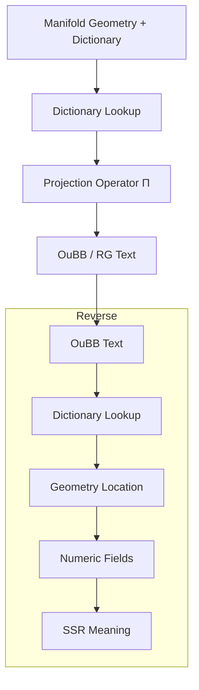

# Dictionary and Projection Specification: The Semantic Rosetta Stone of TS

**Version**: 0.1  
**Date**: 2026-07-04  
**Companion to**: prework_manifold_and_back.md, ssr_numericalization_guide.md, and manifold_geometry_spec.md  
**Repository**: CuriousOne23/WhenMathPrays  
**Associated Papers**:  
[prework_manifold_and_back.md](prework_manifold_and_back.md)  
[ssr_numericalization_guide.md](ssr_numericalization_guide.md)  
[manifold_geomerty_spec.md](manifold_geomerty_spec.md)   
[manifold_tuning_guide.md](manifold_tuning_guide.md)  
[manifold_creation_checklist.md](manifold_creation_checklist.md)  

## 1. Introduction

The dictionary is the semantic Rosetta Stone of the Thought Simulator (TS). It unifies SSR meaning, numeric fields, manifold geometry, and textual output (OuBB/RG). 

This paper covers the final layer: how manifold geometry is mapped to deterministic textual meaning via the dictionary and projection operator $\Pi$. It also details reverse interpretation and debugging of meaning drift. It does not cover SSR numericalization [ssr_numericaliztion_guide.md](ssr_numericaliztion_guide.md)  or [manifold_geomerty_spec.md](manifold_geomerty_spec.md).

### 1.1 Forward Projection & Reverse Interpretation Flow

## 2. What the Dictionary Is

The dictionary is a multi-layer mapping structure that associates each dictionary numeric coordinate with rich semantic metadata across all TS layers. It enables traceability, deterministic projection, and reverse interpretation.

## 3. Dictionary Structure

Each dictionary entry for a dictionary numeric coordinate (e.g., $(s_i, r_j)),\ s_i$ is manifold surface index and $r_j$ is region index, contains:

- SSR-origin fields and relations
- Numeric field vector
- Geometric location (surface, region, basin context)
- Textual meaning signature
- Correlation structure
- Projection behavior metadata
- Reverse interpretation metadata

The dictionary is frozen as part of every manifold snapshot.

## 4. Creating the Dictionary

During pre-work:
- Coordinates are assigned based on geometric clustering.
- SSR-origin meaning, numeric vectors, and geometric context are recorded.
- Textual meaning signatures are extracted from representative OuBB examples.
- Correlations and projection metadata are computed and stored.
- The entire dictionary is versioned with the manifold.

## 5. Textual Meaning Signatures

Textual meaning signatures capture:
- Lexical emphasis and phrasing
- Syntactic structure
- Relational phrasing
- Tone and modality
- Narrative role
- Contextual cues
- Semantic shading

These signatures guide the projection operator to produce coherent OuBB/RG text.

## 6. Projection Operator Π

The deterministic projection operator $\Pi$ maps manifold geometry (via dictionary coordinates) to OuBB/RG text:

$$
\text{OuBB} = \Pi(\text{coordinate}, \text{context})
$$

It uses meaning signatures, correlation data, and projection mapping tables. Interpolation and stability constraints ensure smooth, deterministic outputs. Ambiguity and relational strength are handled via dictionary metadata.

## 7. Reverse Interpretation

The full reverse pipeline is:
- OuBB text → dictionary lookup (via meaning signatures)
- Dictionary coordinate → manifold geometry
- Geometry → numeric fields
- Numeric fields → SSR meaning

This enables full traceability from output back to input semantics.

## 8. Debugging Projection Meaning

Structured workflow for debugging meaning drift:
- Compare expected vs. actual textual output
- Trace active coordinates and meaning signatures
- Check for basin misalignment, projection table errors, or signature drift
- Validate against ground-truth SSR examples

## 9. Tuning Projection

Engineers tune by adjusting:
- Mapping tables
- Meaning signatures
- Correlation weights
- Interpolation and stability rules
- Conditional routing logic

Tuning directly affects textual coherence, tone, and relational fidelity.

## 10. Validation Procedures

Validate dictionary correctness, projection fidelity, reverse interpretation accuracy, meaning stability, discriminability, and traceability.

## 11. Validation Checklist

- [ ] Dictionary entries fully link all layers
- [ ] Projection produces deterministic, semantically faithful outputs
- [ ] Reverse interpretation reconstructs original SSR meaning
- [ ] Meaning signatures accurately guide textual generation
- [ ] No unintended drift across runs

## 12. Examples

(Examples of coordinate-to-text projection, reverse interpretation, meaning drift debugging, and tuning corrections would go here in a full expansion.)

## 13. Conclusion

The dictionary is the unifying semantic Rosetta Stone of TS. It connects symbolic, numeric, geometric, and textual meaning into a single traceable structure. Together with the projection operator $\Pi$, it enables deterministic, debuggable, and engineerable meaning flow in both forward and reverse directions.

## Glossary

**ambiguity fields**  
Fields representing uncertainty or multiple possible interpretations in SSR. Layer: SSR → numeric. Role: Allows the system to handle vague or context-dependent input without forcing false precision.

**attractor**  
Region in the manifold with strong pull on routing paths. Layer: numeric → geometry. Role: Provides stability and predictable behavior in cognitive flows.

**basin**  
Area of attraction or stability in the manifold (object or relational). Layer: numeric → geometry. Role: Models persistence and dynamic associations.

**basin attraction**  
Strength with which a basin pulls nearby routing paths. Layer: geometry. Role: Influences deterministic movement through the latent space.

**basin depth**  
Measure of stability or strength within a basin. Layer: geometry. Role: Determines how strongly a state resists change.

**basin misalignment**  
When routing or projection behavior does not match expected basin influence. Layer: cross-layer. Role: Common source of meaning drift that engineers must debug.

**continuity (C⁰, C¹, C²)**  
Degree of smoothness between surfaces/regions (C⁰ = positional, C¹ = velocity, C² = acceleration). Layer: geometry. Role: Ensures stable, predictable routing.

**coordinate misalignment**  
Mismatch between expected and actual dictionary coordinate behavior. Layer: cross-layer. Role: Leads to projection or routing errors.

**correlation structure**  
Defined relationships between numeric fields and how they influence geometry. Layer: SSR → numeric / cross-layer. Role: Produces predictable manifold effects.

**dictionary**  
Multi-layer mapping that unifies SSR, numeric, geometric, and textual meaning. Layer: cross-layer. Role: The semantic Rosetta Stone enabling traceability and deterministic projection.

**dictionary coordinate** (e.g., $(s_i, r_j)$)  
Stable identifier locating a point in the manifold geometry. Layer: cross-layer. Role: Provides discrete addressing for routing and debugging.

**discriminability**  
Ability of numeric values or regions to separate distinct concepts. Layer: SSR → numeric / geometry. Role: Prevents semantic collapse.

**fidelity**  
How faithfully meaning is preserved across layers. Layer: cross-layer. Role: Core quality metric for the entire architecture.

**fixed-time-step movement**  
Deterministic stepping through the manifold at regular intervals. Layer: geometry. Role: Ensures reproducible routing behavior.

**geometric clustering**  
Grouping of numeric fields into surfaces and regions. Layer: numeric → geometry. Role: Forms the core structure of the latent space.

**geometric continuity**  
Smoothness of transitions in the manifold geometry. Layer: geometry. Role: Supports stable routing.

**geometric discriminability**  
Separation of distinct geometric regions. Layer: geometry. Role: Maintains semantic clarity in the latent space.

**geometric stability**  
Consistency of manifold structure across runs. Layer: geometry. Role: Enables version control and regression testing.

**identity fields**  
Fields capturing core entity or concept presence. Layer: SSR → numeric. Role: Foundation for object persistence.

**lexical emphasis**  
Word choice and highlighting in textual output. Layer: geometry → text. Role: Conveys importance and tone.

**manifold**  
Explicit geometric latent space built from numeric fields. Layer: numeric → geometry. Role: Makes the latent space visible, navigable, and engineerable.

**meaning drift**  
Unintended change in semantic interpretation across runs or steps. Layer: cross-layer. Role: Primary issue engineers debug using reverse interpretation.

**meaning reconstruction**  
Reverse process of going from output text back to SSR meaning. Layer: geometry → text (reverse). Role: Enables full traceability and debugging.

**modality**  
Expression of certainty, possibility, or necessity in text. Layer: geometry → text. Role: Preserves nuance in output.

**narrative role**  
Function of a statement in the broader context (e.g., conclusion, explanation). Layer: geometry → text. Role: Supports coherent textual flow.

**normalization**  
Scaling raw values to a consistent numeric domain. Layer: SSR → numeric. Role: Ensures comparable and stable fields.

**numeric field vector**  
Vector of normalized values extracted from SSR. Layer: SSR → numeric. Role: Input substrate for manifold construction.

**projection operator Π**  
Deterministic function mapping manifold geometry (via dictionary) to OuBB/RG text. Layer: geometry → text. Role: Produces final output while preserving meaning.

**projection table**  
Mapping rules used by Π to convert coordinates and context into text. Layer: geometry → text. Role: Controls textual realization.

**relational fields**  
Fields capturing strength and type of associations. Layer: SSR → numeric. Role: Drives relational basins and dynamic behavior.

**relational phrasing**  
How relationships are expressed in text. Layer: geometry → text. Role: Preserves relational meaning in output.

**reverse interpretation**  
Full pipeline from text output back through dictionary, geometry, numeric fields, to SSR. Layer: cross-layer. Role: Critical for debugging and validation.

**semantic gradients**  
Smooth numeric changes reflecting semantic similarity. Layer: SSR → numeric. Role: Produces natural manifold transitions.

**semantic shading**  
Subtle coloring of meaning in text (e.g., positive/negative valence). Layer: geometry → text. Role: Adds expressive precision.

**signature drift**  
Change in textual meaning signatures over time or runs. Layer: geometry → text. Role: Source of output inconsistency.

**spline smoothing**  
Cubic spline interpolation used to smooth discontinuities. Layer: geometry. Role: Ensures stable transitions without losing semantic intent.

**SSR (Symbolic-Semantic Representation)**  
Structured symbolic input representing concepts, relations, and context. Layer: input. Role: Starting point for the entire TS pipeline.

**stability**  
Consistency of numeric values or geometry across equivalent inputs. Layer: SSR → numeric / geometry. Role: Enables reproducibility and testing.

**structural fields**  
Fields representing hierarchical or compositional relationships. Layer: SSR → numeric. Role: Captures organization of meaning.

**surface**  
Coherent area of related numeric structure in the manifold. Layer: numeric → geometry. Role: Primary unit of semantic organization.

**syntactic structure**  
Grammatical organization in generated text. Layer: geometry → text. Role: Ensures readable, natural output.

**textual meaning signature**  
Stored representation of how a coordinate should be expressed in text. Layer: geometry → text. Role: Guides deterministic projection.

**tone**  
Emotional or attitudinal coloring of text. Layer: geometry → text. Role: Preserves expressive intent.

**traceability**  
Ability to follow meaning from any layer back to original SSR. Layer: cross-layer. Role: Core requirement for engineering confidence and debugging.

**transition**  
Boundary or movement between surfaces/regions. Layer: geometry. Role: Connects different semantic areas smoothly.

**tuning**  
Systematic adjustment of parameters to improve behavior. Layer: cross-layer. Role: Allows engineers to refine the system iteratively.

**validation**  
Process of confirming correctness and fidelity across layers. Layer: cross-layer. Role: Ensures the architecture meets engineering standards.
