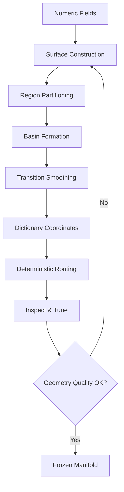

# Manifold Geometry Specification: Numeric Fields to Geometric Meaning in TS

**Version**: 0.1  
**Date**: 2026-07-04  
**Companion to**: prework_manifold_and_back.md and ssr_numericalization_guide.md  
**Repository**: CuriousOne23/WhenMathPrays  
**Associated Papers**:  
[ssr_numericaliztion_guide.md](ssr_numericaliztion_guide.md)  
[dictionary_projection_spec.md](dictionary_projection_spec.md)  
[manifold_tuning_guide.md](manifold_tuning_guide.md)  
[manifold_creation_checklist.md](manifold_creation_checklist.md)  

## 1. Introduction

This paper specifies the second conceptual layer of the Thought Simulator (TS): how numeric fields (produced by SSR numericalization) are transformed into explicit manifold geometry — surfaces, regions, basins, and transitions. 

This geometry is deterministic, inspectable, version-controlled, and forms the navigable latent space over which TS routing operates. This paper does **not** cover [ssr_numericaliztion_guide.md](ssr_numericaliztion_guide.md) or [dictionary_projection_spec.md](dictionary_projection_spec.md).

## 2. Manifold Overview

The manifold $\mathcal{M}$ is a geometric structure built from numeric fields. It consists of:

- **Surfaces**: Coherent areas of related numeric structure.
- **Regions**: Named partitions within or across surfaces.
- **Basins**: Areas of attraction and stability.
- **Transitions**: Spline-smoothed boundaries between surfaces/regions.
- **Dictionary numeric coordinates**: Tuples (e.g., $(s_i, r_j))$ that locate points in the geometry.

The geometry is fully deterministic and versioned. It turns numeric data into a map that engineers can see, drive, test, and refine.

### 2.1 Manifold Geometry Construction & Routing Flow

## 3. Constructing Surfaces

Numeric fields are clustered into surfaces based on similarity and relational coherence. A surface represents a semantically consistent region in the numeric space. Surface identity is determined by dominant field patterns. Boundaries are initially defined by distance or density thresholds.

## 4. Constructing Regions

Regions are named partitions inside surfaces or spanning multiple surfaces. Partitioning uses clustering thresholds. Each region has a stable identity and must be discriminable from others. Region stability is verified by consistent assignment across runs.

## 5. Basin Formation

Basins form around high-stability or high-attraction areas in the numeric geometry:

- **Object basins**: Strong entity persistence.
- **Relational basins**: Dynamic associations.

Basin depth and strength are derived from field values and correlations. Basins influence routing by attracting nearby paths.

## 6. Transitions Between Surfaces and Regions

Transitions occur at surface/region boundaries. They must preserve geometric continuity ($C^0$ minimum) and semantic continuity. Abrupt changes are smoothed (see next section).

## 7. Spline Smoothing

Discontinuities in the raw geometry are smoothed using cubic splines:

$$
S_i(x) = a_i + b_i(x - x_i) + c_i(x - x_i)^2 + d_i(x - x_i)^3
$$

Smoothing is applied only where needed and must preserve semantic meaning. It ensures stable routing across boundaries while maintaining $C^0$, and optionally higher, continuity.

## 8. Dictionary Numeric Coordinates (Geometric Layer Only)

Dictionary coordinates attach directly to the geometry (surface + region). They provide a stable, discrete addressing system for the continuous manifold. Coordinates are stored in the frozen snapshot and used for routing and inspection. This section addresses only their geometric role.

## 9. Routing Over the Manifold

TS routing is deterministic fixed-time-step movement through the geometry using dictionary coordinates. Paths are influenced by basin attraction and transition rules. Routing must remain stable and produce geometrically coherent trajectories.

## 10. Inspecting and Driving the Manifold

Engineers can:
- Visualize surfaces, basins, and gradients.
- Step through dictionary coordinates.
- Test routing paths.
- Inspect boundaries and attractors.

This makes the latent space fully navigable.

## 11. Tuning Geometry

Tuning includes:
- Adjusting clustering thresholds for surfaces/regions.
- Modifying basin attraction strength.
- Refining transition and smoothing parameters.
- Targeted pre-work re-runs on problematic areas.

## 12. Validation Procedures

Validate geometric stability, discriminability, continuity, basin correctness, region correctness, and coordinate consistency.

## 13. Validation Checklist

- [ ] Surfaces and regions are stable and discriminable
- [ ] Basins show expected attraction behavior
- [ ] Transitions are properly smoothed and semantically continuous
- [ ] Dictionary coordinates accurately locate geometry
- [ ] Routing paths are stable and coherent
- [ ] Geometry version is frozen with full traceability

## 14. Examples

(Examples of surface construction, region partitioning, basin formation, transitions, and spline smoothing would go here in a full expansion.)

## 15. Conclusion

Manifold geometry is the explicit, engineerable latent space of TS. It transforms numeric fields into a visible, navigable, and tunable structure that supports deterministic routing. This layer is what makes the latent space a scientific instrument rather than a black box.

**Next paper in series**: dictionary_projection_spec.md (dictionary and projection layer).

