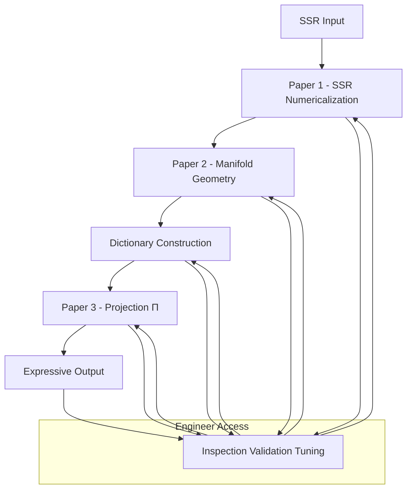

# The Pre-Work Manifold and Back: A Practical Engineering Guide to TS Latent Space

**Version**: 0.6 (High-Level Overview)  
**Date**: 2026-07-04  
**Author**: Generated for CuriousOne23 / WhenMathPrays Thought Simulator (TS) Project  
**Repository**: CuriousOne23/WhenMathPrays  

**Core Architecture Papers** (same directory):  
[ssr_numericalization_guide.md, paper 1](ssr_numericalization_guide.md) | [manifold_geometry_spec.md, paper 2](manifold_geometry_spec.md) | [dictionary_projection_spec.md & glossary, paper 3](dictionary_projection_spec.md)

**Companion Documents**:  
[manifold_creation_checklist.md](manifold_creation_checklist.md) | [manifold_tuning_guide.md](manifold_tuning_guide.md)

## 1. Introduction

The Thought Simulator (TS) separates pre-work (manifold construction) from runtime routing. This document provides the high-level architectural overview. For detailed guidance on each layer, see the specialized papers listed above.

**Pre-work** converts symbolic SSR into a visible, navigable, deterministic manifold. Runtime then routes over this manifold to produce expressive, traceable outputs.

## 2. Overall TS Pipeline

[ssr_numericalization_guide.md, paper 1](ssr_numericalization_guide.md)  
[manifold_geometry_spec.md, paper 2](manifold_geometry_spec.md)  
[dictionary_projection_spec.md, paper 3](dictionary_projection_spec.md)  

**Caption**: Full TS engineering flow. Engineers have direct access to inspect, validate, and tune any layer at any time.

## 3. Why This Architecture Matters

- **Inspectable & Engineerable** latent space
- **Deterministic** behavior with full traceability
- **Lower cost** pre-work compared to traditional training
- **Reusable** manifold + dictionary
- **Debuggable** via reverse interpretation

## 4. How to Use These Documents

- **New Manifold**: Start with [manifold_creation_checklist.md](manifold_creation_checklist.md)
- **Troubleshooting / Tuning**: Use [manifold_tuning_guide.md](manifold_tuning_guide.md)
- **Deep Dive**:
  - Symbolic → Numeric → [ssr_numericalization_guide.md, paper 1](ssr_numericalization_guide.md)
  - Numeric → Geometry → [manifold_geometry_spec.md, paper 2](manifold_geometry_spec.md)
  - Geometry → Text + Reverse → [dictionary_projection_spec.md, paper 3](dictionary_projection_spec.md)

**Hardware Note**: Pre-work runs efficiently on standard CPU hardware (no GPU required for typical use).

## Research and Contribution Opportunities

The TS architecture is designed with standardization and modularity in mind. This creates a fertile ground for broad, collaborative progress across the research and engineering community.

Because each layer is well-defined and separable, contributions can come from many directions:
- Master's students can focus on improving specific techniques (e.g., better numericalization methods, basin dynamics, or meaning signature design).
- PhD candidates can tackle deeper architectural questions, new validation metrics, or novel applications.
- Academic labs and independent scientists can extend the framework, develop specialized tools, or explore new domains.
- Industry engineers can adapt and harden the system for production use.

Over time, this process is expected to develop its own language, techniques, and best practices — much like how relational databases or compiler design evolved into mature fields. The modular, inspectable, and reusable nature of the manifold and dictionary makes it particularly well-suited for cumulative, community-driven advancement.

## Conclusion

The Thought Simulator represents a deliberate shift from opaque statistical models to an explicit, engineerable cognitive architecture. By separating pre-work manifold construction from runtime routing, and by providing clear, layered specifications for each stage, TS offers a path toward more inspectable, controllable, and reusable cognitive systems.

This document, together with the three core papers and companion guides, provides a complete foundation for building, understanding, and extending the architecture. The process is tractable, supports broad contribution, and is designed for standardization and cumulative progress.

Future work will focus on validation at scale, richer expression, specialized domain manifolds, and continued community development of the TS framework.

---
